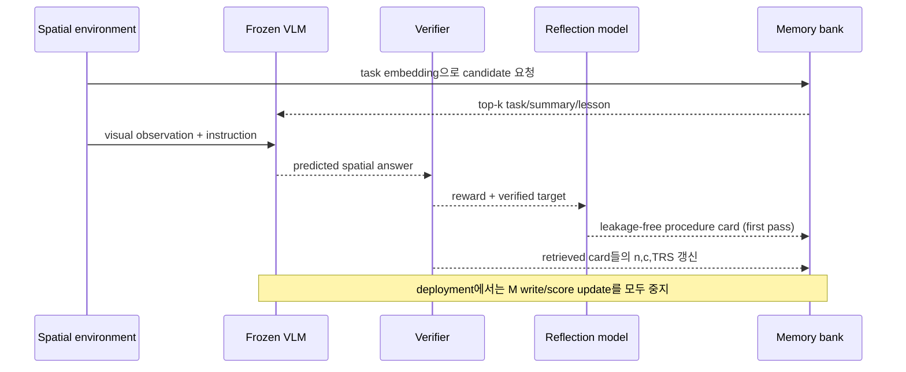

# Spatial Memory Agent 핵심 기술 학습 자료

## 선수 지식

- VLM: 이미지/비디오와 text prompt를 입력으로 받는 model.
- retrieval-augmented generation(RAG): 현재 query와 유사한 외부 문서를 찾아 prompt에 넣는 방식.
- verifier: prediction을 target·규칙·simulator로 평가해 reward를 주는 component.
- contextual bandit 관점: retrieved memory 집합과 final reward 사이의 credit assignment가 완벽하지 않다.

## 용어집

| 용어 | 뜻 | SMA에서의 역할 |
|---|---|---|
| transferable lesson | 특정 정답이 아니라 재사용 가능한 검사 절차 | memory card의 핵심 content |
| TRS | Transfer Reliability Score | 후속 task에서 도움이 된 정도의 보정 추정치 |
| one-pass writing | 첫 environment pass에서만 card 생성 | 중복·feedback dilution 감소 |
| read-only deployment | test/deployment 중 bank를 갱신하지 않음 | online contamination·leakage 방지 |
| semantic filter | embeddings로 무관한 card를 먼저 제거 | relevance 확보 |
| visit evidence | card가 retrieve된 뒤 얻은 reward | TRS의 관측 근거 |

## end-to-end 흐름

## 단계별 이해

### 1. 기억할 단위 선택

raw chain-of-thought나 final answer를 저장하면 narrow instance의 문구를 따라 하거나 target을 leak할 위험이 있다. `summary`에는 문제 모양과 실패/성공 진단을, `lesson`에는 **관계 확인 규칙**을 담는다. 예: “가림 여부를 먼저 확인하고, 대상의 중심이 아니라 접촉 가능한 free-space를 비교하라.”

### 2. relevance와 reliability 분리

질문이 비슷하다고 도움 되는 절차는 아니다. semantic similarity는 “이 카드가 현재 task와 관련 있는가”를, TRS는 “관련 있는 경우에도 과거에 반복적으로 도움이 되었는가”를 표현한다. 둘을 한 score로 합치되, card의 낮은 visit count에는 prior를 둔다.

### 3. TRS를 손으로 계산해 보기

초기값 $v_0=0.5$, prior strength $\lambda=2$라고 하자. 어떤 card가 네 번 retrieve되어 reward 합 $c=3$이면,

$$v=\frac{2\times0.5+3}{2+4}=\frac{4}{6}\approx0.667.$$

한 번의 실패만 있었으면 $v=(1+0)/(2+1)=0.333$이다. prior가 없으면 0 또는 1로 흔들리므로, sparse feedback 상황에서 이 보정이 중요하다.

### 4. VLA 시스템에 붙이는 방법

- perception/VLM이 observation에서 relation·landmark·affordance를 판단한다.
- SMA memory가 “어떤 spatial check를 먼저 할지”를 제안한다.
- planner가 그 result를 waypoint/trajectory candidate 평가에 사용한다.
- safety monitor가 map rule, collision prediction, uncertainty threshold로 최종 action을 gate한다.

SMA 자체를 controller로 오인하지 말아야 한다. procedure card는 policy action을 보증하지 않으며, safety-critical environment에는 verifier와 action shield가 필요하다.

## 구현 메모

1. 카드 schema를 JSON으로 고정한다: `{task, summary, lesson, visits, reward_sum, trs, provenance}`.
2. verified target은 reflection prompt에만 넣고 deployment card에는 저장하지 않는다.
3. embedding threshold와 top-$k$를 offline validation에서 tune한다. 논문 setting은 $\eta=0.5$, $k=3$ 부근이 좋았다.
4. 각 retrieval event에 task id, card ids, action/answer, verifier version, reward를 log한다.
5. 카드 deduplication, trusted writer, card TTL/versioning, adversarial-content filter를 둔다.
6. multi-card reward assignment는 confounded된다. 가능하면 leave-one-out retrieval, counterfactual replay, per-card bandit credit으로 보완한다.

## 자가 점검 질문과 답

**Q1. SMA가 continual fine-tuning보다 항상 싼가?**  
A. model update는 없지만 reflection calls, embeddings, memory retrieval, verifier execution 비용이 있다. high-throughput deployment에서는 prompt token과 retrieval latency도 계측해야 한다.

**Q2. 왜 card 생성 시 reward가 높았다고 높은 TRS를 주지 않는가?**  
A. source task의 성공은 card의 generality를 보장하지 않는다. TRS는 이후 task의 사용 결과로 card가 정말 transfer되는지 측정하려 한다.

**Q3. read-only deployment가 중요한 이유는?**  
A. held-out evaluation 중 target 정보를 간접적으로 흡수하는 것을 막고, feedback loop가 bank를 오염시키는 위험을 분리한다. online learning이 목적이면 안전한 write policy를 별도 설계해야 한다.

**Q4. VLA의 action grounding은 어디에서 생기는가?**  
A. SMA는 spatial reasoning guidance까지만 제공한다. waypoint/trajectory/control로의 grounding은 downstream planner, simulator verifier, safety shield가 담당한다.

## 90분 읽기 로드맵

1. **15분:** Abstract·Figure 3·문제 설정을 읽고 RAG와 TRS의 차이를 한 문장으로 쓴다.
2. **25분:** $S_{ij}$와 $v_j$ 식을 따라가며 **semantic relevance vs. transfer reliability** 비교표를 만든다.
3. **20분:** main table과 ablation을 읽고 “왜 raw output과 reward-only reflection이 약한가”를 설명한다.
4. **20분:** model/benchmark transfer 결과와 continual writing 분석을 검토한다.
5. **10분:** 자신의 navigation/VLA task에 verifier, memory writer, deployment freeze point를 그린다.
