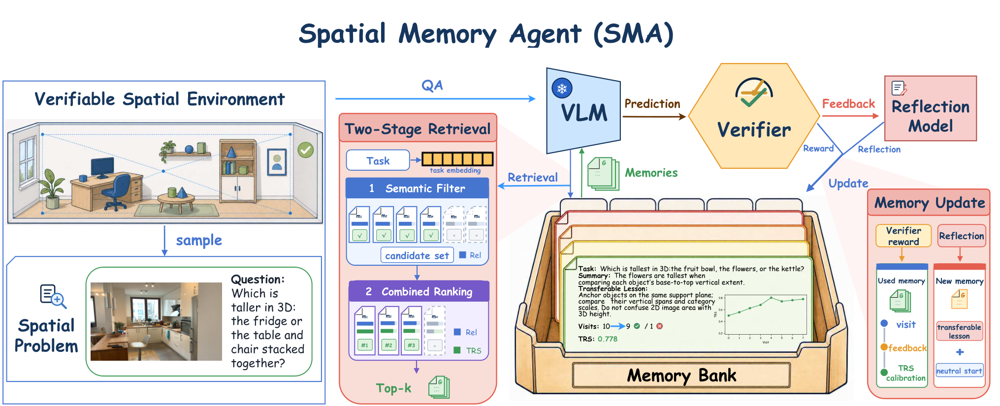
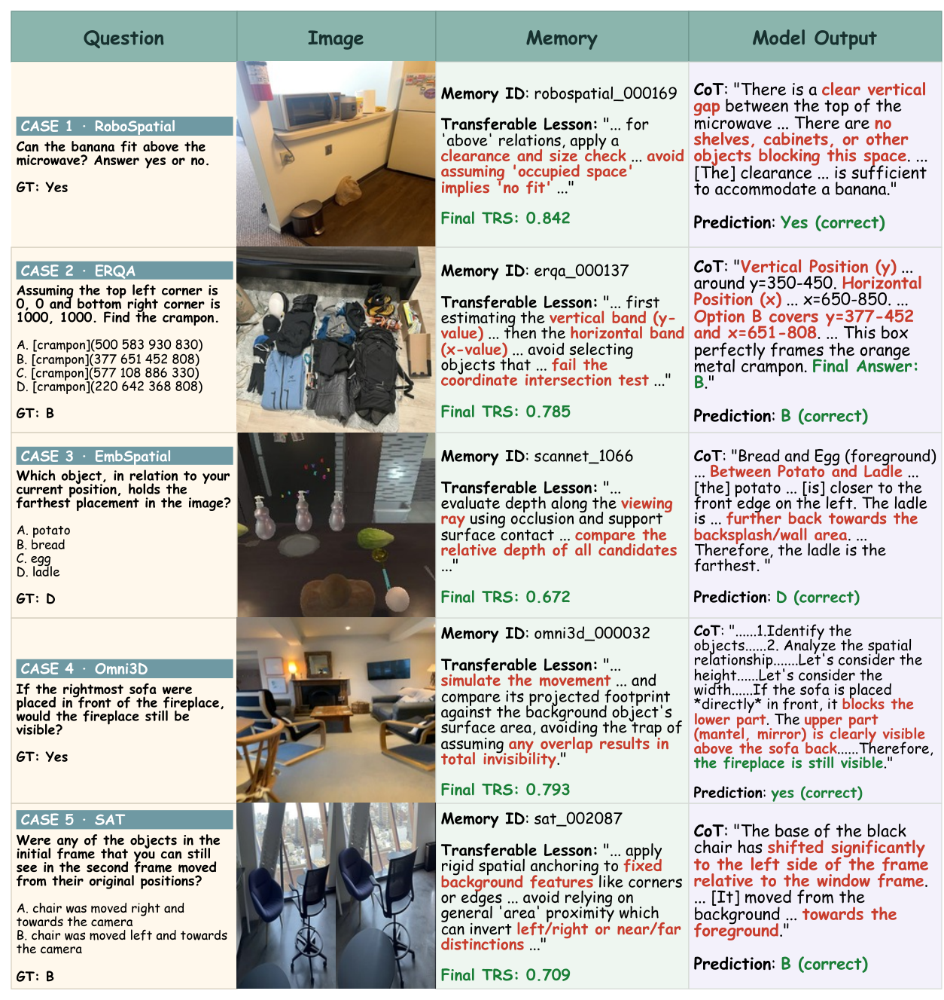

# Spatial Memory Agent: 공간 지능을 위한 경험 기반 절차 메모리

> 원문: Haokai Zhang 외, *Spatial Memory Agent: Experience-Grounded Procedure Memory for Spatial Intelligence* (arXiv:2608.12743). arXiv HTML의 Abstract, Introduction, Method, Experiments, Discussion, Conclusion과 핵심 부록을 한국어로 기술 번역·정리했다. 세부 프롬프트 전문과 모든 추가 표는 생략하고 원문을 참조한다.

## Abstract

공간 지능은 embodied agent, 로봇 planning, multimodal assistant의 기반 능력이 되고 있다. 현재 VLM의 공간 추론을 개선하는 주류 방법은 (1) supervised fine-tuning이나 reinforcement learning으로 파라미터를 post-training하거나, (2) depth estimation·3D reconstruction 같은 외부 공간 도구를 호출해 중간 증거를 모으는 agentic 방법이다. 본 논문은 보완적인 질문을 던진다. **동결된 VLM이 파라미터 업데이트와 추론 시 외부 전문가 도구 없이도, 검증된 경험으로 공간 추론을 스스로 개선할 수 있는가?**

저자들은 Spatial Memory Agent(SMA)를 제안한다. SMA는 검증 가능한 공간 환경에서 frozen VLM의 예측과 reward를 얻고, verifier-guided reflection으로 그 경험을 재사용 가능한 짧은 절차 교훈(transferable lesson)으로 압축한다. 각 교훈에는 이후 retrieval 결과로 보정되는 **Transfer Reliability Score(TRS)** 를 붙인다. read-only deployment에서는 semantic filter와 similarity–TRS 결합 순위가 교훈을 선택해 frozen VLM의 추론을 안내한다. 5개 대표 공간 benchmark와 4개 VLM에서 대다수의 20개 비교 설정 중 최고 accuracy를 기록한다.

## 1. Introduction

공간 VLM은 object relation, depth, viewpoint, object motion, affordance를 안정적으로 다루기 어렵다. SpatialVLM이나 RoboSpatial 계열은 공간 instruction data로 모델 자체를 학습하고, S-Agent·SpaceTools 계열은 추론 때 전문 도구로 기하학적 증거를 추가한다. 전자는 재학습 비용과 배포 교체가 필요하고 후자는 도구 가용성·latency·interface 의존성을 갖는다.

SMA의 출발점은 text-agent의 long-term/procedural memory다. 이전 rollout을 그대로 복사하지 않고, 검증된 정답과 reward를 이용해 “어떤 상황에서 어떤 확인 절차를 써야 하는가”를 짧은 memory card로 만든다. 중요한 점은 memory를 만든 한 번의 성공 여부가 아니라, **새 문제에서 실제로 도움이 되었는가**로 신뢰도를 갱신한다는 것이다.

주요 기여는 다음과 같다.

1. frozen VLM을 유지한 채 verifier reward를 transferable spatial procedure로 바꾸는 training-free SMA를 제안한다.
2. verifier-guided reflection, embedding 기반 후보 검색, 방문 증거(visit evidence)에 따른 TRS 보정을 결합한다.
3. RoboSpatial, ERQA, Omni3D, SAT, EmbSpatial 등 상이한 공간 문제에서 plain RAG와 절차 메모리 baseline보다 신뢰도 기반 검색이 낫다는 실험을 제시한다.

## 2. Related Work

- **공간 post-training:** SpatialVLM, SpatialRGPT, SpatialBot, SpatialEvo는 데이터·curriculum·RL로 VLM의 공간 representation을 바꾼다.
- **tool-augmented spatial agent:** S-Agent와 SpaceTools는 depth/3D/visual program 등 중간 증거를 얻어 ambiguity를 해소한다.
- **self-evolving memory:** Reflexion, Mem0, MemP, MemRL류는 경험을 장기 메모리나 절차로 저장한다. 그러나 주로 text-centric agent에 초점이 있고, semantic similarity만으로 “실제로 transfer되는 절차”를 판정하기 어렵다.

SMA는 파라미터 학습과 도구 호출의 중간이 아니라 별도 축이다. 외부 memory bank를 runtime adaptation의 장소로 사용하지만, deployment에서는 model weight와 bank 모두 수정하지 않는다.

## 3. Method

### 3.1 문제 설정과 memory card

검증 가능한 공간 문제를 환경 split $\mathcal{X}$와 deployment split $\mathcal{D}$로 나눈다. 문제는 시각 입력 $\mathcal{V}_i$, 자연어 task $t_i$, 검증 target $y_i^*$를 가진다. frozen base model $F$는 답 $\hat y_i$를 내고 verifier는 다음 reward를 준다.

$$r_i=\mathrm{Eval}(\hat y_i,y_i^*), \qquad r_i\in[0,1].$$

memory bank $\mathcal{M}=\{m_i\}$의 카드에는 source task, rollout 요약 $s_i$, transferable lesson $l_i$, 이후 retrieval 횟수 $n_i$, 누적 reward $c_i$, 신뢰도 $v_i$가 든다. deployment에 주입되는 것은 task·요약·교훈이며, 과거의 정답이나 raw prediction은 넣지 않아 answer leakage를 줄인다.

### 3.2 경험 기반 memory writing

환경 단계에서 현재 task에 대해 기존 카드를 retrieve한 뒤 frozen VLM을 실행한다. reflection model은 verifier가 준 정답·reward를 참조해 strict JSON의 `summary`와 `transferable lesson`을 쓴다. 교훈은 “공간 패턴, 피해야 할 함정, 확인할 check”를 일반화해야 하며, 정답을 그대로 반복해서는 안 된다.

기본 설정은 **One-Pass Memory Writing** 이다. 첫 번째 환경 pass에서만 신규 카드를 쓰고, 이후 pass에서는 bank를 고정한 채 선택된 카드의 신뢰도만 업데이트한다. 매 pass마다 카드를 계속 쓰면 중복 card가 증가하고 각각이 관측하는 transfer evidence가 얇아진다는 것이 저자들의 관찰이다.

### 3.3 two-stage retrieval과 TRS

첫 단계는 task embedding의 semantic similarity로 threshold $\delta$보다 낮은 카드를 버리는 filter다. 두 번째 단계는 후보의 normalized similarity와 normalized TRS를 합쳐 score를 만든다.

$$S_{ij}=(1-\eta)z(\mathrm{sim}(t_i,m_j))+\eta z(v_j).$$

여기서 $z(\cdot)$는 candidate set 내 clipped z-score, $\eta$는 reliability의 비중이다. 상위 $k$개의 카드가 prompt 앞에 guidance로 붙는다. 즉 유사하지만 반복적으로 도움이 되지 않았던 memory보다, 조금 덜 유사해도 transfer 경험이 좋은 절차를 선택할 수 있다.

TRS는 source rollout의 정답 여부로 초기화하지 않고 uniform prior $v_0$에서 시작한다. 선택된 카드가 후속 문제에서 사용되어 reward를 받으면, $\lambda$개의 virtual visit을 둔 아래의 shrinkage estimator로 갱신한다.

$$v_j=\frac{\lambda v_0+c_j}{\lambda+n_j}.$$

기본 $v_0=0.5$, $\lambda=2$는 초기에 한두 사례로 과신하지 않게 한다. 방문이 많아질수록 empirical transfer success rate가 우세해진다. deployment에서는 bank가 read-only이므로 $n,c,v$ 모두 더 이상 업데이트하지 않는다.

## 4. Experiments

### 설정

- **benchmark:** RoboSpatial(로봇 지향 공간 이해), ERQA(embodied robot QA), Omni3D(3D relation/metric), SAT(시간적·ego spatial aptitude), EmbSpatial(언어 기반 embodied relation). 추가로 SITE-image와 ViewSpatial도 appendix에서 평가한다.
- **base VLM:** Qwen3.5-9B, Qwen3.5-122B-A10B, Qwen3.6-27B, Qwen3.6-35B-A3B. task VLM과 reflection model에 같은 frozen model을 사용한다.
- **metric:** held-out deployment split의 accuracy(%). text-embedding-3-large task embedding, temperature 0, top-p 1을 사용한다.
- **baseline:** No memory, RAG, MemP, reward-only MemRL-R, verified target을 reflection에 제공하는 MemRL-GT.

### 주요 결과

SMA는 네 base-model block의 macro average에서 모두 최고였다: Qwen3.5-122B-A10B 68.8, Qwen3.6-35B-A3B 66.7, Qwen3.6-27B 69.8, Qwen3.5-9B 63.5. 가장 강한 비-SMA baseline 대비 평균 이득은 각각 2.6, 2.9, 1.7, 2.8 percentage point다. 예컨대 Qwen3.6-27B에서 RoboSpatial은 no-memory 54.1에서 SMA 68.5, Omni3D는 41.6에서 47.6으로 상승한다.

ablation에서 summary·transferable lesson·semantic filter를 제거하면 RoboSpatial accuracy가 각각 3.2, 3.5, 5.8 point 하락했다. raw model output을 카드에 넣거나 reward-only reflection을 쓰는 것도 성능을 낮췄다. 최적 근방은 $\eta=0.5$, $k=3$이었다.

### transfer와 memory-bank 분석

Qwen3.5-122B-A10B로 쓴 bank를 Qwen3.6-27B에 transfer하면 RoboSpatial +9.4, ERQA +3.5, SAT +5.7 point 등 모든 대표 probe에서 no-memory보다 나았다. benchmark 간 transfer도 선택된 probe에서 양수였다. 한편 continual writing은 ten pass 후 one-pass 방식보다 10배 많은 memory를 만들고 중복을 21% 높이며 TRS update coverage를 약 절반으로 낮췄다.

## 5. Discussion, 한계 및 결론

TRS bin이 0.2–0.3일 때 pooled accuracy 19.3%에서 0.9–1.0일 때 97.3%로 증가했지만, 이는 benchmark 난이도와 문제 구성 차이도 섞인 상관 분석이다. 또한 동일한 문제의 여러 retrieved card에 같은 episode reward를 부여하므로, 한 카드의 **causal contribution**을 완전히 분리하지 못한다. 실사용에서는 verifier 품질, reflection hallucination, task embedding 편향, memory poisoning이 직접 안전 문제가 될 수 있다.

SMA는 VLA policy가 low-level action을 즉시 내도록 만드는 방법은 아니다. 대신 perception→spatial reasoning→action grounding 앞단에서 재사용할 수 있는 procedure memory다. robot manipulation, urban navigation, autonomous-driving VLM의 map/scene alignment에도 적용 가능하지만, 실제 closed-loop control·latency·safety는 별도 평가가 필요하다. 논문의 핵심 결론은, 잘 보정된 외부 절차 메모리가 모델 재학습 없이도 frozen VLM의 공간 지능을 개선하는 실용적 경로가 될 수 있다는 것이다.

## 원문 링크

- Hugging Face Papers: https://huggingface.co/papers/2608.12743
- arXiv Abstract: https://arxiv.org/abs/2608.12743
- arXiv HTML: https://arxiv.org/html/2608.12743
- Project page: https://aim-uofa.github.io/SMA/
