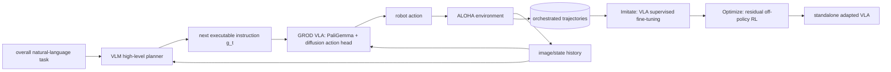

# EXIMO 분석

## 한 문장 결론

EXIMO는 VLM이 long-horizon manipulation goal을 다음 **실행 가능한 language subgoal**로 분해해 data를 모으고, 그 behaviour를 VLA에 SFT로 증류한 뒤 residual off-policy RL로 다듬어 human teleoperation 없이 new task adaptation을 가속한다.

## 문제와 기여

- pretrained VLA는 atomic skill에는 강하지만 novel compositional/reasoning-heavy goal에서 exploration과 data coverage가 부족하다.
- VLM orchestration은 scene history와 overall goal에서 next instruction을 생성해 VLA를 closed loop로 이끈다.
- collected trajectory를 VLA standalone policy에 SFT해 expensive VLM planner의 deployment dependency를 줄인다.
- residual off-policy RL로 SFT policy를 refinement해 offline orchestration–online execution shift를 줄인다.

## Architecture / pipeline

| 단계 | 입력 | 출력 | learning 역할 |
|---|---|---|---|
| Explore | image/state history, overall language goal | VLM subgoal + VLA action trajectory | high-quality autonomous exploration |
| Imitate | filtered orchestrated episodes | updated VLA | VLM's task decomposition distillation |
| Optimize | SFT policy rollouts + success reward | residual correction | online refinement / distribution-shift 대응 |

## I/O, language role, action grounding

- **입력:** robot visual/state observation, overall natural-language task, 그리고 explore 중 image history.
- **중간 language:** VLM의 $g_t$는 “다음으로 blue plate를 left hand로 집어라” 같은 executable subgoal이다.
- **출력:** GROD diffusion policy head가 만드는 continuous robot action; vehicle waypoint/trajectory가 아니라 bimanual manipulation control이다.
- **language 역할:** explanation-only가 아니라 planning·subtask decomposition·instruction following이다.
- **action grounding:** VLM text → VLA language-conditioned motor policy → observation feedback → revised text command. 이는 강한 closed-loop grounding이지만 semantic subgoal correctness가 physical success를 보장하지는 않는다.
- **taxonomy:** autonomous-driving VLA는 아니며, VLA의 **explicit action guidance / hierarchical VLM-planner + VLA-executor** track이다. driving에는 route/rule interpreter와 low-level trajectory policy를 나누는 참고 구조가 된다.

## 핵심 표현과 training recipe

$$\mathbf a\sim\pi^{VLA}(\cdot\mid\mathbf s,g_t),\qquad g_t\sim\pi^{VLM}(\cdot\mid\mathbf s_{\le t},g).$$

- base: Gemini Robotics On-Device 3B, PaliGemma backbone + diffusion action head.
- Explore: VLM instructs the **very next** step rather than one-shot full plan; VLA action 후 scene를 다시 observe한다.
- Imitate: success/quality-filtered orchestration data로 supervised fine-tuning한다.
- Optimize: SFT action에 residual correction을 더하는 off-policy RL. SFT가 RL의 initial success basin을 제공한다.

## Dataset / benchmark / metric

| 항목 | 내용 |
|---|---|
| platform | ALOHA bimanual robot simulation |
| task suite | 22 manipulation tasks; multi-object composition과 semantic reasoning variants |
| rollout scale | exploration comparison 1,000 episodes |
| metric | success rate, time-to-success, episode length, online-RL learning curve/final success |
| open vs closed loop | logged dataset open-loop imitation accuracy가 아니라 interactive simulator rollout에서 success를 측정하는 closed-loop manipulation 평가 |

## 강점

1. VLM의 broad semantic knowledge와 VLA의 robust motor prior를 같은 model에 억지로 합치지 않고 hierarchy로 결합한다.
2. VLM planner가 success가 높은 더 짧은 episode를 만들어 expensive teleoperation data를 대체할 가능성을 보인다.
3. SFT로 policy에 distill하므로 deployed VLM call의 latency/cost/failure surface를 줄일 수 있다.
4. residual RL은 BC/VLA prior를 완전히 버리지 않고 task-specific correction을 학습한다.

## 한계·안전·배포

- 결과는 simulation ALOHA의 22 task와 ground-truth success detector에 기반한다. real robot contact, perception noise, reset, irreversible failure 전이는 검증되지 않았다.
- VLM subgoal hallucination, wrong object reference, stale image history는 unsafe command로 이어질 수 있다.
- VLM-orchestrated offline data와 autonomous online policy rollout에는 distribution shift가 있으며, 저자도 direct residual distillation의 약점을 관찰했다.
- VLM call frequency가 높으면 latency·cloud availability·privacy 문제가 생긴다. deployment에는 bounded instruction vocabulary, affordance verifier, force/collision limits, human override가 필요하다.

## 왜 중요한가

자율주행 관점에서 EXIMO는 “언어 reasoning을 steering/control token으로 바로 내보내는가”보다 안전한 **hierarchical action grounding**을 보여준다. high-level VLM이 route/rule/scene semantics를 short-horizon task로 바꾸고, low-level policy가 trajectory·control을 담당하며, successful closed-loop data를 lightweight deployed policy로 distill한다는 설계는 driving VLA의 latency와 hallucination risk를 낮출 수 있다.
