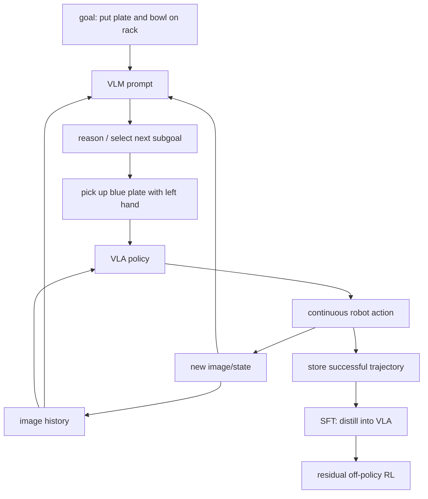

# EXIMO 핵심 기술 학습 자료

## 선수 지식

- behaviour cloning(BC), supervised fine-tuning(SFT), diffusion policy
- off-policy RL과 residual policy
- VLM/VLA의 차이: semantic reasoning vs sensorimotor action generation
- long-horizon task decomposition과 success detector

## 용어집

| 용어 | 의미 |
|---|---|
| VLM | visual observation과 text를 해석·reasoning하는 high-level foundation model |
| VLA | vision/language condition에서 physical action을 내는 sensorimotor policy |
| orchestration | VLM이 overall goal을 next executable subgoal로 계속 갱신하는 process |
| GROD | EXIMO의 initial VLA; PaliGemma backbone + diffusion action head |
| SFT | trajectory/action target으로 policy weight를 supervised update하는 단계 |
| residual RL | base action에 correction을 더해 new task behavior를 refine하는 RL |
| success detector | episode goal completion을 판정해 exploration/RL reward로 쓰는 component |

## Architecture map

## Step-by-step

1. **base skill audit:** initial VLA가 pick/place처럼 무엇을 안정적으로 할 수 있는지 확인한다. EXIMO는 atomic skill이 이미 존재한다고 가정한다.
2. **goal decomposition:** VLM에 overall goal과 recent observations를 주고, 한 번에 full plan이 아니라 “바로 다음” instruction만 내게 한다.
3. **physical execution:** VLA는 subgoal language와 observation에서 continuous action을 낸다. physical result가 다음 VLM command의 evidence가 된다.
4. **dataset filtering:** success rate, episode length, success detector signal을 사용해 orchestrated trajectory의 quality를 검토한다.
5. **imitation:** VLA가 planner 없이도 new task behavior를 내도록 data를 SFT한다.
6. **optimization:** online residual RL로 contact/state mismatch와 task-specific details를 correction한다.

## 핵심 확률 표현

전체 goal $g$, current/history state $\mathbf s_{\le t}$에서 planner와 executor는 다음으로 분리된다.

$$g_t\sim\pi_{VLM}(g_t\mid\mathbf s_{\le t},g),$$
$$\mathbf a_t\sim\pi_{VLA}(\mathbf a_t\mid\mathbf s_t,g_t).$$

closed loop는 $\mathbf s_{t+1}=f(\mathbf s_t,\mathbf a_t)$를 다시 VLM context로 돌려보낸다는 뜻이다. 중요한 것은 VLM의 chain-of-thought 자체가 actuator가 아니라, VLA가 실행·검증 가능한 **intermediate language interface**라는 점이다.

residual action은 개념적으로

$$\mathbf a_t=\mathbf a^{base}_t+\Delta\mathbf a^{RL}_t$$

처럼 표현할 수 있다. 실제 scaling, clipping, safety constraint는 robot/controller별로 명시해야 한다.

## 구현·배포 checklist

- VLM output을 free-form text 그대로 actuator에 주지 말고 action vocabulary·schema와 workspace/affordance verifier를 둔다.
- image history length와 replanning trigger를 제한해 stale context/latency를 관리한다.
- success detector는 VLM judge 단독보다 vision/contact/state rule과 cross-check한다.
- SFT dataset은 successful trajectory만의 bias, rare failure recovery, language paraphrase coverage를 측정한다.
- residual action에는 joint/velocity/force limits, collision checker, emergency stop을 둔다.
- deployment cost는 VLM call 제거 후 standalone VLA success와 latency를 함께 비교한다.

## 공부 질문과 답

**Q1. 왜 VLM을 deployment에서 계속 쓰지 않고 SFT하는가?**
A. VLM orchestration은 high-quality exploration teacher지만 call latency, cost, reliability 문제가 있다. SFT는 그 trajectory prior를 VLA policy에 압축해 standalone action을 가능하게 한다.

**Q2. VLM instruction이 correct하면 task가 반드시 성공하는가?**
A. 아니다. object grounding, grasp/geometry, control noise, scene change 때문에 VLA execution과 feedback replan이 필요하다.

**Q3. EXIMO는 autonomous driving VLA인가?**
A. 아니며 ALOHA manipulation 실험이다. 하지만 language route/rule planner와 trajectory/control executor를 나누고 successful closed-loop behavior를 distill한다는 transfer lesson은 driving에 유효하다.

**Q4. residual RL이 왜 마지막인가?**
A. VLM-orchestrated SFT가 initial success를 높여 RL이 long-horizon random exploration에서 시작하지 않게 한다. 이는 sample efficiency를 높이지만 online distribution shift는 계속 monitor해야 한다.

## reading roadmap

1. Fig. 1과 §3.1: VLM–VLA command loop를 trace한다.
2. §3.2–3.3: trajectory SFT와 residual RL이 각각 무엇을 학습하는지 구분한다.
3. Fig. 2–4: exploration, imitation, optimization ablation을 순서대로 해석한다.
4. [[VisionLanguageAction]], [[BehaviorCloning]], [[ReinforcementLearning]], [[ActionGrounding]]과 비교한다.
5. driving application을 설계한다면 language subgoal schema, route/traffic-rule verifier, trajectory safety shield를 먼저 정의한다.
