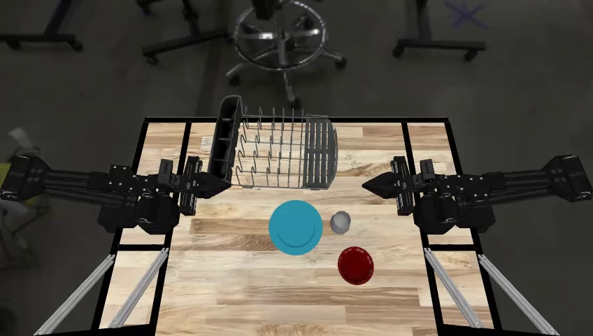

# EXIMO: VLM 안내 탐색으로 VLA policy를 미세조정하기

> 원문: Bhavya Sukhija 외, *EXIMO: VLM Guided Exploration of VLA Policies* (arXiv:2608.19891). arXiv HTML v1의 Abstract, Introduction, Method, Experiment, Conclusion 및 주요 appendix 내용을 한국어 기술 번역·정리했다. 긴 prompt 전문, 개별 task curve와 부록의 모든 수치는 압축했으며 원문을 병행 참조한다.

## Abstract

대규모 Vision-Language-Action(VLA) model은 대량 teleoperation data의 behaviour cloning으로 발전했지만, 새 long-horizon manipulation task에 맞추려면 비싼 human demonstration이 다시 필요하다. reinforcement learning(RL)은 대안이지만 exploration이 어렵고 large VLA의 구조·크기 때문에 sample inefficiency가 크다.

저자들은 VLA를 효율적으로 fine-tune하는 **EXIMO(Explore, Imitate, Optimize)** 를 제안한다. Explore 단계에서 VLM이 planner처럼 어려운 goal을 VLA가 실행 가능한 짧은 instruction으로 분해하여 orchestrated dataset을 모은다. Imitate에서 VLA를 그 data로 fine-tune하고, Optimize에서 residual off-policy RL을 더 적용한다. simulation manipulation experiment에서 세 단계를 모두 ablate하며 sample efficiency와 최종 성능의 이득을 보고한다.

## 1. Introduction

robot policy data 수집은 크게 (i) RL과 (ii) large-scale behavioural cloning(LBC)으로 나뉜다. RL은 agent가 자신의 experience로 개선하지만 long-horizon exploration에서 sample complexity가 크다. LBC는 teleoperator의 고품질 motion을 모아 policy가 모방하게 하므로 data-efficient하지만, distribution 밖 조합 task에 약하고 robot/task마다 human hour를 반복 지출한다.

EXIMO의 setting은 atomic skill(예: pick, place)은 reliable하지만 새로운 compositional/reasoning-heavy goal에는 약한 pretrained language-conditioned VLA다. 예를 들어 training distribution의 “banana를 bowl에 넣어라”와 달리 “monkey가 좋아하는 fruit를 bowl에 넣어라”는 semantic grounding과 subgoal chaining을 요구한다. 목표는 추가 teleoperation 없이 natural-language goal과 success detector만으로 VLA를 적응시키는 것이다.

핵심 직관은 VLM의 world knowledge와 scene reasoning을 **고수준 orchestration**에 쓰고, VLA의 sensorimotor skill을 **저수준 execution**에 쓰는 것이다. 그 trajectory를 VLA에 distill한 뒤 online RL을 시작하면, 무작위 policy보다 이미 유의미한 success region에서 learning을 시작할 수 있다.

## 2. Related Work

- **Foundation model as high-level planner:** PaLM-E, SayCan, RT 계열은 language/vision foundation model의 semantic knowledge를 robotics planning에 연결한다. EXIMO는 VLM을 persistent high-level command generator로 사용하되, deployment-time dependence를 SFT/RL로 줄이려 한다.
- **VLA policy와 behaviour cloning:** large teleoperation corpus가 rich motor prior를 만들지만 new task adaptation은 data collection 비용을 다시 만든다.
- **exploration/RL fine-tuning:** residual policy와 off-policy RL은 BC policy의 local correction을 학습할 수 있지만, exploration distribution이 충분히 좋아야 한다. EXIMO는 VLM-orchestrated data로 이 cold-start를 완화한다.

## 3. Method — Explore, Imitate, Optimize

### 3.1 Explore: VLM-guided data collection

초기 policy로 Gemini Robotics On-Device 3B(GROD)를 쓴다. 이는 PaliGemma VLM backbone과 diffusion policy head 기반의 language-conditioned VLA이며, ALOHA robot의 real/simulation teleoperated manipulation data로 학습되었다. state $\mathbf s$와 language goal $g$를 받아 action을 sample한다.

$$\mathbf a\sim\pi^{VLA}(\cdot\mid\mathbf s,g).$$

VLM(Gemini)은 full goal과 state history $\mathbf s_{\le t}$를 보고, 현재 VLA가 수행 가능한 intermediate instruction $g_t$를 만든다.

$$g_t\sim\pi^{VLM}(\cdot\mid\mathbf s_{\le t},g).$$

VLA는 $g_t$를 따라 action을 실행하고 새 observation을 VLM에 돌려준다. 따라서 VLM은 failure/scene change에 맞춰 command를 바꾸는 **closed-loop orchestrator**이며, VLA는 pick-and-place 같은 affordance-grounded executor다. VLM이 `<think>` block으로 scene·subgoal을 분석하고 `<answer>`의 다음 instruction을 내는 prompt 형식이 사용된다.

### 3.2 Imitate: orchestrated data SFT

성공하거나 유용한 VLM–VLA rollout을 filtered dataset으로 만든 뒤 base GROD를 supervised fine-tune한다. VLM의 instruction chain과 그 아래 실행 trajectory가 policy weight로 distill되어, 이후에는 VLM orchestrator가 없어도 new task의 behaviour를 재현할 수 있게 한다. 저자들은 high success rate와 short episode length가 있는 trajectory가 data quality·collection efficiency를 동시에 높인다고 해석한다.

### 3.3 Optimize: online residual off-policy RL

SFT policy는 non-trivial success를 이미 보이므로 online RL의 exploration 시작점이 된다. EXIMO는 residual off-policy RL로 VLA를 더 fine-tune한다. residual formulation은 base action 위의 correction을 학습해 pretrained behavior를 보존하면서 task-specific adaptation을 한다. 논문은 VLM orchestration을 계속 사용하는 것보다, orchestration data로 SFT한 policy 뒤에 RL을 적용하는 조합이 distribution-shift 문제를 더 잘 다룬다고 보고한다.

## 4. Experiment

### 환경과 task

ALOHA platform simulation에서 **22개 manipulation task**를 평가하고, 1,000 episodes로 base VLA/no orchestration, VLM-orchestrated VLA, orchestrated data SFT, SFT+RL을 비교한다. task에는 multi-object 조합과 reasoning variant가 있다. 예: `PlateBowlOnRack`은 skill chaining, `BananaInBowl-Reasoning`은 semantic description을 correct object에 grounding해야 한다.

| 평가 질문 | 비교 | 관측 지표 |
|---|---|---|
| Explore가 좋은가? | GROD vs VLM-orchestrated GROD | success rate, time-to-success, episode length |
| Imitate가 전이를 주는가? | base/orchestrated vs orchestrated-data SFT | success rate, standalone execution |
| Optimize가 효율적인가? | SFT+residual RL vs base+RL | RL learning curve, final success |

### 결과 해석

- VLM orchestration은 base GROD보다 22 task 전반에서 success rate를 높이고, 특히 long-horizon chaining과 semantic reasoning task에서 효과가 컸다. episode length도 더 짧아 collection efficiency가 좋아졌다.
- filtered orchestrated data SFT는 base VLA를 크게 개선했고, orchestrator가 붙은 agent보다도 좋은 standalone performance를 보였다. 이는 VLM의 subgoal knowledge가 trajectory를 통해 policy로 distill되었음을 시사한다.
- SFT+RL은 initial success가 높고 online learning 동안 더 높은 final success로 수렴했다. base model에 더 많은 environment step을 주어 data-collection overhead를 보정해도 같은 수준에 도달하지 못했다고 보고한다.
- 단, VLM instruction을 residual policy에 직접 distill하는 offline variant는 orchestration data와 online rollout 사이 distribution shift 때문에 online stage benefit이 약했다. VLM은 explore teacher, VLA는 deployed student로 역할을 분리하는 것이 중요한 결과다.

## 5. Conclusion 및 Future Work

EXIMO는 VLM의 general knowledge를 high-level task decomposition에, VLA의 sensory-motor capability를 atomic execution에 배치한다. 세 단계는 (1) 성공적인 autonomous exploration, (2) orchestration trajectory의 VLA 증류, (3) residual RL refinement다. 22개 ALOHA simulation task에서 sample efficiency와 final performance 이득을 보였다.

현재는 ground-truth success detector를 가정한다. 이후에는 VLM을 success detector와 reversible-task reset orchestrator로도 사용해 reward, planning, reset을 모두 자동화하는 loop를 탐색하려 한다. 하지만 VLM judge의 hallucination, reset 실패, real-robot safety는 별도의 verified sensing과 safety controller가 필요하다.
