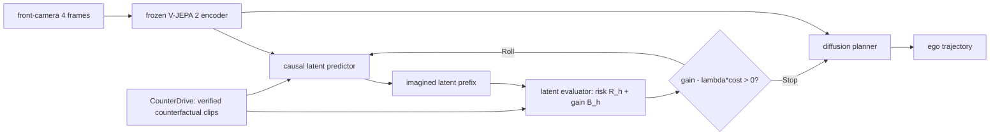

# RISE 분석

## 한 문장 결론

RISE는 자율주행 World Action Model에서 **더 예측할수록 좋은지**를 매 future-latent prefix마다 risk·planning gain으로 추정해, 필요한 scene에만 rollout budget을 쓰도록 만든 adaptive scheduler다.

## 문제와 기여

1. 기존 WAM은 모든 scene에 fixed rollout horizon을 부여해 easy case에는 latency를 낭비하고 ambiguous interaction에는 부족한 imagination을 줄 수 있다.
2. CounterDrive는 factual log의 하나뿐인 미래를 보완하는 curated counterfactual clip·trajectory·incident-onset data다.
3. Latent Evaluator가 current prefix의 risk와 deeper rollout의 expected planning gain을 예측한다.
4. Rollout Gate가 gain–cost trade-off로 `Roll/Stop`을 정하고, zero-to-max horizon의 variable-prefix planner를 routing한다.

## Architecture / pipeline

| 단계 | 입력 | 출력 | 역할 |
|---|---|---|---|
| Encoder | front RGB video | observed latent tokens | scene representation |
| Predictor | latent + relative ego pose | future latent prefix | world imagination |
| Evaluator | context + prefix | risk, future planning gain | continuation utility 추정 |
| Gate | gain, rollout cost $\lambda c_h$ | Roll/Stop | latency–quality control |
| Planner | observed + selected prefix | ego trajectory | executable driving plan |

## I/O, action grounding, taxonomy

- **입력:** front-camera 4 frames와 relative ego motion; route command, additional state, camera extrinsic은 사용하지 않는 perception-free setting이다.
- **출력:** future ego **trajectory**. text reasoning이나 natural-language action을 만들지 않는다.
- **action grounding:** predicted world latent → trajectory diffusion planner라는 numerical action-generation chain이다. Risk/gain은 planner input length를 선택하지만 low-level actuator control을 직접 명령하지 않는다.
- **taxonomy:** VA의 **latent-based world model / world action model**. VLA의 language reasoning policy가 아니라, VLA/agent가 사용할 future-aware planning substrate에 가깝다.

## 핵심 표현과 training recipe

$$p(z_{1:K},\tau_{1:P}\mid c)=p(z_{1:K}\mid c)p(\tau_{1:P}\mid c,z_{1:K}),\quad K\in\{0,\ldots,H\}.$$

- $K=0$: observation-only planning, $K=H$: conventional full imagination.
- Evaluator는 CounterDrive incident/risk와 all-horizon outcome에서 $R_h$, $B_h$를 학습한다.
- Gate는 $B_h$와 normalized depth cost를 비교하고 $x_h>0$일 때만 next latent를 생성한다.
- 3 stages: predictor+initial planner → evaluator+guided planner → gate.
- V-JEPA 2 ViT-L encoder는 frozen; 12-layer predictor와 12-layer diffusion planner는 hidden 384, 12 heads다.

## Dataset / benchmark / metric

| 평가 | 성격 | 대표 metric | RISE 결과 |
|---|---|---|---|
| nuScenes | open-loop | trajectory L2, collision rate | avg L2 0.31 m, collision 0.10 |
| NAVSIM v1 | closed-loop simulator | NC, DAC, EP, TTC, PDMS | PDMS 91.5 |
| NAVSIM v2 | closed-loop simulator | safety/compliance/planning, EPDMS | EPDMS 90.8 |
| CounterDrive | training/safety augmentation | human-verified validity, incident onset | nuScenes 2,432/511; NAVSIM 5,013/1,000 train/test clips |

open-loop error와 collision proxy는 trajectory quality 신호이고, NAVSIM PDMS/EPDMS가 interaction을 포함한 더 강한 검증이다. 그래도 sim-to-real 안전을 증명하지는 않는다.

## 강점

- **adaptive compute:** 하나의 global depth가 아니라 prefix-level stopping이라 high-cost prediction을 필요한 곳에 집중한다.
- **planning-aligned signal:** visual rollout fidelity 대신 future **planning gain**을 직접 continuation criterion으로 둔다.
- **counterfactual safety supervision:** actual log에서 부족한 alternative outcome·incident timing을 보강한다.
- **plug-in positioning:** encoder–predictor–planner WAM에 scheduler를 얹는 설계라 family-level 적용 가능성을 제시한다.

## 한계·안전·배포

- CounterDrive는 generated video와 선택된 subset에 의존하며 full factual dataset coverage가 아니다. artifact나 ego-motion recovery 오류가 risk label을 오염시킬 수 있다.
- gain/risk가 miscalibrated되면 위험한 long-horizon interaction에서 premature stop하거나, 반대로 latency를 과소평가할 수 있다.
- front camera only/perception-free setup은 LiDAR, map, traffic-light, odometry가 있는 production stack과 조건이 다르다.
- vehicle에서는 gate uncertainty threshold, minimum safety rollout, fallback deterministic planner, collision checker와 watchdog을 결합해야 한다.
- A100 training과 latent rollout은 deployment GPU/embedded latency budget을 별도로 측정해야 한다.

## 왜 중요한가

VLA·E2E AD의 핵심 병목은 “더 많은 reasoning/world prediction” 자체가 아니라 그것이 **언제 action quality를 개선하는가**다. RISE는 language 없이도 action grounding 앞단의 compute allocation 문제를 명시화한다. 향후 language-conditioned driving agent라면 route instruction 또는 scene rationale를 context로 넣고, gate의 stop decision을 safety-aware action shield와 검증하는 방식이 유망하다.
