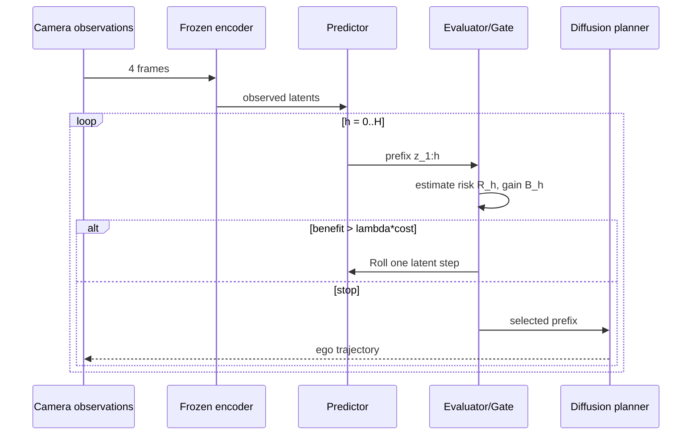

# RISE 핵심 기술 학습 자료

## 선수 지식

1. E2E driving의 observation → future trajectory mapping
2. latent world model, autoregressive rollout, diffusion trajectory planner
3. open-loop trajectory metric과 NAVSIM closed-loop metric의 차이
4. counterfactual data와 risk-label calibration

## 용어집

| 용어 | 뜻 |
|---|---|
| WAM | World Action Model; future world representation을 action planning에 넣는 model |
| imagination / rollout | observation 뒤의 latent future를 여러 step 예측하는 과정 |
| prefix | 현재까지 생성된 $\hat z_{1:h}$ future latent sequence |
| future planning gain | 현재 prefix에서 멈출 때 대비 한 step 이상 더 예측할 때의 plan-quality 예상 변화 |
| Latent Evaluator | prefix에서 risk와 gain profile을 추정하는 경량 model |
| Rollout Gate | gain과 cost의 trade-off로 Roll/Stop을 출력하는 module |
| CounterDrive | verified counterfactual driving clip·trajectory·incident-onset dataset |

## 단계별 이해

1. **관측 encode:** four front-camera frames를 visual latent로 바꾼다.
2. **0-step 판단:** 관측만으로 safe/stable plan을 낼 수 있으면 즉시 stop할 수 있다.
3. **한 step 상상:** predictor가 ego-motion-conditioned next latent를 만든다.
4. **효용 재평가:** evaluator는 “위험이 새로 드러났는가?”와 “다음 latent가 candidate trajectories의 순위를 바꿀까?”를 예측한다.
5. **gate:** $B_h$가 $\lambda c_h$보다 커야 roll한다. 아니면 selected prefix를 planner로 보낸다.
6. **trajectory:** diffusion planner가 observed+imagined evidence를 condition으로 continuous ego path를 샘플한다.

## 핵심 표현

고정 horizon WAM:

$$p(z_{1:H},\tau\mid c)=p(z_{1:H}\mid c)p(\tau\mid c,z_{1:H}).$$

RISE는 stopping time $K(c;\lambda)$를 도입한다.

$$K=\min\{h:d_h=\mathrm{Stop}\}\quad\text{(없으면 }H\text{)},$$

$$d_h=\mathrm{Roll}\iff \widehat B_h-\lambda c_h>0.$$

여기서 중요한 구현 질문은 $\widehat B_h$ target이다. RISE는 같은 scene을 여러 horizon에서 planning해 얻은 downstream outcome과 CounterDrive risk signal로 이를 supervision한다. 따라서 raw video quality loss만으로 gate를 만들지 않는다.

## 구현·배포 메모

- variable-prefix positional/source embedding을 명확히 넣어 planner가 observed token과 imagined token을 구분하게 한다.
- gate가 early stop을 과도하게 선택하지 않도록, validation에서 PDMS/EPDMS와 mean rollout depth를 함께 plot한다.
- latency는 predictor step 수만이 아니라 encoder, diffusion sampling, memory bandwidth를 포함해 device별로 측정한다.
- CounterDrive 같은 synthetic counterfactual은 human verification, ego-motion validity flag, source split isolation이 필요하다.
- safety deployment에서는 low-confidence gate를 `roll`로 보수화할지, deterministic fallback planner로 전환할지 정책을 명시해야 한다.

## 공부 질문과 답

**Q1. 왜 rollout depth를 scene 시작 시 한 번만 정하지 않는가?**
A. 첫 predicted latent가 interaction ambiguity를 해소하거나 새 위험을 드러낼 수 있다. gain은 prefix에 따라 변하므로 sequential stopping이 더 표현력이 있다.

**Q2. 높은 video-prediction fidelity가 곧 좋은 planner인가?**
A. 아니다. visually plausible future라도 candidate trajectory의 안전/진행 순위를 바꾸지 못하면 additional compute의 utility는 작다. RISE는 planning gain을 직접 추정한다.

**Q3. 이 논문은 VLA인가?**
A. 직접 language input/action을 다루지는 않는다. latent-based VA/WAM이지만, driving VLA가 costly world imagination을 사용할 때 action-grounding backend로 결합될 수 있다.

**Q4. closed-loop score가 왜 필요한가?**
A. open-loop L2는 logged future와의 오차일 뿐, agent가 action을 내고 environment가 반응할 때의 collision, route progress, compliance를 완전히 반영하지 않는다.

## 짧은 reading roadmap

1. 본문 Fig. 1–2와 §4.1로 fixed horizon→stopping time의 변화를 이해한다.
2. §3으로 CounterDrive가 factual log 부족을 어떻게 보완하는지 읽는다.
3. §5 Tables 1–3으로 open-loop/closed-loop 결과를 나누어 해석한다.
4. §5.3–5.4로 scheduler ablation과 cost frontier를 확인한다.
5. [[WorldModels]], [[NAVSIM]], [[EndToEndAutonomousDriving]]를 비교하며 language-conditioned VLA에 이 gate를 어떻게 붙일지 설계한다.
