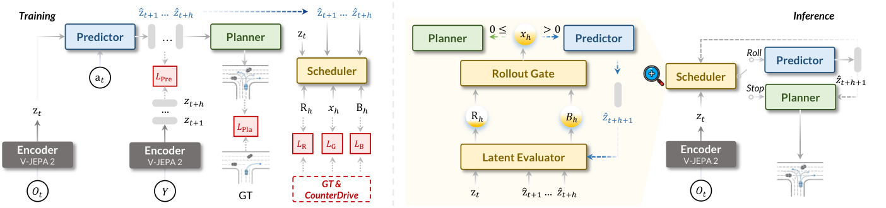
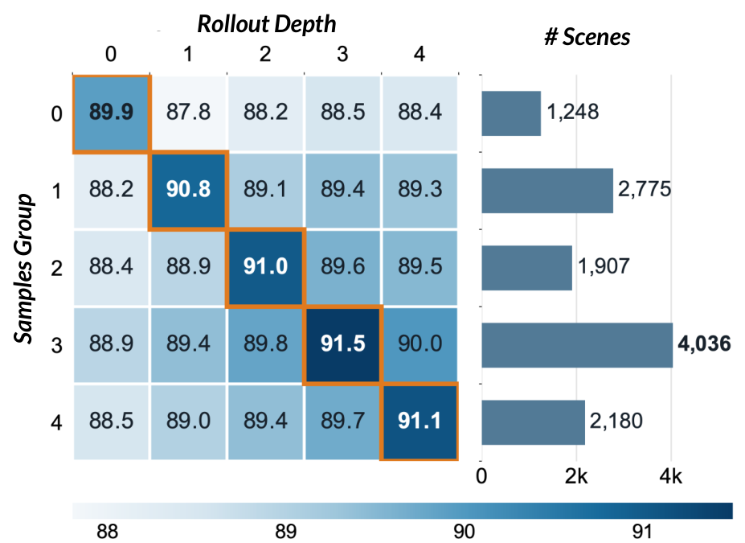
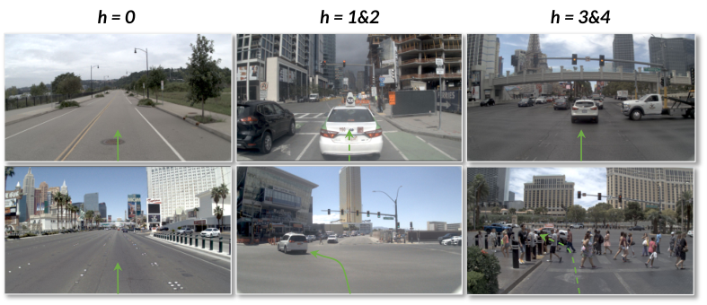

# RISE: World Action Model을 위한 적응형 imagination

> 원문: Hongbo Lu 외, *RISE: Adaptive Imagination for World Action Models* (arXiv:2608.20430). arXiv HTML v1의 Abstract, Introduction, CounterDrive, Method, Experiments, Limitations를 한국어로 기술 번역·정리했다. 표의 모든 세부 수치와 부록의 구현 증명은 압축했으며, 원문을 병행 참조한다.

## Abstract

World Action Model(WAM)은 미래 세계의 전개를 action generation에 포함해 planning을 개선하지만, 기존 방법은 모든 장면에 동일한 imagination budget을 할당한다. 저자들은 계속 rollout할지 중단할지를 순차적으로 결정하는 적응형 imagination framework인 **RISE(Refining Imagination through SElective Rollout)** 를 제안한다. 현재 prefix가 드러낸 위험과 추가 prediction이 planning에 줄 이득을 Latent Evaluator가 추정하고, Rollout Gate가 그 이득을 계산 비용과 비교한다.

factual driving log에는 실제로 일어난 하나의 미래만 있으므로, 저자들은 다양한 결과와 위험도를 갖는 counterfactual dataset **CounterDrive**도 구축했다. NAVSIM과 nuScenes에서 RISE는 불필요한 rollout을 줄이면서 종합 planning 성능을 높였고, 다른 WAM에도 plug-in으로 전이될 수 있음을 보인다.

## 1. Introduction

E2E autonomous driving은 단순 trajectory regression에서 벗어나, 행동하기 전 미래를 예측하고 그 결과를 평가하는 WAM으로 이동하고 있다. 그러나 future latent를 생성한 뒤 trajectory를 만들려면 inference 비용이 늘어난다. 기존 `imagine-and-plan`, `imagine-then-plan`, no-imagination 설계는 서로 다르지만, test-time rollout horizon을 장면 전체에 고정한다.

RISE의 핵심 질문은 “더 깊게 상상할수록 좋은가?”가 아니라 **“현재 prefix만으로 plan이 충분한가, 다음 imagination step이 실제 planning gain을 줄 것인가?”** 이다. 단순 장면은 관측만으로 안정적 trajectory를 낼 수 있고, 상호작용이 모호한 장면은 한 step의 future prediction이 선호 trajectory를 바꿀 수 있다. 따라서 step마다 `Roll` 또는 `Stop`을 결정한다.

## 2. Related Works

- **World Action Model:** latent future prediction이나 action-conditioned dynamics를 통해 observation 밖의 결과를 planning에 넣는다. 그러나 fixed horizon은 easy scene에서 latency 낭비를, hard scene에서 정보 부족을 낳을 수 있다.
- **자율주행 world model:** Gaia-1, LAW, Drive-JEPA, DAWN, DriveFuture 등은 visual/latent dynamics와 planning을 결합한다. RISE는 이 family의 backbone을 대체하기보다 variable-prefix planner와 scheduler를 추가한다.
- **counterfactual safety data:** 실제 log의 단일 미래만으로는 위험 상황의 대안 행동과 onset 시점을 충분히 감독하기 어렵다. CounterDrive는 이 빈틈을 보완하려는 제한된 curated set이다.

## 3. CounterDrive

### 3.1 Counterfactual video generation

NAVSIM·nuScenes의 선택된 source key frame마다 scene description, incident description, 고정 instruction을 결합해 prompt를 만들었다. camera viewpoint, road geometry, 배경, 초기 traffic configuration을 고정하도록 제약한 뒤 Wan 2.7로 1080p·10초 video를 생성하고, 2 Hz에서 20 frame으로 샘플링했다. 완전한 dataset 재생성이 아니라 factual source와 연결된 selected subset이다.

### 3.2 Trajectory와 human verification

OpenVO로 frame별 ego pose $\tilde\tau_{i,t}=(\tilde p^x_{i,t},\tilde p^y_{i,t},\tilde\psi_{i,t})$를 회복하고, 인접 pose의 변화에서 ego-motion action을 계산한다.

$$\tilde a_{i,t}=\mathcal A(\tilde\tau_{i,t},\tilde\tau_{i,t+1}).$$

annotator는 ego-motion consistency, 첫 incident frame, generation distortion, 원인(정상/타 vehicle/ego)을 판정한다. ego-caused incident에는 avoidance 또는 stop 권고를 clip metadata로 단다. 심한 distortion과 믿기 어려운 motion은 제거한다. 필터 후 nuScenes는 train/test 2,432/511 clips, NAVSIM은 5,013/1,000 clips로 구성된다. 따라서 이 data는 future prediction과 시간적으로 local한 risk-ranking supervision을 제공한다.

## 4. RISE

### 4.1 문제 설정

현재 driving context를 $c$, planning horizon의 trajectory를 $\tau_{1:P}$, 최대 imagination horizon의 future world representation을 $z_{1:H}$라 하자. 고정 WAM은

$$p(z_{1:H},\tau_{1:P}\mid c)=p(z_{1:H}\mid c)p(\tau_{1:P}\mid c,z_{1:H})$$

처럼 항상 $H$까지 rollout한다. RISE는 predicted prefix $\hat Z_h=\hat z_{1:h}$에서 scheduler $\mathcal S$가 decision을 내고,

$$K(c;\lambda)=\min\left(\{h\mid d_h=\textsc{Stop}\}\cup\{H\}\right)$$

의 scene-specific horizon $K\in\{0,\ldots,H\}$를 쓴다. $K=0$은 observation-only planning, $K=H$는 full rollout을 복원하며, $\lambda$는 computation cost 선호도다.

### 4.2 WAM architecture

- **Encoder:** frozen V-JEPA 2 ViT-L이 front-camera 4 frames(256×512)를 two-frame tubelet으로 encode한다. 관측 latent는 time step당 512 spatial tokens, dimension 1024이다.
- **Predictor:** 12-layer, hidden 384, 12-head frame-causal Transformer가 ego relative-pose condition을 받아 최대 $H$ future latent steps를 autoregressively 생성한다. route command, 추가 vehicle state, camera extrinsic은 입력하지 않는다.
- **Planner:** 동일한 규모의 12-layer diffusion Transformer가 observed tokens와 선택된 future prefix를 source embedding으로 구분해 받아 $\tau_{1:P}$를 생성한다. 이 구조는 0부터 full까지 variable prefix를 받아들인다.

### 4.3 Adaptive rollout scheduler

**Latent Evaluator**는 prefix로부터 위험 profile $R_h$와 추가 rollout의 future planning gain profile $B_h$를 예측한다. 위험은 CounterDrive의 verified counterfactual incident와 onset 정보를, gain은 가능한 각 horizon에서의 planning outcome을 supervision으로 사용한다. 즉 더 많은 imagination이 “그럴듯한 video”를 만드는지가 아니라, final plan score를 얼마나 바꿀지 학습한다.

**Rollout Gate**는 predicted gain에서 rollout cost를 뺀 score를 평가한다. $x_h>0$이면 Roll, $x_h\le0$이면 Stop하여 planner를 호출한다. 이 정책은 pre-assigned easy/hard class가 아니라, prefix가 추가될 때마다 다시 판단한다.

### 4.4 Three-stage training

1. **Stage I — Predictor + initial planner:** future latent prediction과 full/variable-prefix diffusion planning을 공동 학습한다.
2. **Stage II — Evaluator + guided planner:** CounterDrive의 counterfactual risk와 all-horizon planning outcome으로 Latent Evaluator를 학습하고, latent guidance로 planner를 위험·gain signal에 맞춘다.
3. **Stage III — Rollout Gate:** 추정 planning gain과 normalized computation cost를 trade-off하도록 gate를 학습한다. 결과적으로 task/scene마다 zero-to-$H$ rollout을 선택한다.

## 5. Experiments

### 설정

PyTorch bfloat16, 8×A100, GPU당 batch 4를 썼다. 2 Hz video와 256×512 입력, 4 observed frames를 사용한다. two-frame tubelet 기준 $H_{NAVSIM}=4$, $H_{nuScenes}=3$이다. $\Pi_0$는 20 epochs(lr $2\times10^{-5}$), $\Pi_1$은 50 epochs(lr $5\times10^{-5}$), scheduler는 50 epochs(lr $10^{-3}$) 학습했다. 기본 $\lambda=0.005$이며 0–0.05 범위를 평가했다.

### 결과

- **nuScenes open-loop:** RISE는 average L2 error **0.31 m**, collision rate **0.10**으로 비교 방법 중 최저값을 보고한다. 이는 action/trajectory prediction의 open-loop proxy이지 실제 interactive driving의 완전한 안전 증거는 아니다.
- **NAVSIM v1 closed-loop:** PDMS **91.5**로 strongest baseline보다 0.8 point 높고, EP와 TTC는 이전 최고보다 각각 2.9, 1.9 point 높다.
- **NAVSIM v2 closed-loop:** EPDMS **90.8**, nine component metrics 중 7개에서 최고 또는 공동 최고를 기록했다. safety, compliance, planning quality가 함께 반영된다.
- **ablation:** Scheduler와 CounterDrive는 각각 성능에 기여하며, random stop과 latent-convergence stop보다 predicted gain 기반 gating이 좋다. cost coefficient를 키우면 평균 rollout depth는 감소하고, 지나치면 planning quality가 떨어지는 명시적 latency–quality frontier가 나타난다.

## 6. Conclusion

RISE는 WAM의 imagination을 고정 resource가 아니라, **planning에 유용한 경우에만 지출하는 sequential decision**으로 바꾼다. CounterDrive의 counterfactual risk supervision과 variable-prefix planning을 결합해 NAVSIM·nuScenes에서 quality와 효율을 동시에 개선했다고 보고한다.

## 7. Limitations

실험은 현재 autonomous driving에 집중되어 다른 domain 전이가 아직 검증되지 않았다. CounterDrive 생성·필터링 비용 때문에 NAVSIM training set 전체에 one-to-one coverage를 제공하지 않으며, generative counterfactual의 fidelity·annotation 품질이 risk supervision의 상한을 만든다. 또한 latent risk/gain의 calibration failure, unseen weather/sensor failure, distribution shift에서는 early stop이 위험한 interaction을 놓칠 수 있다. 실제 vehicle deployment에는 uncertainty gate, conservative fallback planner, safety shield, end-to-end closed-loop validation이 필수다.
