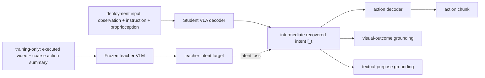

# Act with Intent (INDI) 분석

## 한 문장 결론

INDI는 frozen teacher VLM이 실행 완료된 behavior를 보고 만든 **semantic intent**를 student VLA decoder의 intermediate latent에 증류해, demonstration action의 특정 실현을 모사하는 behavior cloning을 objective/progress-aware action decoding으로 확장한다.

## 문제와 기여

- Behavior cloning은 `$x_t \rightarrow a_t$`를 배워 “어떤 motor command가 나왔는가”를 supervise하지만, 그 행동의 local objective는 암묵적이다.
- Endpoint frame/trajectory 같은 future supervision은 future realization을 주지만, 서로 다른 trajectory가 공유하는 intent를 명시하지 않을 수 있다.
- INDI는 teacher VLM이 current observation, instruction, coarse action summary, execution video를 보며 만든 multimodal intent target을 사용한다.
- Student는 deployment에서 볼 수 있는 standard input만으로 intent를 recover하고, action·visual outcome·textual purpose grounding을 jointly predict한다.
- zero/cross-task/phase intent intervention으로 latent가 action에 실제로 쓰이는지 시험한다.

## Architecture / I-O / action grounding

| 항목 | 내용 |
|---|---|
| Student 입력 | current observation, language instruction, robot context; deployment에서 실행 video 없음 |
| Teacher 입력 | student input + demonstrated execution segment/video + coarse action summary |
| Student 출력 | continuous robot action과 intermediate intent, visual/text grounding predictions |
| Language 역할 | instruction condition 및 teacher textual-purpose grounding; deployed action 자체는 natural-language action이 아님 |
| Action grounding | observed context → recovered intent (objective + progress) → numerical action; grounding streams은 latent가 future outcome/purpose를 담도록 보조 |
| taxonomy | VLA의 implicit representation transfer / VLM-as-teacher 계열 |

## Training recipe

Teacher VLM/visual encoder는 frozen, training-only target producer다. Student는 action loss와 intent alignment·visual/text grounding objective를 결합한다. 논문은 decoder context shortcut을 막는 bottleneck과 mismatch objective를 사용해, intent branch가 부수적 feature가 아니라 action pathway의 필요한 condition이 되게 한다. 정확한 loss weights/implementation은 Appendix A를 참조한다.

## Dataset / benchmark / metric

| setting | metric | 보고된 핵심 결과 |
|---|---|---|
| SimplerEnv-Bridge 4 tasks | success rate | GR00T-N1.7: 64.3% → 84.7% |
| RoboCasa Kitchen 24 tasks | macro success rate | controlled GR00T-N1.7: 64.1% → 70.3% |
| Real robot, 50 trials | success by ID/held-out/distractor | average 62.0% → 68.7%; long horizon 최대 +12.0 pp |
| controlled diagnostic | success after intent replacement | zero/phase/cross-task intervention이 behavior를 바꿈 |

**closed-loop 해석:** simulation/real robot success는 policy action이 task state를 바꾸는 closed-loop metric이다. 그러나 finite trial 수, benchmark task distribution, teacher-generated target의 annotation advantage 때문에 broad safety/generalization claim으로 확대하면 안 된다.

## 강점

- Teacher의 rich future evidence를 deployment input에 leak하지 않고 distilled training target으로만 쓴다.
- Latent intent의 objective와 progress 구조를 probing하고, forced-intervention으로 downstream usage를 검사한다.
- Existing VLA backbone에 training objective/limited module 변경으로 붙일 수 있고 runtime teacher overhead가 없다.
- Real-world distractor·functional substitute setting을 포함한다.

## 한계·안전·배포 함의

- Teacher hallucination 혹은 biased interpretation은 action decoder가 목표로 삼는 latent target 자체를 오염시킬 수 있다.
- Intent가 interpretable natural-language plan과 동치가 아니며, latent label이 safety constraint/rule compliance를 보장하지 않는다.
- Target video cache와 teacher inference 비용은 large-scale VLA learning에서 무시하기 어렵다.
- Long-horizon success 향상은 welcome signal이지만 collision/contact force, uncertainty, recovery, abort protocol 등 safety metrics와 별개다.
- 자율주행 적용 시 intent decoder는 route/map/rules/other-agent prediction과 consistency check되어야 하고, safety shield가 final action authority를 가져야 한다.

## 왜 중요한가

VLA의 병목은 더 많은 future data를 action token 옆에 붙이는 것보다, **다양한 실행을 관통하는 목적을 어떤 representation으로 action decoder에 제공할지**일 수 있다. INDI는 그 representation을 teacher-supervised latent와 causal intervention으로 다룬 드문 사례다.
