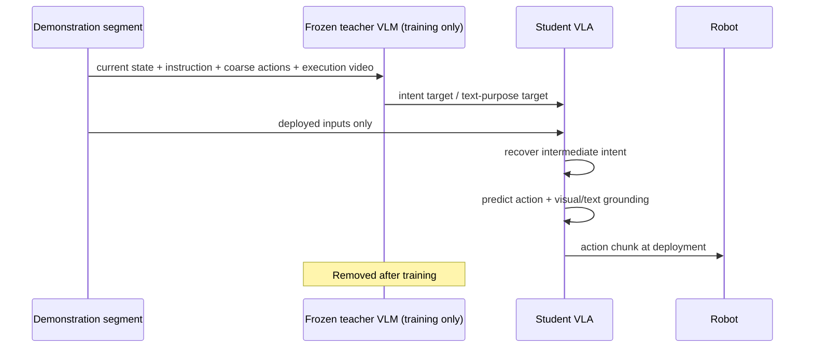

# Act with Intent (INDI) 학습 노트

## 선행지식과 용어

| 용어 | 뜻 |
|---|---|
| behavior cloning | observation/context에서 demonstrated action을 supervised learning으로 복제 |
| behavior intent | 행동 sequence가 달성하려는 local semantic objective와 progress |
| future-based supervision | future frame, trajectory, latent state 등 future realization을 action learning의 target으로 추가 |
| distillation | teacher의 richer representation/soft target을 student가 모방하도록 학습 |
| grounding | latent/language representation이 실제 outcome/action과 연결되는 성질 |
| intervention | latent를 zero·다른 task·다른 phase 값으로 바꾸어 causal role을 시험 |

## 핵심 직관

동일한 “drawer에 넣기” objective는 grasp position, wrist trajectory, speed가 달라도 될 수 있다. 반대로 같은 forward motion은 pick, place, avoid 과정에서 모두 나타날 수 있다. 따라서 action sequence의 surface form만 지도하면 objective-equivalent variation에 약할 수 있다. INDI는 teacher VLM이 execution video를 보고 추정한 **“무엇을 위해, 어느 단계에서 이 행동을 하는가”**를 student decoder의 compact latent에 얹는다.

## Pipeline

## 단계별 분석

1. **Teacher evidence:** executed behavior의 current/future visual evidence와 instruction을 보며 target intent를 만들 수 있다.
2. **Student bottleneck:** student는 action decoder intermediate layer에서 $\hat I_t$를 recover한다. 실행 시 teacher/video가 없으므로 current deployed input에서 predict해야 한다.
3. **Joint grounding:** $\hat I_t$가 action뿐 아니라 endpoint visual representation과 textual purpose representation도 예측하도록 해 intent가 outcome-relevant가 되게 한다.
4. **Dependence test:** recovered intent $\hat I_t$를 zero하거나 다른 objective/phase로 교체한다. policy behavior가 방향성 있게 변하면 latent use의 evidence가 된다.
5. **Deploy:** teacher branches/target generator를 제거하고 base VLA와 유사한 inference graph에서 action한다.

개념적 loss는 다음처럼 이해할 수 있다.

$$\mathcal L = \mathcal L_{\mathrm{action}} + \lambda_I d(\hat I_t,I_t^{\mathrm{teacher}}) + \lambda_V\mathcal L_{\mathrm{visual}} + \lambda_R\mathcal L_{\mathrm{text}} + \lambda_{\mathrm{mis}}\mathcal L_{\mathrm{mismatch}}.$$

이는 explanatory notation이며 target construction, pooling, actual weights는 paper appendix를 따라야 한다.

## 구현 점검표

- Teacher target cache가 train/validation episode split을 침범하지 않게 한다.
- Teacher textual answer가 plausible prose인지가 아니라 execution segment와 objective에 consistent한지 audit한다.
- Teacher capacity/teacher swap, random/free latent, future frame target을 matched compute로 비교한다.
- intent intervention을 task success, failure category, action distribution, safety constraint violation과 함께 기록한다.
- deployment에는 out-of-distribution detector, temporal consistency check, action limit, recovery/abort policy를 별도로 둔다.

## 질문과 답

**Q1. INDI는 future information leakage 아닌가?**
A. Teacher는 training target을 만들 때 future execution video를 보지만 deployed student는 보지 않는다. 다만 teacher target이 실제로 future를 일반화 가능한 objective로 압축하는지와 annotation-cost fairness는 검증해야 한다.

**Q2. Endpoint image supervision과 intent supervision은 무엇이 다른가?**
A. Endpoint는 한 execution의 결과를 담는다. Intent는 다른 successful realization을 묶는 behavior objective와 progress를 목표로 하며, 논문은 objective separation/intervention으로 이 차이를 주장한다.

**Q3. Real-world gain이 곧 robust policy를 뜻하는가?**
A. 아니다. 50 trials의 tabletop suite는 제한된 evidence다. Contact safety, unseen morphology, long-horizon recovery, calibration drift에서 추가 평가가 필요하다.

## 읽기 로드맵

1. Fig. 1–2로 BC/future supervision/INDI와 training-only teacher boundary를 이해한다.
2. Sec. 3.2–3.3에서 intent target과 decoder bottleneck을 읽는다.
3. Table 1–6과 Fig. 3, 6, 8–12를 통해 raw score보다 intervention evidence를 중심으로 평가한다.
4. VLAct/representation transfer, PonderPounce의 slow-fast cognition, DriveVLM류 explicit guidance와 비교해 “어떤 latent를 action에 전달하는가”를 정리한다.
