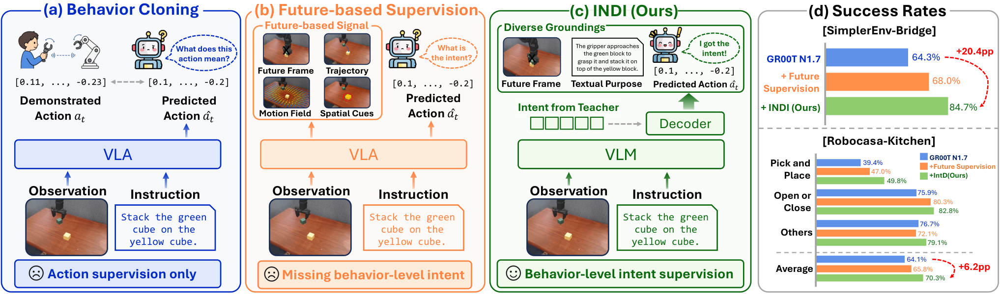
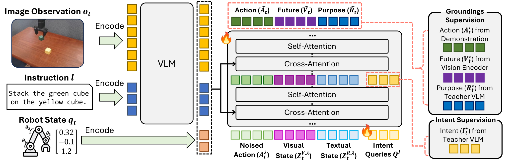
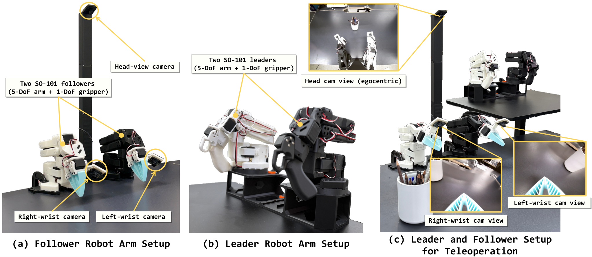

# Act with Intent: Vision-Language-Action 모델을 위한 행동 의도 증류

> 원문: Sangoh Lee, Sangwoo Mo, Wook-Shin Han, *Act with Intent: Distilling Behavior Intent for Vision-Language-Action Models* (arXiv:2608.23478). arXiv HTML v1의 Abstract, Introduction, Methodology, Experiments, appendix limitation을 바탕으로 한국어 기술 번역·정리했다. 모든 appendix table의 세부 행은 압축했으며 원문 HTML을 병행 참조한다.

## Abstract

Vision-Language-Action(VLA) model은 multimodal context를 robot action으로 바꾸지만, action decoder는 여전히 대체로 behavior cloning으로 학습된다. 이는 demonstration의 motor command는 가르치지만, instruction 아래에서 그 행동이 달성하려는 **local objective**, 즉 behavior intent는 암묵적으로 남긴다. Future frame, latent observation, trajectory, motion representation을 추가하는 future-based supervision도 특정한 미래 실현을 담을 뿐, 서로 다른 실행이 공유하는 semantic objective를 명시하지 않는다.

논문은 **Intention Distillation (INDI)** 을 제안한다. Training에서 frozen teacher VLM은 current observation, instruction, coarse action summary, execution video가 포함된 demonstrated segment를 해석하여 behavior-level intent를 만든다. Deployed VLA는 standard input만으로 intermediate decoder layer에서 이 multimodal intent representation을 복구하고, 행동이 어떻게 전개되고 무엇을 달성하는지의 representation과 함께 action prediction을 구성한다.

SimplerEnv-Bridge에서 INDI는 GR00T-N1.7을 64.3%에서 84.7%로, RoboCasa Kitchen에서는 64.1%에서 70.3%로 개선했다고 보고한다. Real-world task의 평균 success는 62.0%→68.7%이며 long-horizon task에서 최대 12.0 pp gain을 보인다. 저자들은 recovered latent가 decoder에 사용되고 objective 및 execution progress를 포착한다고 분석한다.

## 1. Introduction — “무엇을 했는가”와 “무엇을 위해 했는가”

Behavior cloning은 state/context에서 demonstration action을 예측한다. 그러나 같은 objective는 다양한 action trajectory로 실현될 수 있고, 비슷한 local motion도 서로 다른 objective에 속할 수 있다. 예를 들어 물체를 집는 arm motion은 이후 drawer에 넣기 위한 것일 수도, basket에 놓기 위한 것일 수도 있다. Endpoint image나 future trajectory만 주면 observed realization을 더 잘 맞출 수는 있지만 purpose 자체가 separable representation으로 형성된다는 보장은 없다.

INDI의 주장은 VLA action decoding에 **행동의 목적과 진행도**를 나타내는 latent bottleneck을 넣고, training-only teacher가 executed behavior를 보고 만든 intent target을 그 bottleneck에 distill해야 한다는 것이다. Deployment에는 teacher, execution video, target generation module이 남지 않는다.

## 2. Methodology

### 2.1 문제 설정

Student VLA는 current observation $o_t$, language instruction $l$, robot proprioception/action context 등 standard deployed input $x_t$에서 action chunk $a_{t:t+h}$를 생성한다. Teacher는 training 중에만 executed segment의 coarse action summary와 future execution video까지 받아 richer evidence $e_t$를 본다. 이 정보 비대칭은 student가 미래를 직접 보게 하는 leakage가 아니라, future behavior의 shared semantic objective를 teacher target로 전환하려는 design이다.

### 2.2 실행된 행동에서 intent supervision 만들기

Frozen teacher VLM은 $e_t$를 해석해 multimodal intent target과 textual-purpose target을 만든다. 또 frozen visual encoder는 endpoint visual target을 제공한다. 이 target은 deployment 시 제거된다. 논문은 contiguous-region pooling을 포함한 intent target construction과 teacher quality/target geometry ablation을 통해, 단순 action snippet projection보다 objective separation이 강한 intent space를 얻으려 한다.

### 2.3 Intent-aware action decoding

Student decoder의 intermediate alignment layer는 recovered intent $\hat I_t$를 만든다. 이 latent는 다음 세 갈래에 쓰인다.

1. **Action path:** target robot action을 예측한다.
2. **Visual grounding stream:** behavior가 도달할 endpoint/visual outcome representation을 예측한다.
3. **Textual grounding stream:** 행동의 purpose를 나타내는 text-side representation을 예측한다.

의도 target, visual target, textual target, action objective를 함께 최적화한다. 중요한 mechanism은 action/grounding stream이 full VLA context를 shortcut으로 계속 읽지 않고 intent bottleneck에 의존하도록 하는 것, 그리고 mismatch/intent intervention으로 dependence를 검사하는 것이다.

## 3. Experiments

### 3.1 설정

- **Backbone:** GR00T-N1.7을 주된 student로 하고 π0.5에도 적용한다.
- **Simulation:** SimplerEnv-Bridge 4 task, RoboCasa Kitchen 24 task.
- **Real world:** 5-DoF arm + 1-DoF gripper, multi-camera teleoperation/evaluation; ID clean, held-out functional substitutes, distractor condition.
- **Target generation:** teacher VLM과 frozen visual encoder는 training-only이며 deployment inference graph에서 제거된다.

### 3.2 결과와 진단

| 평가 | 보고 결과 | 무엇을 뜻하는가 |
|---|---:|---|
| SimplerEnv-Bridge | GR00T-N1.7 64.3% → 84.7% | behavior-level intent supervision이 simulation success를 높였다는 evidence |
| RoboCasa Kitchen | controlled GR00T-N1.7 64.1% → 70.3% | 24-task kitchen manipulation에서 평균 개선 |
| Real world | 62.0% → 68.7%, long horizon 최대 +12.0 pp | distribution shift/longer execution에 대한 제한적 evidence |
| intent intervention | zero/cross-task/phase forcing이 행동을 바꿈 | latent가 decoder에 causally used됨을 보이려는 test |

Figure 3의 representation analysis는 recovered intent가 task objective와 phase/progress를 함께 organize한다고 보고한다. Stage-forced intervention에서 early intent를 주입하면 policy가 grasp transition에 실패하고, late intent를 주입하면 아직 물체를 들지 않았는데 placement를 수행하려는 behavior가 나타난다. 이는 latent가 단순 classifier feature가 아니라 action sequence의 stage에 영향을 준다는 evidence다.

## 4. 강점과 한계

**강점:** 행동을 “demonstrated motor sequence”와 “semantic objective”로 구분해 supervision target을 설계한다. Teacher와 future video를 deployment에서 제거해 inference latency는 base VLA에 거의 추가하지 않는다. Visual/textual grounding auxiliary를 통해 latent usefulness를 test하고, intervention을 추가해 correlation보다 강한 causal evidence를 제시한다.

**한계:** teacher VLM의 quality와 future execution video가 target semantics를 좌우한다. Intent label/latent가 true human intention을 보장하지 않으며, teacher hallucination이 policy objective로 증류될 수 있다. Simulation과 50 real trial success는 safety-critical generalization evidence로 부족하다. GR00T-N1.7 중심 result가 다른 action tokenizer, robot morphology, contact-rich task에서 유지되는지도 열려 있다. Training-time video/teacher cache 비용은 large-scale robotics data pipeline의 병목이 될 수 있다.

## 5. VLA와 자율주행에 주는 의미

INDI는 VLA taxonomy의 **representation transfer / VLM teacher supervision** 계열이다. Output은 text action이 아니라 continuous robot action이며, language는 task instruction 및 teacher의 textual-purpose target으로 intent representation을 형성한다. 자율주행으로 옮기면 lane change·yield·merge 같은 trajectory가 “앞차와 안전 거리를 유지하며 merge 기회를 만든다” 같은 driving intent를 반영해야 한다는 analog가 된다. 다만 driving에서는 intent가 traffic rule, map/route, other-agent uncertainty, safety constraint에 의해 검증되어야 하며, latent intent만으로 실행 승인하면 안 된다.

## 번역 범위 메모

Abstract부터 Conclusion/Limitations까지의 핵심 argument와 method/experiment을 심층 번역했다. Appendix A–C의 hyperparameter 전부와 per-task result, Appendix E의 LLM-use disclosure는 원문에 남겨 두었다.
