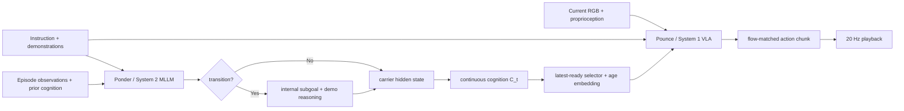

# PonderPounce 분석

## 한 문장 결론

PonderPounce는 느린 pretrained MLLM의 append-only causal context를 episode memory로 쓰고, 빠른 VLA에 **continuous cognition token + age**만 비동기 전달해 long-horizon control을 개선하려는 slow–fast VLA 설계다.

## 문제와 기여

1. Current-frame VLA는 이전에 관측된 object/event/demonstration을 잊어 partial observability에서 실패한다.
2. 기존 memory policy는 history store, retrieval, sampler, compressor 같은 purpose-built mechanism을 설계한다.
3. Ponder는 pretrained MLLM native context에 history를 유지하고, Pounce는 current observation 중심 fast controller로 남긴다.
4. Textual subgoal/reasoning은 Ponder를 ground하는 internal supervision이고, Pounce에는 decoded text 대신 hidden continuous cognition을 보낸다.
5. Cognition freshness를 age encoding으로 명시하고, KV cache/fused kernel로 20 Hz action playback을 목표로 한다.

## Architecture / pipeline

| 구성 | 입력 | 출력 | 역할 |
|---|---|---|---|
| Ponder | instruction, demo, history, observation | carrier state $\mathbf C_t$ | large-context episode reasoning/memory |
| transition branch | context | internal subgoal/reasoning | LM-head grounding; default action input은 아님 |
| readiness selector | async Ponder states | newest $\mathbf C$, age $\Delta$ | stale state를 명시해 System 1에 전달 |
| Pounce | current image, proprioception, instruction, cognition | $A_{1:h}$ | fast numerical action chunk generation |
| StaticCache | append-only token stream | cached KV | long context re-encode 비용 감소 |

## I/O, language role, action grounding, taxonomy

- **입력:** Ponder는 instruction, visual episode history, optional demonstration; Pounce는 current observation·proprioception·instruction과 latest continuous cognition을 입력으로 받는다.
- **출력:** flow-matched continuous robot action chunk, 20 Hz playback.
- **Language 역할:** instruction은 양 시스템 조건; Ponder의 subgoal/demo reasoning text는 internal grounding target이다. Default action path는 natural-language action이 아니라 latent cognition이다.
- **Action grounding:** accumulated visual/language evidence → carrier hidden state → age-aware prefix → Pounce flow-matching action. 지연/age를 모델이 보게 하여 contextual reasoning과 actuator clock을 연결한다.
- **taxonomy:** VLA의 **dual-system / explicit action guidance 인접** 계열이지만 guide가 text가 아닌 continuous hidden state인 memory interface다. Driving VLA라면 long-horizon route/scene memory와 fast trajectory controller를 나누는 설계 analog가 된다.

## Training recipe 및 수식

$$\mathcal L=w_1\mathcal L_{\mathrm{fm}}+w_2\mathcal L_{\mathrm{ground}}.$$

- $\mathcal L_{\rm fm}$: Pounce action flow-matching MSE.
- $\mathcal L_{\rm ground}$: transition token, annotated subgoal, demo reasoning의 LM cross entropy.
- Carrier embedding/projector/age projection/null cognition만 새로 초기화하고 pretrained Ponder/Pounce를 joint train한다.
- Multiple Pounce calls가 한 cognition을 refer하면 action gradient가 누적되므로, Ponder 유입 action gradient를 0.5로 scale한다.
- Latest-ready rule: Pounce invocation보다 완료가 이른 Ponder state 중 가장 최근 것을 선택하고 source time과 current time의 차이를 sinusoidal age로 encode한다.

## Dataset / benchmark / metric

| 평가 | 성격 | 결과 | 해석 제한 |
|---|---|---:|---|
| RoboMME 1× | 16 simulator memory tasks | 60.83% | FrameSamp+Modul 44.51%, current π0.5 17.93% |
| RoboMME 9× | fresh 14,400 episodes | 75.54% | 더 많은 trajectory로 +14.71 pp, task별 variance 존재 |
| Ponder scale | same Pounce/interface | 9B 60.83%, 0.8B 50.04% | pretrained context capacity의 evidence |
| RoboCasa-DC | cross-embodiment demo control | 12.5%, null 8.6% | cognition contributes, 그러나 absolute success 낮음 |
| serving profile | batch-1 H100/A100 | Ponder 78 ms p50, Pounce 25 ms p50 | concurrency/energy/real robot E2E latency는 미측정 |

RoboMME의 Permanence/Reference에는 강했지만 Imitation과 9× Counting은 strongest baseline보다 약하다. 따라서 “native MLLM context가 모든 robot memory를 대체한다”는 결론은 과장이다.

## 강점

- **context/controller separation:** MLLM scale을 controller 재설계 없이 바꿀 수 있다.
- **action path의 bandwidth 절약:** history 전체나 generated text가 아니라 one cognition carrier와 age만 전송한다.
- **grounding evidence:** null-cognition·held-state·scale ablation이 channel의 역할을 부분적으로 검증한다.
- **latency-aware formulation:** asynchronous schedule/staleness를 architecture 수준 변수로 명시한다.
- **cross-embodiment signal:** action-only RoboCasa-DC에서도 cognition ablation의 차이를 제시한다.

## 한계·안전·배포 함의

- RoboMME's simulator-derived reasoning/subgoal labels는 baseline과 matched annotation cost가 아니며 architecture 효과와 supervision 효과가 얽혀 있다.
- 9B context engine+3B action policy는 memory, power, thermal, network placement을 고려하지 않은 채 vehicle/robot edge에 올리기 어렵다.
- Stale cognition 또는 잘못된 internal reasoning이 fast controller를 오도할 수 있다. Age embedding만으로 safety guarantee는 되지 않는다.
- Held-cognition test는 true age mismatch를 포함하므로 sparse refresh가 불가능하다는 깨끗한 causal test는 아니다.
- Real vehicle/robot에는 deadline-aware scheduling, freshness threshold, confidence/calibration, fallback planner, collision/safety shield, sensor timestamp integrity가 필요하다.

## 왜 중요한가

VLA에서 “생각하는 큰 모델”과 “빠르게 움직이는 작은 모델”을 결합할 때 중요한 것은 더 많은 chain-of-thought를 출력하는지가 아니라, **언제 계산한 어떤 representation을 control에 전달하며 얼마나 stale한지를 action model이 아는가**이다. 이 질문은 long-horizon navigation, E2E autonomous driving, teleoperation 모두에서 핵심이다.
