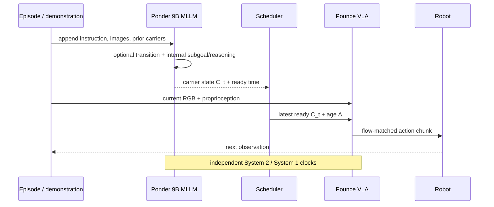

# PonderPounce 핵심 기술 학습 자료

## 선수 지식

1. Transformer causal attention과 KV cache
2. VLA의 vision/language/proprioception → continuous action chunk 구조
3. flow matching과 action diffusion의 기초
4. partial observability, recurrent state, external memory/retrieval
5. real-time control의 latency, jitter, data freshness, safety watchdog

## 용어집

| 용어 | 뜻 |
|---|---|
| Ponder / System 2 | 긴 multimodal context를 누적하고 cognition을 갱신하는 pretrained MLLM |
| Pounce / System 1 | current observation에서 빠르게 action chunk를 생성하는 VLA |
| cognition carrier | Ponder hidden state에서 직접 읽는 $K\times H$ continuous latent interface |
| age | Ponder가 state를 본 time부터 Pounce invocation까지의 freshness signal |
| latest-ready | asynchronous completion 상태 중 controller deadline 전에 준비된 가장 최신 cognition 선택 규칙 |
| null cognition | 아직 System 2 결과가 없을 때 쓰는 learned fallback state |
| grounding loss | transition/subgoal/demo reasoning token을 supervision하는 LM-head loss |
| stale cognition | 현재 environment state보다 오래된 context state |

## Architecture map

## 단계별 이해

1. **History를 재입력하지 않는다:** Ponder의 append-only causal context/KV cache가 prior observation과 demonstration를 보존한다.
2. **새 observation을 sparse query로 추가한다:** Ponder는 transition 여부를 판단하고 필요할 때 internal text를 생성한 뒤 carrier hidden state를 얻는다.
3. **Cognition 전달:** scheduler는 finished state 중 현재 System 1 time에 쓸 수 있는 최신 것을 선택한다.
4. **Freshness를 같이 전달한다:** same cognition vector라도 0.3 s old인지 4 s old인지 controller가 다르게 처리할 수 있도록 age embedding을 prefix에 넣는다.
5. **Fast action:** Pounce는 history full sequence가 아니라 current observation+proprioception+cognition으로 action chunk를 flow-match하고 20 Hz로 playback한다.
6. **공동 학습:** action loss가 latent channel을 통해 Ponder까지 들어가고, LM grounding이 Ponder representation을 subgoal/reasoning target으로 정돈한다.

## 핵심 수식

Latest-ready 선택과 age:

$$t^*=\arg\max_t\{\tau_t^{(2)}+d_t\le\tau_j^{(1)}\},$$
$$\tilde{\mathbf C}_j=\mathbf C_{t^*},\qquad \Delta_j=\tau_j^{(1)}-\tau_{t^*}^{(2)}.$$

Action-grounding loss:

$$\mathcal L=w_1\mathcal L_{\rm flow}(A_{1:h},\hat A_{1:h})+w_2\mathcal L_{\rm CE}(T,S,DR).$$

$w_2=0$이어도 RoboCasa-DC에서는 action gradient만으로 cognition channel이 유용했지만, RoboMME에서는 LM grounding을 제거하면 큰 성능 저하가 있었다. 즉 label availability에 따라 training dynamics가 달라진다.

## 구현·배포 checklist

- 모든 observation, Ponder query, cognition-ready, Pounce invoke, actuator command에 monotonic timestamp를 남긴다.
- Queue가 밀리면 “가장 최근 생성”이 아니라 “deadline 전에 ready인 최신”을 선택해야 한다.
- Age distribution을 training과 deployment에서 맞춘다. Training에서 0.3–1 s만 봤다면 5 s stale state는 OOD다.
- `null cognition`, stale threshold, timeout fallback을 명시한다. Safety-critical robot/vehicle은 stale state를 계속 사용하기보다 safe stop 또는 certified local planner로 전환해야 한다.
- KV cache가 커질수록 memory/eviction/context truncation이 behavior에 미치는 영향을 measure한다.
- Ponder text는 internal이라고 해도 hallucination/incorrect latent influence risk가 사라지지 않는다. Counterfactual freshness/error injection으로 action effect를 검증한다.
- p50만이 아니라 p95/p99, jitter, concurrent throughput, end-to-end sensor-to-actuator latency, energy/thermal을 profile한다.

## 공부 질문과 답

**Q1. 왜 Ponder가 text subgoal을 Pounce에 직접 주지 않는가?**  
A. Text decode는 느리고 lossy할 수 있다. Continuous carrier는 MLLM hidden state의 더 넓은 정보를 low-bandwidth prefix로 전달하며, text는 Ponder grounding/inspection에 남긴다.

**Q2. Continuous cognition은 해석 불가능한 black box 아닌가?**  
A. 그렇다. Subgoal/reasoning target과 ablation은 indirect evidence일 뿐, 어떤 information이 action에 causal하게 쓰였는지는 representation probe·counterfactual test가 더 필요하다.

**Q3. Age embedding만 있으면 stale memory가 안전한가?**  
A. 아니다. Age는 condition signal일 뿐 calibrated uncertainty나 environment change detector가 아니다. Safety shield와 deadline policy가 필요하다.

**Q4. 자율주행에 어떻게 번역되는가?**  
A. Ponder는 route instruction, prior scene/risk, VLM reasoning을 누적하고 Pounce는 current camera/BEV/ego state에서 waypoint/trajectory를 내는 구조가 가능하다. 다만 20 Hz playback만으로 vehicle control safety를 증명할 수 없고, perception timestamp·fallback MPC·closed-loop simulator/road validation이 선행돼야 한다.

## 읽기 roadmap

1. Figure 1–2와 §3.1에서 history storage와 control interface를 분리해 이해한다.
2. §3.2–3.4로 loss, async schedule, cache/latency를 읽는다.
3. §4에서 RoboMME memory 종류와 RoboCasa-DC demo transfer를 분리해 평가한다.
4. §5의 grounding/null/held/staleness ablation을 causal claim의 강도별로 평가한다.
5. §7–8을 읽고 real-time profile, supervision cost, simulator-to-real 안전 gap을 체크한다.
