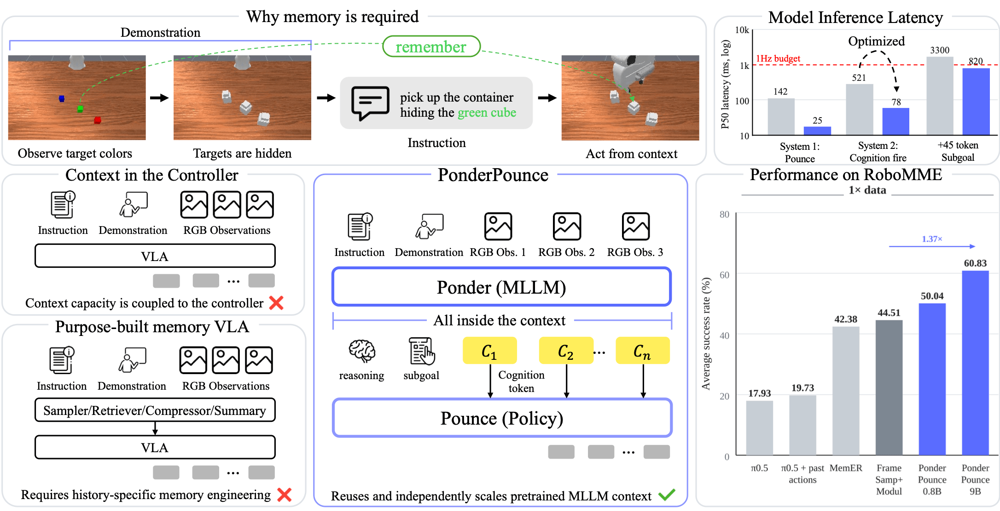
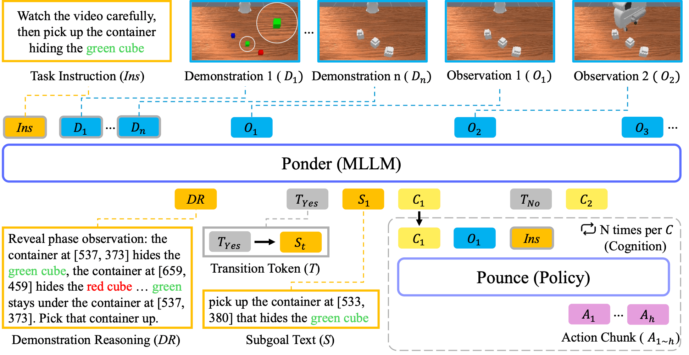
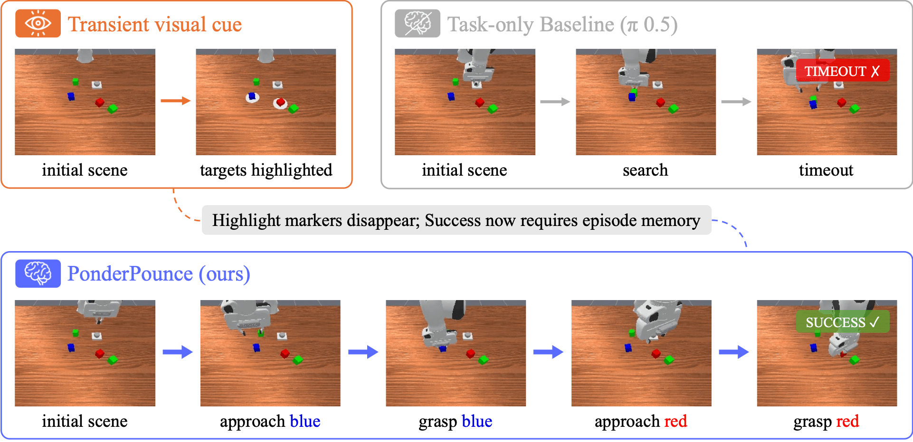

# PonderPounce: 사전학습 MLLM을 로봇 제어의 episode context engine으로 사용하기

> 원문: Suhwan Choi 외, *PonderPounce: A Pretrained MLLM as an Episode Context Engine for Robot Control* (arXiv:2608.24115). arXiv HTML v1의 Abstract, Method, Experiment, Analysis, Limitation을 한국어 기술 번역·정리했다. Appendix의 모든 table row와 serialization string은 압축했으며 원문을 병행 참조한다.

## Abstract

Multimodal large language model(MLLM)은 긴 visual history, partial observability, few-shot behavior를 통합할 수 있지만, 일반적인 VLA는 pretrained representation만 상속할 뿐 그 causal context를 episode memory로 직접 활용하지 않는다. 기존 memory policy는 history sampler, external bank, retrieval, compressor 같은 전용 module을 추가한다.

**PonderPounce**는 MLLM의 native causal context 자체를 robot memory로 재사용한다. 느린 **Ponder(System 2)** 는 observation, demonstration, prior cognition을 append-only context에 누적하고 internal subgoal text/demonstration reasoning을 생성할 수 있다. 빠른 **Pounce(System 1)** 는 current observation, instruction, proprioception을 직접 받고, Ponder가 비동기로 갱신한 continuous cognition token과 그 age만 받아 action chunk를 낸다. 두 시스템은 별도 bridge pretraining이나 purpose-built memory 없이 end-to-end 공동 학습된다.

Optimized serving은 cognition refresh p50 78 ms, action invocation p50 25 ms를 보고해 20 Hz action playback을 지원한다. RoboMME에서 9B PonderPounce는 base data 60.83%, 9× data 75.54%를 기록했고, RoboCasa-DC에서 cognition을 null state로 바꾸면 12.5%에서 8.6%로 감소했다. 결과는 pretrained context가 강력하지만 공짜도 보편적으로 우월한 memory도 아니라는 점을 보여 준다.

## 1. Introduction — 현재 frame에 없는 정보를 action으로 옮기기

로봇은 이전에 봤지만 지금은 가려진 object, transient event, referent identity, demonstration procedure에 근거해 행동해야 한다. Current observation π0.5는 RoboMME에서 17.93%이고 past action을 추가해도 19.73%인 반면 human은 90.50%다. 문제는 history를 저장하는 것만이 아니라, accumulated evidence를 **controller가 사용할 수 있는 representation으로 전달하는 법**이다.

PonderPounce는 MLLM의 context capacity를 독립적인 scale axis로 삼는다. System 2를 키워도 fast controller architecture를 바꾸지 않으며, System 2는 action critical path 밖에서 느리게 돌고 System 1은 빠르게 action을 재생한다.

## 2. Related work

FrameSamp+Modul은 sampled history token을 layer-wise modulator로 넣고, SAM2Act+는 segmentation-derived bank를, MemER는 selected keyframe retrieval과 textual subgoal을 쓴다. MemoryVLA도 external bank를 retrieve/fuse하며 RoboTTT는 fast weight에 history를 압축한다. ICRT, Vid2Robot, UniSkill, ViVLA, SeeTraceAct는 demonstration를 controller sequence, cross-attention, skill representation, latent plan 등으로 action에 연결한다.

PonderPounce의 차이는 history-specific store/retrieval/compressor를 설계하는 대신, pretrained MLLM의 **native transformer causal context**에 episode를 유지하고, activation-level continuous cognition과 age를 비동기적으로 전달한다는 데 있다. Natural-language subgoal/reasoning은 Ponder 내부 supervision/grounding 용도이지 default Pounce input은 아니다.

## 3. PonderPounce 방법

### 3.1 Architecture

Ponder query $t$에서 causal context는 instruction $\mathrm{Ins}$, optional demonstration $D_{1:n}$, observation $O_t$, earlier cognition carrier, internal subgoal/reasoning으로 구성된다. Ponder는 transition token $T_t\in\{T_{\rm Yes},T_{\rm No}\}$를 예측한다. Transition이면 internal subgoal $S_t$와, first execution transition이면 demonstration reasoning $DR$을 생성한 뒤 $K$개의 carrier position을 넣는다. Carrier final hidden state가 cognition이다.

$$\mathbf C_t\in\mathbb R^{K\times H}.$$

Pounce invocation $j$는 current image, instruction, proprioception에 최신 ready cognition과 sinusoidal age embedding을 prefix로 붙여 action $A_{1:h}$를 예측한다. 아직 ready cognition이 없으면 learned null cognition을 쓴다.

### 3.2 Training과 action grounding

두 pretrained component를 end-to-end로 학습한다. Randomly initialized 것은 carrier embedding, cognition projector, age projection, learned null cognition이다. Action flow-matching loss와 Ponder LM head의 grounding cross entropy를 합친다.

$$\mathcal L= w_1\mathcal L_{\rm fm}+w_2\mathcal L_{\rm ground}.$$

$\mathcal L_{\rm ground}$는 annotated transition, subgoal text, demonstration episode의 first-execution reasoning에 대한 token cross entropy다. Flow-matching action gradient는 cognition을 통해 Ponder에 도달하고, grounding은 LM head로 직접 들어간다. 여러 Pounce action이 하나의 cognition을 참조하면 action gradient가 과대해질 수 있어 Ponder로 들어가는 action gradient를 0.5로 scale한다.

중요하게, Pounce는 generated text가 아니라 continuous cognition만 받는다. 따라서 language reasoning은 interpretable auxiliary target이지만 action grounding의 default bridge는 hidden-state channel이다.

### 3.3 Asynchronous schedule

System 2 query time, compute delay, System 1 invocation time은 독립적이다. Pounce는 자신보다 먼저 완료된 cognition 중 가장 최신 것을 고른다.

$$\operatorname{ref}(j)=\arg\max_t\{\tau_t^{(2)}+d_t\le \tau_j^{(1)}\},\qquad
\Delta(j)=\tau_j^{(1)}-\tau_{\operatorname{ref}(j)}^{(2)}.$$

RoboMME training은 Pounce 약 100 ms, Ponder 1 s, compute delay 300 ms를 log-normal sampling한다. Evaluation에서는 model clock을 1 Hz, delay 300 ms로 고정하고 action chunk를 20 Hz로 재생한다. Age를 전달하는 것은 stale cognition을 current one으로 오인하지 않게 하는 핵심 interface 일부다.

### 3.4 Serving

Append-only StaticCache/KV cache는 새 token만 encode해 context 전체 re-encoding을 피한다. Fused Triton kernel은 Pounce latency를 142 ms에서 25 ms로 줄였다고 보고한다. Ponder cognition-only refresh p50은 78 ms다. 이는 memory가 별도 module이 아니어도 large contextual model의 compute/memory pressure가 사라지는 것은 아님을 뜻한다.

## 4. Experiments

| Benchmark | setting | Ponder/Pounce | 핵심 결과 |
|---|---|---|---|
| RoboMME | 16 memory tasks, 1× data | Qwen3.5-9B / π0.5-3.6B | 60.83%, FrameSamp+Modul 44.51%, current-only π0.5 17.93% |
| RoboMME | 9× fresh collection | 동일 | 75.54%, FrameSamp+Modul 57.88% |
| RoboMME | context scale | 0.8B vs 9B Ponder | same interface에서 9B가 +10.79 pp |
| RoboCasa-DC | cross-embodiment demo | Qwen3.5-9B / GR00T N1.5-3B | 12.5%, cognition null 8.6%, SeeTraceAct 11.6% |

RoboMME는 Counting, Permanence, Reference, Imitation의 16 task로, earlier observation이 current frame에 없는 조건을 측정한다. PonderPounce는 Permanence/Reference에 강하지만 Imitation과 9× Counting에서는 FrameSamp+Modul이 더 좋다. 그러므로 MLLM context가 모든 memory type의 보편적 replacement라는 결론은 지원하지 않는다.

RoboCasa-DC에서는 GR-1 human demonstration과 PandaOmron execution의 cross-embodiment setting을 쓴다. Subgoal/reasoning annotation이 없으므로 action supervision만으로 Ponder와 Pounce를 공동 학습한다. Cognition-disabled ablation의 하락은 channel이 실제 control에 기여함을 보이지만, absolute success가 낮고 published baseline uncertainty가 없으므로 넓은 SOTA claim에는 주의가 필요하다.

## 5. Cognition channel 분석

LM-head grounding을 모두 빼면 RoboMME success가 60.83%에서 27.96%로, demonstration reasoning만 빼면 48.21%로 떨어진다. 이 결과는 grounding이 action-relevant cognition이나 transition/subgoal generation을 돕는다는 뜻이지만, 두 경로의 효과를 완전히 분리하지는 않는다. Continuous cognition은 별도로 adaptation한 transition-only subgoal text reference 59.96%와 비슷하며, advantage는 latency다. 동일 cadence의 45-token text generation은 0.82 s인 반면 cognition-only fire는 78 ms다.

Cognition을 transition 때만 유지하고 intermediate refresh를 막으면 1.83%까지 떨어졌다. 단, reported age를 실제 stale age로 업데이트하지 않은 intervention이므로 “sparse channel은 원천적으로 불가능”하다는 증거는 아니다. Teacher-forced staleness diagnostic은 1 s refresh checkpoint의 normalized loss가 0.3 s age에서 1.00×, 4.3 s에서 9.22×임을 보인다. 2/4 s refresh로 training하면 stale robustness는 좋아지지만 fresh fit이 나빠지는 trade-off가 있다.

## 6. Conclusion, limitations, future work

PonderPounce는 MLLM causal context를 episode memory로 재사용하고 continuous cognition을 action model에 비동기 공급한다. Pretrained System 2 scale이 같은 Pounce interface에서 성능 차이를 만든다는 것이 논문의 주요 증거다. 하지만 9B+3B급 two-system serving은 cost가 크며, 16K context, 두 simulated benchmark, $K=1$ carrier에 한정된다.

RoboMME의 subgoal/reasoning은 simulator-derived label이므로 published baseline과 annotation cost가 동일하지 않다. Latency는 batch-1 profile이지 concurrent throughput/energy evidence가 아니다. Future work는 matched supervision, real robot, longer/harder context, sparse-delivery training, representation probe, distilled/quantized Ponder, closed-loop refresh sweep을 요구한다. 따라서 안전-critical VLA/자율주행에 적용할 때에는 stale cognition detection, conservative fallback, timing watchdog, closed-loop fault injection이 필수다.
