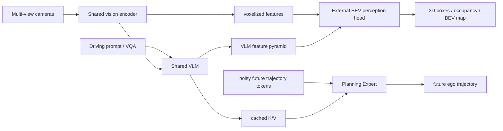

# Qwen-Drive-1.0 분석

## 한 문장 결론

Qwen-Drive-1.0은 shared VLM representation을 유지하면서 외부 **BEV perception head**와 **Planning Expert**를 붙여 3D scene structure, driving VQA, 미래 ego trajectory를 함께 다루는 staged autonomous-driving foundation model이다.

## 문제와 기여

| 문제 | 논문의 선택 |
|---|---|
| 일반 VLM은 driving-specific 3D geometry와 numerical planning이 약함 | VLM feature를 BEV head와 planner의 공통 조건으로 사용 |
| driving fine-tuning은 general VLM capability를 망가뜨릴 수 있음 | driving + general vision-language data를 staged mixture로 학습 |
| text explanation은 안전한 action을 보장하지 않음 | cached VLM K/V에 조건부인 Planning Expert가 future trajectory를 생성 |
| multi-task head가 camera rig/data ontology에 과적합 | cross-dataset label unification과 external BEV pathway |

핵심 기여는 (1) 3D detection·occupancy·map segmentation의 unified perception probe, (2) driving/general VQA의 shared pathway, (3) flow matching→reward optimization trajectory planner, (4) open-loop·pseudo-closed-loop·closed-loop evaluation이다.

## Architecture / I-O / action grounding

- **입력:** multi-view RGB, driving question/prompt; planning에는 scene context와 trajectory token.
- **출력:** text answer, 3D objects, semantic occupancy, BEV map, future ego trajectory.
- **Language 역할:** scene explanation·VQA·spatial reasoning의 explicit interface이며, Planning Expert의 shared condition을 만든다.
- **Action grounding:** visual/language context → VLM K/V → denoising/flow Planning Expert → numerical trajectory. 즉 natural-language response를 control command로 직접 parse하지 않는다.
- **taxonomy:** Vision-Action의 perception-action 계열과 VLA의 numerical action generation 사이에 놓인 driving VLM; monolithic language agent보다는 hybrid end-to-end system이다.

## Training recipe

1. BEV perception head를 초기화한다.
2. perception + driving VQA + general VLM data로 shared vision/VLM pathway를 adaptation한다.
3. shared representation을 고정하고 Planning Expert를 flow matching으로 trajectory supervision한다.
4. NAVSIM PDMS, WOD-E2E RFS, PAI-AV ADE 등 source-specific reward로 planner를 RL optimize한다.

이 ordering은 high-dimensional VLM adaptation과 continuous action learning의 optimization interference를 줄이지만, later planner loss가 backbone을 개선하지 못하는 trade-off도 있다.

## Dataset / benchmark / metric

| 영역 | data / benchmark | 핵심 지표 |
|---|---|---|
| 3D perception | remapped nuScenes, OpenScene | detection, semantic occupancy, BEV segmentation, NDS류 |
| driving VQA | LingoQA, PAI-AV-CoC, Ego3D-Bench, VLADBench, in-house | QA score, Ego3D RMSE |
| general VLM | knowledge/reasoning/recognition, spatial/grounding groups | benchmark average |
| open-loop planning | WOD-E2E, PAI-AV | ADE at 3 s/5 s, min ADE, RFS |
| pseudo-closed-loop | NAVSIM v1.1 | PDMS, NC, DAC, EP, TTC, comfort |
| closed-loop | 916 AlpaSim scenarios | interactive rollout performance |

**open-loop 대 closed-loop:** ADE는 logged future와의 거리이고, closed-loop는 agent action이 다음 state를 바꾸는 feedback을 포함한다. NAVSIM/AlpaSim 성과는 더 강한 evidence지만 real-road safety 증명은 아니다.

## 강점

- 3D output이 language representation의 **inspectable geometric interface**가 된다.
- driving specialization과 general VLM preservation을 함께 측정한다.
- planner를 trajectory regression에만 묶지 않고 source-specific reward와 collision/progress/comfort metric을 본다.
- distinct camera rigs와 label spaces에 대한 cross-dataset design을 명시한다.

## 한계·안전·배포 함의

- VLM, multi-view encoding, BEV head, planner의 end-to-end latency/energy/thermal profile은 on-road constraint에서 별도 검증이 필요하다.
- simulator pseudo/closed-loop score는 rare event, perception outage, calibration drift, social interaction에 대한 safety case가 아니다.
- planner가 reasoned VQA text를 causal하게 사용한다는 보장은 없고, shared representation correlation만으로 safe grounding을 주장할 수 없다.
- vehicle deployment에는 uncertainty-calibrated trajectory, timing watchdog, rule/map consistency check, collision shield, conventional fallback planner가 필요하다.

## 왜 중요한가

VLA for AD에서 중요한 진전은 VLM이 “운전을 설명”하는 데 그치지 않고, **3D scene representation과 numerical trajectory 모두에 연결되는 representation**을 갖게 한 점이다. 다음 검증 과제는 이 shared representation이 unseen city/weather/agent interaction에서 planner의 closed-loop failure를 실제로 줄이는지다.
