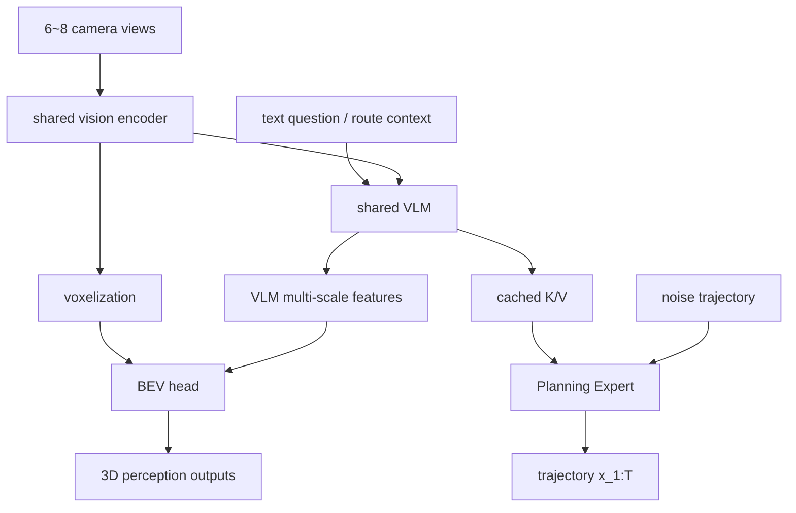

# Qwen-Drive-1.0 학습 노트

## 선행지식

- camera-based 3D detection, BEV feature/occupancy, multi-view calibration
- VLM의 vision encoder, visual token, key/value cache
- trajectory representation, ADE/FDE, imitation learning과 flow matching
- NAVSIM류 closed-loop metric: no collision, drivable area compliance, progress, TTC, comfort

## 용어

| 용어 | 간단한 뜻 |
|---|---|
| BEV | bird's-eye view; ground plane 좌표에서 scene을 표현하는 map-like representation |
| semantic occupancy | 3D voxel/space가 어떤 semantic class에 점유되었는지 예측 |
| Planning Expert | VLM representation을 condition으로 받아 미래 ego trajectory를 만드는 action head |
| flow matching | noise와 data distribution 사이 vector field를 학습해 sample을 복원/생성하는 방법 |
| PDMS | Predictive Driver Model Score; NAVSIM의 closed-loop proxy metric |
| RFS | WOD-E2E에서 trajectory quality를 평가하는 Rater Feedback Score |

## Architecture map

## Step-by-step

1. **공유 visual-language representation을 만든다.** Camera image와 text prompt를 VLM context에 넣는다.
2. **geometry를 외부에서 probe한다.** Vision feature를 voxelize하고 VLM feature pyramid와 fuse하여 object/occupancy/map을 예측한다.
3. **planner의 condition을 분리한다.** VLM 전체 text output이 아니라 cached K/V representation을 Planning Expert에 제공한다.
4. **trajectory를 numerical action으로 복원한다.** Noisy sequence $x^{(s)}_{1:T}$에서 condition $c$ 하에 clean future $x_{1:T}$로 향하는 vector field/denoising model을 학습한다.
5. **closed-loop objective로 보정한다.** logged trajectory error(ADE)만 최소화하면 collision·progress·comfort가 누락될 수 있어, environment-specific reward를 사용한다.

개념적으로 planner는 다음 형태의 conditional generation이다.

$$\hat{x}_{1:T} = f_\theta\bigl(x^{(s)}_{1:T},\; \operatorname{KV}_{\mathrm{VLM}}(I_{1:V},q)\bigr).$$

여기서 $I_{1:V}$는 multi-view images, $q$는 driving/VQA context, $x_{1:T}$는 ego pose/waypoint trajectory의 한 표현이다. 실제 paper의 flow objective와 reward definitions의 세부식은 원문 Appendix A를 보라.

## 구현·배포 점검표

- camera timestamp와 calibration을 BEV voxelization 전 검증한다.
- training label ontology를 dataset별로 remap하고, unknown/missing label policy를 문서화한다.
- offline ADE와 simulator PDMS/NC/TTC를 분리 dashboard로 본다.
- VLM answer가 planner action에 영향을 주는 causal path를 ablation한다: cached K/V zeroing, prompt perturbation, feature intervention.
- planner output에는 confidence·map/rule check·kinematic feasibility와 emergency fallback을 둔다.
- worst-case rather than average latency에서 encoder + BEV + planner pipeline의 deadline을 측정한다.

## 자가 점검 질문과 답

**Q1. 왜 text action을 직접 생성하지 않고 Planning Expert를 두는가?**
A. Trajectory는 continuous/numerical output이며, VLM prose를 controller로 parse하면 ambiguity와 latency가 커진다. Expert는 shared semantic context를 executable numeric representation으로 변환한다.

**Q2. BEV head는 auxiliary task인가?**
A. 학습 supervision이면서 VLM representation에서 3D가 실제로 recover되는지 보는 inspectable interface다. 하지만 head 성능이 planner safety를 자동 보장하지는 않는다.

**Q3. ADE가 낮으면 안전한가?**
A. 아니다. logged future를 가깝게 모사해도 rollout에서 collision, off-road, delayed interaction이 발생할 수 있다. 그래서 NAVSIM/AlpaSim 같은 interaction-aware evaluation이 필요하다.

## 읽기 로드맵

1. 원문 Fig. 2–4로 interface와 training stage를 먼저 본다.
2. Table 1–3으로 perception/VQA가 shared backbone에서 어떻게 공존하는지 확인한다.
3. Table 4–7과 Fig. 9–11로 open-loop→pseudo-closed-loop→closed-loop 및 RL effect를 비교한다.
4. 이후 UniAD/VAD 같은 E2E AD background와 SimWAM 같은 world-action model을 비교해, modular interface가 얼마나 줄어드는지 분석한다.
