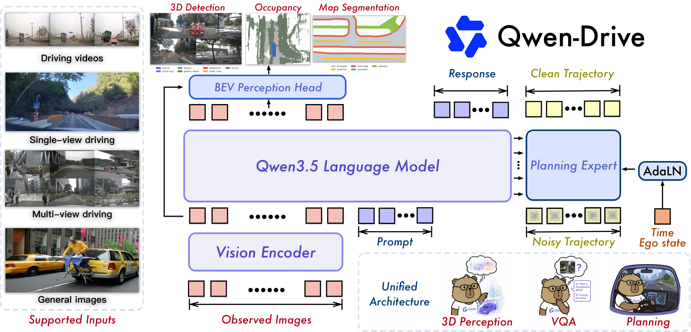
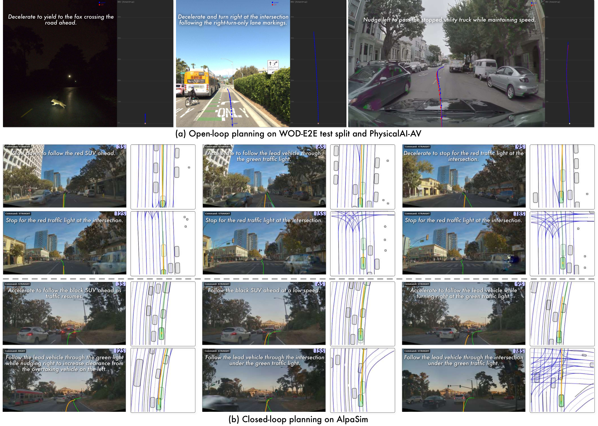

# Qwen-Drive-1.0: 자율주행 Vision-Language Foundation Model을 향한 첫 단계

> 원문: Xin Zhou 외, *Qwen-Drive-1.0: An Initial Step towards a Vision-Language Foundation Model for Autonomous Driving* (arXiv:2609.00111). arXiv HTML v1의 본문과 표·그림 caption을 기준으로 한국어 기술 번역·정리했다. 부록의 전체 사례와 모든 수치 행은 압축했으며, 정확한 원문 표는 [arXiv HTML](https://arxiv.org/html/2609.00111)을 병행한다.

## Abstract

Qwen-Drive-1.0은 pretrained vision-language model(VLM)의 구조를 보존하면서 **3D perception, driving visual question answering, motion planning**을 하나의 framework에 통합하려는 자율주행 vision-language foundation model이다. 외부 **BEV perception head**는 shared representation에서 3D object detection, semantic occupancy prediction, BEV map segmentation을 공동 수행한다. 이는 공유 표현이 접근할 수 있는 3D 정보를 검사하는 probe이자, 해석 가능한 3D scene interface이다.

**Planning Expert**는 shared VLM representation에 조건부로 미래 ego trajectory를 생성한다. 단계적 training은 driving supervision과 general-purpose vision-language data를 결합해 driving competence를 얻으면서도 폭넓은 visual understanding과 instruction following을 보존한다. 논문은 open-loop, pseudo-closed-loop, closed-loop 평가에서 경쟁력 있는 planning 성능과 3D perception·driving scene understanding을 보고한다.

## 1. Introduction — 운전 특화화가 일반 VLM 능력을 잃지 않게 하기

End-to-end autonomous driving은 sensing에서 planning까지를 학습으로 연결하지만, 3D geometry, scene understanding, language reasoning, future action을 각각 따로 학습하면 interface가 경직되고 cross-task transfer가 제한될 수 있다. 반대로 일반 VLM만으로는 multi-camera geometry와 정량 trajectory를 충분히 ground하기 어렵다.

Qwen-Drive-1.0의 질문은 다음과 같다. **하나의 pretrained VLM representation을 driving VQA의 language interface, inspectable 3D perception interface, 실행 가능한 planning interface로 동시에 사용할 수 있는가?** 답은 VLM 자체를 모든 task head로 바꾸는 것이 아니라, shared backbone 위에 geometry-aware external modules를 붙이는 방식이다. 3D head는 voxelized visual feature와 VLM feature pyramid를 결합하고, Planning Expert는 cached VLM key/value를 조건으로 noisy trajectory token을 clean trajectory로 복원한다.

## 2. Method

### 2.1 통합 architecture와 목표

입력은 multi-view camera images와 task별 text prompt/질문이며, shared vision encoder가 image feature를 만들고 VLM이 visual-language token을 처리한다.

| 경로 | 조건/입력 | 출력 | 목적 |
|---|---|---|---|
| VLM text path | image tokens + driving/general prompt | answer text | driving VQA, general VLM capability |
| BEV perception head | voxelized visual feature + VLM feature pyramid | 3D boxes, semantic occupancy, BEV map | geometry를 명시적으로 inspect/probe |
| Planning Expert | cached VLM K/V + noisy trajectory tokens | future ego trajectory | numerical action generation |

BEV head는 camera rig에 고정된 embedding만 학습하는 head와 달리 unified label set과 external geometry pathway를 통해 nuScenes와 OpenScene 같은 서로 다른 data configuration을 다룬다. Planning Expert는 diffusion/flow-style denoising 관점으로 trajectory token을 생성해 language reasoning·visual context를 ego motion으로 ground한다.

### 2.2 4단계 training recipe

1. **Stage 1 — BEV head 초기화:** 외부 perception head를 먼저 초기화한다.
2. **Stage 2 — shared vision-language adaptation:** perception과 driving VQA supervision으로 vision encoder와 VLM을 업데이트한다. public driving data를 filtering·format unification 후 혼합하며, general vision-language data를 함께 사용해 catastrophic forgetting을 줄인다.
3. **Stage 3 — planning flow matching:** 앞 단계 representation을 고정한 채 Planning Expert를 trajectory data로 학습한다.
4. **Stage 4 — reward-based optimization:** planning module을 task-aligned reward로 최적화한다. NAVSIM에는 PDMS, WOD-E2E에는 Rater Feedback Score(RFS), PAI-AV에는 ADE 계열 reward를 사용하는 source-specific design을 비교한다.

### 2.3 Data recipe

- **Perception:** cross-dataset label alignment와 missing-label completion을 적용한다. semantic occupancy label은 nuScenes·OpenScene 사이 format/ontology가 다르므로 remapping한다.
- **Vision-language:** filtering된 public driving sample 3.09M 중 Stage 2 mixture는 1.54M sample로 구성된다. diverse road, weather, illumination과 다양한 input format을 포함한다.
- **Planning:** WOD-E2E, PAI-AV 및 NAVSIM/AlpaSim 계열 evaluation에 맞춘 trajectory data를 사용한다. PAI-AV data-scale ablation은 0.17M→1.38M 증가가 5 s ADE/FDE를 지속적으로 낮춘다고 보고한다.

## 3. Experiments

### 3.1 Unified 3D perception

평가는 remapped nuScenes와 OpenScene validation split에서 detection, semantic occupancy, BEV map segmentation을 함께 본다. 비교 방법 다수는 six-camera nuScenes rig에 묶인 camera embedding을 사용해 eight-camera OpenScene에서 직접 평가할 수 없지만, Qwen-Drive의 external head는 cross-dataset geometry evaluation을 목표로 한다. 이 결과는 task unification이 단순 text QA가 아니라 inspectable spatial interface를 제공한다는 evidence다.

### 3.2 Driving VQA와 일반 VLM 보존

Driving VQA는 temporal understanding/agent-state estimation(LingoQA), planning causal reasoning(PAI-AV-CoC), cross-view spatial distance(Ego3D-Bench), traffic-road recognition(VLADBench) 등에서 평가한다. 논문은 Qwen3.5-4B와 비교해 general knowledge/reasoning/recognition에서 평균 약 1 point 이내로 유지하면서 spatial understanding·grounding group에서는 향상을 보고한다. 즉 driving fine-tuning이 일반 instruction-following capability를 전부 교체하지 않도록 한 mixture가 중요하다.

### 3.3 Motion planning: open-loop에서 closed-loop까지

| 설정 | benchmark / 지표 | 해석 |
|---|---|---|
| Open-loop | WOD-E2E: 3 s·5 s ADE, RFS | recorded future에 대한 trajectory error와 rater-aligned quality |
| Open-loop | PAI-AV: avg/min ADE, leakage-free 700-frame subset | data leakage 가능성을 줄인 subset을 별도 제시 |
| Pseudo-closed-loop | NAVSIM v1.1: PDMS, NC, DAC, EP, TTC, comfort | collision, drivable area, progress와 comfort를 분해 |
| Closed-loop | 916 AlpaSim scenarios | simulated rollout에서 실제 interaction effect를 확인 |

논문은 SFT version과 RL version을 비교한다. 동일 NAVSIM left-turn qualitative example에서 reward optimization은 recorded future를 모사하는 것만으로 충분하지 않은 no-collision·progress·comfort trade-off를 개선하려 한다. 다만 closed-loop가 real-world vehicle deployment를 뜻하지는 않으며, simulator distribution과 safety-assurance gap은 남는다.

## 4. Ablation과 해석

Stage 2 mixture ablation은 unadapted Qwen3.5-4B에 vision-language와 3D perception supervision을 순차적으로 추가한 뒤 동일 WOD-E2E Planning Expert로 RFS를 비교한다. driving VQA와 3D supervision은 planning representation에도 보완적임을 보이려는 design이다. RL ablation은 NAVSIM-only 대비 NAVSIM/WOD-E2E/PAI-AV joint training, 그리고 source-specific reward 대비 shared-ADE reward를 비교한다. 핵심은 trajectory learning을 단일 displacement objective로 환원하지 않는다는 점이다.

## 5. Conclusion 및 limitations

Qwen-Drive-1.0은 pretrained VLM을 3D perception, language understanding, motion planning의 shared semantic/visual backbone으로 사용하고, BEV head와 Planning Expert로 **inspectable geometry와 executable trajectory**를 분리해 연결한다. VLA taxonomy에서는 pure text-action generator가 아니라 **perception-action / numerical action generation을 결합한 driving VLM**에 가깝다.

한계도 분명하다. (1) external head와 Planning Expert가 있으므로 완전히 monolithic end-to-end policy는 아니다. (2) pseudo/closed-loop simulator score는 sensor failure, rare traffic interaction, map mismatch, human social behavior의 real-world safety guarantee가 아니다. (3) staged freezing은 stability에는 유리하지만 perception/VLM/planner가 joint adaptation으로 얻을 수 있는 ceiling을 제한할 수 있다. (4) multi-camera VLM와 external BEV pipeline의 compute·latency, uncertainty calibration, fallback planner/shield는 on-road deployment 전에 별도로 측정해야 한다.

## 번역 범위 메모

Abstract, Introduction, Method, Data/Training recipe, 주요 experiment design, ablation, limitations를 심층 번역했다. 부록 A reward의 모든 symbolic definition, 부록 B/C의 전체 visualization·VQA example은 원문 HTML에 남겨 두었다.
