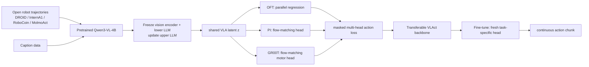

# VLAct 분석

## 한 문장 결론

VLAct는 로봇 trajectory를 단순 action label로 fit하지 않고, **VLM prior 보존 + multiple continuous action head + 부분 공유 action space**로 처리해 task·head·embodiment가 달라도 재사용되는 VLA backbone을 만들려 한다.

## 문제와 기여

1. Robot trajectory는 web-scale image-text보다 수집이 비싸고 physical interaction space coverage가 희소하다.
2. Action-only full update는 VLM의 broad visual-language prior를 좁은 robot distribution으로 drift시킨다.
3. Single action head는 decoder lock-in을 유발해 다른 action representation에 transfer되지 않을 수 있다.
4. VLAct는 shallow-layer freeze/caption mixing, OFT·PI·GR00T multi-head co-supervision, masked partially unified action layout을 결합한다.
5. Downstream에서 새 task-specific head를 붙이는 protocol로 representation 자체의 기여를 분리해 보인다.

## Architecture / pipeline

| 요소 | 입력 | 출력 | 역할 |
|---|---|---|---|
| VLM backbone | image + language instruction | multimodal latent $z$ | visual/semantic grounding |
| shallow protection | pretrained parameter groups | protected lower features | narrow robot data에 의한 prior drift 완화 |
| caption mixing | caption/image auxiliary data | VLM loss | representation anchor |
| multi-head action learner | $z$, action chunk | OFT/PI/GR00T losses | one decoder geometry로의 collapse 억제 |
| partial unified layout | embodiment-native actions | masked 20-D target | 공유 가능한 gripper semantics만 정렬 |
| downstream head | $z$ | continuous control chunk | target robot/task action grounding |

## Input → action grounding → taxonomy

- **입력:** robot camera observation과 language instruction, 학습·평가 setting에 따른 proprioception/action history.
- **출력:** embodiment-native continuous action chunk. Franka는 delta end-effector+gripper, AgileX는 absolute joint+gripper 등이다.
- **Language 역할:** instruction-conditioned visual semantics를 backbone에 유지·grounding하는 조건이다. 언어 chain-of-thought를 action으로 생성하는 설계가 아니다.
- **Action grounding:** VLM latent → selected continuous action head → motor command chunk. Downstream head를 바꿀 수 있게 backbone/head를 분리한다.
- **taxonomy:** VLA의 **representation transfer / distillation 인접 축**, 동시에 numerical continuous action generation의 backbone recipe다. Autonomous driving에 바로 평가되진 않지만, VLM prior를 vehicle trajectory/action head로 옮길 때 같은 문제가 나타난다.

## Training recipe와 핵심 표현

$$\mathcal L=\sum_h\lambda_h\mathcal L_{\mathrm{action}}^{(h)}+\lambda_{\mathrm{vlm}}\mathcal L_{\mathrm{caption}}+\lambda_{\mathrm{wrap}}\mathcal L_{\mathrm{wrap}}.$$

- Pretraining: vision encoder+lower LLM freeze, upper LLM/action heads update.
- Caption mixing: action supervision 밖의 dense semantic/spatial gradient로 VLM feature preservation.
- Multi-head: OFT, PI, GR00T가 동일 $z$를 각자 decode하여 head-agnostic access를 압박.
- Action layout: active dimension만 mask-loss; physically comparable gripper coordinate만 cross-embodiment share.
- Wrap-aware loss: periodic joint angle의 $\operatorname{wrap}(\hat a-a)$ residual에 L1 penalty.
- Fine-tuning: pretraining head를 재사용하지 않고 fresh downstream head로 target protocol을 맞춘다.

## Dataset / benchmark / metric

| 항목 | 성격 | 주요 metric | 주의점 |
|---|---|---|---|
| LIBERO-Plus | robustness simulation | success rate | visual/task perturbation의 open-loop 아닌 policy rollout 지표 |
| RoboTwin 2.0 | dual-arm simulation | clean/random success | domain randomization protocol 차이를 baseline 간 확인해야 함 |
| VLA-Arena | suite benchmark | weighted success | 11 suite weighting과 task 분포에 민감 |
| DOMINO | dynamic manipulation | SR, Manipulation Score | dynamic object에 대한 짧은 benchmark proxy |
| RoboCasa-GR1 | cross-embodiment | success vs data fraction | held-out humanoid transfer를 보는 핵심 실험 |
| RoboDojo | broad sim/real leaderboard | partial score, success | leaderboard snapshot은 compute/data protocol이 균일하지 않음 |
| Franka physical tasks | real robot | 10-rollout success/task | sample 수가 작고 industrial safety evidence가 아님 |

## 강점

- **공정한 representation 주장:** 동일 downstream head/data/budget을 맞춘 비교로 pretraining head의 재사용 효과를 줄인다.
- **실용적 모듈성:** one universal action head를 강제하지 않고 user가 controller/latency 요구에 맞는 head를 선택한다.
- **multi-embodiment alignment:** full coordinate alignment의 오류를 피하면서 share할 semantic만 공유한다.
- **data-efficient transfer:** GR-1을 continual pretraining에서 보지 않고도 20% downstream data 결과를 제시한다.
- **개방성:** public data, 16-GPU setting, code/weights release 계획은 접근성에 유리하다.

## 한계·안전·배포 함의

- VLM prior를 얼마나 freeze할지, caption mixture가 어느 embodiment/data scale에서 안전한지는 model-dependent이다.
- Multiple head는 training memory/engineering cost를 늘리며, PI/GR00T action generation은 one-shot regression보다 latency가 클 수 있다.
- Continuous action normalisation, per-dataset gripper convention, angle wrapping이 틀리면 shared representation이 아니라 cross-dataset artifact를 학습할 위험이 있다.
- Benchmark success는 contact force, collision, emergency stop, hardware delay, sensor dropout을 충분히 모델링하지 않는다.
- 자율주행 전이에서는 arm joint 대신 waypoint/trajectory/control, camera/BEV/occupancy, vehicle dynamics에 맞는 partial action semantics가 필요하며 closed-loop simulation과 road safety validation이 별도 필요하다.

## 왜 중요한가

VLA scaling의 병목을 “얼마나 많은 robot data를 모으나”에서 “제한된 data가 foundation representation을 얼마나 망치지 않고 action-aware하게 바꾸나”로 이동시킨다. 자율주행 E2E VLA에도 generic VLM prior를 traffic scene/route language/trajectory action에 맞추는 과정에서 catastrophic drift, output-head lock-in, vehicle/platform differences가 같은 설계 문제로 나타난다.
