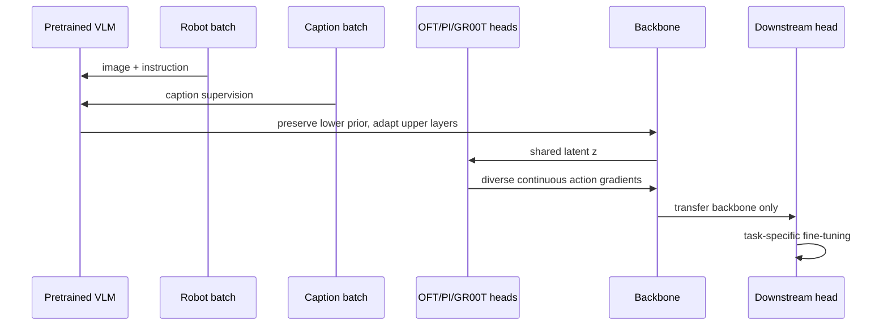

# VLAct 핵심 기술 학습 자료

## 선수 지식

1. VLM의 vision encoder–projector–LLM 구조와 instruction tuning
2. VLA의 observation/language → action chunk mapping
3. continuous regression, diffusion/flow matching, action tokenization의 차이
4. catastrophic forgetting/representation drift와 transfer learning
5. robot action convention: delta end-effector, absolute joint angle, gripper command

## 용어집

| 용어 | 뜻 |
|---|---|
| continued pre-training | pretrained VLM을 broad robot trajectory로 target task fine-tuning 이전에 추가 학습하는 단계 |
| VLM prior | web-scale data에서 얻은 object, relation, language alignment의 일반 표현 |
| decoder lock-in | single action head가 backbone feature geometry를 자신에게만 유리하게 만드는 현상 |
| OFT | action query token에서 continuous chunk를 병렬 회귀하는 head |
| PI | conditional flow matching으로 noise를 action chunk로 운반하는 action expert |
| GR00T | VLM semantic stream과 DiT-style motor stream을 결합하는 flow-matching 계열 head |
| partial unification | physically comparable dimension만 공유하고 나머지는 mask하는 action-space 설계 |
| wrap-aware loss | periodic joint angle의 $2\pi$ 경계를 인지하는 residual loss |

## 단계별 이해

1. **시작점:** generic VLM은 visual-language generality가 있지만 robot action을 직접 만들도록 최적화되어 있지 않다.
2. **보존:** vision encoder와 lower LLM을 freeze하고 caption data를 섞어 robot-only gradient가 broad prior를 덮지 않게 한다.
3. **다양화:** 동일 latent를 OFT/PI/GR00T로 decode한다. 한 decoder의 shortcut만 통하는 latent로 수렴하기 어렵게 한다.
4. **정렬:** 로봇별 native action을 유지하되, 실제로 같은 의미인 gripper coordinate만 share한다.
5. **전이 검사:** continual pretraining head는 버리고 fresh downstream head를 붙인다. 이때도 성능이 좋으면 reusable backbone claim이 강해진다.

## 핵심 표현

다중 head objective의 최소 형태는 다음과 같다.

$$z=f_\theta(o,\ell),\qquad \mathcal L_{\text{action}}=\sum_h\lambda_h\mathcal L_h(g_h(z),a).$$

여기서 $o$는 observation, $\ell$은 instruction, $g_h$는 head-specific decoder다. 핵심은 $z$가 한 $g_h$가 아니라 여러 $g_h$로부터 유용한 action information을 제공해야 한다는 것이다.

Periodic angle에는

$$\operatorname{wrap}(x)=((x+\pi)\bmod 2\pi)-\pi,$$
$$\mathcal L_{\text{wrap}}=\lVert\operatorname{wrap}(\hat a-a)\rVert_1$$

를 사용한다. $+\pi$와 $-\pi$ 부근을 멀리 떨어진 Euclidean target으로 처리하는 오류를 막는다.

## 구현·배포 메모

- Dataset마다 frame rate, action scale, gripper sign/range, absolute-vs-delta convention을 manifest로 명시하고 normalization을 unit test한다.
- Mask는 padded inactive coordinate뿐 아니라 loss reduction/metric에서도 일관되게 적용해야 한다.
- Freeze ratio는 ablation해야 한다. 너무 많이 freeze하면 action adaptation이 부족하고, 너무 적게 freeze하면 visual-language drift가 생긴다.
- Head diversity를 늘릴 때, 모든 head가 같은 action target semantic을 보는지 확인한다. 서로 다른 target horizon이면 diversity가 아닌 noisy multitask training이 된다.
- Deployment에서는 continual training의 multi-head 구성을 모두 serve할 필요가 없다. latency/quality/safety에 맞춰 one-shot regression, flow/diffusion, planner interface 중 하나를 downstream에서 선택한다.
- Autonomous driving 적용 시 shared coordinate를 waypoint, velocity, steering, acceleration, trajectory polynomial 등 무엇으로 정의할지와 vehicle-specific dynamics mask를 분리 설계한다.

## 공부 질문과 답

**Q1. Caption mixing은 왜 robot data를 늘리는 것과 다른가?**  
A. Caption은 action target이 아니라 object/attribute/relation을 dense하게 supervision해 pretrained VLM의 operating regime를 지킨다. 목표는 coverage 양뿐 아니라 representation drift 억제다.

**Q2. 여러 action head를 함께 쓰면 항상 좋은가?**  
A. 아니다. Head가 같은 action semantics를 서로 보완하고 loss scale이 맞을 때 decoder lock-in을 줄일 수 있다. incompatible target이나 불균형한 gradient는 negative transfer를 만들 수 있다.

**Q3. Fully unified action space가 위험한 이유는?**  
A. 두 coordinate의 index가 같아도 physical meaning/kinematics가 다를 수 있다. 그 경우 false alignment가 발생한다. VLAct는 shared gripper처럼 비교 가능한 부분만 share한다.

**Q4. VLAct가 autonomous driving VLA인가?**  
A. 직접 평가는 robot manipulation이다. 그러나 VLM backbone을 numerical action generation에 맞추는 recipe, output decoder lock-in, domain/embodiment shift는 E2E driving VLA에도 이전 가능한 연구 질문이다.

## 읽기 roadmap

1. 본문 §1–2: data scaling과 decoder lock-in이라는 문제를 먼저 구분한다.
2. §3.2–3.4: prior protection, multi-head objective, partial layout의 인과를 그림과 함께 읽는다.
3. §4.1–4.4: robustness, dual-arm, real-world, unseen embodiment 결과를 서로 다른 일반화 축으로 나눠 본다.
4. Appendix F/H/I: angle wrapping, data cleaning, action-head 정의를 구현 관점에서 확인한다.
5. RoboDojo/VLA-Arena 비교에서는 leaderboard score와 real deployment 안전을 혼동하지 않는다.
