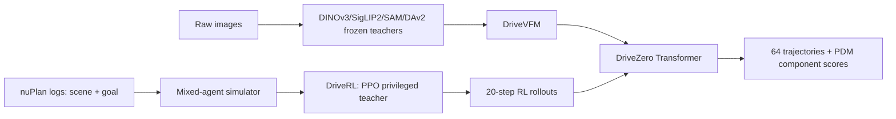

# DriveZero 분석

## 한 문장 결론
DriveZero는 사람 궤적을 그대로 모방하지 않고, privileged-state **DriveRL**의 closed-loop 행동을 multi-VFM **DriveVFM**과 함께 camera-only trajectory planner로 증류하는 E2E 자율주행 설계다.

## 문제·기여
1. 한 로그에는 하나의 사람 행동만 있으므로 rare recovery와 policy-induced state가 빠지는 imitation-learning 병목을 지적한다.
2. real nuPlan log에서 초기화한 interactive mixed-agent world에서 PPO teacher를 처음부터 학습한다.
3. DINOv3/SigLIP2/SAM/Depth Anything V2를 annotation 없이 distill한 driving backbone을 사용한다.
4. RL teacher rollout과 PDM-based proposal score로 64개 trajectory proposal을 학습한다.

## 입출력과 pipeline
| 단계 | 입력 | 출력 | 역할 |
|---|---|---|---|
| DriveRL | object/map/light/goal privileged state | jerk, steering-rate | closed-loop teacher 행동 학습 |
| DriveVFM | raw multi-view RGB | driving visual token | semantic·boundary·geometry 압축 |
| DriveZero | 4-view RGB, ego state, command | 20-step 후보 trajectory + score | deployable camera-only planner |

## Training / evaluation
- DriveRL: 922,703 scene, 5 Hz, 110-step rollout, 1:1 log replay/IDM traffic, 96 GPU, PPO 2,400 update.
- DriveZero: NAVSIM navtrain 약 100K scenario, DriveVFM ViT-L 고정 + rank-32 Q/V LoRA, 25 epoch, batch 256, AdamW/cosine LR. Scale은 SimScale OOD 237K scene 추가.
- Closed-loop: nuPlan Val14/Test14-hard/Test14-random, reactive 및 non-reactive.
- Camera planner: NAVSIMv1 PDMS, NAVSIMv2 EPDMS, HUGSIM true closed-loop.

## open-loop 대 closed-loop
DriveZero student 자체 학습은 logged frame에서의 open-loop distillation이다. 그러나 target은 interactive teacher rollout이므로 행동 policy의 정보원은 closed-loop다. 이것이 사람 logged trajectory target과의 핵심 차이다. 단, simulator의 traffic dynamics·reward misspecification은 teacher→student에 그대로 전달될 수 있다.

## 강점 / 주의점
- **강점:** perception/action의 training regime을 분리하고, human action supervision 없이 camera policy를 얻는다. TTS와 multi-proposal scoring은 action uncertainty를 다룬다.
- **안전:** hard safety event를 reward에 넣어도 reward hacking, rare social norm, perception failure는 별도 검증이 필요하다.
- **latency:** deploy student는 teacher와 simulator를 제거하지만 multi-view VFM + 64 proposal decoder의 실측 차량 latency는 본문에서 충분히 정량화되지 않았다.
- **관련성:** VLA가 아니라도 VLM/VFM feature와 executable trajectory를 결합한 representation-to-action grounding의 실용 사례이며, AD의 closed-loop 평가 우선순위를 선명히 한다.
