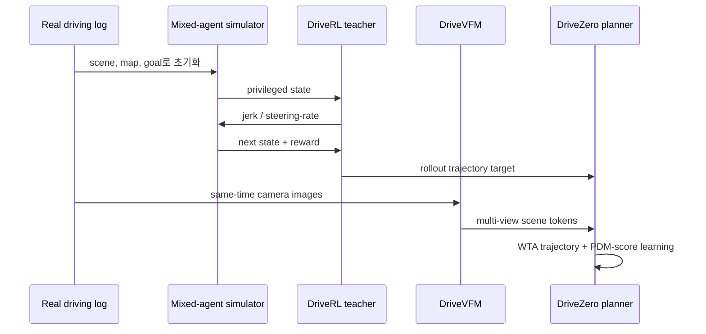

# DriveZero 학습 노트

## 선수지식·용어
- **imitation learning:** log의 expert action을 target으로 정책을 학습한다.
- **closed-loop RL:** ego가 낸 action이 이후 state를 바꾸고, 그 결과 reward를 받아 policy를 갱신한다.
- **privileged input:** 배포 시 직접 얻기 어려운 정확한 object/map state.
- **jerk / steering-rate:** 가속도의 변화율과 조향각 변화율. low-level control보다 smooth trajectory control에 가깝다.
- **PDM score:** proposal trajectory의 safety, compliance, progress, comfort 등의 planner quality를 구성해 평가하는 지표 계열이다.

## 세 단계로 이해하기

## 핵심 representation
DriveRL의 action은 \(a_t=(j_t,\dot\delta_t)\)이며 vehicle dynamics를 거쳐 future trajectory를 만든다. student는 \(\hat\tau_1,\ldots,\hat\tau_M\)과 score \(s_1,\ldots,s_M\)를 출력한다. WTA는 teacher trajectory \(\tau^*\)에 가장 가까운 proposal만 강하게 맞추므로 multi-modal future를 모두 평균내는 blur를 피한다. deployment action은 높은 predicted PDM quality proposal을 선택하는 형태다.

PPO의 개념적 목적은 \(\mathbb{E}[\min(r_t(\theta)A_t,\mathrm{clip}(r_t,1-\epsilon,1+\epsilon)A_t)]\)로 policy update를 제한하는 것이다. 여기서 advantage는 hard safety, goal arrival, soft driving-quality reward를 반영한다. 논문은 reward 세부와 dynamics를 부록에 제시한다.

## 구현/배포 점검표
1. simulator의 actor-response model이 ego policy의 exploitation을 허용하지 않는지 검증한다.
2. privileged-state teacher와 noisy onboard perception 사이의 domain gap을 별도로 측정한다.
3. multi-view calibration 및 3D position embedding이 camera dropout에 견디는지 검사한다.
4. TTS의 candidate 수·rollout 길이·critic calibration이 latency budget 안에 있는지 측정한다.
5. pseudo closed-loop뿐 아니라 reactive closed-loop 및 실제 safety case를 분리 보고한다.

## 학습 질문과 답
**Q. 왜 camera policy를 RL로 직접 학습하지 않았나?** 3D scene state에서 RL을 먼저 학습하면 interaction과 reward assignment가 더 직접적이며, raw image에서 필요한 perception은 VFM distillation으로 해결할 수 있기 때문이다.

**Q. teacher의 human-free가 raw log도 안 쓴다는 뜻인가?** 아니다. log는 scene와 navigation goal seed이며, 사람 trajectory는 action target/supervision으로 쓰지 않는다는 뜻이다.

**Q. 이것이 VLA인가?** 언어를 reasoning/action input으로 쓰는 VLA는 아니다. 다만 VFM representation을 executable driving trajectory로 grounding하는 E2E AD 접근이며 VLA 설계의 action-training 축에 직접 참고된다.

## 읽기 로드맵
1. 본문 그림 1–2와 §1–2.3을 먼저 읽는다.
2. §3.1에서 reactive/non-reactive nuPlan 차이를 확인한다.
3. §3.2의 PDMS/EPDMS/HUGSIM을 비교한다.
4. 이어서 `references.md`의 PlannerRFT, SimScale, Qwen-Drive를 대조한다.
