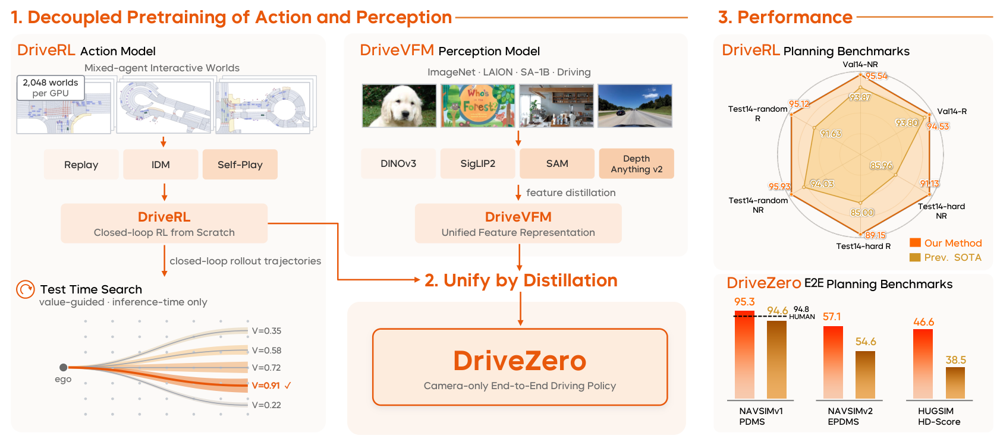
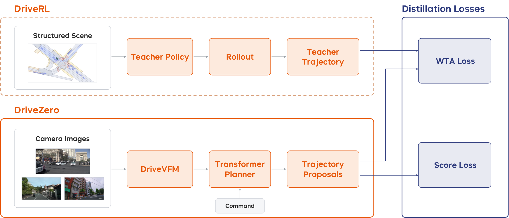

# DriveZero: 인간 시연을 넘어서는 End-to-End 자율주행

> 원문: [arXiv HTML](https://arxiv.org/html/2609.06055) · [PDF](https://arxiv.org/pdf/2609.06055) · [프로젝트](https://xiaomiautol3.github.io/DriveZero/) · [코드](https://github.com/XiaomiAutoL3/DriveZero)

## 초록 번역
대부분의 end-to-end 자율주행 시스템은 사람의 운전 로그를 모방하므로, 학습된 행동은 기록 궤적의 품질과 범위에 묶인다. DriveZero는 인지(perception)와 행동(action)을 각자에 적합한 방식으로 사전학습한 뒤 하나의 planner로 결합한다. 행동 측면의 **DriveRL**은 실제 driving log를 상호작용 가능한 world로 바꾼 mixed-agent closed-loop reinforcement learning 프레임워크다. PPO로 학습된 privileged teacher는 goal-conditioned 의도 증강과 value-guided test-time action search를 통해 로그에 없는 다양하고 목표 일관적인 감독을 만든다. 인지 측면의 **DriveVFM**은 DINOv3, SigLIP2, SAM, Depth Anything V2를 포함한 frozen vision foundation model들을 raw image만으로 하나의 backbone에 distill하며 task-specific annotation을 요구하지 않는다. 이를 합친 **DriveZero**는 teacher rollout을 distill한 camera-only planner다. 저자들은 nuPlan에서 DriveRL-TTS가 여러 community split의 평균 93.57을, DriveZero가 사람 궤적 감독 없이 NAVSIMv1/v2 및 closed-loop HUGSIM에서 강한 성능을 기록했다고 보고한다.

## 1. 문제와 동기
End-to-end driving은 onboard observation과 navigation intent를 차량 motion으로 직접 사상한다. 하지만 imitation learning은 한 장면에서 실제로 일어난 미래 하나만 관측한다. 회피·복구 같은 안전 중요 행동은 드물고, 정책이 스스로 만든 off-distribution state는 offline log에 없다. 따라서 작은 오차가 closed-loop에서 누적될 수 있다.

논문의 핵심 가정은 **인지와 행동을 같은 데이터·손실로 억지로 학습할 필요가 없다**는 것이다. 시각 인지는 대규모 다양 시각 데이터와 foundation-model 지식에서 이득을 얻고, 행동은 자기가 유도한 상태를 경험하는 interactive closed-loop learning에서 이득을 얻는다. DriveZero는 이 둘을 분리한 후 RL teacher의 rollout으로 재결합한다.

*그림 1 번역 — DriveRL은 real nuPlan log로 초기화한 mixed-agent world에서 privileged structured state를 받아 RL로 학습한다. DriveVFM은 여러 frozen VFM의 feature를 raw image에서 증류한다. 마지막으로 DriveZero는 RL teacher의 behavior를 camera-only policy로 옮긴다.*

## 2. 방법

### 2.1 DriveRL: privileged closed-loop teacher
시점 \(t\)의 structured observation \(O_t\)는 ego vehicle, 주변 traffic participant, local vector map, traffic-light state와 goal point를 담는다. ego와 각 actor는 5 Hz의 현재+과거 4개 frame으로, 최대 96개 actor와 256개 map token으로 표현한다. policy는 longitudinal jerk와 tire steering-angle rate의 연속 action 분포를 출력한다.

실제 nuPlan log는 scene 및 goal을 seed하지만 사람 궤적을 action target으로 사용하지 않는다. background actor는 log replay, rule-based IDM 또는 learned policy를 따르는 mixed-agent simulator에서 ego action에 반응한다. 최대 96 GPU에서 196,608개 world를 병렬 실행하고 PPO로 안전 위반, goal arrival, driving quality를 조합한 reward를 최적화한다. 학습에는 922,703개 nuPlan trainval scene, 110-step rollout, \(\gamma=0.99\), 4 PPO epoch, 2,400 update(약 21시간)가 사용되었다.

추론에서는 policy의 Beta-mode action만 따르는 대신 여러 action candidate를 짧게 rollout할 수 있다. 5-step reward와 critic value로 후보를 평가하고 switching margin을 넘는 더 높은 가치 후보만 채택하는 **value-guided test-time search (TTS)**가 핵심이다. 이는 model parameter를 바꾸지 않고 closed-loop decision quality를 높인다.

### 2.2 DriveVFM: 여러 foundation model의 driving representation 증류
한 VFM이 driving에 필요한 semantic, geometry, boundary를 모두 잘 표현한다는 보장은 없다. DriveVFM은 다음 frozen teacher들의 feature를 한 student backbone으로 직접 맞춘다.

| Teacher | 맡기는 신호 |
|---|---|
| DINOv3 | spatial structure, correspondence |
| SigLIP2 | image-level semantic, open-vocabulary 정보 |
| SAM | segmentation과 유사한 boundary-sensitive 정보 |
| Depth Anything V2 | depth/geometric cue |

따라서 detection·lane·segmentation·depth용 사람 annotation을 별도 auxiliary head로 모으지 않는다. DriveVFM이 각 teacher의 상보적 feature를 압축해 deployable visual backbone으로 제공한다.

### 2.3 DriveZero: camera-only student planner
Driving log의 같은 시점에는 multi-view image와 privileged state가 함께 있으므로, state에서 rollout한 DriveRL teacher trajectory를 image 입력 student의 supervision으로 쓸 수 있다. 입력은 전·후·좌·우 4개 camera image, ego kinematics, navigation command다. DriveVFM feature에 3D position embedding을 더하고 register token으로 camera마다 16개 scene token으로 압축한다. ego state와 command는 ego token이 되며, \(M\)개의 learnable trajectory query와 함께 Transformer decoder에 들어간다.

student는 64개 candidate trajectory와 각 proposal의 score를 출력한다. teacher의 20-step trajectory에 대해 winner-takes-all trajectory loss를 적용하고, 별도 proposal-scoring decoder는 PDM score 구성요소를 예측한다. teacher는 학습 때만 쓰이며 deploy 시 삭제된다. DriveVFM에는 rank-32 Q/V LoRA만 학습하고 backbone은 고정한다.

*그림 2 번역 — DriveRL teacher가 structured observation에서 20-step rollout을 만들고, DriveZero는 multi-view feature와 command로 여러 20-step proposal을 생성한다. WTA supervision이 행동을 이전하고 PDM-target proposal score가 선택 품질을 학습한다.*

## 3. 실험과 결과

- **DriveRL / nuPlan:** Val14(1,118), Test14-hard(272), Test14-random(261)를 각각 non-reactive와 reactive closed-loop로 평가한다. TTS 포함 DriveRL은 보고된 여섯 설정 평균 93.57이며 Log-Replay expert를 각 split에서 앞섰다고 주장한다.
- **DriveZero 학습:** NAVSIM navtrain의 약 100K interactive real-world scenario에서 teacher rollout을 target으로 사용한다. Scale 버전은 SimScale의 237K OOD simulation scene을 더한다.
- **Camera-only 평가:** NAVSIMv1은 PDMS 및 no-collision, drivable-area compliance, TTC, comfort, progress를, NAVSIMv2는 perturbation을 포함하는 2-stage EPDMS를 사용한다. HUGSIM은 실제 closed-loop generalization을 본다.
- **주요 해석:** DriveRL의 closed-loop action learning을 open-loop image student로 옮겼다는 점이 중요하다. student 결과만으로 RL을 직접 camera input에 적용한 효과가 검증되지는 않으며, simulator·teacher의 reward 및 privileged-state 품질이 최종 정책의 상한을 정한다.

## 4. 배포와 한계
저자들은 DriveRL을 소규모 차량 fleet에 배포했고, auto-labeled perception state와 기록된 onboard perception 출력을 섞고 domain randomization을 적용했다고 보고한다. 이는 camera-only DriveZero의 실제 차량 배포와는 구분해야 한다.

한계는 (1) RL teacher가 structured/privileged input을 필요로 하므로 현실 인식오차에 직접 노출되지 않는 점, (2) 대규모 병렬 simulator·96 GPU 비용, (3) NAVSIM의 pseudo closed-loop와 실제 interaction 사이의 간극, (4) PDM reward/critic이 학습한 가치가 안전·사회적 규범을 완전히 대표하지 않는 점이다. 논문 부록의 세부 reward·vehicle dynamics·추가 visualization은 이번 번역에서 요약했고, 원문 HTML/PDF를 참조한다.

## 5. 결론
DriveZero는 “사람 로그를 더 많이 모방”하는 대신, perception은 foundation model distillation으로, action은 mixed-agent closed-loop RL로 학습하고 behavior를 camera planner에 distill한다. 자율주행 VLA/VLM 연구에 주는 직접적 메시지는 language model을 붙이는 것보다도, **action supervision이 실제로 interactive하고 closed-loop인가**와 **인지 표현이 action에 어떤 방식으로 전달되는가**를 분리해 설계해야 한다는 점이다.
