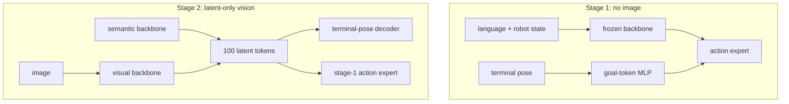

# LIT 학습 노트

## 용어
- **vision–action shortcut:** image 속 nuisance cue가 demonstration action과 우연히 상관돼 policy가 이를 원인처럼 쓰는 현상.
- **action chunk:** control loop에서 한 번에 생성하는 \(H\)개 action sequence.
- **SE(3) goal:** 3D position + orientation. 여기서는 gripper까지 합쳐 8차원 terminal goal이다.
- **latent interface:** backbone feature와 action expert 사이를 잇는 제한된 token bottleneck.
- **WAM:** world-action model. 미래 visual dynamics를 representation/action 학습에 이용하는 계열.

## 먼저 그려 보기

## 단계별 이해
1. **원인 분리:** stage 1은 image를 아예 보지 못하므로 action expert가 background/texture로 action을 결정할 수 없다. 대신 instruction, robot proprioception, terminal pose가 action chunk를 설명한다.
2. **공간 grounding:** stage 2는 image를 되돌려주되 direct path를 막는다. latent token은 terminal pose를 복원해야 하므로 object와 end-effector의 relative geometry를 담도록 압박받는다.
3. **실행:** inference에서는 terminal pose가 알려지지 않는다. image와 language에서 만든 latent token이 stage-1 prior에 필요한 공간 정보의 proxy가 된다.

## 핵심 식
Flow matching에서는 noise \(\epsilon\)과 time \(\tau\)로
\[
\tilde A^\tau=(1-\tau)\epsilon+\tau A,\qquad v^*=A-\epsilon
\]
를 만들고 velocity network가 \(v^*\)를 예측한다. LIT는 이 native action loss에 terminal pose reconstruction loss를 더한다. 중요한 점은 “좋은 pose reconstruction”이 곧 “좋은 control”을 보장하지는 않으므로 action loss와 OOD rollout으로 둘 다 확인해야 한다는 것이다.

## 구현 실험 제안
1. baseline VLA의 direct visual cross-attention map과 interface-composed attention을 비교한다.
2. camera/lighting/background만 바꾸고 action trajectory deviation을 측정한다.
3. task-relevant goal object를 바꾼 counterfactual에서 policy가 새 목표로 방향을 바꾸는지 확인한다.
4. token 수 \(K\), parameter sharing interval \(m\), pose-loss coefficient를 sweep하며 ID/OOD/latency Pareto curve를 만든다.
5. driving 전환 시 terminal pose 대신 future waypoint, heading, speed profile을 pose target 후보로 비교한다.

## 질문과 답
**Q. latent bottleneck이면 정보 손실이 커지지 않나?** 가능하다. 그래서 ID LIBERO 성능을 함께 보고, pose reconstruction으로 최소한의 spatial signal을 보존시키는 것이 LIT의 설계다.

**Q. language instruction shift는 왜 항상 좋아지지 않나?** LIT가 주로 visual path의 shortcut을 대상으로 하기 때문이다. text encoder, instruction diversity, language-action alignment는 별도 병목일 수 있다.

**Q. VLA와 WAM 모두에 가능한 이유는?** 둘 다 backbone representation이 action expert를 condition하는 구조를 갖기 때문이다. native action objective와 sampling은 바꾸지 않고 interface만 삽입한다.

## 읽기 로드맵
1. 그림 1–2와 §III-A~D를 읽어 two-stage 목적을 잡는다.
2. Table I/II로 ID와 7개 OOD shift를 분리해 본다.
3. Figure 4–5의 attention/counterfactual analysis를 읽는다.
4. real-robot §IV-D와 limitations를 읽은 뒤 Pi0.5, MolmoAct2, LIBERO-Plus를 비교한다.
