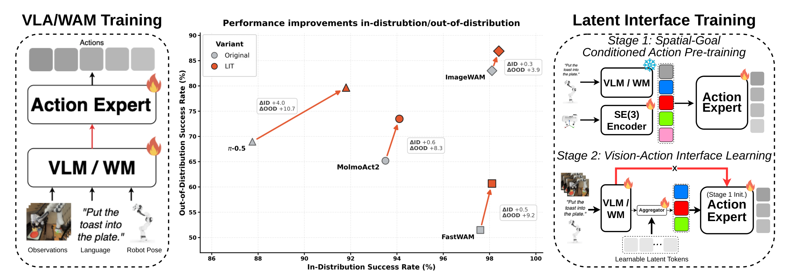
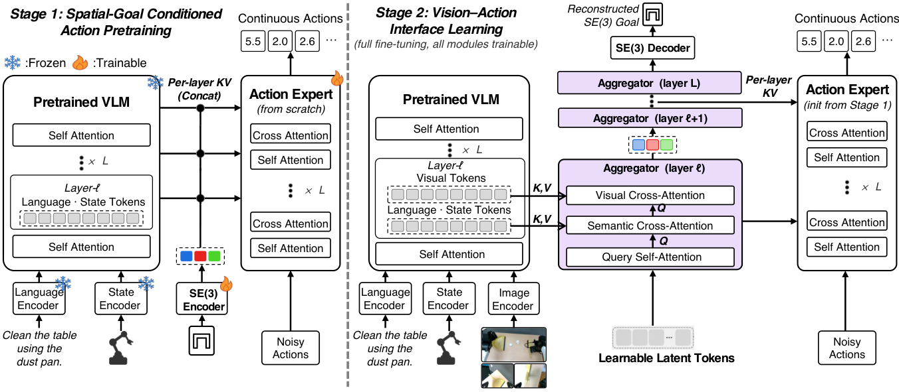

# Breaking the Vision–Action Shortcut: Latent Interface Training for Generalizable Robotics Foundation Models

> 원문: [arXiv HTML](https://arxiv.org/html/2609.12641) · [PDF](https://arxiv.org/pdf/2609.12641) · [프로젝트](https://magiclab-nus.github.io/LIT/) · [코드](https://github.com/MAGICLAB-NUS/LIT)

## 초록 번역
Robot foundation model은 training distribution 안에서는 강하지만 visual distribution shift에서 약해진다. pretrained visual representation으로부터 action을 만들 때 모델은 demonstration 안에서 action과 우연히 상관된, task와 무관한 시각 단서를 사용할 수 있다. 저자들은 이를 **vision–action shortcut**이라 부른다. Latent Interface Training (LIT)은 먼저 image 없이 spatial-goal-conditioned action prior를 만들고, 그 뒤 pose-supervised latent interface를 통해서만 visual conditioning을 허용하는 framework-agnostic 2단계 방법이다. 1단계에서는 language, robot state, action chunk의 terminal SE(3) end-effector pose로 action chunk를 학습한다. 2단계에서는 visual·semantic representation을 모은 latent token이 action expert의 유일한 visual pathway가 되며 terminal pose를 복원하도록 supervision한다. Pi0.5, MolmoAct2, FAST-WAM, ImageWAM의 네 VLA/WAM에서 LIBERO-Plus overall success가 3.87–10.70 percentage point 개선되었고, 실제 로봇의 unseen camera·lighting·distractor 조건에서도 개선을 보고한다.

## I. 문제 설정
VLA policy는 시점 \(t\)에 visual observation \(\mathbf o_t\), language instruction \(l\), robot state \(\mathbf s_t\)를 받아 horizon \(H\)의 action chunk를 만든다.

\[
\mathbf A_t=(\mathbf a_t,\ldots,\mathbf a_{t+H-1}).
\]

일반적인 backbone→action-expert 연결은 풍부한 image feature를 바로 action generator에 준다. 이때 training scene의 background, camera, illumination처럼 action의 원인과 무관한 signal을 shortcut으로 사용하면, 새 시점·조명·distractor에서 action이 바뀐다. 반대로 visual input을 과도하게 제거하면 object 위치 같은 action-grounding 정보도 잃는다. LIT의 목표는 **nuisance cue는 차단하고 spatially relevant cue는 보존**하는 것이다.

*그림 1 번역 — 표준 학습은 visual representation을 action expert에 직접 condition한다. LIT는 image 없는 action prior를 먼저 만들고, pose reconstruction으로 공간 정보를 강제한 latent interface를 뒤에 붙인다. 여러 VLA/WAM에서 OOD success가 향상된다.*

## III. 방법

### 1단계: Spatial-Goal-Conditioned Action Pretraining
각 demonstration chunk의 terminal robot state를 목표 \(\mathbf g_t\)로 둔다.

\[
\mathbf g_t=[\mathbf p_{t+H};\mathbf r_{t+H};\mathbf q_{t+H}]\in\mathbb R^8,
\]

여기서 \(\mathbf p\in\mathbb R^3\)는 world-frame end-effector position, \(\mathbf r\in\mathbb R^3\)는 axis-angle orientation, \(\mathbf q\in\mathbb R^2\)는 gripper joint position이다. 이 goal은 학습의 condition/target일 뿐 inference 입력은 아니다.

frozen backbone은 image 없이 language와 robot state만 처리한다. 3-layer GELU MLP가 goal을 goal token \(\mathbf G_t=E_\eta(\mathbf g_t)\)으로 바꾸고, 각 coupling layer의 semantic representation \(\mathbf H^{sem}_{\ell,t}\)와 concatenate해 action expert를 condition한다. flow-matching action objective의 경우

\[
\widetilde{\mathbf A}^{\tau}_t=(1-\tau)\epsilon+\tau\mathbf A_t,\quad
\mathbf v_t^*=\mathbf A_t-\epsilon,
\]

으로 noisy action chunk와 target velocity를 만들고 \(v_\theta\)가 \(\mathbf v_t^*\)를 예측한다. 즉 visual pixel 없이도 “instruction·현재 state·공간 goal이면 이 action chunk를 낸다”는 reusable prior를 학습한다.

### 2단계: Pose-Supervised Vision–Action Interface
이제 1단계 action expert를 초기화하고, \(K=100\)개의 learnable latent token \(\mathbf Z^0\in\mathbb R^{K\times d}\)을 interface로 넣는다. layer \(\ell\)에서 token은 self-attention 뒤 semantic cross-attention, visual cross-attention 순서로 갱신된다.

\[
\bar Z_\ell=Z_{\ell-1}+SA(Z_{\ell-1}),\quad
\tilde Z_\ell=\bar Z_\ell+CA^{sem}(\bar Z_\ell;H^{sem}_\ell),\quad
Z_\ell=\tilde Z_\ell+CA^{vis}(\tilde Z_\ell;H^{vis}_\ell).
\]

이 token만이 action expert의 visual conditioning input이다. terminal pose를 decode·reconstruct하는 auxiliary loss가 interface가 goal-relevant spatial information을 유지하게 만든다. inference에서는 goal encoder와 pose decoder는 제거하고, image/language/robot state만 넣어 원래 architecture의 sampling·execution 절차를 그대로 사용한다.

*그림 2 번역 — Stage 1은 language, state, terminal pose로 action prior를 만들며 image를 쓰지 않는다. Stage 2는 semantic/visual backbone representation을 latent token으로 집계하고, pose reconstruction으로 token을 action-relevant geometry에 묶는다.*

## IV. 실험 번역
**Benchmarks.** LIBERO 4 suite(Spatial/Object/Goal/Long) 40 task에서 task당 50 rollout, 총 2,000 episode를 평가한다. LIBERO-Plus는 original LIBERO demonstration만으로 훈련한 뒤 camera viewpoint, sensor noise, robot initial state, language instruction, object layout, lighting, background texture의 7개 task-preserving shift 10,030개를 zero-shot으로 평가한다.

**Architecture.** Pi0.5와 MolmoAct2는 VLA, FAST-WAM과 ImageWAM은 world-action model이다. 따라서 LIT는 shared self-attention, layerwise KV cross-attention, future-video training 등 서로 다른 visual–action coupling에도 적용된다.

**ID 성능.** LIBERO 평균 success는 Pi0.5 87.75→91.80, MolmoAct2 93.50→94.10, FAST-WAM 97.60→98.10, ImageWAM 98.10→98.40이다. 즉 interface가 in-distribution 성능을 대체로 보존한다.

**OOD 성능.** LIBERO-Plus overall은 Pi0.5 68.97→79.67(+10.70), MolmoAct2 63.62→71.92(+8.30), FAST-WAM 51.44→60.63(+9.19), ImageWAM 83.02→86.89(+3.87)이다. 특히 camera viewpoint 및 sensor noise에서 큰 개선이 보고된다. 단 MolmoAct2와 ImageWAM의 language-instruction shift는 각각 -2.11/-0.92로 일관된 이득이 아니므로, 모든 shift를 자동으로 해결한다고 읽으면 안 된다.

**실물 로봇.** Keep LEGOs, Wipe trash, Transfer egg의 3 task를 300 demonstration으로 multi-task 학습하고, lighting/camera/distractor OOD에서 비교했다. 논문은 MolmoAct2+LIT가 task를 유지하면서 visual nuisance 변화에 강해졌다고 보고한다.

## V. 한계와 결론
저자들이 명시한 한계는 더 크고 다양한 실제 로봇 demonstration 및 환경에서의 검증이 아직 필요하다는 점이다. 추가로 pose-supervision은 camera calibration, robot kinematics, terminal pose annotation 품질에 의존한다. action-expert가 visual input을 오직 latent bottleneck으로 받으므로 interface capacity·training stability가 실시간 latency와 robustness의 교환조건이 될 수 있다.

그럼에도 LIT는 VLA에서 language CoT를 더하는 방식과 다른 종류의 action grounding 기여다. “모델이 무엇을 말하는가”가 아니라 “visual signal이 어떤 bottleneck을 지나 실제 action chunk를 바꾸는가”를 목표 pose로 제약한다는 점에서, autonomous driving의 BEV/waypoint/trajectory policy에도 옮겨볼 수 있는 구조적 아이디어다. 부록 및 모든 implementation detail은 이번 번역에서 생략했고 원문을 참조한다.
