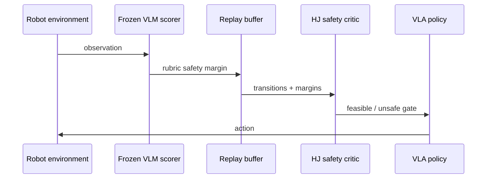

# ShieldVLA 핵심 기술 학습 자료

## 사전지식·용어

| 용어 | 뜻 |
|---|---|
| constrained RL | task reward와 safety cost constraint를 함께 최적화하는 RL |
| HJ reachability | 어떤 state에서 안전 policy가 존재하는지를 value/reachable set으로 정의하는 control 이론 |
| safety critic \(Q^s\) | state-action의 recoverable safety value를 추정하는 critic |
| feasibility | 단순히 현재 충돌이 없는 것이 아니라 안전한 continuation이 존재하는 상태 |
| rubric score | VLM이 세분화한 위험 조건을 항목별로 채점한 score |
| CSC | rollout 전체에서 누적된 safety cost |

## 단계별 이해

1. **안전 신호를 만든다.** RGB observation을 VLM에게 주고 obstacle overlap, proximity 등 rubric별 위험도를 \([0,1]\)로 얻는다.
2. **안전 critic을 배운다.** replay buffer의 transition과 score로 HJ Bellman target을 적용해 \(Q^s(o,a)\)를 학습한다.
3. **feasible 여부를 나눈다.** \(Q^s>\delta\)면 policy는 task reward를 쫓아도 된다. 아니면 안전 gradient가 우선한다.
4. **실행시 VLM은 제거한다.** scorer는 cost label 생산자이고 online controller가 아니다. 이것이 latency 설계의 핵심이다.

## 핵심 식 해석

\[\mathcal L_{safety}=-Q^s_\phi(o,\pi_\theta(o)).\]

unsafe state에서 이 loss를 줄이면 policy가 critic이 더 안전하다고 평가하는 action을 내게 된다. 이는 `collision이면 벌점`보다 앞선 state에서 action 방향을 바꿀 수 있다. 단, critic이 틀리면 gradient도 틀리므로 calibration과 OOD test가 필수다.

## 구현·배포 체크리스트

- rubric은 domain 전문가와 failure log에서 만들고, item별 inter-rater/VLM consistency를 검사한다.
- VLM score를 raw control action으로 쓰지 말고 training-side cost label로 한정한다.
- task critic과 safety critic의 data coverage를 분리 모니터링한다.
- threshold \(\delta\)는 success, CSC, intervention rate를 함께 보며 calibration한다.
- deployment에는 emergency stop, deterministic collision checker, policy fallback을 별도 유지한다.

## 자가 점검 질문

**Q. Lagrangian penalty만 쓰지 않는 이유는?**  
A. 기대 reward와 cost의 soft trade-off는 위험 region에서도 reward-gradient를 남길 수 있다. ShieldVLA는 infeasible이면 safety objective로 update를 전환한다.

**Q. positive \(Q^s\)가 collision-free와 같은가?**  
A. 아니다. 지금 안전해 보여도 future continuation이 없으면 infeasible일 수 있다. 반대로 temporary risk에서 recovery가 가능할 수도 있다.

**Q. 자율주행에서 바로 쓸 수 있는가?**  
A. 원리는 trajectory shield에 쓸 수 있지만 camera-only rubric 대신 BEV, occupancy, map, traffic rule, prediction uncertainty와 certified fallback이 필요하다.

## 읽기 로드맵

1. SafeVLA로 constrained VLA baseline을 읽는다.
2. HJ reachability / control barrier function의 safe-set 차이를 정리한다.
3. ShieldVLA의 Appendix C algorithm과 E rubric prompt를 읽는다.
4. driving scenario에서 `near miss`, red-light, cut-in을 rubric으로 바꿔보고 critic input과 failure metric을 설계한다.
