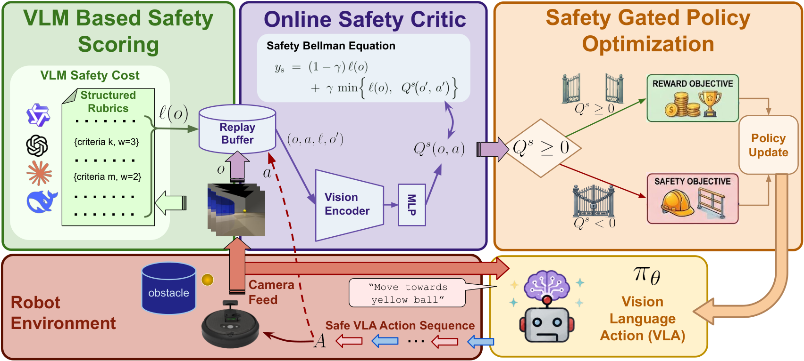
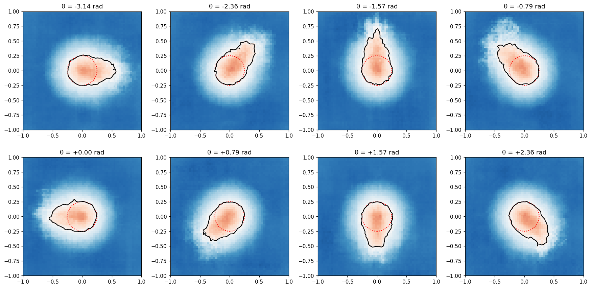

# ShieldVLA: VLA를 위한 실행가능성 인지 안전 정렬

> 원문: Manan Tayal, Akshay Nambi, *ShieldVLA: Feasibility-Aware Safety Alignment for Vision-Language-Action Models* (arXiv:2609.13231). arXiv HTML v1 및 원문 PDF를 바탕으로 핵심 본문을 한국어로 기술 번역·정리했다. 부록의 전체 prompt·하이퍼파라미터 표는 압축했으며, 수식 전개 증명은 원문을 병행 참조한다.

## Abstract

Vision-Language-Action(VLA) 모델은 robot manipulation과 navigation에서 일반화 능력을 보이지만, 기존 fine-tuning은 안전 보장이 제한적이다. 널리 쓰이는 Lagrangian 최적화는 누적 cost의 기대값에 soft penalty를 주므로 constraint violation이 남거나 지나치게 보수적인 정책이 되기 쉽다. 시각 환경에는 조밀한 per-step safety annotation이 없다는 점도 안전 학습을 어렵게 한다.

저자들은 Hamilton–Jacobi(HJ) reachability에 기반한 safety-aligned fine-tuning인 **ShieldVLA**를 제안한다. 시각 observation에서 safe operating region을 추정하도록 model-free HJ reachability value를 근사하고, learned safety critic이 feasible 영역의 reward optimization과 unsafe 근처의 recovery를 구분해 policy update를 gate한다. 또한 rubric 기반 VLM safety score로 semantic safety feedback을 critic target으로 바꾸어 수작업 cost label 없이 visual-domain supervision을 확장한다. 다섯 navigation/manipulation benchmark에서 평균 cumulative safety cost를 57% 낮추고 SafeVLA보다 task success rate를 0.13 높였다고 보고한다.

## 1. Introduction — 성공률만으로는 안전하지 않다

VLA는 image와 language instruction을 받아 continuous/low-level robot action을 생성한다. 그러나 reward를 높이면서 cost를 벌점으로 주는 constrained RL만으로는 “목표를 달성하지만 충돌한다”와 “안전하지만 멈춘다” 사이를 안정적으로 조절하기 어렵다. 특히 hazard proximity, posture, collision risk는 RGB 한 장에서 명시적 label로 제공되지 않는다.

ShieldVLA의 핵심 주장은 safety를 기대 cost가 아니라 **현재 state-action에서 안전한 continuation이 존재하는가**라는 feasibility 문제로 다뤄야 한다는 것이다. 이 경계는 HJ reachability의 value로 표현한다. VLM은 관측을 structured rubric으로 채점해 dense-ish semantic cost 신호를 만들고, critic은 replay buffer에서 이 신호를 online으로 학습한다. 배포되는 policy는 VLM을 호출하지 않으며 safety critic과 action policy만 남는다.

## 2. Background — HJ safety와 VLM rubric

안전 cost를 \(\ell(o)\)라 하자. 논문은 여러 rubric 항목을 각 \([0,1]\) 점수로 평가하고 weight를 더해 raw severity를 만든다. 예를 들어 Dubins-VL/TurtleBot-Nav에서는 obstacle overlap·edge proximity·heading 같은 관찰 가능한 위험 조건을 rubric으로 분리한다. 단일 collision bit보다 contact 전 위험을 먼저 구분할 수 있다는 것이 의도다.

안전 critic \(Q^s(o,a)\)는 HJ safety Bellman operator로 학습한다. 직관적으로 \(Q^s>0\)이면 해당 action 뒤에도 안전 policy가 존재하는 feasible region이고, 음수이면 이미 회복하기 어려운 unsafe region이다. 논문은 이 operator의 convergence proof를 Appendix A에 제시한다. 그림의 Dubins 차량 reachable set은 장애물 쪽으로 heading이 향할수록 수축한다.

## 3. Method

### 3.1 Online safety critic

공유 replay buffer \(\mathcal D\)에 observation, action, 다음 observation, VLM rubric cost를 저장한다. safety critic은 task reward critic과 별도의 HJ target으로 update된다. 이 분리는 “reward가 큰 위험 행동”을 safety value가 덮어쓰지 않도록 한다. VLM scoring은 offline/collection-side cost pipeline이므로 action inference loop의 latency를 늘리지 않는다.

### 3.2 Feasibility-gated optimization

threshold \(\delta\)에 대해 두 update를 쓴다.

- **Feasible:** \(Q^s(o,a)>\delta\)이면 base VLA/PPO의 원래 reward gradient를 적용한다.
- **Infeasible 또는 경계 근처:** reward gradient 대신 \(\mathcal L_{safety}=-Q^s_\phi(o,\pi_\theta(o))\)를 최소화해 predicted action의 safety value를 높인다.

따라서 unsafe area에서 “reward를 조금 포기하는 soft trade-off”가 아니라 policy가 안전 region으로 되돌아가도록 직접 최적화한다. Threshold ablation은 \(\delta\)가 클수록 shielding이 빨라지지만 과도하게 높이면 success를 억제할 수 있음을 보인다.

### 3.3 VLM 기반 safety margin

Frozen VLM은 structured prompt와 rubric으로 frame을 채점한다. 저자들은 prompt를 refinement-through-differentiation(RTD)로 다듬어 2B scorer의 항목별 mode collapse를 줄이고 8B scorer에서 pre-contact tail의 구별력을 높였다고 보고한다. 중요한 제한은 VLM score가 물리적 ground truth가 아니라 model-generated supervision이라는 점이다. 잘못된 visual judgment나 prompt bias는 critic으로 전파될 수 있다.

## 4. Experiments

### 4.1 설정

평가 환경은 Dubins-VL, TurtleBot-Nav, Safety-CHORES Nav, Safety-CHORES Fetch, Franka-Reach의 다섯 가지다. 이동·reach·fetch를 함께 포함해 VLA backbone과 robot morphology가 달라도 적용되는지를 본다. Main table은 각 benchmark에서 200 evaluation episode를 사용하며, 별도로 3 training seed 평균/표준편차를 보고한다.

지표는 **SR(success rate; 높을수록 좋음)**와 **CSC(cumulative safety cost; 낮을수록 좋음)**다. 이는 open-loop prediction error가 아니라 실제 policy rollout 중 누적한 위험을 측정하는 closed-loop 관점이다.

### 4.2 결과와 ablation

저자 보고에 따르면 ShieldVLA는 다섯 환경 전체에서 SafeVLA 대비 평균 CSC를 57% 낮추고 SR을 +0.13 개선한다. VLM rubric cost를 binary collision indicator로 바꾸는 ablation은 contact 이전 위험 정보가 줄어드는 상황을 보인다. 같은 HJ critic을 써도 gating을 하지 않으면 TurtleBot-Nav에서 safety/success의 동시 개선이 약해져 critic만 있고 policy update가 분리되지 않는 설계의 한계를 드러낸다.

색상·조명 변형을 포함한 OOD visual perturbation에서는 held-out appearance가 VLM score와 critic generalization을 동시에 흔들 수 있다. 논문은 이러한 OOD condition에서도 CSC 이득을 제시하지만, 카메라·물체·weather가 훨씬 다양하고 다른 교통 참여자가 존재하는 real driving 수준의 evidence는 아니다.

## 5. Conclusion 및 한계

ShieldVLA는 VLM semantic rubric, HJ reachability critic, feasibility gate를 결합하여 VLA fine-tuning을 safety-constrained control로 재구성한다. deployment 시 scorer를 제거하고 critic을 사용한다는 점은 latency 관점의 장점이다.

다만 (1) VLM rubric이 안전의 완전한 정의가 아니고, (2) learned critic의 보장은 function approximation·distribution coverage·score quality에 의존하며, (3) 200-episode benchmark success는 rare catastrophic failure를 충분히 추정하지 못한다. threshold와 rubric weighting도 application-specific tuning 대상이다. 저자들이 말하는 safety는 formal system-level guarantee가 아니라 HJ-inspired learned shielding으로 해석해야 한다.

## 6. VLA for AD 관점

분류상 ShieldVLA는 **dual-system / explicit action guidance**에 가까운 safety layer다. language는 직접 trajectory를 생성하기보다 VLM rubric에서 scene 위험을 semantic score로 바꾸는 역할을 한다. 자율주행에 옮기면 BEV/occupancy, map·route, velocity, traffic-light state까지 포함한 critic이 “이 trajectory 뒤 안전한 continuation이 있는가”를 판단하고, planner/VLA policy의 action을 gate하는 구조가 된다. 다만 road rule·uncertain agent prediction·hard braking comfort·real-time compute를 함께 포함해야 하므로 RGB rubric만으로는 부족하다.

## 번역 범위 메모

Abstract, Introduction, Background, Method, Experiment protocol/results interpretation, Conclusion/Limitations를 심층 번역했다. Appendix A의 full proof, E의 verbatim VLM prompt, G의 전체 hyperparameter table은 압축했고 원문 HTML/PDF 링크를 남긴다.
