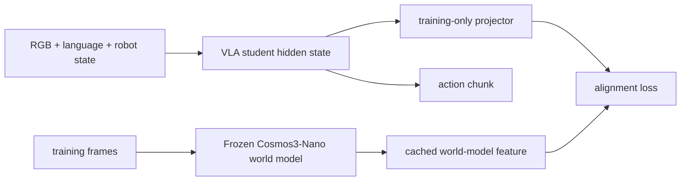

# THAW-VLA 분석

## 한 문장 결론
World model을 control loop에서 rollout하지 않고 cached hidden feature만 VLA student에 distill하면, baseline과 같은 inference architecture·latency로 physical-world prior를 전달할 수 있다는 주장이다.

## 문제와 기여

| 항목 | 내용 |
|---|---|
| 문제 | VLA는 fast하지만 world response를 직접 최적화하지 않고, world model은 grounded하지만 rollout이 느리다. |
| 기여 1 | frozen world-model intermediate feature를 offline cache한다. |
| 기여 2 | VLA hidden state와 teacher feature 사이의 alignment loss 하나를 action loss에 더한다. |
| 기여 3 | teacher/projector를 deployment에서 제거해 test-time capacity·compute를 늘리지 않는다. |
| 기여 4 | LIBERO, RoboCasa-GR1, two real-robot platform에서 closed-loop success를 비교한다. |

## Architecture / action grounding

입력은 standard VLA modality, 출력은 executable robot action chunk다. Language는 task instruction이며, action grounding은 hidden state가 world-model representation과 align된 상태에서 behavior-cloning action target을 예측함으로써 발생한다. 배포 시 오른쪽 teacher branch는 사라진다.

## Training·평가

\(\mathcal L=\mathcal L_{act}+\lambda\lVert P(z^S)-z^W\rVert^2\). Teacher feature는 training frames에서 미리 계산·cache하고 teacher 모델은 backprop/inference에 유지하지 않는다.

- **LIBERO:** 0.8B student 97.9% reported four-suite mean.
- **RoboCasa-GR1:** undistilled 48.2% → distilled 50.5% reported.
- **Real robot:** AgileX Nero·TRIP-Bag; cell당 30 trial success.
- **Deployment:** consumer RTX 5090, 32 ms / 1.86 GB 보고.

평가는 simulator/real rollout success라 closed-loop지만, long-horizon autonomy나 driving safety metrics는 없다.

## 강점·한계·AD relevance

**강점:** 미래 생성이라는 expensive objective가 만든 representation은 보존하면서 generative rollout cost를 제거한다. Student scale·backbone·layer·teacher ablation이 representation transfer의 일반성을 점검한다.

**한계:** feature MSE alignment가 causal predictive understanding을 보장하지 않고 teacher의 bias·data blind spot도 전달한다. cache storage/compute가 대규모 corpus에 부담이며 reported manipulation tasks는 rare safety event를 다루지 않는다.

**AD relevance:** driving world model의 BEV/occupancy/dynamics feature를 E2E trajectory policy intermediate state로 distill하면 10–50 Hz control budget 안에 world prior를 넣을 수 있다. 반드시 closed-loop route completion, collision, rule violation, interaction uncertainty와 latency를 같이 검증해야 하며 THAW만으로 safe planning은 되지 않는다.
