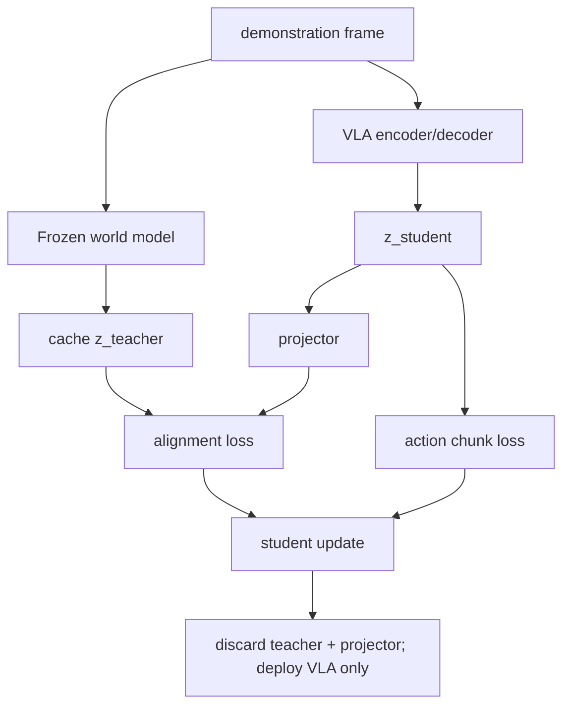

# THAW-VLA 핵심 기술 학습 자료

## 사전지식·용어

| 용어 | 뜻 |
|---|---|
| VLA | vision/language/robot state를 executable action으로 바꾸는 policy |
| world model | action-conditioned future observation/dynamics를 학습하는 model |
| distillation | teacher의 output/feature를 student가 모방하도록 하는 training |
| representation alignment | teacher/student hidden state를 같은 feature geometry에 맞추는 loss |
| action chunk | 매 control step에 예측하는 짧은 연속 action 묶음 |
| offline cache | training 전/중 teacher feature를 계산해 저장하고 online teacher forward를 피하는 방식 |

## 설계의 핵심 질문

`world model을 매 step rollout하면 더 grounded한데 느리다. rollout 없이 무엇을 남길까?`  
THAW의 답은 **teacher의 internal feature**다. Future generation은 teacher를 만든 objective이고, student는 그 objective가 형성한 representation을 imitation한다.

## 핵심 식과 구현 순서

\[
\mathcal L=\mathcal L_{act}+\lambda\Vert P(h^S_t)-h^W_t\Vert_2^2.
\]

1. Frozen Cosmos3-Nano 같은 teacher의 적절한 layer를 선택한다.
2. training video/frame에서 \(h^W_t\)를 batch ID와 함께 cache한다.
3. VLA hidden state \(h^S_t\)에 projector \(P\)를 붙인다.
4. action loss와 feature loss를 joint optimization한다.
5. checkpoint export 때 teacher와 projector dependency가 없는지 확인한다.

`lambda`, teacher layer, student alignment layer는 핵심 ablation 축이다. 너무 큰 \(\lambda\)는 teacher imitation이 action supervision을 압도할 수 있다.

## 평가 해석

| 축 | 논문 evidence | 읽을 때 물을 질문 |
|---|---|---|
| simulation | LIBERO 4-suite 97.9% 보고 | task distribution/seed protocol은 공정한가? |
| humanoid | RoboCasa-GR1 48.2→50.5% | gain이 difficult scene에서 더 큰가? |
| real robot | 30 trials/cell | CI와 failure type은 충분한가? |
| deployment | 32 ms, 1.86 GB on RTX 5090 | target hardware·camera pipeline까지 포함한 latency인가? |

## 실패와 한계

feature alignment는 object contact를 직접 supervise하지 않는다. 논문이 제시한 drop, rim grasp, egg slip은 world prior가 있어도 gripper geometry·state estimation·action noise가 남는다는 사례다. 또한 cached teacher feature가 data leakage 없이 observation-only policy input과 시간적으로 정렬되는지 확인해야 한다.

## 자가 점검 질문

**Q. 왜 test-time world model을 쓰지 않는가?**  
A. 미래 생성/rollout은 seconds per decision일 수 있어 fast control loop에 맞지 않는다. THAW는 training-time feature cache만 쓴다.

**Q. projector를 버리면 student 정보도 사라지는가?**  
A. 아니다. projector는 alignment loss를 위한 training head이고, student hidden representation의 geometry가 action backbone에 이미 학습되었다는 가정이다.

**Q. driving으로 옮길 때 가장 큰 차이는?**  
A. multi-agent uncertainty다. BEV/occupancy world-model feature를 distill할 수 있지만, ego trajectory policy는 route/rule/safety constraint와 closed-loop interaction metric을 별도로 가져야 한다.

## 읽기 로드맵

1. World model, WAM, VLA의 input/output과 rollout latency를 표로 비교한다.
2. THAW Figure 2와 Table IV–VI를 읽어 teacher/layer/scale ablation을 해석한다.
3. Fast-WAM과 robustness study를 비교해 `rollout` 대 `representation transfer`를 정리한다.
4. AD 실험 설계: cached BEV world-model feature → trajectory policy alignment, nuPlan/CARLA closed-loop safety 평가를 작성한다.
