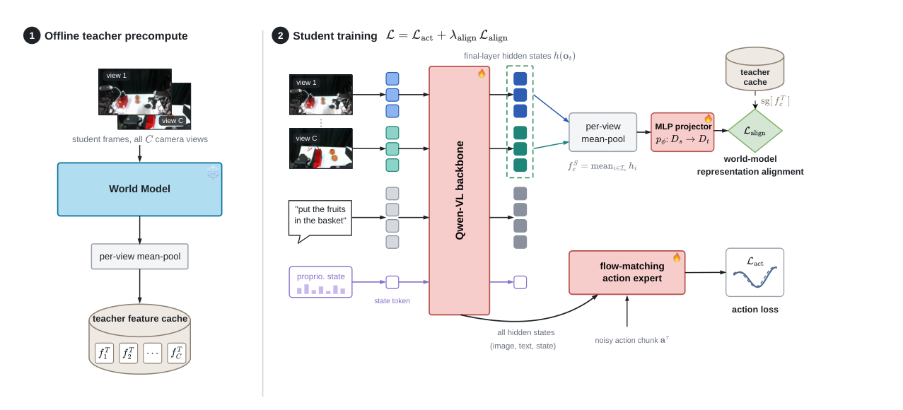
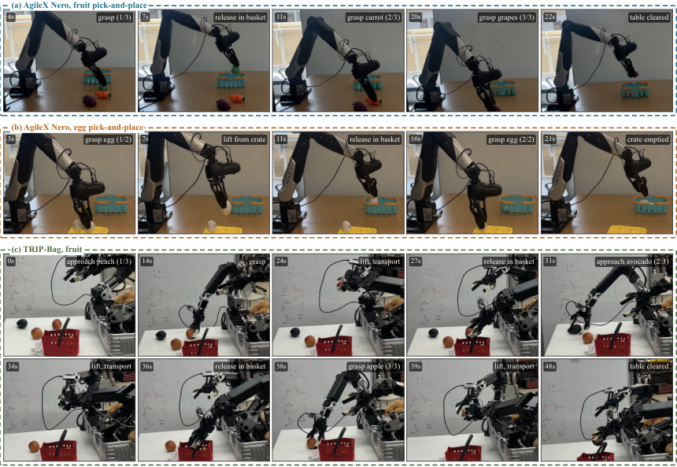
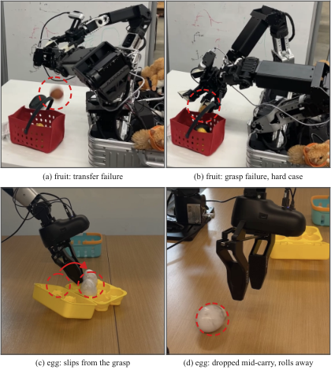

# THAW-VLA: World Model 표현을 Compact VLA 정책으로 증류하기

> 원문: Trung Dao, Sankalp Yamsani, Jaden Park, Joohyung Kim, Yong Jae Lee, *Think Like a World Model, Act Like a VLA: Distilling World-Model Representations into Compact Robot Policies* (arXiv:2609.24682). arXiv HTML v2와 PDF의 Abstract, 본문 I–V, 표·그림 caption을 바탕으로 한국어 기술 번역·정리했다. 논문 부록/구현 세부 전체는 원문을 병행 참조한다.

## Abstract

VLA는 observation을 action으로 매핑하지만, world가 action에 어떻게 반응하는지를 직접 학습 목표로 삼지 않아 robustness가 data coverage에 묶인다. World model은 바로 그 미래 예측 objective를 통해 물리적 장면을 더 잘 ground하지만, future rollout은 action 하나당 수 초가 걸려 control loop에 넣기 어렵다.

논문은 world model이 아는 물리 scene 정보는 internal feature에 있고, 미래를 생성하는 무거운 machinery는 그 feature를 만들기 위한 training objective일 뿐이라고 본다. Frozen world model을 training frame에 한 번 실행해 feature cache를 만들고, VLA student가 그 feature와 agree하도록 ordinary VLA training에 alignment term 하나를 더한다. teacher는 training 후 제거되고 deployed policy도 baseline과 동일하다. 저자들은 consumer RTX 5090에서 32 ms, 1.86 GB로 동작하는 0.8B student가 LIBERO 97.9%, RoboCasa-GR1 humanoid manipulation 48.2%→50.5%를 달성하며 real robot에도 전이된다고 보고한다.

## I. Introduction — 미래 생성과 표현 전달을 분리한다

World model은 observation과 action에서 future visual state를 예측한다. 이 objective는 object permanence, contact, trajectory consequence 같은 physical regularity를 representation 안에 넣지만, autoregressive/diffusion rollout 자체는 control latency에 맞지 않는다. 반대로 lightweight VLA는 빠르게 action chunk를 내지만 training distribution 밖의 visual·dynamics shift에서 취약할 수 있다.

THAW-VLA의 질문은 “world model의 future imagination을 매 action마다 실행하지 않고 그 representation만 action policy에 넘길 수 있는가?”이다. 답은 offline cached teacher feature와 student hidden state alignment다. inference graph·parameter count·action decoder는 base VLA와 같으므로 gain을 test-time compute나 capacity가 아니라 representation prior의 효과로 해석할 수 있다.

## II. Related Work의 위치

- **VLA:** language, RGB/vision, robot state를 action chunk로 변환한다. 일반적으로 behavior cloning 또는 action-token prediction이다.
- **World model / World Action Model:** action-conditioned future observation을 학습해 planning, data augmentation, evaluation에 쓰지만 rollout cost가 크다.
- **Representation distillation:** teacher output/logit을 맞추는 것과 달리 THAW는 action label 외에 hidden physical representation을 student VLA 내부에 주입한다.

따라서 분류상 **world model + VLA** 및 **implicit representation transfer**의 교차점이다.

## III. Method

### A. Student와 base objective

Student는 standard VLA input \(x_t\)—camera observation, language instruction, robot state/history—을 받아 action chunk \(a_{t:t+h}\)를 예측한다. Base objective \(\mathcal L_{act}\)는 기존 VLA training과 동일한 action prediction loss다. 논문은 작은 0.8B student와 다른 scale/backbone에도 method를 시험한다.

### B. World-model representation alignment

Frozen teacher world model \(W\)에 training frame을 넣고 chosen intermediate feature \(z^W_t\)를 cache한다. Student hidden feature \(z^S_t\)는 small projector \(P\)를 거쳐 teacher space에 align된다.

\[
\mathcal L = \mathcal L_{act} + \lambda\,\lVert P(z^S_t)-z^W_t\rVert^2.
\]

핵심은 teacher가 online rollout을 하지 않고 cached feature target만 제공한다는 것이다. Training이 끝나면 teacher와 projector를 버린다. 따라서 deploy 시 \(\mathcal L_{act}\)로 학습한 원래 VLA architecture가 그대로 남는다.

### C. Teacher: Cosmos3-Nano

Teacher로 Cosmos3-Nano world model을 사용한다. World-model feature가 future dynamics를 prediction하도록 훈련되었기 때문에, explicit human action labels만 가진 VLA student에도 scene evolution 관련 inductive bias가 전달된다는 가설이다. 논문은 teacher·alignment layer·student scale을 바꾼 ablation으로 한 조합의 우연한 match가 아님을 확인하려 한다.

## IV. Experiments

### A. Setup

- **LIBERO:** 네 suite 평균 success를 action policy quality의 주요 simulation 지표로 사용한다.
- **RoboCasa-GR1:** 24 humanoid manipulation environment에서 0.8B student의 transfer를 비교한다.
- **Real robot:** AgileX Nero와 TRIP-Bag에서 fruit/egg pick-and-place를 포함하며, 표 III는 cell당 30 trial success rate를 보고한다.
- **Deployment:** baseline과 같은 deployed architecture가 consumer RTX 5090에서 32 ms, 1.86 GB라는 점을 명시한다.

이들은 open-loop trajectory MSE가 아니라 simulator/robot success라는 closed-loop evidence다. 다만 short-horizon manipulation 중심이므로 driving의 long-horizon interaction으로 일반화해서는 안 된다.

### B. Results

저자 보고 수치는 0.8B student가 LIBERO 평균 97.9%에 도달하고, RoboCasa-GR1에서는 undistilled 48.2% 대비 distilled 50.5%다. 가령 student size, backbone family, align하는 layer, teacher choice를 바꾼 Table IV–VI에서도 improvement가 남는다고 보고한다. 이는 feature supervision이 단지 capacity 증가가 아니라 transferable physical prior일 수 있다는 evidence다.

Real-rollout figure는 single-arm·bimanual platform에서 성공적인 pick-and-place를 보여 준다. Failure figure에는 receptacle 전 drop, rim을 잡는 closed gripper, egg grasp/carry 중 slip이 포함된다. 즉 representation distillation이 contact-rich failure를 제거하지는 않는다.

## V. Conclusion 및 한계

THAW-VLA는 heavy world model의 생성 기능을 deployed control loop에 넣지 않고, 그 internal representation을 action policy에 학습시키는 단순한 teacher-student recipe를 제시한다. Offline feature caching과 discarded projector로 inference cost를 baseline 수준으로 유지하는 것이 실용적 기여다.

하지만 feature similarity가 causal physical understanding을 보장하지는 않는다. Teacher bias/coverage가 student에 이전되고, cache 생성·storage 비용이 large-scale robot corpus에서 커질 수 있다. 평가가 LIBERO·RoboCasa와 몇 real manipulation task에 집중되어 long-horizon planning, safety-critical collision avoidance, fast moving agents의 failure distribution은 충분히 측정하지 않는다.

## VLA for AD 관점

자율주행에서는 image/BEV/occupancy world model의 hidden state를 E2E driving VLA 또는 trajectory policy의 intermediate state에 align할 수 있다. test-time diffusion rollout을 생략하므로 real-time planner에 매력적이다. 그러나 driving은 future multi-agent uncertainty와 safety rule이 핵심이므로 imitation success만으로 평가할 수 없고, closed-loop CARLA/nuPlan, collision/route/rule violation 및 latency를 함께 검증해야 한다. THAW 방식은 planner를 대체하는 안전 보증이 아니라 world-model prior를 압축하는 방법이다.

## 번역 범위 메모

Abstract, Introduction, Related Work 분류, Method의 base objective/feature alignment/teacher, LIBERO·RoboCasa·real-robot experiment, Conclusion을 심층 번역했다. baseline 논문의 모든 per-suite 표 행, training config와 appendix-level implementation은 압축했다.
