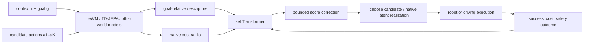

# D-JEPA 분석

## 한 문장 결론
D-JEPA는 world model의 **future prediction**을 더 정교하게 만드는 대신, 동일 context에서 경쟁하는 action 후보들을 set-wise로 비교하고 실제 outcome으로 순위를 보정해 “예측상 가까움”과 “실행 성공”의 간극을 줄인다.

## 문제·기여

| 항목 | 내용 |
|---|---|
| 문제 | global latent prediction/rank가 좋아도 top-k decision boundary에서는 실패 action이 성공 action보다 낮은 cost를 받을 수 있다. |
| 기여 1 | goal-relative descriptor와 ordinal rank를 후보 집합 전체에서 처리하는 permutation-equivariant relational alignment. |
| 기여 2 | \(|\delta|\le0.2\) bounded correction으로 native preference를 보존하는 trust region. |
| 기여 3 | predictor-tail adaptation과 multi-geometry ordinal fusion의 calibrated composition. |
| 기여 4 | re-ranked decision을 native JEPA future latent distance로 그대로 읽을 수 있는 representation lifting. |

## I/O·pipeline

- **Input:** observation context, goal, action candidate set; RoboTwin에서는 language + synchronized multi-view RGB + proprioception도 포함한다.
- **Output:** candidate action sequence 또는 driving trajectory의 순위. action representation 자체는 원 policy/planner의 것을 유지한다.
- **Language role:** drive-specific reasoning text를 생성하지 않는다. VLA transfer에서는 instruction-conditioned VLA가 만든 action candidate를 re-rank한다.

## 학습·평가

- full candidate-set success mass + low-score boundary pair ordering + correction regularization.
- predictor adaptation은 TD-JEPA tail/projection에만 gradient를 준다.
- core: PushT, Reacher, granular control. transfer: RoboTwin, PiPER physical robot, focused driving scenes.
- **Open-loop/closed-loop:** candidate ranking은 logged/offline outcome에 fit하지만, main metric은 simulator/physical robot execution success와 driving PDMS다. driving은 traffic context가 공유된 32 trajectory 후보를 actual evaluator로 측정한다.

## 결과와 해석

- PushT 87.89%, Reacher 93.75%.
- RoboTwin native VLA success 61.72% → 76.76%; PiPER 64.0% → 81.0%.
- driving 7 scene 평균 PDMS 57.36 → 95.34. 이 수치는 trajectory generator를 바꾼 것이 아니라 candidate selection을 개선한 효과다.
- exact ordinal realization은 기존 latent-distance planner를 바꾸지 않으면서 aligned ranking을 유지하는 deployment interface다.

## 강점·한계·AD relevance

**강점:** raw score fusion보다 candidate relations를 사용하고, bounded correction·native fallback으로 risk를 제한한다. world model, VLA, driving planner가 공유할 수 있는 “candidate selection layer”를 제시한다.

**한계:** candidate set에 성공 후보가 없으면 reranker가 해결할 수 없다. executed labels의 coverage, task-local calibration, ranking-to-safety causality에 의존한다. driving evaluation은 7 focused scene이므로 long-tail, prediction uncertainty, interaction feedback의 일반화를 보장하지 않는다.

**자율주행 의미:** E2E AD/VLA에서 route-conditioned trajectory generator 위에 decision alignment를 둘 수 있다. 다만 production 수준에서는 collision/TTC 외 traffic-rule, comfort, epistemic uncertainty, fail-safe fallback을 hard constraint 또는 certified shield로 결합해야 한다.