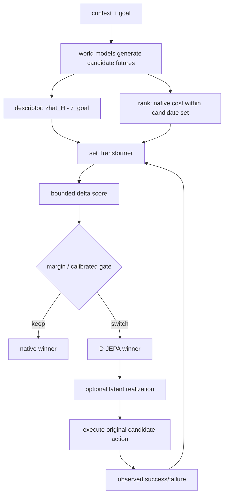

# D-JEPA 핵심 기술 학습 자료

## 사전지식·용어

| 용어 | 핵심 의미 |
|---|---|
| latent world model | observation/action을 pixel 대신 latent future로 예측하는 model |
| candidate set | 같은 시작 state에서 가능한 \(K\)개의 action sequence/trajectory |
| decision-local gap | 전체 prediction은 좋아도 실제 선택 top-k에서는 순위가 틀리는 현상 |
| ordinal evidence | 값의 scale 대신 후보 내 rank만 쓰는 비교 signal |
| permutation equivariance | candidate 입력 순서를 바꾸면 output도 같은 순서로만 바뀌는 성질 |
| representation lifting | learned ranking을 native latent distance가 읽을 수 있는 future geometry로 되돌리는 것 |

## 왜 단순 score calibration이 아닌가?

후보 A/B의 predicted cost가 0.20/0.22이고 A는 실패, B는 성공할 수 있다. 전체 63개 후보를 대상으로는 correlation이 높아도, `argmin`은 이 두 후보의 순서 하나에 의해 실패한다. 따라서 좋은 predictor를 평균적으로 만드는 objective와 좋은 action을 선택하는 objective는 다르다.

## 단계별 pipeline

1. future latent와 goal latent로 native cost를 만든다.
2. descriptor는 backbone별 geometry를, rank는 scale-invariant preference를 준다.
3. set Transformer가 후보 간 관계를 본다. 후보 하나를 독립적으로 score하는 MLP보다 “B가 A보다 실제로 낫다”를 배우기 좋다.
4. `tanh` bounded correction으로 멀리 떨어진 native preference는 보존한다.
5. 실행된 outcome으로 success mass와 local ordering을 학습한다.

## 핵심 식

\[
s_i=b_i+\delta_i,\quad |\delta_i|\le\epsilon
\]

\[
\mathcal L_R=-\log\sum_{i:y_i=1}p_i+
\lambda_{local}\mathcal L_{local}+
\lambda_{trust}\frac{1}{K}\sum_i\delta_i^2
\]

- 첫 항: 성공 후보가 하나라도 있으면 그쪽으로 probability mass를 옮긴다.
- local loss: 현재 decision boundary 근처 low-score 후보에서 success가 failure보다 앞서도록 만든다.
- trust term: learned ranker가 base model의 모든 판단을 덮어쓰지 못하게 한다.

## 자율주행에 옮기는 사고법

| 구성 | D-JEPA driving 구현 | production AD에서 확장할 것 |
|---|---|---|
| 후보 | Drive-JEPA의 32 trajectory | route/map/behavior planner의 trajectory set |
| feature | query, native score/rank, 24-D geometry | BEV/occupancy, prediction uncertainty, rules |
| label | official candidate quality, collision/TTC readout | closed-loop intervention, near miss, traffic violation |
| guard | native fallback + risk penalty | RSS/CBF/verification, emergency fallback |
| metric | PDMS scene mean | collision, comfort, progress, rule compliance, latency |

## 구현 메모

- candidate identity를 persistent ID로 유지해야 rank tie와 logged outcome join이 안정적이다.
- train/calibration/test start를 분리해야 ranking model이 같은 scenario의 candidates를 외우는 것을 줄일 수 있다.
- candidate budget을 바꿀 때 within-set rank를 다시 계산해야 한다.
- ranking model의 offline AUC만 보지 말고 “available-success가 있을 때 selected-success”와 risk regression을 별도 측정한다.

## 자가 점검

**Q. descriptor만 쓰면 안 되나?**
A. 서로 다른 world model latent는 scale/coordinate가 달라 직접 합치기 어렵다. rank는 monotonic transform에 불변이라 common interface가 된다.

**Q. rank만 쓰면 안 되나?**
A. rank는 direction·geometry를 잃는다. D-JEPA는 descriptor와 rank를 함께 써서 각 model의 detail과 model 간 비교성을 모두 확보한다.

**Q. reranking이 안전을 보장하나?**
A. 아니다. 후보에 safe option이 없거나 label/uncertainty가 부정확하면 위험하다. bounded correction은 damage containment이지 safety certificate가 아니다.

## 읽기 로드맵

1. PlaNet/Dreamer로 latent planning의 기본식을 복습한다.
2. V-JEPA 2 또는 TD-JEPA에서 action-conditioned future를 본다.
3. D-JEPA Figure 2로 decision-local gap을 확인한다.
4. Section 4의 relational loss와 Appendix G.2 driving token을 따라 구현해 본다.
5. E2E driving에서 `candidate generator → reranker → safety shield`를 분리한 ablation을 설계한다.
