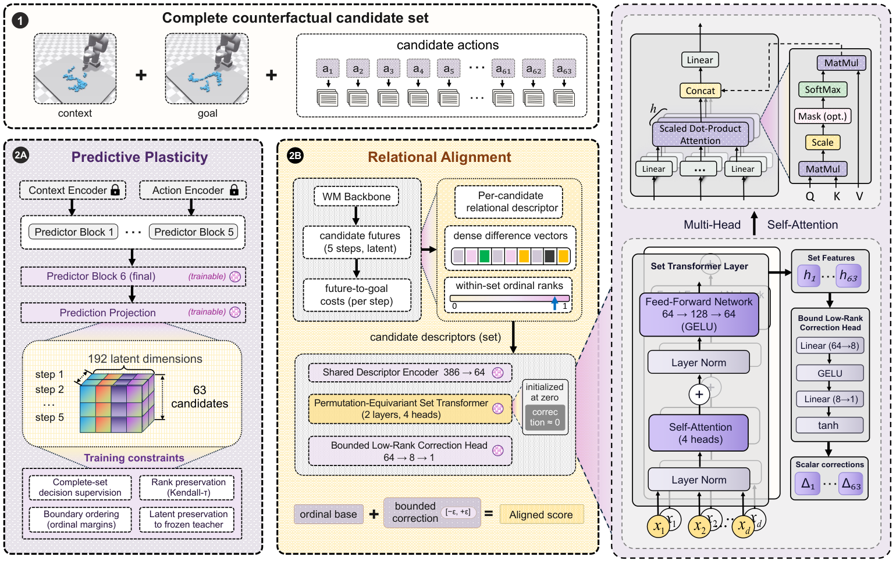
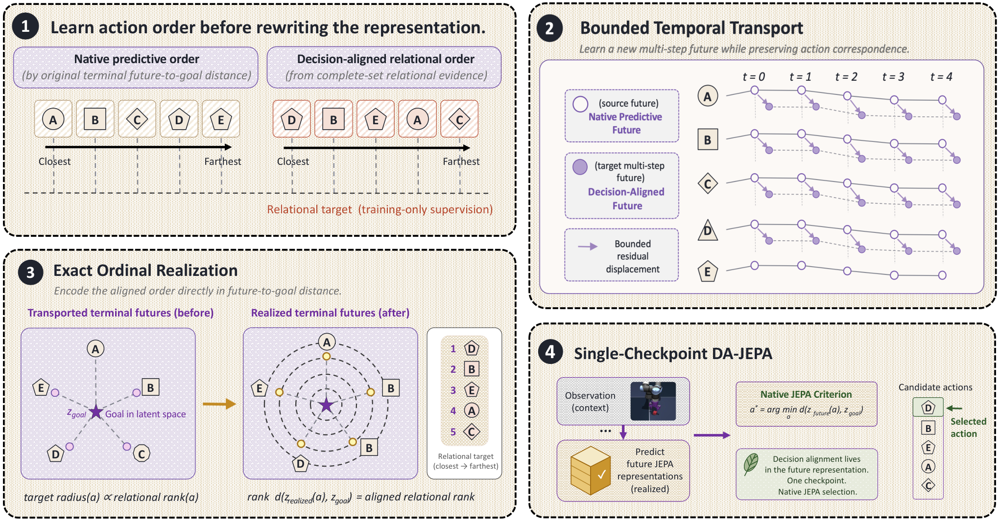

# D-JEPA: A Decision-Aligned Latent World Model — 핵심 기술 번역

> **번역 범위:** Abstract, Introduction, Method, 실험·자율주행 interface, 결론을 기술적으로 상세 번역·재구성했다. 증명·대형 수치표·부록의 반복 서술은 핵심 식과 설정으로 압축했다.

## Abstract

잠재 world model은 action의 결과를 예측하지만, latent distance가 실제로 실행에 성공할 후보를 반영한다는 보장은 없다. 저자들은 실행 직전 경쟁하는 소수 후보에서, goal에 더 가깝다고 예측된 후보가 실제로는 실패하고 다른 후보가 성공하는 **decision-local prediction gap**을 관찰한다. D-JEPA는 실행 outcome으로 후보 future들 사이의 의사결정 관련 관계를 학습하는 decision-aligned latent world model이다. goal-relative predictive feature와 ordinal evidence를 bounded, permutation-equivariant set operator가 함께 처리해 중요한 decision boundary 근처의 순서를 보정한다. PushT에서 87.89% success, RoboTwin의 native VLA success를 61.72%에서 76.76%로, 물리 로봇 두 과제는 64.0%에서 81.0%로 높였으며, 7개 driving scene의 평균 PDMS는 57.36에서 95.34로 보고한다.

## 1. 문제 설정: prediction이 좋아도 선택은 틀릴 수 있다

world model은 context \(x\), candidate action sequence \(a_i\), goal \(g\)에서 future latent와 goal latent를 만든다.

\[
\hat z^{m}_{i,1:H}=F_m(x,a_i), \qquad z_g^m=E_m(g)
\]

일반적인 planner는 terminal latent와 goal latent의 distance로 cost \(c_i^m\)를 계산하고 최솟값 후보를 실행한다. 그러나 후보 전체에서 예측 cost와 실제 cost의 correlation이 높아도, 실제 선택을 좌우하는 top-k 후보 안에서는 순서가 뒤집힐 수 있다. PushT audit에서 top-4 후보의 predicted-realized cost Spearman correlation은 LeWM 0.11, TD-JEPA 0.13까지 하락했고, mixed-outcome shortlist의 success/failure inversion은 각각 49.0%, 38.2%였다.

핵심 질문은 “더 좋은 pixel/latent prediction을 만들 수 있는가?”가 아니라 **“지금 실행할 후보들 중 무엇이 더 나은가?”**이다. D-JEPA는 후보 묶음 전체를 보고, 실행된 success/failure outcome이 실제로 필요한 상대 순서를 가르치게 한다.

## 2. D-JEPA의 후보 집합 정렬

각 predictive geometry \(m\)과 후보 \(i\)에서 terminal goal-relative descriptor와 native cost의 normalized rank를 만든다.

\[
d_i^m=\operatorname{LN}(\hat z_{i,H}^m-z_g^m),\qquad
r_i^m=\frac{\operatorname{rank}_{\mathcal A}(c_i^m)-1}{K-1}
\]

- \(d_i^m\): 각 backbone 내부의 방향성·geometry 정보를 보존한다.
- \(r_i^m\): 다른 backbone의 cost scale을 직접 맞추지 않고도 비교할 수 있는 scale-free ordinal evidence다.

LeWM과 TD-JEPA를 함께 쓰는 기본 token은 \(v_i=[d_i^L;d_i^T;r_i^L;r_i^T]\)이다. two-layer Transformer set encoder는 candidate position embedding 없이 후보 전체를 처리하므로 input 순서를 바꾸면 output도 같은 방식으로 바뀌는 permutation-equivariant 구조다. base ordinal fusion \(b_i=\alpha r_i^L+(1-\alpha)r_i^T\)에 작은 bounded correction을 더한다.

\[
\delta_i=\epsilon\tanh\!\left(W_{up}\tanh(W_{down}h_i)\right),\quad
s_i=b_i+\delta_i,\quad \epsilon=0.2
\]

이 bound는 base score gap이 \(2\epsilon\)보다 큰 후보의 상대 순서를 함부로 뒤집지 못하게 한다. 즉 model은 전역 ranking을 새로 발명하지 않고, native decision boundary 근방만 수정한다.

학습 loss는 (1) successful candidate 전체에 probability mass를 주고, (2) 현재 low-score subset에서 success가 failure보다 앞서도록 하고, (3) correction 크기를 regularize한다.

\[
\mathcal L_R=-\log\sum_{i:y_i=1}p_i+
\lambda_{local}\mathcal L_{local}+
\lambda_{trust}K^{-1}\sum_i\delta_i^2
\]

## 3. complementary predictive evidence와 representation lifting

D-JEPA는 두 보완 경로를 둔다.

1. **Predictive plasticity:** TD-JEPA의 마지막 predictor block과 projection만 제한적으로 adapt한다. success mass, boundary ordering, rank/latent consistency를 함께 써서 predictive geometry가 outcome을 더 반영하게 한다.
2. **Relational alignment:** 여러 predictive model의 descriptor/rank를 보고 후보 간 순위를 보정한다.

calibrated composition은 plastic predictor가 relational default보다 충분히 확실할 때만 predictor proposal을 채택한다. JEPA-WM, DINO-WM처럼 latent coordinate가 서로 다른 backbone도 ordinal coordinate를 통해 추가할 수 있다.

마지막에는 re-ranked action을 별도의 planner wrapper만으로 끝내지 않고, JEPA-compatible future latent 자체로 다시 표현한다. PushT의 terminal future는 strict rank \(\pi_i\)에 비례하는 goal-relative radius로 둔다.

\[
\tilde z_{i,H}^T=z_g^T+\frac{\pi_i}{K+1}u_i
\]

\(u_i\)는 원래 terminal displacement 방향이다. 따라서 native mean-squared goal distance는 \((\pi_i/(K+1))^2\)가 되어, 기존 latent-distance planner도 정렬된 순서를 그대로 읽는다. Reacher에서는 same-action future 간 normalized displacement를 time-conditioned bounded coefficient로 transport한다.

## 4. 실험과 결과

### 공통 평가

- **Core control:** PushT (256 starts), DMC-Reacher (128), Granular manipulation (64)
- **VLA manipulation:** RoboTwin 4개 task, multi-view RGB + proprioception + language instruction → bimanual 16-D action chunk
- **Physical robot:** PiPER 2개 task, V-JEPA 2 action-conditioned planner의 candidate를 re-rank
- **Autonomous driving:** Drive-JEPA의 scene별 32 candidate trajectory, 4초 horizon·0.5초 간격의 \((x,y,\theta)\) 8 pose

### 주요 결과

- PushT 87.89%, Reacher 93.75%로 matched predictive baselines를 앞선다.
- RoboTwin native VLA는 61.72% → **76.76%**.
- PiPER physical task 평균은 64.0% → **81.0%**.
- focused driving 7 scene에서 PDMS는 57.36 → **95.34**. candidate·traffic context·official evaluator는 공유하고, D-JEPA는 candidate score만 bounded set-wise correction으로 바꾼다.
- held-out PushObj shape 및 blur/noise/illumination/color shift의 모든 보고 조건에서 calibrated fusion보다 개선했다.

### 자율주행 interface

Drive-JEPA candidate token은 256-D proposal query, native score/rank, auxiliary channel, 24-D trajectory geometry를 결합한다. relational encoder가 score correction을 내며 native winner에는 correction을 고정하고, collision/time-to-collision supervised readout이 위험한 switch에 penalty를 준다. 최종 trajectory는 공식 evaluator로 **변형 없이** 전달된다. 이는 perception/planner/control 전체를 다시 학습한 결과가 아니라, 동일 action 후보의 ranking interface를 개선한 결과라는 점에서 해석이 명확하다.

## 5. 결론과 한계

D-JEPA의 메시지는 global predictive quality와 execution decision quality가 동치가 아니라는 것이다. 실제 outcome으로 candidate-set 관계를 학습하고, correction 범위를 제한하며, 정렬된 순서를 native latent geometry로 다시 표현하면 world model을 control interface에 더 직접 연결할 수 있다.

다만 task-local fitting, candidate pool의 quality, offline executed outcome coverage에 의존한다. 7개 focused driving scene의 결과는 고속·희귀 event·large-scale closed-loop fleet deployment을 검증한 것은 아니며, safety constraint와 uncertainty calibration이 별도로 필요하다.
