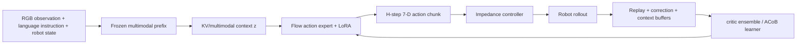

# VLA-Precision 분석

## 한 문장 결론
VLA-Precision은 사람 correction을 빠른 BC signal로, TD return과 proposal-vs-correction ranking을 느린 critic calibration signal로 결합하고, frozen VLM context를 재사용해 large VLA의 real-world online RL을 실용적 cycle time으로 끌어내리려는 연구다.

## 문제·기여

| 항목 | 내용 |
|---|---|
| 문제 | large VLA에서 real-world RL을 하면 value error가 policy drift를 만들고, frozen prefix/KV/replay/full model sync가 training throughput을 제한한다. |
| ACoB | intervention-driven behavior cloning + global TD + local preference ranking + pessimistic relative-advantage update + reference regularization. |
| ACoB-Stream | context formation, disk-backed persistence, objective-aligned access, trainable-subspace synchronization. |
| 범위 | 4 robot platform·9 high-precision chemistry manipulation task의 real-world online RL. |

## I/O·action grounding

- **Input:** visual observation, language instruction, robot proprioception/force-torque.
- **Output:** \(H\)-step action chunk; single step은 6-D TCP increment + gripper action이다.
- **Language role:** instruction으로 task-conditioned multimodal prefix를 만든다. language CoT를 생성하기보다 flow action expert를 condition한다.
- **Action grounding:** action chunk는 Cartesian impedance controller를 거쳐 UR5e/Franka control로 실행된다.

## training recipe

1. Stage I: \(\pi_{0.5}\) full-parameter imitation fine-tuning으로 task prior를 만든다.
2. Stage II: multimodal prefix와 base action expert는 freeze, action-expert LoRA만 online update한다.
3. critic ensemble은 executed transition의 TD target과 human correction이 original proposal보다 낫도록 하는 ranking loss로 학습한다.
4. policy는 current/reference relative advantage, success/correction BC, reference action regularization을 결합한다.
5. context KV는 actor가 생성하고 learner는 replayed context ID로 load해 prefix recomputation을 피한다.

## benchmark·metric·결과

- **Benchmark:** 4 platform, 4 chemistry manipulation category, 9 precision task; real robot closed-loop evaluation.
- **Metric:** task success, task completion time/data time, episode duration, throughput/compute efficiency; pure open-loop action error가 주 지표가 아니다.
- 보고값: mean success **98.3%**, **45.8분/task**, 27.6초 episode; ACoB-Stream 최대 **10.9×** throughput/compute efficiency.

## 강점·한계·배포

**강점:** human intervention을 단순 demonstration 재생이 아니라 counterfactual proposal에 대한 local preference supervision으로 쓴다. 또한 KV cache/replay/synchronization을 algorithm과 한 system으로 보므로 online loop latency를 직접 줄인다.

**한계:** real-world precision chemistry task와 특정 backbone/action setup에 맞춘 system이다. human correction quality·reward·teleop availability에 민감하고, disk-backed KV cache 운영은 장애 복구·data integrity·privacy 이슈를 만든다. large VLA online RL의 safety는 impedance control만으로 보장되지 않는다.

**자율주행 relevance:** policy improvement은 VLA driving policy나 trajectory action expert에 적용 가능하고, correction buffer는 safety driver intervention/route recovery log와 닮았다. 하지만 road deployment에는 low-latency perception, planner verification, traffic-rule constraint, rare-event safety와 offline counterfactual evaluation이 추가로 필요하다.