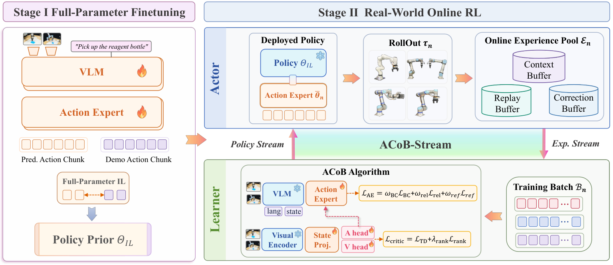
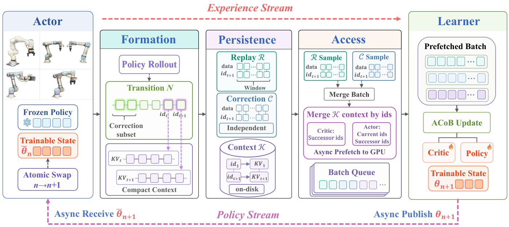

# VLA-Precision: Asymmetric Co-Bootstrapping — 핵심 기술 번역

> **번역 범위:** Abstract, 문제 설정, ACoB algorithm, ACoB-Stream system, real-robot deployment, 실험·한계·결론을 기술적으로 상세 번역·재구성했다. 반복 부록과 대형 표는 압축했다.

## Abstract

pretrained Vision-Language-Action(VLA) model은 넓은 manipulation 능력을 가지지만 precision·repeatability가 필요한 작업에서는 여전히 불안정하다. real-world online reinforcement learning(RL)은 demonstration의 한계를 넘어 trial-and-error로 개선할 수 있지만, 잘못된 value signal이 policy drift를 유도하고 large VLA의 compute overhead가 online throughput을 낮춘다. VLA-Precision은 이를 위해 **Asymmetric Co-Bootstrapping(ACoB)**과 **ACoB-Stream**을 제안한다. ACoB는 빠른 intervention-guided behavioral learning과 점진적인 global return propagation/local preference ranking을 서로 다른 timescale로 결합한다. ACoB-Stream은 frozen VLM context를 재사용하고 context/policy state를 on-demand로 stream해 최대 10.9× throughput·compute efficiency를 보고한다. 4 platform, 9개 high-precision chemistry manipulation task에서 평균 98.3% success를 task당 45.8분 만에 얻었다고 보고한다.

## 1. 문제: broad prior와 precision online learning의 충돌

behavior cloning(BC)은 demonstration action을 복제하지만 distribution 밖의 작은 alignment/contact error가 누적된다. RL은 long-horizon return으로 이를 고칠 수 있으나 real-world에서는 data가 비싸고 failure가 위험하다. large VLA에서는 다음 두 문제가 함께 생긴다.

1. **Algorithmic stability:** critic의 early value error를 그대로 최대화하면 policy가 spurious high-value action으로 drift할 수 있다.
2. **System efficiency:** frozen multimodal prefix, large KV context, replay I/O, full policy synchronization이 actor–learner loop를 늦춘다.

VLA-Precision은 imitation learning으로 task-specific prior를 먼저 만들고, Stage II에서 action expert의 LoRA만 online update한다. vision/language/robot-state prefix는 frozen 상태로 유지한다.

## 2. Formulation: VLA action chunk와 closed loop

task instruction \(\ell\)에서 state는 visual observation, robot state, language로 구성된다.

\[
s_t=(o_t,q_t,\ell),\qquad a_t=(u_{t,0},\ldots,u_{t,H-1})\in\mathbb R^{H\times d}
\]

여기서 \(a_t\)는 한 번에 실행하는 \(H\)-step action chunk다. frozen prefix encoder는 multimodal context \(z_t=F_{\Theta_f}(o_t,\ell,q_t)\)를 만들고, flow-based action expert \(G_{\psi,\theta}\)가 noise \(\epsilon_t\)에서 action chunk를 생성한다. Stage I task fine-tuning 뒤, Stage II는 frozen \(\Theta_f,\psi\) 위에서 LoRA \(\theta\)만 학습한다.

actor는 deployed \(\bar\theta_n\)로 rollout을 만들고 replay buffer \(\mathcal R\), correction buffer \(\mathcal C\), context buffer \(\mathcal K\)에 저장한다. learner는 ACoB로 \(\theta_n\to\theta_{n+1}\)를 update해 actor에 배포한다.

## 3. ACoB: 빠른 행동 개선 + 느린 value calibration

### 3.1 Progressive value calibration

critic ensemble은 \(Q_{\phi_k}(\omega,\hat a)=V_{\phi_k}(\omega)+A_{\phi_k}(\omega,\hat a)\)로 value와 action-dependent advantage를 분리한다. executed action을 대상으로 target critic의 pessimistic minimum을 쓰는 TD target은 다음과 같다.

\[
y_t=R_t^{(H)}+\bar\gamma(1-d_t)\min_k Q_{\bar\phi_k}(\omega_{t+1},\hat a_{t+1}^{\theta_n})
\]

global TD loss는 장기 return을 전달한다. 그러나 사람의 correction이 original proposal을 덮어써 성공한 경우, 덮어쓴 proposal에는 successor가 없으므로 TD만으로 “왜 original이 나빴는지”를 학습하지 못한다. 그래서 effective intervention에서 executed action의 advantage가 original proposal보다 margin 이상 크도록 **local preference ranking**을 더한다.

\[
\mathcal L_{rank}=\mathbb E\left[\frac1K\sum_k[m_c-(A_{exec}-A_{prop})]_+^2\right]
\]

이로써 critic loss는 \(\mathcal L_{critic}=\mathcal L_{TD}+\lambda_{rank}\mathcal L_{rank}\)가 된다.

### 3.2 Relative-advantage policy improvement

absolute Q를 직접 최대화하는 대신, 동일 context와 동일 noise에서 current action expert와 frozen reference expert의 advantage 차이를 각 critic 내부에서 계산한다. effective correction이 있으면 original proposal도 baseline에 포함하고, ensemble의 최솟값을 사용한다.

\[
\Delta A_t=\min_k[A^\theta_{t,k}-\operatorname{sg}(b_{t,k})]
\]

\[
\mathcal L_{rel}=\mathbb E\left[\kappa\operatorname{softplus}\left(\frac{m_\pi-\Delta A_t}{\kappa}\right)\right]
\]

policy는 충분한 relative improvement 후에는 critic score를 무한히 추구하지 않는다. 여기에 successful trajectory와 effective human correction을 flow-matching BC로 빠르게 흡수하고, frozen reference action에 대한 regularization을 더한다.

\[
\mathcal L_{AE}=w_{BC}\mathcal L_{BC}+w_{rel}\mathcal L_{rel}+w_{ref}\mathcal L_{ref}
\]

이 구조의 `asymmetric` 의미는 BC가 early phase에서 experience quality를 빨리 올리고, critic calibration은 data가 쌓이며 점진적으로 reliable guidance가 되는 것이다.

## 4. ACoB-Stream: large VLA의 actor–learner 병목 제거

ACoB-Stream은 네 lifecycle을 관리한다.

1. **Experience-context formation:** frozen prefix의 KV context를 actor inference 때 한 번 계산해 저장한다. learner가 같은 prefix를 재계산하지 않는다.
2. **Persistence:** context는 disk-backed \(\mathcal K\)에 deduplicate해 한 번만 저장하고, replay/correction buffer는 context ID만 참조한다. sliding-window sampling은 Linux page-cache reuse를 높인다.
3. **Objective-aligned access:** value update에는 successor context만, action-expert update에는 current+successor context를 batch로 읽는다. CPU prefetch와 GPU update를 overlap한다.
4. **Policy-state synchronization:** frozen VLA 전체를 전송하지 않고 trainable action-expert state만 actor에 publish해 version lag를 줄인다.

## 5. real-world data와 deployment

논문은 long sequence에는 UR5e와 kinematically isomorphic master arm, 미세 정렬에는 coarse/fine Cartesian keyboard teleoperation을 사용한다. state에는 relative TCP pose, twist, force/torque, gripper가 포함된 19-D robot state를 쓰며, action은 6-D incremental end-effector command와 gripper를 합친 7-D다. nominal 15 Hz로 synchronous state-action을 기록한다.

Stage I은 \(\pi_{0.5}\) full-parameter imitation fine-tuning, Stage II는 action expert LoRA online update다. UR5e는 force-mode Cartesian impedance, Franka는 torque-mode Cartesian impedance controller를 사용해 action chunk를 안전한 low-level command로 실행한다.

## 6. 평가·결과·해석

- 4 robotics platform, 4 chemistry task category, 9 high-precision manipulation task를 real-world에서 평가했다.
- 평균 **98.3%** success, **45.8분/task** data-collection/train time, 평균 episode 27.6초를 보고한다.
- ACoB-Stream은 baseline VLA/RL 대비 각각 1.2×/1.8× episode speed와 최대 **10.9×** throughput·compute efficiency를 보고한다.
- 핵심 ablation은 intervention BC가 초기에 policy와 data quality를 올리고, local preference ranking과 relative advantage가 후기에 drift를 줄인다는 주장이다.

## 7. 한계와 결론

사람 intervention, task-specific reward/teleoperation, real-robot hardware와 chemistry task에 의존한다. critic ensemble·flow action expert·KV context persistence는 implementation 복잡도가 높고, success rate만으로 novel language compositionality나 broad cross-task retention을 완전히 보여 주지는 않는다. 또한 VLA control의 online RL은 robot safety·operator burden·hardware wear를 여전히 수반한다.

그럼에도 이 논문은 VLA post-training을 “RL loss 하나 추가”가 아니라 **algorithm, data interface, memory/I/O, deployment synchronization을 함께 설계해야 하는 closed-loop system**으로 다룬다는 점에서 중요하다.
