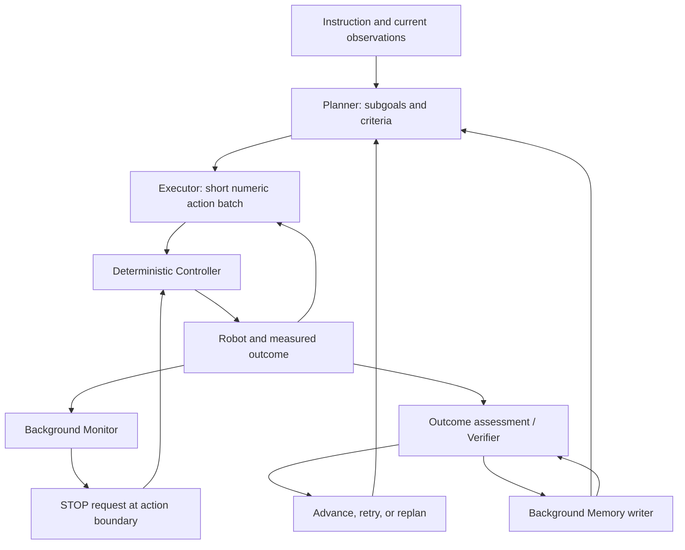

# MotorMind 분석: 범용 VLM의 Decision을 실행 가능한 Action으로 연결하기

## 한 문장 결론

MotorMind는 새 robot policy를 학습하는 대신 frozen VLM에 **mid-level action interface, measured feedback, asynchronous monitoring, explicit verification**을 연결해 zero-shot 조작을 개선합니다.

## 문제와 핵심 기여

VLA는 specialized demonstration coverage 밖에서 transfer가 약하고 VLM+tool agent는 external action/perception model과 code revision 비용을 가집니다. MotorMind의 핵심은 더 큰 learned action expert가 아니라 VLM이 이해할 수 있으면서 실제 robot이 실행할 수 있는 representation과 execution lifecycle입니다.

1. action/progress/completion을 분리한 240-question local diagnostic.
2. move/rotate/gripper의 parameterized proposal과 deterministic Controller.
3. 같은 VLM의 Planner·Executor·Monitor·Verifier·Memory role separation.
4. action boundary cancellation, stale result rejection, background memory.
5. LIBERO-PRO perturbation과 xArm6 interactive placement 평가.

## Taxonomy / Positioning

worldbench의 VA/VLA 분류를 먼저 대조했습니다. 이 논문은 **autonomous driving 논문이 아니라 tabletop robotics 논문**입니다. AD taxonomy를 확장해 보면 learned end-to-end VA가 아닌 **explicit action guidance + numerical mid-level action generation**에 가깝습니다. VLM이 language subgoal과 structured numeric proposal을 만들고 Controller가 실제 action에 grounding합니다. 이를 vehicle control이나 nuPlan/CARLA 성능으로 오인하지 않습니다.

| 항목 | 실제 interface |
|---|---|
| Input | instruction, camera images, tool pose/gripper state, measured motion, recent history |
| Language 역할 | task decomposition, target reference, success criterion, outcome reasoning, memory |
| Action | base-frame translation mm, rotation degree, gripper open/close; optional wait/home |
| Grounding | VLM bbox, compatible camera triangulation, target offset; validated Cartesian motion |
| Training | frozen general VLM; task-specific robot policy training 없음 |
| Feedback | actual motion, grasp/release state, updated images, alert/outcome |

## Architecture

Monitor가 action을 대체하지 않는 authority 분리와 늦게 도착한 이전 attempt 응답을 버리는 generation boundary가 중요합니다. main decision loop 자체는 sequential입니다. asynchronous라는 표현을 joint-control real-time inference로 해석하면 안 됩니다.

## Evaluation Matrix

| 평가 | 종류 | 결과 / 해석 |
|---|---|---|
| 240 embodied QA | local offline diagnostic | action/progress/completion 정확도와 latency; whole-task safety 아님 |
| LIBERO-PRO base | simulation closed-loop | MotorMind 66.7%; zero-shot CaP-X best 13.3% |
| LIBERO-PRO perturbation | simulation closed-loop | 53.8%; CaP-X best 19.2%; FT OpenVLA-OFT 51.2% |
| Adaptive suite | small interactive stress test | scene/prompt/moving target 변경; 통계 일반화 제한 |
| xArm6 | real robot closed-loop | direct + human perturbation pooled 95%; semantic task는 별도 |
| Backbone sensitivity | single-seed comparison | stronger VLM 83.3%, wall time 증가 |

원문 숫자이며 독립적으로 재현하지 않았습니다. open-loop trajectory ADE나 real-road collision metric은 제공하지 않습니다. TimeScore는 pp/min의 descriptive 지표로 GPU 비용이나 monetary cost가 아닙니다.

## Strengths

- motor backend와 semantic reasoning을 명시적으로 나눠 model 교체를 쉽게 합니다.
- intended outcome과 measured outcome, model done과 environment success를 구별합니다.
- observation freshness, command cancellation, memory completion을 실제 scheduling 문제로 다룹니다.
- no target-domain policy training과 fine-tuned checkpoint comparison을 구분합니다.

## Limitations / Contradictions

- grounding과 false completion이 남고 더 큰 VLM도 latency를 늘립니다.
- Controller/SDK·calibration·camera geometry는 여전히 embodiment-specific입니다.
- action-boundary stop은 즉시 continuous emergency stop과 다릅니다.
- baseline의 model, action representation, tools, scheduling이 함께 달라 asynchronous scheduling의 독립 효과를 확정할 수 없습니다.
- 본문은 3 task family를 열거하나 부록 D.1 matrix는 4 family를 사용합니다. source discrepancy로 기록하고 definitive count를 보류합니다.
- diagnostic GPT-6 Astra와 closed-loop sensitivity GPT-6 Sol을 섞지 않습니다.
- slow conveyor/tabletop task 결과를 autonomous-driving deployment safety로 일반화하지 않습니다.

## Safety / Latency / AD Implications — 분석자 추론

AD로 옮길 수 있는 것은 결과 수치가 아니라 **semantic intent → bounded numerical action → measured outcome → independent verification**이라는 설계 원칙입니다. 실제 vehicle에서는 low-level controller와 emergency supervisor가 VLM을 기다리지 않아야 합니다. stamped observation, max command age, bounded magnitude, independent collision/rule constraint, deadline watchdog, fallback policy를 추가로 검증해야 합니다. 이는 본 논문의 도로 실험 결과가 아니라 배포를 위한 추론입니다.

## 기존 Wiki와 연결

[[VisionLanguageModel]], [[AutonomousDrivingVLA]], [[ObservationToActionLoop]], [[LatentInterfaceTraining]]의 action interface·evidence 문제와 연결됩니다. learned latent interface를 바꾸는 LIT와 달리 MotorMind는 frozen VLM의 runtime scaffolding을 바꿉니다. 같은 주의 PerturBot은 training data가 evidence use를 요구하도록 바꾸므로 두 논문은 대체재보다는 서로 다른 단계의 intervention입니다.

## 원문

https://arxiv.org/html/2609.38078v1 · https://huggingface.co/papers/2609.38078
