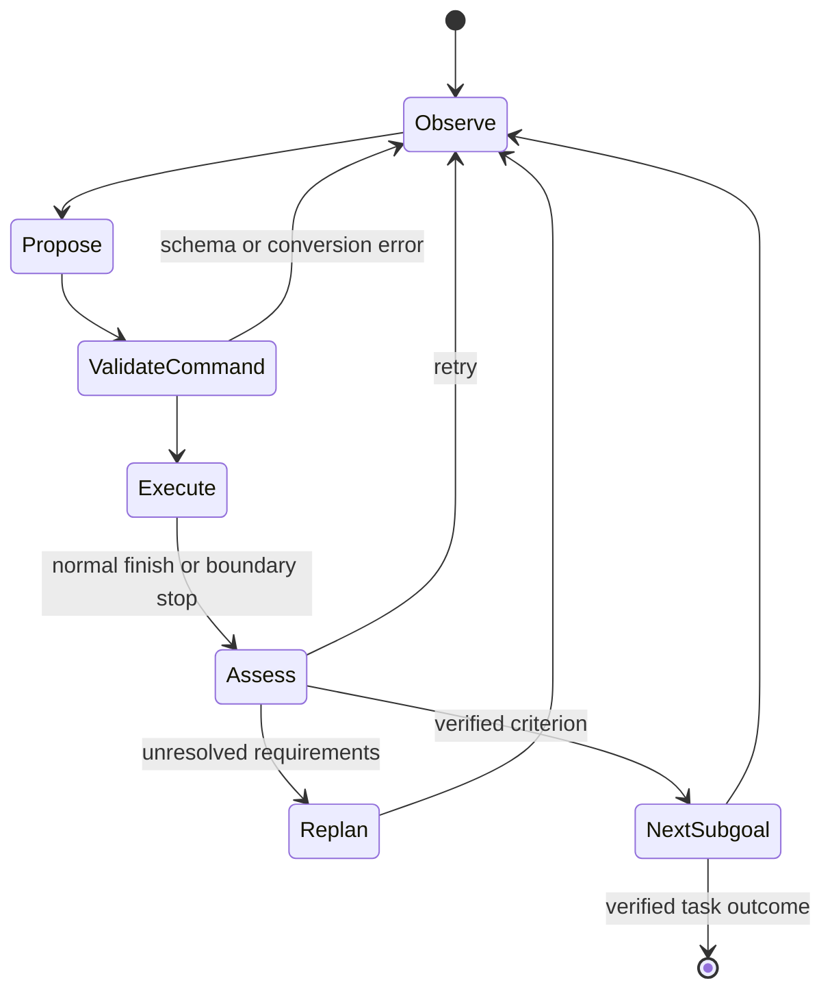

# MotorMind 핵심 기술 학습: Model Decision과 Robot Execution의 계약

## 선수지식과 목표

필요한 배경은 VLM의 image-conditioned reasoning, camera/base coordinate frame, finite-state execution, robot feedback, concurrency입니다. robot SDK로 실제 hardware를 작동시키는 방법보다 **proposal을 어디까지 믿고 어떤 evidence로 다음 state로 넘어갈지**를 이해하는 것이 목표입니다.

## 용어

| 용어 | 쉬운 설명 |
|---|---|
| harness | 모델 주변의 input 구성, 실행, 검증, 재시도 시스템 |
| mid-level action | “왼쪽으로 10mm”처럼 semantic direction과 numeric magnitude를 결합한 명령 |
| action grounding | 언어/시각 decision을 실제 robot motion과 outcome에 연결하기 |
| outcome verification | 말한 결과가 아니라 실제 criterion 달성을 확인하기 |
| stale response | 이미 종료한 attempt의 뒤늦은 inference result |
| action boundary | 현재 primitive 종료 뒤 다음 primitive 시작 전 취소 가능한 지점 |
| closed-loop | action 후 fresh observation을 보고 다음 action을 정하는 feedback 구조 |

## 먼저 Example로 이해하기

지시는 “blue cube를 box에 넣어라”입니다. Planner는 cube 접근, grasp, box 위 운반, release 같은 subgoal과 criterion을 만듭니다. Executor가 “gripper를 닫고 lift”를 제안해도 **close command를 보냈다는 사실은 cube를 잡았다는 사실이 아닙니다.** image와 holding state를 확인해야 합니다. wrong object를 잡았다면 Monitor가 pending placement를 취소 요청하고 Verifier가 현재 evidence를 다시 평가합니다. retry/replan은 새 observation에서 시작합니다.

## Pipeline



Monitor/Memory는 이 main state machine 옆에서 돌아갑니다. proposal/execution/assessment를 무조건 병렬화하면 observation이 어떤 action의 결과인지 모호해집니다.

## 표현과 수식

$ o_t=(\mathcal I_t,r_t)$는 image와 measured state를 구분합니다. $a=(\tau,\eta)$는 type과 parameter를 분리합니다. `move(left, distance_mm)`처럼 unit과 frame을 interface에 넣는 이유는 “왼쪽”이라는 같은 말이 image frame과 robot base frame에서 다른 방향을 뜻할 수 있기 때문입니다.

원문 진단에서 image-left/right는 fixed external camera 관계를 설명하며 action-left/right는 base axis를 뜻합니다. 실제 implementation은 calibrated transform와 view disagreement를 검증해야 합니다. bbox만 반환한다고 3D grounding이 완성되지는 않습니다.

## 다섯 역할과 Authority

1. Planner는 subgoal/criterion을 작성하지만 robot을 움직이지 않습니다.
2. Executor만 bounded action batch를 제안합니다.
3. Controller가 schema, conversion, 실제 motion을 처리합니다.
4. Monitor는 alert/stop request를 보내고 corrective action을 생성하지 않습니다.
5. Verifier는 measured outcome과 criterion을 확인합니다.
6. Memory는 evidence를 요약하고 action을 쓰지 않습니다.

본문은 Monitor를 통합 역할로 설명하지만 부록 prompt는 Motion Supervisor와 Scene Monitor를 구분합니다. 실제 구현에서 권한을 하나의 unconstrained agent에게 합치면 안 됩니다.

## Asynchrony의 실무 포인트 — 교육용 제안

아래는 원문 code 복제가 아니라 설계 invariant입니다.

```text
attempt_id를 관측·proposal·monitor request에 연결한다.
proposal의 frame/unit/schema를 실행 전에 확인한다.
monitor result가 현재 attempt와 다르면 폐기한다.
STOP은 다음 action boundary에서 pending command를 제거한다.
종료 후 measured state와 criterion으로 advance/retry/replan을 결정한다.
memory는 최신 완료 snapshot을 읽으며 미완료 write를 기다리지 않는다.
```

real hardware에는 이 VLM loop와 독립적인 emergency stop, workspace/velocity/force limit, watchdog가 필요합니다. 논문의 stop-at-boundary는 그런 safety controller의 대체재가 아닙니다. 이 학습 자료는 physical robot execution script를 제공하지 않습니다.

## 실험 결과를 제대로 읽기

- local QA accuracy와 closed-loop SR은 다른 지표입니다.
- no task-specific policy training은 zero engineering을 뜻하지 않습니다.
- model 교체로 SR이 올라도 latency가 커져 evolving scene에서는 stale observation risk가 늘 수 있습니다.
- TimeScore는 cost가 아니며 실패 episode를 빨리 끝내는 것만으로 deployment 효율을 평가하면 안 됩니다.
- small tabletop adaptive task와 real-road safety는 evidence level이 다릅니다.

## Study Questions와 답

**Q1. Executor가 done=true를 주면 성공인가요?** 아니요. outcome assessment를 요청하는 signal입니다. measured grasp/release와 task criterion을 확인합니다.

**Q2. Monitor가 wrong target를 감지하면 새 grasp action을 바로 내나요?** 아니요. authority는 alert/stop request입니다. corrective decision은 fresh observation을 받은 Executor/replanning으로 돌아갑니다.

**Q3. asynchronous면 이전 call이 늦게 와도 받아야 하나요?** 아니요. 종료한 attempt의 응답은 stale이므로 버려야 합니다.

**Q4. stronger VLM이 항상 더 좋은 control인가요?** 아닙니다. accuracy, decision latency, scene evolution, control deadline을 함께 평가해야 합니다.

**Q5. AD에 무엇을 가져갈 수 있나요?** bounded action contract와 independent verification이라는 설계 원칙입니다. benchmark SR을 차량 성능으로 가져갈 수는 없습니다.

## Reading Roadmap

1. paper-ko.md의 3절로 representation과 scheduler를 읽습니다.
2. 부록 C로 target localization와 structured proposal field를 확인합니다.
3. diagnostic/main/backbone sensitivity의 평가 구성을 구분합니다.
4. references.md의 Code as Policies → VoxPoser → Harness VLA를 훑습니다.
5. PerturBot과 비교해 runtime evidence check와 learned evidence reliance의 차이를 정리합니다.

## 출처

https://arxiv.org/html/2609.38078v1 · https://worldbench.github.io/vla4ad · https://github.com/worldbench/awesome-vla-for-ad
