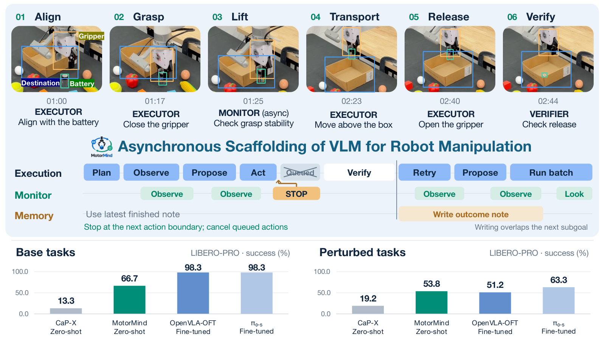
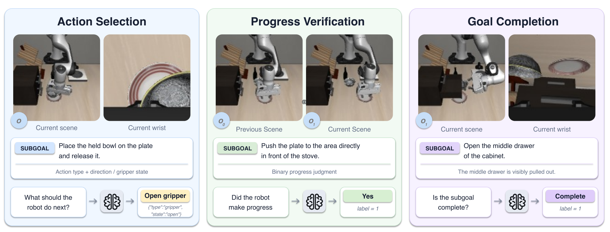
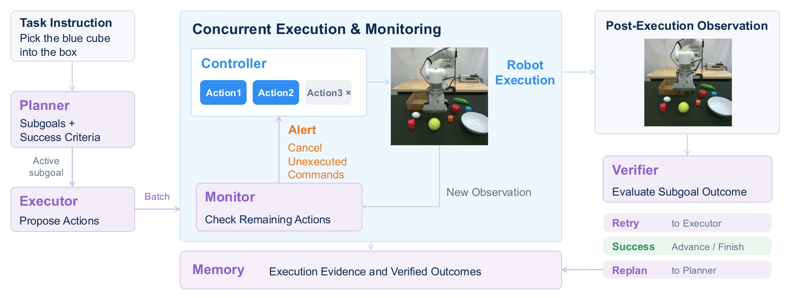
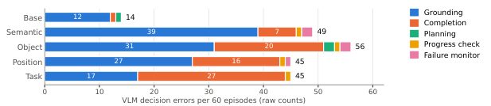

# MotorMind: 범용 Vision Language Model을 Zero-Shot 로봇 조작에 연결하는 실행 Harness

원제: *MotorMind: Scaffolding General Vision Language Models for Zero-Shot Robot Manipulation*
저자: Bingxuan Li, Siqi Song, Yizhuo Wu, Jiarui Yao, Tong Zhang, Huan Zhang (UIUC).

> 번역 범위: arXiv v1의 Abstract와 본문 1–7절을 절 구조에 맞추어 상세 기술 번역하고, 주요 수식·실험표·그림 설명을 보존했습니다. 문장을 일부 통합했으며 완전한 문장별 대역본은 아닙니다. 긴 baseline 표는 핵심 행을 발췌했고, 부록 A–G는 구현·평가에 필요한 내용을 선택 번역했습니다. 전체 prompt, 개별 task 목록, 나머지 표는 생략했습니다. 원문은 CC BY 4.0이며 이 문서는 한국어 번역·표 재구성이라는 변경을 포함합니다. 결과는 저자 보고값이며 자체 재현 실험이 아닙니다.

## Abstract

Vision-language-action(VLA) 모델은 로봇 조작을 발전시켰지만 새로운 task와 환경에서의 zero-shot 일반화는 여전히 제한적입니다. 전문적인 로봇 학습에 의존하기 때문에 빠르게 발전하는 범용 vision-language model(VLM)의 역량을 직접 활용하기도 어렵습니다. 한편 agentic robot system은 VLM으로 high-level reasoning을 수행하거나 coding agent로 로봇을 제어하지만, 대개 많은 외부 모델과 도구에 의존해 복잡성과 비용이 증가합니다.

이 연구의 질문은 다음과 같습니다. 학습된 action expert, coding agent, SAM3 같은 grounding 도구 없이, 범용 VLM 자체가 관측을 해석하고 action을 명령하며 execution feedback에 지속적으로 적응하는 인간 teleoperator처럼 로봇을 운용할 수 있을까요?

MotorMind는 VLM이 제안한 mid-level action을 deterministic robot control 및 feedback에 연결하고 asynchronous monitoring과 background memory update를 결합한 robot manipulation harness입니다. task-specific policy training, coding agent, 추가 grounding tool 없이 LIBERO-PRO base suite에서 66.7%, perturbation에서 53.8%의 성공률을 얻었습니다. 비교한 기존 zero-shot 방법의 최고치는 각각 13.3%, 19.2%였습니다. 동일한 interface는 실제 xArm6에서 직접 조작과 인간 교란을 합쳐 평균 95%의 성공률을 보였습니다. 더 강한 VLM으로 backbone을 교체하면 성능이 개선되며, 남은 실패는 주로 visual grounding, embodied reasoning, action knowledge에 관련됩니다. 적절한 mid-level action representation과 asynchronous execution harness가 있다면 범용 VLM으로도 효과적인 zero-shot manipulation을 수행할 수 있다는 결과입니다.

**그림 1 번역:** VLM은 “앞으로 12.20mm 이동”과 같은 mid-level action을 제안합니다. control layer가 이를 물리 실행과 feedback에 연결합니다. asynchronous monitoring은 미실행 action을 중단할 수 있고 outcome verification은 복구·재계획을 유도합니다. task-specific training 없이 simulation과 real-world를 지원하는 설계입니다.

## 1. Introduction — 서론

VLA는 이미지와 언어 지시를 robot action으로 직접 매핑하는 유망한 robotics foundation model입니다. 그러나 object appearance, spatial configuration, task semantics, environment structure가 바뀌면 zero-shot transfer가 제한됩니다. 미지 환경에서 높은 성능을 얻으려면 robot-action data를 추가하거나 policy를 적응시키는 경우가 많습니다. 전문 로봇 dataset으로 학습한 모델은 최신 범용 VLM의 intelligence를 그대로 받아들이지도 못합니다.

다른 방향인 agentic robotics는 범용 VLM이 planning과 reasoning을 담당하고 외부 component가 perception, grounding, action generation, motion planning, execution을 수행합니다. 모든 단계를 end-to-end로 학습할 필요는 없어지지만 learned action expert, segmentation model, skill library, motion planner, iterative execution module을 함께 운영해야 합니다. 범용 VLM의 공간 이해와 embodied reasoning이 개선되어도 robot system이 더 단순해지는 것은 아닙니다.

저자들은 manipulation 중 필요한 세 가지 local decision을 평가합니다. 다음 action 선택, subgoal 진행 여부 평가, subgoal 완료 판정입니다. 모든 평가 모델에서 action selection이 나머지 판단보다 부정확했고 progress·completion 판단도 완벽하지 않았습니다. 이 진단은 local decision의 한계를 보여 줄 뿐, 특정 control abstraction이 오류의 원인임을 증명하지는 않습니다.

MotorMind는 두 원칙을 채택합니다. 첫째, parameterized translation·rotation·gripper operation으로 이루어진 compact mid-level action을 VLM에 노출하고 embodiment-specific controller가 실제 동작으로 변환합니다. 둘째, background monitoring이 실행 중 최신 관측을 점검하고 다음 action boundary에서 pending command 취소를 요청할 수 있게 합니다. action proposal → execution → outcome assessment는 순차적 decision loop이며 memory summary만 background에서 생성됩니다. 따라서 모든 monitoring call을 기다리지 않고도 무효해진 continuation을 재검토할 수 있습니다.

동일한 reasoning/action interface가 simulation과 xArm6에서 사용됩니다. Qwen3.8-Flash-Next를 GPT-6 Sol로 바꾸면 LIBERO-PRO base 평균 성공률이 66.7%에서 83.3%로 개선되지만 더 느려집니다. 이는 specialized robot training뿐 아니라 범용 model capability와 control representation의 정렬이 중요한 발전 방향임을 시사합니다.

### 표 1의 핵심 비교

| 방법 계열 | action 생성 | 추가 학습·도구 | 실행 방식 |
|---|---|---|---|
| π0.5 / MolmoAct2 / OpenVLA-OFT / GR00T | learned action policy | trained action model 또는 decoder | action chunk / policy rollout |
| CaP-X | robot code 생성 | perception·control tool | program 실행 |
| VoLoAgent / Harness VLA | VLA + primitive | perception model / primitive library | tool orchestration / retry |
| MotorMind | 범용 VLM의 mid-level proposal | 별도 learned action model 없음 | sequential decision + asynchronous monitoring |

“외부 component 없음”은 별도의 learned perception/action model을 뜻합니다. 실제 robot SDK와 deterministic Controller까지 없다는 뜻은 아닙니다.

## 2. Diagnosing VLMs for Robotic Manipulation — 능력 진단

범용 VLM을 robot policy로 쓰려면 semantic reasoning과 embodiment-specific motion을 연결해야 합니다. 모델은 반복적으로 “다음에 무엇을 해야 하는가?”, “이전 action이 진전을 만들었는가?”, “현재 subgoal이 완료되었는가?”에 답해야 합니다.

240개 embodied QA question을 구성하며 각 능력에 80개를 배정합니다. action selection과 progress assessment는 과거·현재 observation을 이용하고 completion은 현재 observation과 criterion을 이용합니다. 이는 complete task의 closed-loop control 평가가 아니라 local visual decision 진단입니다.

**그림 2 번역:** 다음 action 선택, 실행 progress 평가, subgoal 완료 판정을 분리해 VLM 조작 능력을 측정합니다.

| 모델 | Action % | Progress % | Completion % | Overall % | 평균 latency ms |
|---|---:|---:|---:|---:|---:|
| Qwen3.8-Flash-Next-FP8 | 36.25 | 55.00 | 65.00 | 52.08 | 276 |
| HY-Embodied-0.5 MoT-2B | 20.00 | 50.00 | 47.50 | 39.17 | 402 |
| HY-Embodied-VLM-1.0 A3B | 18.75 | 43.75 | 50.00 | 37.50 | 592 |
| Cosmos3-Nano | 18.75 | 50.00 | 62.50 | 43.75 | 3035 |
| GLM-5.3-Flash | 37.50 | 52.50 | 58.75 | 49.58 | 403 |
| GPT-6 Astra | 60.00 | 76.25 | 82.50 | 72.92 | 8724 |

첫째, action selection accuracy는 18.75–60.00%로 모든 모델에서 가장 낮습니다. 다만 각 task의 answer space가 다르므로 내재적인 난이도를 동일 기준으로 비교한 수치로 읽어서는 안 됩니다. 결과는 짧고 수정 가능한 proposal의 필요성을 뒷받침합니다.

둘째, progress와 completion도 불완전하므로 model judgment와 측정한 robot feedback을 함께 사용해야 합니다. 반복 확인이 오류를 제거한다는 인과적 증명은 아닙니다.

셋째, GPT-6 Astra는 가장 정확하지만 query당 8.724초로 Qwen의 0.276초보다 느립니다. backbone 선택에는 decision quality와 feedback frequency를 함께 고려해야 합니다. 이 진단의 GPT-6 Astra와 후속 closed-loop backbone 실험의 GPT-6 Sol은 원문에 서로 다르게 기재되어 있으므로 동일 모델로 합치지 않습니다.

## 3. MotorMind: VLM Harness for Zero-Shot Robotic Manipulation

빠른 Qwen3.8-Flash-Next를 기본 backbone으로 사용하고 short-horizon action을 계속 수정하며 progress와 outcome을 반복 확인합니다. frozen VLM은 measured feedback을 받으며, motion decision은 순차적으로, monitoring과 memory update는 비동기적으로 실행됩니다.

### 3.1. Task Formulation

자연어 instruction $\ell$이 요구하는 물리 결과를 만족하는 action sequence를 생성합니다. cycle $t$의 observation은

$$o_t=(\mathcal I_t,r_t)$$

이며 $\mathcal I_t$는 사용 가능한 camera image, $r_t$는 tool pose와 gripper state를 포함한 measured robot state입니다. Planner는 ordered subgoal sequence

$$\mathcal G=(g_1,\ldots,g_M)$$

를 구성합니다. 각 subgoal에는 intended state change, target description, success criterion이 포함됩니다. 물체를 집는 단계는 실제로 잡고 있다는 evidence가 필요하고 운반 단계는 목적지 도달과 grasp 유지가 모두 필요합니다. 실행 중 초기 plan이 무효해질 수 있으므로 만족한 task requirement를 추적하고 미완료 subgoal을 수정합니다.

### 3.2. Mid-level Action Representation

VLM은 joint command를 생성하지 않고 robot base frame의 parameterized action을 제안합니다. Executor의 구조화된 proposal은 현재 subgoal 평가, completion signal, 선택적인 action batch, expected outcome을 포함합니다.

$$\mathcal A_t=(a_{t,1},\ldots,a_{t,K_t}),\qquad a_{t,k}=(\tau_{t,k},\boldsymbol\eta_{t,k})$$

$\tau$는 action type, $\boldsymbol\eta$는 parameter입니다. `move`는 방향/axis와 거리, `rotate`는 방향/axis와 각도, `gripper`는 open/close 및 선택적인 width를 명시합니다. VLM이 action과 magnitude를 정하고 Controller가 embodiment-specific motion으로 변환합니다.

Controller는 command를 검증하고 Cartesian motion으로 변환하며 실제 수행 결과를 기록합니다. 다음 proposal에는 fresh observation, measured feedback, recent execution history가 제공됩니다. **의도한 움직임을 실제 달성한 움직임으로 취급하지 않습니다.** completion signal은 outcome assessment 요청일 뿐 성공 증명이 아닙니다.

### 3.3. Architecture Overview

**그림 3 번역:** Planner가 subgoal과 criterion을 만들고 Executor가 짧은 action batch를 제안하면 Controller가 실제 motion으로 변환합니다. 실행 중 Monitor는 최신 관측을 평가하고 action boundary에서 중단을 요청해 pending command를 취소할 수 있습니다. outcome assessment는 advance, retry, replan을 선택합니다. Memory는 execution evidence와 평가 결과를 background에서 요약합니다.

동일한 범용 VLM이 서로 다른 context와 authority를 가진 다섯 역할을 맡습니다.

- **Planner:** instruction을 subgoal로 분해하고 unfinished plan을 수정합니다.
- **Executor:** current image, measured state, recent cycle history를 보고 active subgoal을 전진시키는 짧은 batch를 만듭니다.
- **Monitor:** wrong target, object drop, scene change를 감지합니다. 출력은 alert이며 replacement action이 아닙니다.
- **Verifier:** observation과 robot-state evidence로 success criterion을 확인합니다. grasp loss·release 같은 직접 측정 결과가 model verdict 전에 attempt를 판정할 수 있습니다.
- **Memory:** execution evidence와 assessed outcome을 compact note로 압축합니다. Planner·Verifier의 장기 문맥과 Executor의 local recent history는 구별됩니다.

### 3.4. Asynchronous Scheduling

**순차 backbone:** observe → 필요한 target localization → Executor context 구성 → proposal → batch execution은 sequential입니다. 다음 decision은 직전 batch의 measured outcome에 의존합니다. verification과 replanning도 trigger evidence 뒤에 수행됩니다. 전체 policy를 병렬로 실행하는 구조가 아닙니다.

**Concurrent monitoring:** Monitor는 subgoal attempt 동안 background thread에서 periodic observation 및 motion 후 observation을 평가합니다. informational alert는 evidence로 기록되고 STOP alert는 batch cancellation을 요청합니다. 실제 중단은 다음 action boundary에서 일어나며 pending command는 폐기됩니다. Monitor는 corrective motion을 선택하지 않습니다.

**Verification/recovery:** interruption 여부와 무관하게 fresh observation, measured state, alert로 outcome을 평가합니다. interruption 자체는 성공·실패 판정이 아닙니다. criterion을 만족하면 advance, 아니면 retry 또는 unresolved requirement를 Planner에 돌려보냅니다. 종료한 attempt의 monitoring은 in-flight model call을 기다리지 않고 멈추며 뒤늦은 응답을 폐기합니다. 다음 attempt에 stale alert가 적용되지 않게 합니다.

**Non-blocking memory:** outcome assessment 후 background writer에 summary를 요청하고 다음 subgoal은 이를 기다리지 않고 시작합니다. planning과 verification은 최신 완료 note를 읽습니다. pending request는 통합되어 마지막 accepted summary 이후의 evidence를 반영합니다.

## 4. Experiments — 실험

### 4.1. Main Experiment

LIBERO-PRO Goal, Spatial, Object suite의 unperturbed task와 Semantic·Object·Position·Task perturbation을 평가합니다. baseline은 π0.5, MolmoAct2, OpenVLA/OFT, GR00T N1.5 및 CaP-X, Harness VLA, VoLoAgent입니다. grouping은 **underlying action policy가 task-specific fine-tuning을 받았는가**로 정합니다. agent의 test-time interaction만으로 fine-tuned group에 넣지 않습니다. MotorMind는 LIBERO demonstration이나 task-specific policy fine-tuning을 사용하지 않습니다.

primary metric은 SR과 mean episode wall time입니다. 보조 metric은

$$\mathrm{TimeScore}=\frac{60s}{\bar T}$$

이며 $s$는 0–100 scale의 success percentage, $\bar T$는 같은 evaluation subset의 평균 episode seconds입니다. 단위는 pp/min입니다. 비용이나 compute 사용량의 지표가 아니며 빠르게 실패하는 episode가 효율적인 조작을 의미하지 않으므로 SR·wall time과 함께 해석합니다.

| 방법 / configuration | Base SR % | Perturbation SR % | Base time s | Perturbation time s |
|---|---:|---:|---:|---:|
| π0.5 fine-tuned | 98.3 | 63.3 | 5.9 | 6.8 |
| MolmoAct2 fine-tuned | 100.0 | 62.9 | 6.6 | 7.7 |
| OpenVLA/OFT fine-tuned | 98.3 | 51.2 | 5.7 | 6.7 |
| GR00T N1.5 fine-tuned | 31.7 | 19.6 | 15.6 | 16.2 |
| VoLoAgent with FT VLA | 81.7 | 60.4 | 106.2 | 216.9 |
| Harness VLA S1 10 loops, FT policy | 80.0 | 65.4 | 1764.0 | 2184.1 |
| CaP-X zero-shot single pass | 3.3 | 5.8 | 68.5 | 72.4 |
| CaP-X zero-shot 10 loops | 13.3 | 19.2 | 346.4 | 320.4 |
| MotorMind Qwen | 66.7 | 53.8 | 223.4 | 248.5 |

MotorMind의 base Goal/Spatial/Object SR은 45.0/75.0/80.0%, perturbation Semantic/Object/Position/Task SR은 58.3/46.7/51.7/58.3%입니다. TimeScore는 base 17.91, perturbation 12.99 pp/min입니다. 직접 VLA의 zero-shot configuration은 대체로 매우 낮은 SR을 보입니다. **MotorMind가 fine-tuned policy의 base 성능이나 latency를 능가한다는 결론은 아닙니다.** 저자들은 perturbation에서 OpenVLA-OFT와 유사한 SR을 task-specific learning 없이 달성한 점을 강조합니다.

### 4.2. Adaptive Tasks Experiment

conveyor에서는 reasoning 중에도 object가 움직입니다. Dynamic Reasoning은 semantic/relational/temporal target를 찾아 조작하고, Scene Shift는 instruction을 유지하며 object·destination을 옮깁니다. Dynamic Manipulation은 움직이는 named object를 다루고, Prompt Shift는 physical trigger 후 instruction을 변경하되 robot·scene을 reset하지 않습니다.

| 방법 | Dynamic Reasoning (10 tasks) | Scene Shift (10) | Dynamic Manipulation (5) | Prompt Shift (5) |
|---|---:|---:|---:|---:|
| π0.5 | 0% | 70% | 0% | 20% |
| GR00T N1.5 | 0% | 10% | 0% | 0% |
| MolmoAct2 | 20% | 50% | 40% | 0% |
| CaP-X | 30% | 20% | 20% | 60% |
| MotorMind | 70% | 90% | 80% | 60% |

동일한 interface와 asynchronous inference process가 실행 중 변화에도 대응할 수 있음을 시사합니다. 부록은 이 소규모 study를 정밀한 정량 증거보다 stress test로 규정합니다.

## 5. Real Robot Deployment — 실제 로봇 배포

xArm6, RealSense D455 camera, standard xArm6 SDK로 tabletop task를 수행하며 task-specific demonstration이나 fine-tuning은 없습니다.

- **Direct Perception:** “파란 cube를 하얀 bowl에 넣어라”처럼 object와 destination을 직접 명시합니다.
- **Human Perturbation:** 같은 task 중 사람이 relevant object를 이동·대체합니다.
- **Semantic Understanding:** “음식”, “같은 색”, “가운데”처럼 category·attribute·relation으로 대상을 표현합니다.

object-destination pair당 Direct/Human setting에서 각각 10 trial, semantic task 4개에는 각각 5 trial을 사용하고 배치를 randomize합니다. blue cube, corn, battery를 bowl/box에 배치하는 Direct/Human 평가를 합친 SR은 95%입니다. Direct는 98%, Human은 92%; semantic task SR은 80/100/100/60%입니다. 이 95%에 semantic task를 섞지 않습니다.

qualitative case에서 gripper가 cube 대신 white bowl 위로 접근하자 Monitor가 mismatch를 표시합니다. Executor는 새 관측으로 cube를 다시 localize하고 grasp·box placement를 수행합니다. 물리 실행에서 observation-driven correction이 동작한 사례입니다.

## 6. Discussion — 논의 및 한계

**Backbone sensitivity:** GPT-6 Sol Medium Reasoning은 single-seed base sensitivity에서 Spatial/ Object/Goal SR을 80/100/70%로 높입니다. Qwen의 같은 sensitivity 값은 70/80/50%입니다. 평균은 83.3% 대 66.7%이지만 모든 suite에서 wall time이 늘며 Spatial은 370.4초 대 199.0초입니다. sensitivity의 suite별 Qwen 값과 main table의 suite별 값은 다른 보고 구성이므로 섞지 않습니다.

**Ablation:** replanning 제거 시 SR 36.7%, verifier 제거 시 60.0%, planner 제거 시 0.0%입니다. 더 짧은 wall time이 더 나은 execution을 뜻하지 않습니다. 특히 planner 제거는 TimeScore도 0입니다. 다만 비교 방법 간 차이는 backbone/tool/interface/schedule이 함께 바뀌므로 모든 이득을 asynchronous scheduling 하나에 귀속하는 것은 어렵습니다.

**Failure analysis:** malformed output 외 오류를 grounding, completion, planning, progress checking, failure monitoring으로 나눕니다. Semantic/Object/Position perturbation에서 grounding이 큰 비중이고, Task/Object perturbation에서는 premature completion도 중요합니다.

**그림 5 번역:** LIBERO-PRO setting별 VLM decision error를 분석합니다. 주요 병목은 inaccurate grounding과 false completion입니다. 원문의 그림 4 ablation과 일부 case/flow diagram은 HTML의 별도 다운로드 가능한 image로 제공되지 않아 원문 링크로 확인해야 합니다.

### 번역자 검토 메모 — 원문 내부 불일치

본문·부록 D.1은 Goal/Spatial/Object 세 family를 열거하지만 같은 부록의 matrix 계산은 네 family와 200 configuration을 적습니다. 이를 임의로 고치지 않았습니다. definitive rollout count는 실험 code/저자 확인이 필요합니다. 부록 prompt excerpt의 Motion Supervisor/Scene Monitor authority와 본문의 통합 Monitor STOP 역할도 세분화된 문맥이므로 동일한 하나의 prompt로 단순화하면 안 됩니다.

## 7. Conclusion — 결론

MotorMind는 하나의 frozen VLM을 다섯 역할로 사용하고 mid-level action representation으로 robot control과 연결합니다. sequential execution과 concurrent monitoring, background memory, explicit outcome verification을 조합합니다. LIBERO-PRO base 66.7%, perturbation 53.8%, 실제 xArm6 placement 95%를 보고하고 stronger backbone에서 base 평균 83.3%로 개선됩니다. 남은 주요 병목은 visual grounding과 premature task-completion claim입니다. 개선된 general-purpose VLM과 lightweight harness를 조합하는 complementary robotics 방향을 제시하지만 저속 tabletop evidence가 실도로·일반 조작 안전성을 보증하지는 않습니다.

## 부록 선택 번역 — 구현·평가 재현에 필요한 내용

### A. Related Work

robot foundation policy는 robot-action distribution coverage에 제한됩니다. coding agent는 online code revision의 latency와 offline fixed program의 적응성 사이 trade-off를 가집니다. VLM+VLA hierarchy는 high-level reasoning을 추가해도 physical capability가 learned action backend에 의존합니다. concurrent Show-Harness와는 scheduling, decision autonomy, motion magnitude 예측, proactive interruption이 다르며 직접 성능 비교는 제공하지 않습니다.

### B. Diagnostic Construction

LIBERO expert trajectory를 Codex가 private state, short future window, simulator predicate와 함께 검토해 temporal window와 local subgoal을 제안하고 human expert가 수정합니다. 평가 모델에는 supplied image·subgoal·criterion만 주어집니다. target relation의 left/right는 fixed external camera image를 뜻하고 action 방향의 left/right는 robot base frame입니다. moving wrist camera로 relation을 재정의하면 안 됩니다. rotation label은 $\Delta R=R_1R_0^{-1}$를 rotation vector로 바꾸어 정합니다. action label은 primitive type과 방향이며 거리·속도·완전한 실행 command가 아닙니다.

### C. Implementation

Executor input에는 tool pose, gripper opening/holding state, measured displacement, available clearance, recent refusals/outcomes가 있습니다. localization이 필요하면 VLM이 labeled image-space bounding box를 만들고 compatible fixed views를 triangulate하며 wrist view로 refine합니다. offset·uncertainty·view disagreement를 base-frame vocabulary로 전달합니다.

proposal field는 `assessment`, `done`, optional `command`, `expect`, `confidence`; command는 ordered `actions`입니다. core primitive 외 `wait`와 `home`을 지원합니다. translation은 mm, rotation은 degree이며 schema/conversion error는 실행 전 proposer에게 반환합니다. 모델에 external IK solver가 없다는 주장과 robot SDK 내부의 embodiment controller까지 제거한다는 주장은 다릅니다.

### D–E. Evaluation Protocol

published checkpoint는 evaluation 중 frozen입니다. “fine-tuned” label은 checkpoint가 이미 받은 task-specific adaptation을 뜻하며 이번 evaluation에서 추가 학습했다는 뜻이 아닙니다. baseline마다 supported image, proprioception, normalization, chunk execution schedule이 달라 동일 control frequency로 가정하면 안 됩니다.

dynamic environment는 model inference를 기다리는 동안에도 elapsed wall time에 맞춰 20Hz simulation stepping을 수행합니다. robot에는 zero-motion command가 전달되어 conveyor가 멈추지 않습니다. online suite budget은 600초입니다. intervention trigger, ground-truth identity, evaluator state는 privileged policy input으로 주지 않습니다. success는 agent의 done claim이 아니라 environment predicate로 평가합니다. 일부 stove task predicate는 stove on-before-placement만 검사하여 요구한 intermediate placement나 종료 시 on 유지까지 독립적으로 검증하지 않습니다.

### F–G. Additional Ablations / Error Analysis

execution budget 300/450/900/3600초의 평균 SR은 각각 66.7/66.7/50.0/60.0%로 단조 증가하지 않습니다. 더 오래 실행하는 것보다 fresh observation으로 계속할지 멈출지 판단하는 능력이 중요합니다. error-flow analysis는 failed episode에 마지막 unrecovered failure를 배정하며, `false done`은 model이 complete를 선언했지만 goal predicate가 false인 경우입니다.

## 참고 원문

- arXiv v1: https://arxiv.org/html/2609.38078v1
- Metadata/PDF: https://arxiv.org/abs/2609.38078 · https://arxiv.org/pdf/2609.38078
- Hugging Face: https://huggingface.co/papers/2609.38078
- Project: https://motor-mind.github.io
- License: https://creativecommons.org/licenses/by/4.0/
