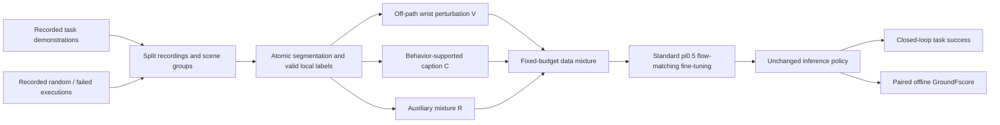

# PerturBot 분석: 성공률과 Evidence Use를 분리하기

## 한 문장 결론

성공 trajectory를 더 모으기만 하면 shortcut도 함께 강화될 수 있으므로 PerturBot은 **label-valid data intervention**과 **invariance + causal responsiveness 평가**를 함께 제시합니다.

## 문제 / 기여

expert의 successful demonstration에서는 target salience, noun-operation pairing, close-lift sequence가 실제 evidence와 일치합니다. behavior cloning은 정답 action을 맞히는지만 보므로 evidence와 shortcut을 식별할 필요가 없습니다.

- visual salience capture, lexical noun lock-in, motor inertia를 공통 data mechanism으로 설명합니다.
- V/C/R 세 intervention을 factorial ablation할 수 있습니다.
- 기존 π0.5 flow-matching loss와 inference architecture를 그대로 둡니다.
- GroundFscore는 irrelevant change에는 안정적이고 relevant change에는 responsive해야 높습니다.
- real robot PnP, RoboTwin Clean2Random, scaling·control·metric validity를 함께 검증합니다.

## Taxonomy / I/O / Language

worldbench taxonomy를 robotics에 유추하면 이 논문은 **numerical action-generating VLA의 training-time supervision/data intervention**입니다. independent slow planner가 action을 guidance하는 dual-system이나 설명-only VLM은 아닙니다. autonomous driving, NPU에 대한 직접 실험은 없습니다.

| 항목 | 내용 |
|---|---|
| Input | head + 2 wrist views, language instruction, dual-arm proprioception |
| Output | 양 arm/gripper의 action chunk; π0.5 normalized space, H=16 |
| Language role | operation/target/relations를 명확히 하는 training caption; deployment는 ordinary instruction |
| Grounding | actual segment behavior와 image/motor/action 동기화; 잘못된 action relabel 금지 |
| Training | full π0.5 fine-tuning, standard flow matching, validation-selected V/C/R rates |
| Inference | 기존 policy graph 유지; extra model/forward pass 없음 |

## Pipeline

information decomposition은 data-design rationale입니다. mutual information을 직접 loss로 최적화하거나 causal guarantee를 증명한 것은 아닙니다.

## Training Recipe / Dataset

real robot은 AgileX PiPER X dual-arm이며 head/wrist observation을 사용합니다. 총 recording은 PnP demo 1000, random 200, failed 200입니다. main demo budget은 500이고 auxiliary가 batch fraction을 대체합니다. 모든 derivative는 recording-level split에 남습니다. AdamW LR 2e-5, batch 256, BF16, H=16, image 224², inference Euler step 10, 8×A100 80GB와 run당 약 4일을 보고합니다. exact selected sampling probability는 확인한 표에서 absolute value를 제공하지 않아 임의로 채우지 않습니다.

## Benchmark / Metric / Evidence

| 평가 | 역할 | 핵심 보고값 |
|---|---|---|
| General PnP 50 restored case | real closed-loop SR | FT 42±14%, full 84±10% |
| 100 held-out observation edits | offline action response | full GF-V/L/A .62/.57/.53 |
| 50-trial SC/MI probe | shortcut failure | FT 68/82%, full 20/24% |
| RoboTwin 50 task | simulation closed-loop generality | C2R random 46.0 → 58.2% |
| 36 checkpoint validity | offline-online association | GF correlation .72, SR .31 |

GF는 open-loop **action intervention diagnostic**이지 open-loop planning ADE도 closed-loop SR도 아닙니다. null/causal paired expert delta가 필요하며 fixed sampling noise와 near-zero denominator 처리가 중요합니다.

## Strengths

- visually salient distractor를 피해도 instructed target를 못 찾는 modality-drop shortcut을 진단합니다.
- task-preserving edit의 label validity를 명시합니다.
- failed trajectory를 “실패를 따라 하라”가 아니라 실제 local behavior의 instruction으로 바꿉니다.
- data amount, optimizer updates, generic regularization을 control로 분리합니다.
- latency 개선이 아니라 inference overhead를 추가하지 않는 training 방법임을 분명히 합니다.

## Limitations / Safety

- R은 unrecorded recovery를 창조하지 않습니다. corrective continuation은 별도 data가 필요합니다.
- caption hallucination, image-edit geometry 변화, segment boundary crossing은 label을 무효화할 수 있습니다.
- metric은 expert paired rollout/annotation 품질에 의존합니다. offline scoring이 data acquisition까지 무료라는 뜻은 아닙니다.
- actual PnP는 operation 하나이므로 verb grounding probe는 RoboTwin에서 별도로 수행합니다.
- main table의 selected baselines보다 높은 부록 published results가 있어 absolute SOTA claim은 피합니다.
- evidence-use score는 formal safety certificate가 아닙니다. real-road scene·traffic interaction은 검증하지 않았습니다.
- source abstract는 GroundingFscore, full text는 GroundFscore로 명칭이 다릅니다.

## 찬호님 주제와의 연결 — 분석자 추론

AD에서도 familiar cue가 decision evidence를 대체할 수 있습니다. 예를 들어 늘 비어 있는 crosswalk background를 보고 pedestrian evidence를 무시하거나 route-command noun에 의존해 실제 signal을 놓칠 수 있습니다. 이는 논문의 vehicle 실험이 아니라 유추입니다. vehicle rollout label을 그대로 둔 visual edit는 occlusion, collision geometry, drivable area, actor behavior를 바꾸지 않아야 하고, relevant instruction/rule edit에는 새로운 valid trajectory target이 필요합니다.

MotorMind가 runtime feedback·verification을 다룬다면 PerturBot은 training distribution의 decision branch를 다룹니다. [[LatentInterfaceTraining]], [[VisionActionShortcut]], [[VisionLanguageModel]], [[AutonomousDrivingVLA]]와 함께 읽으면 representation, training data, runtime harness라는 세 intervention layer가 구분됩니다.

## 원문

https://arxiv.org/html/2610.04616v1 · https://huggingface.co/papers/2610.04616
