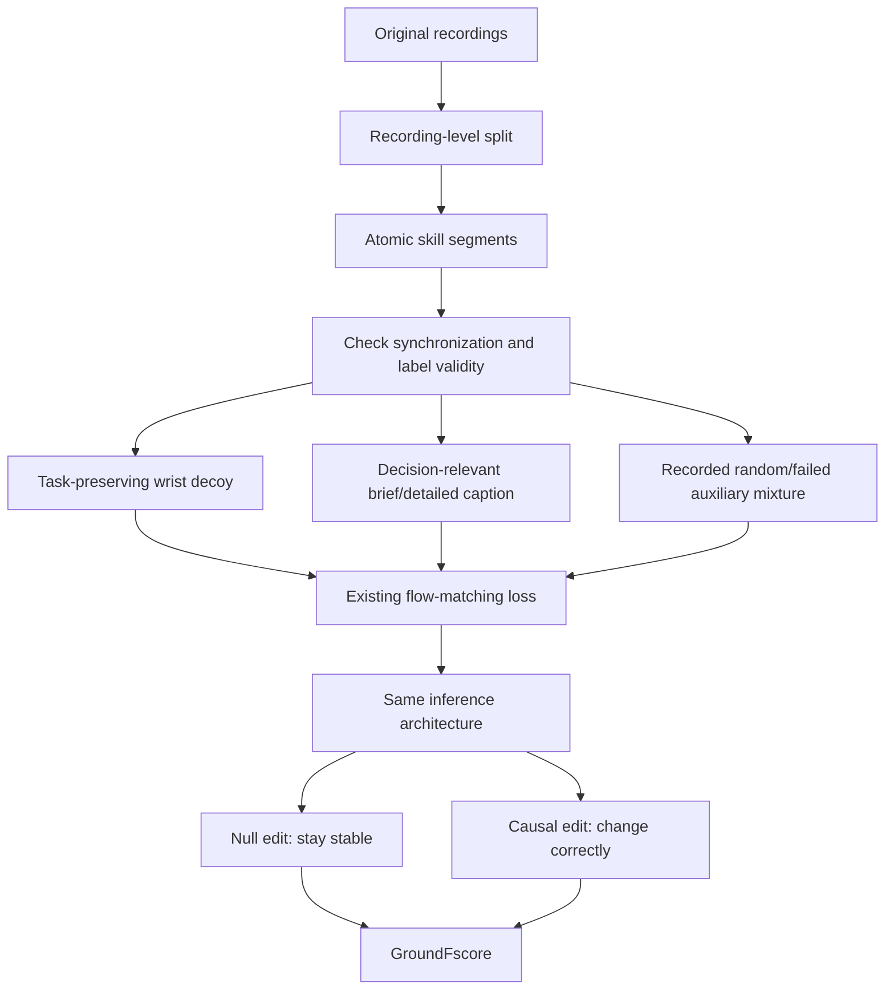

# PerturBot 핵심 기술 학습: Robustness와 Responsiveness를 함께 측정하기

## 선수지식과 목표

behavior cloning, conditional policy, data augmentation, flow matching의 기본 개념, normalized action chunk와 mutual information을 알고 시작하면 좋습니다. 핵심 목표는 **정답 action을 맞힌 것과 올바른 evidence를 사용한 것을 구분**하는 것입니다.

## 쉬운 예시

항상 blue mug만 집는 demo를 모으면 policy는 verb나 scene 관계를 읽지 않고 “mug이면 grasp”를 학습할 수 있습니다. 이제 “mug을 밀어라”라고 바꾸면 실패합니다. 이때 instruction text만 push로 바꾸고 grasp action을 그대로 label로 쓰면 오히려 잘못된 data가 됩니다. push를 가르치려면 실제 push가 기록되어 있어야 합니다.

마찬가지로 wrist camera에 항상 target만 크게 나오면 가까이 있는 다른 물체가 target이 될 수 있습니다. distractor를 넣되 target/grasp path를 보존하면 같은 action label로 shortcut과 task evidence를 구분할 기회를 만들 수 있습니다. grasp path 위 distractor는 collision geometry를 바꿔 같은 label이 더 이상 유효하지 않습니다.

## Glossary

| 용어 | 의미 |
|---|---|
| salience capture | 가까이·크게 보이는 물체가 instruction target를 대체하는 오류 |
| noun lock-in | object name과 familiar operation을 고정 결합하는 오류 |
| motor inertia | 실제 outcome과 무관하게 familiar motion sequence를 이어가는 오류 |
| null edit | correct action을 바꾸면 안 되는 input 변화 |
| causal edit | correct action이 알려진 방향으로 달라져야 하는 변화 |
| paired noise | 두 policy call에 같은 sampling noise를 써 input effect만 비교 |
| label validity | edited observation/instruction이 recorded action과 물리적으로 양립하는 조건 |
| GroundFscore | stability와 task-relevant sensitivity를 함께 요구하는 offline 진단 |

## Architecture / Data Flow

## Step-by-step Training

1. **먼저 split:** 같은 trajectory의 adjacent frame이나 edited derivative가 train/test 양쪽에 있으면 evidence-use 평가가 leakage됩니다.
2. **segment와 label:** local instruction은 실제 행동을 설명해야 합니다. failed task의 original goal을 local behavior label로 그대로 쓰지 않습니다.
3. **V 검증:** off-path, no target occlusion, unchanged contact/collision condition을 확인합니다.
4. **C 검증:** visible object attribute와 recorded operation만 넣습니다. 긴 문장 자체가 목적이 아닙니다.
5. **R sampling:** auxiliary가 batch 일부를 대체합니다. data source style을 label로 누설하지 않고 optimizer budget을 맞춥니다.
6. **기존 loss 유지:** $Q=(1-\rho)D_{demo}+\rho D_{extra}$에서 action loss를 학습합니다. 별도 GF loss나 mutual-information regularizer를 도입한 논문이 아닙니다.
7. **독립 평가:** SR, SC/MI online probe, offline GF를 모두 봅니다.

## Information Decomposition의 직관

$I(d;e\mid s)$는 shortcut을 이미 안 뒤 evidence가 decision에 얼마나 추가 정보를 주는지입니다. expert demo에서 shortcut만으로 정답이 정해지면 추가 정보가 거의 0입니다. V는 shortcut과 decision의 중복을 줄이고 C는 evidence를 읽기 쉽게 만들며 R은 실제 다른 decision branch를 기록합니다.

$H(d)\approx0$이면 evidence를 아무리 설명해도 관측한 decision은 하나뿐입니다. **설명만으로 없던 recovery branch가 생기지 않습니다.** 정보론 식은 data-design motivation이며 model이 이를 실제 사용한다는 보증은 아닙니다.

## GroundFscore를 구현할 때

원문 정의는 normalized action space의 full chunk입니다.

$$R=\mathbb E\left[\frac{\|\pi(e_0(o))-\pi(o)\|}{\|a^*\|}\right],\quad S=\mathbb E\left[\frac{\langle\pi(e_1(o))-\pi(o),\Delta a^*\rangle}{\|\Delta a^*\|^2}\right]$$

$$GF=\frac{2S(1-R)}{S+1-R}$$

R/S를 [0,1]로 clip합니다. paired pass의 noise를 공유하고 reference norm floor, near-zero causal delta exclusion을 적용합니다. base/edited action의 timestep·normalization·joint ordering이 달라지면 수치가 잘못됩니다. zero denominator의 GF는 explicit fallback으로 처리하고 invalid probe count도 보고해야 합니다.

**교육용 가정:** 입력을 무시하는 policy는 irrelevant edit에도 action이 같아 stability가 높지만 relevant edit에도 action이 같아 S=0입니다. 따라서 GF=0입니다. 반대로 모든 변화에 크게 움직이는 policy는 S만 높을 수 있어도 R이 높아 GF가 낮습니다. 원하는 것은 무조건 안정적인 policy도 무조건 responsive한 policy도 아니라 **task relevance에 따라 선택적으로 반응하는 policy**입니다.

## Implementation / Deployment Checklist

- [ ] full recording/scene split을 먼저 수행했는가?
- [ ] augmentation이 geometry, occlusion, collision constraint를 바꾸지 않는가?
- [ ] action chunk가 atomic segment boundary 안에 있는가?
- [ ] caption의 hand state, verb, object identity가 image/action에 근거하는가?
- [ ] failed/random data가 original goal 성공으로 mislabeled되지 않았는가?
- [ ] GF probe의 causal expert delta가 valid인가?
- [ ] paired flow noise와 action normalization이 같은가?
- [ ] SR과 GF를 모두 기록하고 confidence interval/seed를 분리했는가?
- [ ] training cost와 unchanged inference cost를 구분했는가?
- [ ] recovery/safety claim이 실제 recorded continuation/rollout로 입증되는가?

## Study Questions와 답

**Q1. wrist camera를 없애면 distractor에 강해지는데 좋은가요?** 그것만으로는 아닙니다. paper에서 SC는 낮아지지만 instructed target selection과 SR도 악화됩니다. 필요한 evidence까지 제거한 것입니다.

**Q2. failed trajectory를 학습하면 failure를 그대로 따라 하나요?** local behavior에 맞는 instruction으로 relabel하면 그 behavior의 conditional mapping을 학습합니다. original goal의 failed action을 성공 label로 붙이면 안 됩니다.

**Q3. caption을 “pick”에서 “push”로 바꾸면 verb 다양성이 늘지 않나요?** 실제 action이 grasp면 supervision이 모순됩니다. 새로운 valid behavior는 기록해야 합니다.

**Q4. GF가 높으면 안전한가요?** 아닙니다. paired probe의 response quality 진단입니다. physical safety와 long-horizon competence는 closed-loop 평가가 필요합니다.

**Q5. AD에서는 null edit를 어떻게 만들까요?** 분석자 유추로 off-route background texture처럼 valid trajectory를 바꾸지 않는 edit부터 시작할 수 있습니다. actor/occlusion/collision geometry를 바꾸면 기존 trajectory label 보존은 대개 정당화되지 않으므로 expert/simulator verification이 필요합니다.

## Reading Roadmap

Shortcut Learning → Causal Confusion / Copycat → π0.5 → PerturBot 3절 → metric validity → LIT 비교 순서로 읽습니다. LIT는 latent interface, PerturBot은 data/measurement, MotorMind는 runtime harness를 바꾼다는 차이를 표로 정리해 보세요.

## 출처

https://arxiv.org/html/2610.04616v1 · https://github.com/aim-uofa/PerturBot · https://github.com/worldbench/awesome-vla-for-ad
