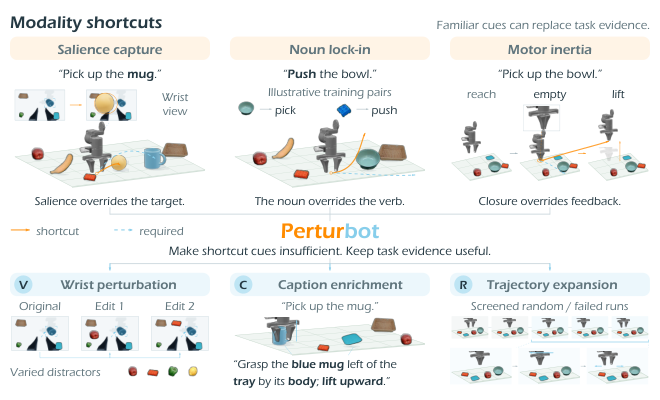
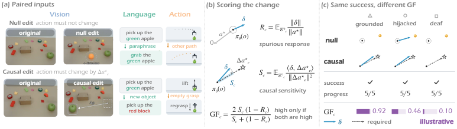
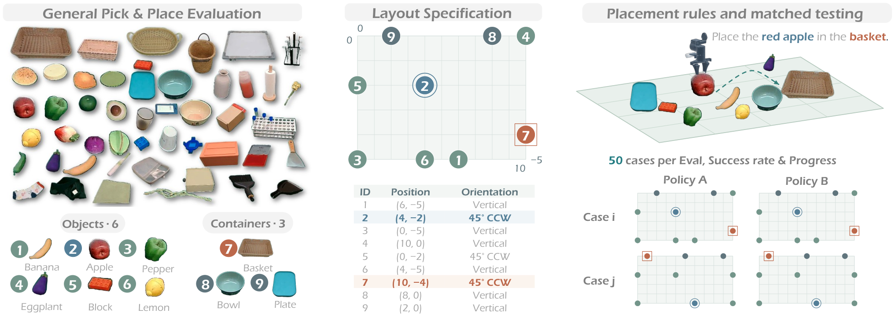
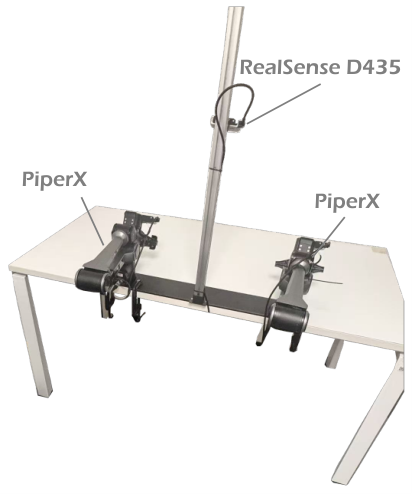

# PerturBot: Perturbative Training으로 VLA의 Shortcut Prior 깨뜨리기

원제: *PerturBot: Breaking Shortcut Priors in Vision-Language-Action Models with Perturbative Training*
저자: Mingyu Liu, Chonghao Sima, Tianjian Feng, Hanqing Wang, Cong Chen, Hao Chen, Chunhua Shen.

> 번역 범위: arXiv v1의 Abstract, Introduction, Method, Experiments, Ablations, Limitations, Conclusion을 절 구조에 맞추어 상세 기술 번역했습니다. 주요 수식과 핵심 표를 재구성했으며 전체 문장별 대역본은 아닙니다. 부록은 data construction·training·evaluation 관련 부분을 선택 번역했고 전체 annotation prompt와 큰 leaderboard/추가 표는 축약했습니다. 원문 CC BY 4.0에 따른 한국어 번역·재구성입니다. 모든 실험값은 저자 보고이며 자체 재현하지 않았습니다. HF abstract의 `GroundingFscore`와 full-text의 `GroundFscore` 표기가 다르므로 이 문서에서는 full-text 표기를 사용합니다.

## Abstract

Vision-language-action(VLA) policy는 복잡한 task를 성공하면서도 action을 결정해야 하는 evidence를 무시할 수 있습니다. wrist camera 가까이 놓인 object가 instruction의 target을 밀어내고, familiar noun이 verb가 바뀌어도 학습 때 결합된 operation을 유발하며, 아무것도 잡지 않은 gripper가 닫힌 뒤 그대로 lift할 수 있습니다.

저자들은 이를 **modality shortcut**이라고 부릅니다. successful demonstration의 regularity 때문에 visual·lexical·motor cue만으로 expert action을 예측할 수 있어, 실제 decision에 필요한 task evidence가 불필요해지는 현상입니다. 같은 종류의 demonstration을 더 늘리면 task success는 높아져도 shortcut은 남을 수 있습니다.

PerturBot은 task-relevant evidence를 쓰기 쉽게 만들고 shortcut만으로는 충분하지 않게 만드는 training 방법입니다. task를 보존하는 wrist-view perturbation, decision-relevant caption enrichment, 실제 behavior에 맞게 relabel한 random/failed trajectory segment를 사용합니다. 단순히 더 많은 데이터를 넣는 대신 **무엇을 scaling할지**를 바꾸며 inference는 변경하지 않습니다.

또한 offline metric GroundFscore로 policy의 modality shortcut 의존도를 진단합니다. task SR은 성능 향상 여부를, GroundFscore는 evidence에 의존하는 방향으로 건강하게 scaling하는지를 보여 줍니다. 두 방법은 task evidence에 대한 responsiveness를 유지하면서 shortcut prior에서 VLA decision을 분리하기 위한 training-and-evaluation framework입니다.

## 1. Introduction — 서론

VLA는 복잡한 manipulation을 수행하지만 단순한 view 변화에도 task에서 벗어납니다. wrist view의 object가 지정 target을 대체하고, “bowl을 집어라”를 “bowl을 밀어라”로 바꾸어도 grasp하며, 빈 grasp 후에도 lift합니다. 성공률만으로는 scene·instruction·observed outcome을 읽었는지 familiar cue를 보고 action을 재생했는지 구분할 수 없습니다.

modality shortcut은 중요하지 않은 input이 아니라 decision evidence를 대신하는 **쉽게 decode 가능한 cue**입니다. expert가 target에 접근하면 target이 wrist view를 지배하고, 특정 object name은 하나의 operation과만 등장하며, gripper closure 뒤에는 항상 lift가 이어집니다. behavior cloning은 예측 action과 demonstrated action의 일치를 보상할 뿐 어떤 evidence로 이를 예측했는지는 제한하지 않습니다. 이는 shortcut learning과 imitation learning의 causal confusion에 연결됩니다.

동일 correlation을 유지한 새 trajectory에서는 shortcut rule과 intended rule이 같은 action을 내므로 더 많은 데이터로 둘을 식별할 수 없습니다. 익숙한 분포의 성공률은 오르지만 target selection, instruction following, outcome assessment가 더 견고해졌다는 뜻은 아닙니다.

해결하려면 modality를 약화시키는 대신 training data가 요구하는 decision을 바꿔야 합니다. distractor는 target·valid action을 바꾸지 않고, caption은 recorded behavior가 뒷받침하는 attribute·relation·operation만 추가하며, failed/random segment는 실제 포함된 local behavior로 relabel합니다. relabeling은 기록되지 않은 corrective continuation을 만들지 않으므로 recovery skill을 생성하는 방법이 아닙니다.

GroundFscore는 action이 같아야 하는 edit와 바뀌어야 하는 edit를 짝지어 모두 잘 처리해야 높은 점수를 줍니다. vision을 완전히 무시하는 것만으로 distractor robustness를 얻는 편법을 막습니다. rollout 없이 checkpoint마다 측정할 수 있습니다. π0.5에서 세 component의 모든 조합을 실제 General PnP 50 case와 RoboTwin 2.0의 broader skill로 평가합니다.

**그림 1 번역:** 위쪽은 visual·lexical·motor cue가 task evidence를 대체하는 개념적 예입니다. 실선은 shortcut choice, 점선은 필요한 대안입니다. 아래쪽은 task-preserving wrist perturbation(V), behavior-supported caption(C), screened/relabelled segment(R)입니다. local behavior를 relabel했다는 것만으로 recovery를 보였다고 해석하면 안 됩니다.

## 2. Related Work — 관련 연구

**VLA scaling:** VLA는 observation/instruction을 action으로 바꾸며 pretrained VLM과 large robot demonstration dataset을 활용합니다. dataset 규모·diversity·composition과 perturbation benchmark가 발전했지만 SR만으로 shortcut reliance를 식별하지는 못합니다. 기존 task-preserving perturbation sensitivity와 달리 GroundFscore는 relevant evidence 변화에 action이 바뀌는지도 요구합니다.

**Shortcut learning:** dataset bias, simplicity bias, VQA language prior, causal confusion/copycat agent는 expert action 일치가 올바른 evidence 사용을 뜻하지 않음을 보여 줍니다. 기존 VLA 연구는 language underuse, vision override, modality regularization을 다루지만 이 논문은 세 shortcut을 decision type에 연결하고 successful demonstration의 regularity라는 공통 원인을 설명합니다.

**Data intervention:** augmentation, domain randomization, counterfactual editing, instruction enrichment, corrective/unstructured data는 대개 한 축의 variation을 다룹니다. PerturBot은 특정 decision에서 evidence를 대신하는 cue를 표적으로 삼고 action label validity와 unchanged inference를 보존합니다.

## 3. Method — 방법

### 3.1. Modeling Modality Shortcuts

세 실패는 manipulation의 서로 다른 decision에 대응합니다.

| Shortcut | 질문 | shortcut cue | 필요한 evidence |
|---|---|---|---|
| salience capture | 무엇을 조작할까? | wrist view 가까이의 salient object | instruction target와 scene relation |
| noun lock-in | 어떤 operation을 적용할까? | 특정 noun에 결합된 operation | 실제 verb와 task semantics |
| motor inertia | 다음에 어떻게 움직일까? | close → lift 관성적 sequence | grasp 성공/실패에 대한 visual feedback |

policy $\pi_\theta(a\mid v,\ell,q)$는 camera observation $v$, instruction $\ell$, proprioception/past action 등 motor context $q$를 action 또는 chunk $a$에 매핑합니다. decision $d$, shortcut $s$, evidence $e$를 놓으면 Bayes rule은

$$p(d\mid s,e)=p(d\mid s)\frac{p(e\mid d,s)}{p(e\mid s)}$$

이며 expectation은 다음처럼 분해됩니다.

$$\mathbb E\left[\log\frac{p(d\mid s,e)}{p(d\mid s)}\right]=I(d;e\mid s)=I(d;e)-\mathcal R$$

$$\mathcal R=I(d;s)+I(d;e)-I(d;(s,e))$$

여기서 $I$는 mutual information, $\mathcal R$은 shortcut이 복제한 decision information의 redundancy입니다. 원문이 고려하는 redundant regime에서는 nonnegative이지만 모든 확률분포에 대한 일반적 nonnegative 보장은 아닙니다.

successful demonstration에서 $I(d;e\mid s)$가 거의 사라지는 원인은 둘입니다. **Collinearity:** expert가 target으로 가므로 wrist salience와 target이 항상 일치하고 noun과 verb도 함께 등장합니다. **Degeneracy:** gripper를 닫은 뒤 lift만 기록되어 $H(d)\approx0$인 상태입니다. 같은 유형의 demonstration을 늘려도 이 구조가 유지됩니다.

따라서 off-path decoy로 redundancy $\mathcal R$을 낮추거나 decision-relevant caption으로 evidence term $I(d;e)$를 높입니다. 그러나 degeneracy에서는 $I(d;e)\le H(d)$이므로 빈 grasp 후 reopening 같은 missing branch를 실제로 기록해야 합니다. 이는 data-design 목표이지 별도 training loss나 learned evidence use에 대한 보장은 아닙니다.

### 3.2. PerturBot의 세 Data Component

**V — Task-preserving wrist-view perturbation.** wrist image에 plausible distractor를 넣되 grasp path 밖에 두고 target을 가리거나 contact geometry를 바꾸지 않습니다. task, motor context, recorded action은 유효하게 유지합니다. target, collision constraint, required grasp가 달라질 edit는 기존 label을 붙이지 않고 폐기합니다. distractor 자체가 task cue가 되지 않게 identity·placement를 변화시킵니다. noise, masking, camera removal은 control일 뿐 대체 방법이 아닙니다.

**C — Decision-relevant caption enrichment.** observation과 action은 그대로 두고 VLM이 recording을 grasp/lift/move/put-down 같은 atomic skill로 나눕니다. acting hand, open/closed state, operation, 구별에 필요한 object attribute, position, initial state, grasp point를 설명합니다. “mug을 집어라”의 grasp는 “왼손이 닫혀 tray 왼쪽의 세워진 blue mug 몸통을 잡는다”가 됩니다. 목표는 긴 문장이 아니라 decision-relevant detail입니다. grasp를 push라고 바꾸면 push demonstration이 생기는 것이 아닙니다. demo와 auxiliary source 모두 brief/detailed caption을 같은 규칙으로 섞어 caption style이 source를 누설하지 않게 합니다. deployment에서는 일반 instruction을 받습니다.

**R — Caption-grounded trajectory expansion.** random motion과 failed execution recording을 synchronized image, motor context, action을 가진 segment로 분해합니다. unusable segment는 버리고 실제 수행한 behavior의 brief/detailed instruction을 붙입니다. bowl grasp 실패 trajectory의 “빈 gripper를 왼쪽으로 이동하며 열기”는 유효한 local label이지만 original task 성공이나 향후 failure의 label은 아닙니다. language-conditioned state-action coverage를 늘릴 뿐 original goal 아래 recovery를 가르치려면 실제 corrective continuation이 필요합니다.

모든 component는 backbone의 기존 action loss를 유지합니다. π0.5에서는 flow matching입니다.

$$Q=(1-\rho)\mathcal D_{demo}+\rho\mathcal D_{extra}$$

$$\mathcal L(\theta)=\mathbb E_{(v,\ell,q,a)\sim Q}[\mathcal L_{act}(\pi_\theta;\tilde v,\tilde\ell,q,a)]$$

$\tilde v$는 original/perturbed image, $\tilde\ell$은 같은 behavior의 brief/detailed instruction입니다. augmentation과 caption sampling의 expectation을 포함합니다. V/C/R을 끄는 것은 각각 visual perturbation, detailed caption, auxiliary mixing을 끄는 것입니다. R 없이 C를 쓰거나 C 없이 R을 써도 valid brief label을 유지합니다. rate는 validation으로 선택해 run 안에서 고정합니다. component와 shortcut family는 일대일로 한정되지 않으므로 모든 configuration을 세 family 모두에서 평가합니다.

### 3.3. GroundFscore — Offline Evidence-use 진단

family $c\in\{c_V,c_L,c_A\}$마다 **null edit** $e\in\mathcal E^0_c$는 input을 바꾸되 correct action은 유지하고 **causal edit** $e\in\mathcal E^1_c$는 알려진 $\Delta a_e^*$만큼 correct action을 바꿉니다.

$$R_c=\mathbb E_{o,e\sim\mathcal E^0_c}\left[\frac{\|\pi_\theta(e(o))-\pi_\theta(o)\|}{\|a^*\|}\right]$$

$$S_c=\mathbb E_{o,e\sim\mathcal E^1_c}\left[\frac{\langle\pi_\theta(e(o))-\pi_\theta(o),\Delta a_e^*\rangle}{\|\Delta a_e^*\|^2}\right]$$

$R_c$는 변하면 안 될 때 변하는 spurious response, $S_c$는 요구된 변화 방향을 얼마나 실현했는지 나타내는 causal sensitivity입니다. 둘을 [0,1]로 clip하고

$$GF_c=\frac{2S_c(1-R_c)}{S_c+(1-R_c)}$$

로 결합합니다. precision-like term은 $1-R$, recall-like term은 $S$입니다. input을 무시하는 policy는 $R=0$이지만 $S=0$이라 GF도 0입니다. 분모 0의 수치 처리 규칙은 구현 시 명시해야 합니다.

**그림 2 번역:** off-path decoy/paraphrase/same-pose alternative history는 action을 유지해야 합니다. target displacement, 다른 object 지시, empty grasp는 알려진 action 변화를 요구합니다. response를 normalized spurious 변화와 target 방향 projection으로 나누어 결합합니다. demonstration SR이 같은 policy도 GF가 크게 다를 수 있습니다.

held-out General PnP observation 100개에 세 family의 null/causal edit를 적용합니다. causal target change는 같은 state에서 original/edited condition을 수행한 두 expert recording의 chunk 차이로 정합니다. action은 π0.5 normalized action space의 full chunk입니다. paired forward pass에서 flow-matching noise를 공유해 sampling noise가 sensitivity로 계산되지 않게 합니다. $\|a^*\|$에는 median의 1/10 floor를 적용하고 $\|\Delta a^*\|$가 median의 1/5보다 작으면 causal edit를 제외합니다. 이는 diagnostic이지 task competence certificate가 아닙니다.

## 4. Experiments — 실험

### 4.1. Protocol

General PnP는 100개 item pool에서 object 6개와 container 3개를 배치하고 instruction의 object를 지정 container에 넣는 실제 task입니다. unseen layout 50개를 rule-based random placement로 한 번 생성하고 매 rollout 전에 복원합니다. 모든 policy는 같은 case를 수행합니다. π0.5 initialization, optimizer, training steps, batch size를 공유하고 auxiliary data는 batch의 fixed fraction을 대체합니다. recording/scene group을 segmentation·caption·augmentation 이전에 split해 leakage를 막습니다. primary evaluation은 brief instruction입니다.

**그림 3 번역:** 왼쪽은 material pool 및 case의 6 object·3 container, 가운데는 position/orientation을 저장한 layout, 오른쪽은 instruction-conditioned scene입니다. 모든 policy는 동일한 50 stored case에서 평가됩니다.

### 4.2. General Pick and Place

원문 표 1의 주요 값을 재구성했습니다. GF는 100 held-out observation, SC·MI는 별도의 50-trial probe에서 측정합니다. SR은 50 case이며 Prog.는 0–5 progress 평균입니다. ±는 원문 95% bootstrap interval half-width입니다.

| Configuration | SR % | Prog. | GF-V | GF-L | GF-A | SC failure % | MI failure % |
|---|---:|---:|---:|---:|---:|---:|---:|
| π0.5 FT | 42±14 | 2.71 | .28 | .24 | .19 | 68 | 82 |
| +V | 52±14 | 3.12 | .51 | .26 | .21 | 36 | 80 |
| +C | 54±14 | 3.20 | .30 | .47 | .22 | 62 | 78 |
| +R | 56±14 | 3.34 | .29 | .27 | .44 | 64 | 44 |
| +V+C | 64±13 | 3.62 | .55 | .50 | .24 | 30 | 76 |
| +V+R | 66±13 | 3.73 | .54 | .28 | .47 | 34 | 40 |
| +C+R | 68±13 | 3.82 | .31 | .51 | .48 | 58 | 38 |
| PerturBot V+C+R | 84±10 | 4.36 | .62 | .57 | .53 | 20 | 24 |
| noise/dropout | 44±14 | 2.80 | .33 | .25 | .20 | 60 | 82 |
| 2× demonstrations | 48±14 | 2.95 | .29 | .25 | .20 | 66 | 80 |
| negative guidance | 46±14 | 2.86 | .41 | .36 | .28 | 48 | 62 |
| wrist camera removed | 26±12 | 1.94 | .16 | .30 | .18 | 12 | 88 |

각 component는 주로 해당 family의 GF를 높이고 pair는 single component보다 낫습니다. full method는 SR 84%로 baseline의 42%보다 높습니다. wrist camera 제거는 SC를 12%로 낮추지만 target evidence를 잃어 SR과 GF-V가 악화됩니다. **distractor에 반응하지 않는다는 것과 올바른 target을 찾는다는 것은 다릅니다.**

### 4.3. Generality Across Skills

RoboTwin 2.0의 50 bimanual task는 block handover, microwave opening, hammering, mug hanging 등으로 확장됩니다. Full은 clean+randomized demo로, Clean2Random은 clean demo만으로 학습하며 둘 다 clean/randomized scene에서 평가합니다. Clean2Random에서는 randomized clutter가 학습에 없으므로 shortcut robustness를 더 직접적으로 시험합니다. R의 simulator rollout도 clean-only 조건을 지킵니다.

| 방법 | Full clean % | Full random % | Full avg % | C2R clean % | C2R random % | C2R avg % |
|---|---:|---:|---:|---:|---:|---:|
| π0.5 baseline | 82.7 | 76.8 | 79.8 | 70.7 | 46.0 | 58.4 |
| PerturBot w/o V | 84.9 | 79.3 | 82.1 | 72.6 | 49.8 | 61.2 |
| PerturBot w/o C | 84.1 | 80.6 | 82.4 | 71.8 | 55.4 | 63.6 |
| PerturBot w/o R | 84.4 | 80.9 | 82.7 | 72.0 | 56.2 | 64.1 |
| PerturBot | 85.6 | 81.9 | 83.8 | 73.4 | 58.2 | 65.8 |

Clean2Random randomized scene에서 baseline보다 12.2 points 개선됩니다. main table에 나온 일부 비교 방법보다 낫다는 뜻이며 전체 문헌의 absolute SOTA는 아닙니다. 부록 표 7에는 InternW0 등 더 높은 published result가 있고 architecture/recipe가 달라 matched causal comparison은 아닙니다.

## 5. Ablation Study — 분석 실험

### 5.1. Data Scaling

125/250/500/1000 demonstration의 nested subset에서 optimizer step을 고정하고 각각 3 seed를 씁니다. 같은 종류의 demo만 늘리면 shortcut을 만드는 collinearity·degeneracy가 유지되는지 시험합니다.

| Demos | FT SR % | FT mean GF | PerturBot SR % | PerturBot mean GF |
|---:|---:|---:|---:|---:|
| 125 | 30 | .21 | 48 | .36 |
| 250 | 36 | .23 | 66 | .47 |
| 500 | 42 | .24 | 84 | .57 |
| 1000 | 48 | .25 | 96 | .66 |

doubling당 least-squares SR slope는 FT +6.0, PerturBot +16.2 points입니다. PerturBot 125 demo는 FT 1000 demo의 SR과 같습니다. FT는 SR이 증가해도 GF가 거의 변하지 않고 SC/MI가 높게 남습니다. PerturBot에서는 SR과 GF가 함께 증가하며 SR–GF Spearman correlation은 .93, FT는 .41입니다. 제한된 budget/seed 실험이지 모든 dataset에 대한 universal scaling law는 아닙니다.

### 5.2. Component Specificity

동일 sample budget에서 mechanism을 없앤 control과 비교합니다. V는 noise/crop/dropout 및 무작위 위치 decoy와 비교합니다. grasp path 위 decoy는 label을 무효화해 baseline보다 SR이 낮아질 수 있습니다. C는 paraphrase·length-matched text, R은 equal-duration successful demo·random-only·failed-only와 비교합니다. data quantity나 generic regularization만으로 full mechanism의 target GF gain을 설명하기 어렵습니다.

### 5.3. Controllability

| Policy | instructed target 선택 % | distractor 선택 % | secured grasp 후 lift % | empty grasp 후 lift % |
|---|---:|---:|---:|---:|
| FT | 88 | 68 | 94 | 82 |
| No wrist camera | 48 | 12 | 90 | 88 |
| PerturBot | 90 | 20 | 92 | 24 |

원하는 evidence가 바뀌면 반응하고 irrelevant edit에는 안정적이어야 합니다. camera 제거는 distractor를 피하지만 instructed target 선택이 48%로 떨어집니다. PerturBot은 successful grasp의 lift를 유지하면서 empty grasp의 lift를 줄입니다.

### 5.4. GroundFscore Validity

12 condition × 3 seed, 36 checkpoint에서 offline score와 negative online shortcut-failure rate의 rank correlation을 비교합니다. GF는 .72, task SR은 .31, stability $1-R$은 .44, responsiveness $S$는 .38입니다. GF–SR paired advantage의 95% cluster-bootstrap interval은 [.12,.68]입니다. stability alone은 no-wrist policy를 baseline보다 높게 평가하는 문제가 있습니다. 이 결과는 해당 paired probe 분포에서의 association이며 formal safety guarantee가 아닙니다.

## 6. Limitations — 한계

detailed caption과 relabelled segment는 recorded behavior에 맞게 annotation되어야 합니다. demonstration 외 random/failed trajectory가 필요합니다. relabeling은 기록되지 않은 recovery behavior를 만들어 내지 못합니다. real robot rollout은 auxiliary failure data의 source가 될 수 있지만 annotation validity, physical safety, data leakage를 별도로 관리해야 합니다. GroundFscore는 valid edit와 expert action delta를 요구하므로 rollout-free scoring이 annotation-free 평가를 뜻하지 않습니다.

## 7. Conclusion — 결론

VLA는 familiar task를 성공하면서도 successful demonstration이 만든 visual·lexical·motor shortcut에 의존할 수 있습니다. 같은 형태의 demo를 더 모아도 이를 유지할 수 있습니다. PerturBot은 inference를 변경하지 않고 task-preserving wrist perturbation, decision-relevant caption, relabelled random/failed segment로 training data가 요구하는 decision을 바꿉니다. GroundFscore는 evidence use와 shortcut 강화 중 어느 방향으로 policy가 개선되는지를 offline에서 진단합니다. robot-data scaling의 목표는 familiar behavior의 반복뿐 아니라 scene, instruction, observed outcome에 따라 달라지는 decision 범위를 넓히는 것입니다.

### AI Use / Reproducibility Statement 번역

저자들은 generative AI로 writing의 표현과 문장/논리 순서를 다듬었으며 모든 AI-assisted text를 검토했고 최종 claim/artifact에 책임진다고 명시합니다. publication 시 data/checkpoint/model을 open-source하겠다고 적습니다. 본 문서 작성 시 실제 code/checkpoint 실행 여부는 검증하지 않았으므로 재현 성공을 주장하지 않습니다.

## 부록 선택 번역 — 구현에 필요한 사항

**그림 5 번역:** AgileX PiPER X 두 arm이 tabletop을 향하고 중앙 post의 RealSense D435가 third-person view를, 각 gripper 옆 RealSense camera가 wrist view를 제공합니다. HTML의 scaling 그림 4는 다운로드 가능한 독립 image가 아니므로 수치표와 원문을 참조합니다.

### A. Experimental Setup

실제 data와 evaluation은 dual-arm AgileX PiPER X, 각 6-DoF arm과 two-finger gripper로 수행합니다. head 및 두 wrist stream은 30FPS, 640×360으로 기록됩니다. motor context는 양 arm proprioception, action은 양 arm과 gripper를 명령합니다. stored evaluation layout을 모든 policy/seed에 복원하고 bootstrap은 evaluation unit을 10,000회 resample합니다.

RoboTwin random trajectory는 script로 workspace를 sweep하고 failed trajectory는 expert rollout에 grasp offset, early release, placement shift 등을 넣어 수집합니다. success check가 failed로 표시한 rollout만 남깁니다. Clean2Random training에는 randomized scene을 넣지 않습니다.

### B. Training Data

General PnP teleoperated demonstration 1000개, random motion 200개, failed execution 200개로 총 1400 recording입니다. main experiment에는 demo 500개와 auxiliary recording을 사용합니다. auxiliary는 5–10초, 3–6 distinct motion이며 task를 완료하지 않습니다. recording split 후 segment·caption을 만들고 derivatives는 원래 split에 남깁니다. action chunk는 label이 설명하는 segment boundary를 넘으면 안 됩니다. original failed goal을 local label로 유지하지 않으며 measured state/action을 덮어쓰지 않습니다.

### C. π0.5 Training

| 항목 | 설정 |
|---|---|
| adaptation | full fine-tuning, all modules |
| optimizer | AdamW; β=(.9,.999), ε=1e-8 |
| LR | 2e-5 constant, no warmup |
| weight decay / gradient clipping | 0 / 1.0 |
| batch | 256, GPU당 32, accumulation 없음 |
| precision / image | BF16 / view별 224×224 |
| action chunk | H=16; control 15Hz |
| flow matching | example당 noise sample 4; inference Euler step 10 |
| hardware / time | 8× A100 80GB / run당 약 4일 |

### D–E. Visual Editing / Caption Annotation

V는 GPT-Image-2.5(`gpt-image-2.5-flare`)로 wrist image만 edit합니다. target, relevant relation, grasp path, contact evidence가 읽히고 new collision이 암시되지 않는 edit만 유지합니다. head view, motor state, instruction, action label은 그대로입니다. training distractor와 GF probe decoy는 disjoint이고 online SC probe는 physical distractor입니다.

caption은 timestamped frame을 atomic skill로 나누고 실제 hand state, operation, object attribute, initial configuration, grasp point를 묘사합니다. uncertain identity/direction/contact는 수정하거나 제외합니다. full prompt는 본 문서에서 생략합니다. 원문 prompt에는 Chinese description 요청과 English output schema가 함께 있으므로 구현 시 target language를 명시해야 합니다.

### F. Additional Ablations

rate를 두 배 늘려도 SR이 단조 증가하지 않습니다. validation-selected rate와 component interaction을 확인해야 합니다. noun lock-in은 actual verb-change가 가능한 RoboTwin 5 task pair에서 matched state로 100 trial을 수행합니다. FT는 instructed operation 36%, familiar operation 52%; PerturBot은 71%, 19%입니다. 실제 General PnP에는 operation 하나뿐이라 noun lock-in을 직접 평가하지 않습니다.

detailed instruction은 C 없는 condition에서 OOD여서 SR을 떨어뜨리지만 C를 쓰면 도움이 됩니다. full PerturBot은 brief 84%, detailed 86%로 deployment가 detailed caption을 반드시 요구하는 것은 아닙니다. GF validity interval은 checkpoint가 독립이 아님을 반영한 two-level cluster bootstrap으로 계산합니다.

## 참고 원문

- arXiv v1: https://arxiv.org/html/2610.04616v1
- Metadata/PDF: https://arxiv.org/abs/2610.04616 · https://arxiv.org/pdf/2610.04616
- Hugging Face: https://huggingface.co/papers/2610.04616
- Repository: https://github.com/aim-uofa/PerturBot
- License: https://creativecommons.org/licenses/by/4.0/
