# EmbodiedMidtrain: Mid-training을 통해 Vision-Language Models와 Vision-Language-Action Models 사이의 간극 메우기
Yiyang Du1, Zhanqiu Guo1, Xin Ye2, Liu Ren2, and Chenyan Xiong1
1Language Technologies Institute, Carnegie Mellon University
2Bosch Research North America & Bosch Center for Artificial Intelligence (BCAI)
{yiyangd,zhanqiug,cx}@cs.cmu.edu;
{xin.ye3,liu.ren}@us.bosch.com
###### 초록
Vision-Language-Action Models (VLAs)는 Vision-Language Models (VLMs)로부터 시각 및 언어 능력을 물려받지만, 대부분의 VLA는 embodied domain에 적응되지 않은 off-the-shelf VLM으로 구축되어 downstream 성능이 제한된다. 본 연구에서는 VLM과 VLA 사이의 간극을 메우기 위해 EmbodiedMidtrain을 제안한다. 먼저 이들 사이의 데이터 분포 간극을 특성화하여, VLA 데이터는 더 넓은 VLM 분포와 대체로 분리된 조밀한 영역을 차지하는 반면, 정렬 정도는 VLM 데이터 소스 간 및 소스 내부에서 모두 크게 달라짐을 보인다. 그런 다음, 대규모 VLM 풀에서 VLA와 가장 잘 정렬된 후보를 선택하기 위해 경량 학습 가능한 proximity estimator를 활용하는 mid-training 데이터 엔진을 구축하고, downstream VLA fine-tuning 전에 이 선별된 혼합 데이터로 VLM을 mid-train한다.
세 가지 로봇 조작 benchmark에 대한 실험은 mid-training이 서로 다른 VLM backbone 전반에서 일관되게 성능을 향상시키며, 더 큰 모델 규모와 학습 예산으로 훈련된 expert VLA 및 off-the-shelf VLM과 경쟁력 있는 결과를 달성함을 보여준다.
추가 분석은 mid-training이 VLA fine-tuning을 위한 더 강한 초기화를 제공하며, 이득이 가장 이른 단계부터 나타나고 학습 전반에 걸쳐 커짐을 드러낸다. 또한 데이터 엔진은 dataset-level 및 sample-level 정렬 신호를 모두 포착하여, VLM 데이터의 다양성을 보존하면서 text-centric task보다 spatial reasoning을 선호한다.
향후 연구를 위해 모든 코드, 데이터 및 모델을 공개할 예정이다.

Project page: [adu2021.github.io/blog/EmbodiedMidtrain/](https://adu2021.github.io/blog/EmbodiedMidtrain/)
## 1 서론
로보틱스 foundation model의 최근 발전은 Vision-Language-Action Models (VLAs)의 등장을 이끌었으며, VLA는 다양한 task, 환경, embodiment 전반에서 generalist robot control을 가능하게 하기 위해 시각 지각, 언어 이해, 행동 생성을 단일 모델 안에 통합한다 (Kim et al., [2024](#bib.bib19); Black et al., [2024](#bib.bib5); GR Team, [2025](#bib.bib14)). 대부분의 VLA는 Vision-Language Models (VLMs)를 backbone으로 활용하여, embodied setting에 대한 빠른 적응을 촉진하는 풍부한 시각 및 언어 representation을 물려받는다 (Kim et al., [2025a](#bib.bib20); Physical Intelligence et al., [2025](#bib.bib35); NVIDIA et al., [2025](#bib.bib32)).
이러한 진전에도 불구하고 근본적인 간극이 존재한다. 대부분의 VLA는 embodied action generation에 맞추어 조정되지 않은 범용 *off-the-shelf* VLM에서 초기화된다. VLM pretraining (Liu et al., [2023c](#bib.bib29); Li et al., [2023a](#bib.bib23); Bai et al., [2023](#bib.bib1))은 captioning, visual question answering, document understanding과 같은 광범위한 vision-language task를 포괄하는 반면, VLA training은 물리적 상호작용에 기반한 로봇 조작 trajectory에서 작동한다. 이러한 분포 불일치는, VLM backbone이 언어 및 시각 이해에 강한 초기화를 제공하더라도, 그 내부 representation이 효과적인 action generation이 요구하는 embodied reasoning에 잘 맞지 않을 수 있음을 의미한다 (Yang et al., [2025](#bib.bib47)). 이 간극을 메우는 것은 여전히 열린 과제로 남아 있다. 선별된 embodied data로 VLM을 단순히 fine-tuning하는 것은 더 나은 VLA 성능으로 안정적으로 이어지지 않으며 (Zhang et al., [2026](#bib.bib50)), 이는 VLA domain에 대한 더 원칙적인 VLM adaptation의 필요성을 시사한다.
본 연구에서는 VLM data distribution을 VLA domain과 정렬하여 VLA가 VLM backbone의 능력으로부터 진정으로 이득을 얻을 수 있게 하는 mid-training framework인 EmbodiedMidtrain을 제시한다. 우리는 VLM-VLA 간극에 대한 심층 분석으로 시작하여 핵심 문제를 식별한다 (Figure [1](#S1.F1 "Figure 1 ‣ 1 Introduction ‣ EmbodiedMidtrain: Bridging the Gap between Vision-Language Models and Vision-Language-Action Models via Mid-training")a):
두 domain은 상당한 data distribution discrepancy를 보인다. VLA data는 넓고 다양한 VLM distribution과 대체로 분리된 조밀한 cluster를 형성한다 (Xing et al., [2025](#bib.bib45)); 그러나 이 간극은 균일하지 않으며, 일부 VLM sample은 다른 것들보다 VLA domain과 본질적으로 더 잘 정렬되어 있다. 이는 VLM data의 대부분이 VLA data와 먼 능력에 집중되어 있어, downstream VLA fine-tuning이 잘못 정렬된 시작점에서 큰 representational gap을 메워야 함을 보여준다.
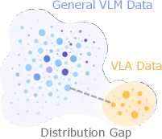
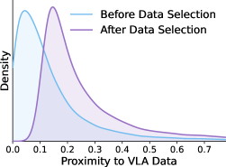
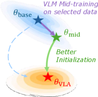
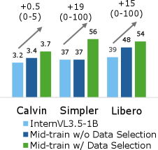
(a) VLM-VLA 데이터 분포 간극
(b) VLM 데이터
분포 변화
(c) VLM Mid-training
(d) Downstream
VLA 이득
Figure 1: EmbodiedMidtrain 개요.
우리는 VLM과 VLA 사이의 데이터 분포 간극을 분석하고, mid-training을 위해 VLA domain에 더 높은 proximity를 갖는 VLM sample을 선택하여 downstream VLA fine-tuning을 위한 더 강한 초기화를 산출한다.
이러한 이해를 바탕으로, 우리는 간극을 메우기 위해 fine-tuning이 시작되기 전에 VLM training distribution을 VLA domain 쪽으로 재형성하는 mid-training data engine을 개발한다 (Figure [1](#S1.F1 "Figure 1 ‣ 1 Introduction ‣ EmbodiedMidtrain: Bridging the Gap between Vision-Language Models and Vision-Language-Action Models via Mid-training")b). 핵심 아이디어는 사용 가능한 모든 VLM data에 무차별적으로 훈련하는 대신, target VLA distribution과 가장 잘 정렬된 subset을 *선택*하고 이를 사용해 VLM을 mid-train함으로써 downstream VLA learning을 위한 더 강한 초기화를 생성할 수 있다는 것이다. 구체적으로, 우리는 경량 proximity estimator를 제안한다. 이는 frozen VLM feature 위의 학습 가능한 classifier로, VLA data와 VLM data를 구별하도록 학습하며, 그 예측 점수는 각 VLM sample이 VLA domain에 얼마나 가까운지를 나타내는 연속적인 척도로 사용된다. 그런 다음 점수가 높은 sample들을 선별된 mid-training mixture로 조립하고, VLM은 이 distribution-aligned dataset에서 mid-train되어 VLA fine-tuning을 위한 더 나은 초기화로 사용된다 (Figure [1](#S1.F1 "Figure 1 ‣ 1 Introduction ‣ EmbodiedMidtrain: Bridging the Gap between Vision-Language Models and Vision-Language-Action Models via Mid-training")c). 이 pipeline은 경량이고 확장 가능하며, 기반 VLM 또는 VLA에 대한 어떠한 architectural change도 필요로 하지 않는다.
Calvin ABC-D (Mees et al., [2022](#bib.bib31)), SimplerEnv Bridge (Walke et al., [2023](#bib.bib38)), Libero-10 (Liu et al., [2023a](#bib.bib27))에 대한 실험은 우리의 mid-trained 1.1B 모델이 유의미한 성능 향상을 달성함을 보여준다 (Figure [1](#S1.F1 "Figure 1 ‣ 1 Introduction ‣ EmbodiedMidtrain: Bridging the Gap between Vision-Language Models and Vision-Language-Action Models via Mid-training")d). 원시 성능 향상을 넘어, 우리의 분석은 무엇이 mid-training을 효과적으로 만드는지에 대한 여러 통찰을 드러낸다.
첫째, 동일한 선별 데이터는 architecture 전반에 전이된다. InternVL3.5-1B로 선택한 mixture를 Qwen3VL-2B에 적용하면 일관된 이득이 나타나며, proximity-based selection이 VLM 전반에서 전이 가능한 속성을 포착함을 시사한다.
둘째, 학습된 proximity estimator는 feature-space distance 및 perplexity-based metric과 같은 hand-crafted 대안들을 상당히 능가한다.
셋째, training dynamics 분석은 mid-trained model이 가장 이른 fine-tuning checkpoint부터 baseline을 능가하고 시간이 지남에 따라 간극이 넓어짐을 보여주며, mid-training이 일시적인 head start가 아니라 근본적으로 더 나은 초기화를 제공함을 나타낸다.
우리의 주요 기여는 다음과 같다:
- VLM-VLA 간극을 메우기 위한 proximity-based mid-training pipeline. 우리는 VLM sample이 VLA domain에 얼마나 가까운지 점수화하는 proximity estimator를 학습하고, 상위 후보를 선택하여 distribution-aligned mid-training mixture를 구성하는 mid-training data engine인 EmbodiedMidtrain을 제안한다.
- benchmark와 backbone 전반에서 일관된 VLA 성능 향상. Calvin ABC-D, SimplerEnv Bridge, Libero-10에 대한 광범위한 실험은 우리의 mid-trained VLM initialization이 원래 backbone 대비 크고 일관된 개선을 가져오며, 훨씬 더 큰 모델들과 경쟁력 있는 결과를 달성함을 입증한다.
- VLA를 위한 더 나은 VLM initialization에 대한 통찰. 우리는 mid-training이 가장 이른 fine-tuning step부터 장점이 나타나고 시간이 지남에 따라 증폭되는 initialization을 생성함을 보인다. 또한 학습된 proximity estimation이 VLA domain과의 fine-grained alignment를 포착함으로써 hand-crafted 대안들을 능가함을 입증한다.
## 2 관련 연구
Vision-Language-Action Models.
VLA는 VLM과 같은 foundation model을 확장하여 robot action을 생성하며, VLM으로부터 물려받은 광범위한 시각 및 언어 이해를 활용한다 (Kim et al., [2024](#bib.bib19); Black et al., [2024](#bib.bib5); NVIDIA et al., [2025](#bib.bib32)).
기존 설계들은 backbone 선택과 action generation mechanism에서 차이를 보인다.
OpenVLA (Kim et al., [2024](#bib.bib19))와 같은 token-based approach는 robot action을 token으로 discretize하여 autoregressive generation을 수행한다. OpenVLA-OFT (Kim et al., [2025a](#bib.bib20))는 efficient continuous action prediction을 위해 learnable action embedding을 사용한 parallel decoding을 추가로 도입한다.
π0\pi\_{0} (Black et al., [2024](#bib.bib5)) 및 π0.5\pi\_{0.5} (Physical Intelligence et al., [2025](#bib.bib35))와 같은 flow-matching 및 diffusion-based approach는 대신 continuous action generation head와 결합된 VLM backbone (PaliGemma, Beyer et al. ([2024](#bib.bib4)))을 채택한다.
GR00T N1 (NVIDIA et al., [2025](#bib.bib32))과 같은 더 최근 모델들은 전용 cross-attention action decoder와 함께 VLM backbone (Eagle-2, Li et al. ([2025b](#bib.bib26)))을 사용한다.
이러한 설계들은 architecture적으로 다르지만, 공통점은 VLM backbone이 embodied domain을 위한 특별한 준비 없이 범용 학습에서 *off-the-shelf*로 가져와진다는 점이며, 이는 본 연구가 식별하고 다루는 간극을 가져온다.
VLM Mid-training.
많은 VLM은 multi-stage training pipeline을 채택하며, 여기서 모델은 초기 multimodal pretraining 또는 alignment 이후, 그리고 최종 instruction tuning 이전에 선별된 vision-language data로 추가 학습된다 (Bai et al., [2023](#bib.bib1); Wang et al., [2024b](#bib.bib40); Chen et al., [2025c](#bib.bib10)). 본 논문에서는 이 중간 단계를 *VLM mid-training*이라고 부른다. LLM의 mid-training과 유사하게, 그 목표는 최종 post-training 또는 task-specific fine-tuning 전에 foundation model을 원하는 domain 또는 capability 쪽으로 적응시키는 것이다 (Wang et al., [2025b](#bib.bib43); Grattafiori et al., [2024](#bib.bib15); Hu et al., [2024](#bib.bib17); OLMo et al., [2025](#bib.bib33), *inter alia*). 본 연구는 이 paradigm을 embodied setting에서 연구하며, 여기서 mid-training은 일반 VLM pretraining data와 VLA fine-tuning data 사이의 data distribution gap을 메우는 데 사용된다.
Embodied-oriented VLMs.
광범위한 연구 흐름은 embodied-oriented dataset construction (Du et al., [2024](#bib.bib11); Zhou et al., [2025](#bib.bib52); Chen et al., [2025a](#bib.bib8); Yuan et al., [2025](#bib.bib48))과 model-level adaptation (Cai et al., [2024](#bib.bib6); Ji et al., [2025](#bib.bib18); Chen et al., [2025b](#bib.bib9))을 통해 VLM의 embodied capability를 향상시키는 것을 목표로 한다.
이러한 노력에도 불구하고, Zhang et al. ([2026](#bib.bib50))은 embodied task에서 VLM을 finetuning하여 얻은 이득이 downstream VLA task performance로 안정적으로 전이되지 않음을 보이며, 현재의 embodied VLM fine-tuning이 VLA execution이 요구하는 것과는 다른 신호를 포착함을 시사한다.
대안적으로, Vlaser (Yang et al., [2025](#bib.bib47))는 in-domain robot trajectory를 VLM fine-tuning을 위한 VQA pair로 변환한다.
종합하면, 이러한 노력들은 VLM과 VLA를 연결하는 것이 여전히 열린 문제임을 강조한다. 기존 접근법들은 더 나은 VLA 성능으로 안정적으로 이어지지 않으면서 VLM 측 embodied benchmark를 개선하거나, 혹은 대량의 in-domain robot data를 필요로 한다 (Yang et al., [2025](#bib.bib47); Kim et al., [2025b](#bib.bib21); Zhang et al., [2026](#bib.bib50)). 본 연구는 task-specific corpora를 만드는 대신 다양하고 풍부한 VLM data 위에서 작동함으로써 상호보완적인 관점을 취한다.
## 3 VLM과 VLA 사이의 데이터 분포 간극
대부분의 VLA는 VLM pretraining으로부터 시각 및 언어 representation을 물려받기 때문에, 이 초기화의 품질은 근본적으로 VLM이 학습된 데이터에 의해 형성된다. 이는 우리가 VLM과 VLA 사이의 간극을 training data distribution의 관점에서 검토하도록 동기를 부여하며, 우리는 공유 representation space에서 VLM 및 VLA data를 분석하고 정성적 및 정량적 측정으로 간극을 특성화한다.
VLM 및 VLA data를 통합된 distribution space에서 표현하기 위해, 우리는 각 data sample에 대한 feature representation h​(⋅)h(\cdot)로 VLM (Wang et al., [2025a](#bib.bib42))의 last hidden state를 추출한다. 먼저 Maximum Mean Discrepancy (MMD)를 사용하여 dataset 쌍마다의 거리를 정량화한다.
형식적으로, 두 dataset PP와 QQ 사이의 squared MMD는 다음과 같다:
|  |  |  |  |
| --- | --- | --- | --- |
|  | MMD2⁡(P,Q)=𝔼x,x′∼P​[k​(x,x′)]−2​𝔼x∼Py∼Q​[k​(x,y)]+𝔼y,y′∼Q​[k​(y,y′)]\operatorname{MMD}^{2}(P,Q)=\mathbb{E}\_{x,x^{\prime}\sim P}\!\left[k(x,x^{\prime})\right]-2\,\mathbb{E}\_{\begin{subarray}{c}x\sim P\\ y\sim Q\end{subarray}}\!\left[k(x,y)\right]+\mathbb{E}\_{y,y^{\prime}\sim Q}\!\left[k(y,y^{\prime})\right] |  | (1) |
여기서 k​(x,y)=exp⁡(−∥h​(x)−h​(y)∥22/ 2​σ2)k(x,y)=\exp\!\bigl(-\lVert h(x)-h(y)\rVert\_{2}^{2}\,/\,2\sigma^{2}\bigr)는 추출된 feature 위에 적용되는 Gaussian RBF kernel이며, bandwidth σ\sigma는 median heuristic (Gretton et al., [2012](#bib.bib16))으로 설정된다. Figure [2](#S3.F2 "Figure 2 ‣ 3 Data distribution gap between VLMs and VLAs ‣ EmbodiedMidtrain: Bridging the Gap between Vision-Language Models and Vision-Language-Action Models via Mid-training")a는 모든 dataset pair에 대한 globally normalized pairwise MMD score를 보고한다. 우리는 추가로 Figure [2](#S3.F2 "Figure 2 ‣ 3 Data distribution gap between VLMs and VLAs ‣ EmbodiedMidtrain: Bridging the Gap between Vision-Language Models and Vision-Language-Action Models via Mid-training")b에서 t-SNE를 사용하여 이러한 feature를 시각화한다.
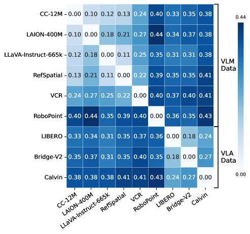
(a) VLM 및 VLA dataset 사이의 pairwise normalized MMD distance matrix
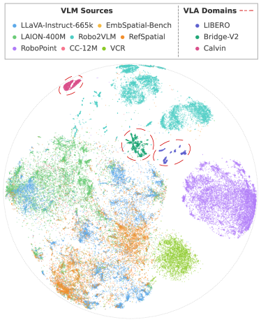
(b) VLM 및 VLA dataset 전반의 visual feature distribution에 대한 t-SNE 시각화
Figure 2: VLM 및 VLA dataset의 distribution analysis.
(a) Pairwise MMD distance는 이 distribution gap을 정량화하며, cross-group distance가 within-group distance보다 더 크다.
(b) VLA dataset은 더 넓고 더 분산된 VLM distribution과 분리된 더 조밀하고 집중된 cluster를 형성한다.
VLM과 VLA 사이의 데이터 분포 간극의 특징. VLM data와 VLA data의 distribution space는 대체로 분리되어 있으며, 가까운 이웃은 소수에 불과하다. Figure [2](#S3.F2 "Figure 2 ‣ 3 Data distribution gap between VLMs and VLAs ‣ EmbodiedMidtrain: Bridging the Gap between Vision-Language Models and Vision-Language-Action Models via Mid-training")a는 MMD distance가 일반적으로 두 group 사이보다 VLM group 내부 및 VLA group 내부에서 더 작음을 보여주며, 명확한 distributional mismatch를 정량적으로 확인한다. Figure [2](#S3.F2 "Figure 2 ‣ 3 Data distribution gap between VLMs and VLAs ‣ EmbodiedMidtrain: Bridging the Gap between Vision-Language Models and Vision-Language-Action Models via Mid-training")b는 이 pattern을 추가로 설명한다. VLA dataset은 VLM dataset이 차지하는 주요 영역에서 대부분 떨어져 있는 조밀한 cluster를 형성하는 반면, VLM data의 작은 subset만이 근처에 위치한다. 이러한 결과는 downstream embodied task의 성능에 영향을 줄 수 있는 VLM data와 VLA data 사이의 명확한 distribution mismatch를 드러낸다.
데이터 분포 간극은 상당한 내부 이질성을 보인다. VLM 및 VLA data가 전체적으로 분리되어 있기는 하지만, 그 mismatch는 각 dataset 내부에서 균일하지 않다. Figure [2](#S3.F2 "Figure 2 ‣ 3 Data distribution gap between VLMs and VLAs ‣ EmbodiedMidtrain: Bridging the Gap between Vision-Language Models and Vision-Language-Action Models via Mid-training")b는 일부 VLM source가 다른 source보다 VLA domain에 눈에 띄게 더 가까우며, global separation에도 불구하고 몇몇 local region이 명확한 cross-domain proximity를 보임을 나타낸다. 이는 VLM과 VLA 사이의 간극이 binary distinction이라기보다 alignment의 spectrum으로 더 잘 특성화되며, VLM distribution의 서로 다른 부분들이 VLA data와 어떻게 관련되는지에 상당한 heterogeneity가 있음을 드러낸다.
이러한 통찰은 embodied task를 위해 VLM을 향상시키려면 training data distribution을 VLA domain 쪽으로 재형성해야 함을 시사한다. 이 목표를 실현하려면 coarse dataset-level mixture adjustment 이상이 필요하며, 각 dataset 내에서 sample-wise selection이 요구된다.
이는 target embodied domain과 가장 잘 호환되는 VLM sample을 명시적으로 우선시하는 data-centric mid-training strategy의 동기가 된다.
## 4 EmbodiedMidtrain을 위한 데이터 엔진
Section [3](#S3 "3 Data distribution gap between VLMs and VLAs ‣ EmbodiedMidtrain: Bridging the Gap between Vision-Language Models and Vision-Language-Action Models via Mid-training")에서 보인 바와 같이, 전체 VLM candidate pool은 VLA distribution에서 멀리 떨어진 sample의 큰 비율을 포함하므로, 이를 무차별적으로 mid-training하면 downstream VLA adaptation에 가장 유용한 embodied signal이 희석될 수 있다. 이를 해결하기 위해, 우리는 두 가지 고려사항을 가진 mid-training data engine을 제안한다: (1) data mixture는 diversity를 보존하기 위해 general 및 embodied-oriented VLM source를 모두 포괄해야 하고, (2) 같은 source 내부에서도 개별 sample이 VLA task와의 관련성에서 크게 달라지기 때문에 selection은 dataset level이 아니라 *sample* level에서 작동해야 한다.
Proximity-Based Data Selection.
LLM pretraining을 위한 target-guided data selection (Xie et al., [2023](#bib.bib44))에서 영감을 받아, 우리는 distribution이 VLA domain과 가장 잘 정렬되는 VLM subset을 선택한다. 우리의 핵심 아이디어는 selection을 domain-membership problem으로 정식화하는 것이다. 우리는 frozen VLM feature 위에서 경량 binary classifier를 학습하여 각 candidate sample이 VLA data와 얼마나 유사한지 점수화한다. 점수화 후, 모든 VLM sample을 순위화하고 mid-training을 위해 가장 높은 점수의 subset만 보존하여, 원래 pool의 다양성을 유지하면서 가장 VLA-compatible sample에 집중된 선별 corpus를 만든다.
𝒟VLM\mathcal{D}\_{\mathrm{VLM}} 및 𝒟VLA\mathcal{D}\_{\mathrm{VLA}}가 shared representation space 위에서 density pVLMp\_{\mathrm{VLM}} 및 pVLAp\_{\mathrm{VLA}}를 갖는 candidate VLM pool과 target VLA corpus를 나타낸다고 하자. 우리의 목표는 distribution이 VLA data와 가장 잘 정렬되는 size-KK subset을 선택하는 것이다:
|  |  |  |  |
| --- | --- | --- | --- |
|  | 𝒟VLM∗=argmin𝒟′⊆𝒟VLM,|𝒟′|=Kd​(P𝒟′,PVLA)\mathcal{D}\_{\mathrm{VLM}}^{\*}=\operatorname\*{argmin}\_{\mathcal{D}^{\prime}\subseteq\mathcal{D}\_{\mathrm{VLM}},\;|\mathcal{D}^{\prime}|=K}\;d\!\left(P\_{\mathcal{D}^{\prime}},\;P\_{\mathrm{VLA}}\right) |  | (2) |
여기서 dd는 distributional divergence이다. 이를 정확히 푸는 것은 다루기 어려우므로, 우리는 이를 per-sample scoring 및 top-KK selection으로 완화한다:
|  |  |  |  |
| --- | --- | --- | --- |
|  | 𝒟VLM∗=top​-​Kxi∈𝒟VLM⁡s​(xi)\mathcal{D}\_{\mathrm{VLM}}^{\*}=\operatorname{top\text{-}K}\_{x\_{i}\in\mathcal{D}\_{\mathrm{VLM}}}\;s(x\_{i}) |  | (3) |
핵심 질문은 scoring function ss를 어떻게 정의할 것인가이다. 자연스러운 선택은 density ratio pVLA​(x)/pVLM​(x)p\_{\mathrm{VLA}}(x)/p\_{\mathrm{VLM}}(x)로, 이는 sample이 VLM distribution에 비해 VLA distribution 아래에서 얼마나 그럴듯한지를 측정한다. 그러나 high-dimensional feature space에서 이 ratio를 직접 추정하는 것은 어렵다. 대신 우리는 density ratio estimation의 고전적 결과 (Goodfellow et al., [2014](#bib.bib13))를 활용한다. 두 distribution을 구별하도록 학습된 binary classifier는 optimality에서 이 ratio를 복원한다:
|  |  |  |  |
| --- | --- | --- | --- |
|  | s∗​(x)=pVLA​(x)pVLA​(x)+pVLM​(x)s^{\*}(x)=\frac{p\_{\mathrm{VLA}}(x)}{p\_{\mathrm{VLA}}(x)+p\_{\mathrm{VLM}}(x)} |  | (4) |
s∗s^{\*}는 density ratio에 대해 단조 증가하므로, classifier output으로 순위화하는 것은 density ratio로 순위화하는 것과 동등하다.
우리는 이를 frozen VLM feature 위의 경량 proximity estimator로 구현하여, scoring이 효율적이고 mid-training 자체와 분리되도록 한다. 이 estimator는 frozen VLM의 last hidden state ϕ​(𝐱)\phi(\mathbf{x}) 위에 learnable scoring function ff를 적용한 다음 sigmoid를 적용한다:
|  |  |  |  |
| --- | --- | --- | --- |
|  | s​(𝐱)=σ​(f​(ϕ​(𝐱)))s(\mathbf{x})=\sigma\!\big(f(\phi(\mathbf{x}))\big) |  | (5) |
우리는 VLA sample을 positive로, VLM sample을 negative로 사용하여 학습하며, binary cross-entropy loss를 training objective로 사용한다:
|  |  |  |  |
| --- | --- | --- | --- |
|  | ℒcls=−𝔼y∼𝒟VLA​[log⁡s​(y)]−𝔼x∼𝒟VLM​[log⁡(1−s​(x))]\mathcal{L}\_{\mathrm{cls}}=-\mathbb{E}\_{y\sim\mathcal{D}\_{\mathrm{VLA}}}\left[\log s(y)\right]-\mathbb{E}\_{x\sim\mathcal{D}\_{\mathrm{VLM}}}\left[\log\big(1-s(x)\big)\right] |  | (6) |
학습 후, 우리는 모든 candidate VLM sample을 s​(x)s(x)에 따라 순위화하고 상위-KK를 보존하여 mid-training을 위한 𝒟VLM∗\mathcal{D}\_{\mathrm{VLM}}^{\*}를 형성한다.
이 절차는 broad candidate pool을 embodied adaptation을 위한 더 targeted corpus로 전환하여, VLM data의 유용한 다양성을 보존하면서 training distribution을 VLA domain 쪽으로 이동시킨다. 우리는 EmbodiedMidtrain의 후속 mid-training stage에서 이 선별된 subset을 사용한다.
## 5 실험
우리는 제안된 mid-training data engine이 VLM-VLA 간극을 메운다는 것을 입증하기 위해 실험을 수행한다. 특히 proximity-based data selection을 사용한 mid-training이 downstream VLA task에서 여러 VLM backbone을 일관되게 개선하며, 선별된 data mixture가 cross-backbone transferability를 보임을 보인다.
### 5.1 설정
VLM data source.
data selection을 위한 candidate pool을 구성하기 위해, 우리는 general-purpose 및 embodied-oriented source를 모두 포괄하는 다양한 VLM dataset 집합을 수집한다.
general VLM data의 경우, Qwen-VL (Bai et al., [2023](#bib.bib1))을 따라 LAION-400M (Schuhmann et al., [2021](#bib.bib36))의 subset, BLIP (Li et al., [2022](#bib.bib22))으로 caption이 relabel된 CC-12M (Changpinyo et al., [2021](#bib.bib7))의 image-captioning data, LLaVA-Instruct-665k (Liu et al., [2023b](#bib.bib28))의 instruction-following data, 그리고 Visual Commonsense Reasoning (VCR) (Zellers et al., [2019](#bib.bib49))을 포함한다. embodied-oriented VLM data로는 spatial referring 및 reasoning을 위한 RefSpatial (Zhou et al., [2025](#bib.bib52)), embodied spatial understanding을 위한 EmbSpatial-Bench (Du et al., [2024](#bib.bib11)), robotic visual question answering을 위한 Robo2VLM (Chen et al., [2025a](#bib.bib8)), spatial affordance prediction을 위한 RoboPoint (Yuan et al., [2025](#bib.bib48))를 추가로 포함한다.
VLM mid-training.
우리는 먼저 Section [4](#S4 "4 Data engine for EmbodiedMidtrain ‣ EmbodiedMidtrain: Bridging the Gap between Vision-Language Models and Vision-Language-Action Models via Mid-training")에서 설명한 data engine을 사용하여 mid-training dataset을 구성한다.
우리는 proximity estimator learning을 위한 target VLA data로 VLA fine-tuning의 training data에 대한 balanced mixture를 활용한다.
overfitting을 방지하기 위해, validation accuracy 90%에서 early stopping을 적용한다. 결과로 얻은 proximity estimator는 candidate VLM sample에 점수를 매기고 선택하여, LLaMA-Factory (Zheng et al., [2024](#bib.bib51)) framework를 사용해 InternVL3.5-1B (Wang et al., [2025a](#bib.bib42)) 및 Qwen3VL-2B (Bai et al., [2025a](#bib.bib2))에서 mid-training을 수행한다.
우리는 global batch size 256으로 모든 model parameter를 5,000 step 동안 학습한다. 더 자세한 implementation detail은 Appendix [A.1](#A1.SS1 "A.1 Implementation Details for VLM Mid-training ‣ Appendix A Appendix ‣ EmbodiedMidtrain: Bridging the Gap between Vision-Language Models and Vision-Language-Action Models via Mid-training")를 참조하라.
VLA fine-tuning.
VLM mid-training 후, 우리는 결과 VLM에서 VLA를 초기화하고 VLM4VLA (Zhang et al., [2026](#bib.bib50))의 VLA training pipeline을 따라 fine-tune한다. 여기서 VLM backbone은 continuous arm action과 binary gripper action을 예측하는 two-branch MLP action decoder와 cascade된다. 이 architecture는 서로 다른 VLM backbone 전반에서 generic하도록 설계되었으며, 각 VLM의 intrinsic knowledge를 충분히 활용할 수 있다.
architecture 및 training detail은 Appendix [A.2](#A1.SS2 "A.2 Implementation Details for VLA Fine-tuning ‣ Appendix A Appendix ‣ EmbodiedMidtrain: Bridging the Gap between Vision-Language Models and Vision-Language-Action Models via Mid-training")에 제공된다.
Evaluation benchmarks.  공정하고 재현 가능한 비교를 위해 VLM4VLA의 evaluation protocol을 따라, embodied control의 여러 측면을 포괄하는 세 가지 simulated manipulation benchmark에서 평가한다. Calvin ABC-D (Mees et al., [2022](#bib.bib31))는 ABC split에서 학습하고 unseen split D에서 1,000개의 five-subtask sequence로 평가하여 새로운 scene configuration에 대한 generalization을 테스트한다. SimplerEnv Bridge (Li et al., [2025a](#bib.bib24); Walke et al., [2023](#bib.bib38))는 네 가지 tabletop manipulation task와 각 24개의 randomized trial을 포함하는 real-to-sim benchmark이며, mean success rate를 보고한다. LIBERO-10 (Liu et al., [2023a](#bib.bib27))은 LIBERO benchmark에서 가장 어려운 suite로, task당 50 trial에서 평가되는 10개의 long-horizon task로 구성된다.
### 5.2 Baseline
우리는 우리의 방법을 두 범주의 baseline과 비교한다: expert VLA model 및 off-the-shelf VLM에서 학습된 VLA. 이러한 baseline은 VLM4VLA가 실험하거나 재현한 것이다. 공정한 비교를 위해 model size와 training budget도 보고하며, 이는 본 sample의 총 수로 측정된다. 이를 통해 downstream performance뿐 아니라 우리 approach의 효율성도 평가할 수 있으며, proximity-based data selection을 사용한 VLM mid-training이 훨씬 적은 training resource로 경쟁력 있는 결과를 달성할 수 있음을 보여준다. 추가 implementation detail은 Appendix [A.2](#A1.SS2 "A.2 Implementation Details for VLA Fine-tuning ‣ Appendix A Appendix ‣ EmbodiedMidtrain: Bridging the Gap between Vision-Language Models and Vision-Language-Action Models via Mid-training")에 제공된다.
Expert VLA Baselines.
우리는 먼저 OpenVLA (Kim et al., [2024](#bib.bib19)) 및 π0\pi\_{0} (Black et al., [2024](#bib.bib5))를 포함한 대표적인 expert VLA model과 비교한다. OpenVLA는 DINOv2 및 SigLIP visual encoder를 포함한 Llama-2-7B 위에 구축되며, discretized action token을 autoregressively 예측하여 robot control을 모델링한다. π0\pi\_{0}는 Paligemma-1 VLM을 기반으로 하며 flow matching을 사용해 continuous robot action을 모델링한다.
Off-the-shelf VLM Baselines.
pretrained VLM ability가 downstream action learning으로 어떻게 전이되는지 평가하기 위해, 우리는 서로 다른 architecture와 scale에 걸친 다양한 off-the-shelf VLM에서 직접 finetune된 VLA를 추가로 고려한다. 이러한 VLM에는 강력한 범용 open-source VLM 계열을 대표하는 Qwen2.5VL 및 Qwen3VL family  (Bai et al., [2025b](#bib.bib3); [a](#bib.bib2)), downstream adaptation에 널리 채택되는 Paligemma family (Paligemma-1 (Beyer et al., [2024](#bib.bib4)) 및 Paligemma-2 (Steiner et al., [2024](#bib.bib37))), 그리고 grounding-oriented 대안을 제공하는 KosMos-2 (Peng et al., [2023](#bib.bib34))가 포함된다.
### 5.3 주요 결과
Table [1](#S5.T1 "Table 1 ‣ 5.3 Main results ‣ 5 Experiments ‣ EmbodiedMidtrain: Bridging the Gap between Vision-Language Models and Vision-Language-Action Models via Mid-training")은 주요 결과를 제시한다. proximity-based mid-training을 통해, 우리의 모델들은 세 benchmark 모두에서 일관되고 상당한 개선을 달성하며, 잘 선별된 mid-training mixture가 downstream action learning을 위한 VLM의 준비도를 크게 강화할 수 있음을 입증한다.
더 자세한 내용은 Appendix [A.3](#A1.SS3 "A.3 Detailed Experimental Results ‣ Appendix A Appendix ‣ EmbodiedMidtrain: Bridging the Gap between Vision-Language Models and Vision-Language-Action Models via Mid-training")에 제공된다.
규모의 일부만으로 달성한 경쟁력 있는 성능.
비교 대상 중 가장 작은 모델임에도 불구하고, mid-trained InternVL3.5-1B는 Calvin ABC-D에서 두 expert VLA baseline을 모두 능가하며, Paligemma-1, Paligemma-2, KosMos-2를 포함해 3–8×\times 더 큰 여러 off-the-shelf VLM보다 뛰어난 성능을 보인다. SimplerEnv-Bridge 및 Libero-10에서는 Qwen family와 같은 훨씬 더 큰 VLM과 동등한 성능에 도달하면서, training budget은 그 일부만 사용한다. 이러한 결과는 가장 중요한 것이 VLM이 본 pretraining data의 양이 아니라, mid-training data가 downstream embodied distribution과 얼마나 잘 정렬되는지임을 시사한다.
Cross-backbone transferability.
단일 backbone을 넘어 우리 data engine의 일반성을 검토하기 위해, 우리는 InternVL3.5-1B의 feature space를 사용해 선택한 동일한 mid-training data를 Qwen3VL-2B에 적용한다. 서로 다른 모델의 representation으로 선별되었음에도, 선택된 data는 mid-training 후 세 benchmark 모두에서 Qwen3VL-2B에 대해서도 명확한 이득을 산출한다. 이는 proximity-based selection이 단일 backbone에 특화된 것이 아니라 embodied VLA task와의 더 일반적인 alignment를 반영하는 distributional property를 포착함을 시사한다.
Model
Size
# Samples Seen
Calvin (Tasks Completed in a Row)
Simpler↑\uparrow
Libero↑\uparrow
(Calvin / Simpler / Libero)
1
2
3
4
5
Avg. Len.↑\uparrow
Expert VLA Baselines\*
OpenVLA (Llama-2)
7.7B
7.7M / 25.6M / 25.6M
0.792
0.644
0.499
0.368
0.245
2.548
04.2
53.7
π0\pi\_{0} (Paligemma-1)
3.1B
7.7M / 25.6M / 25.6M
0.896
0.785
0.786
0.610
0.532
3.509
60.4
46.0
Off-the-shelf VLM Baselines\*
Qwen2.5VL-3B
3.8B
7.7M / 25.6M / 25.6M
0.922
0.842
0.766
0.700
0.626
3.856
48.0
43.0
Qwen2.5VL-7B
8.3B
7.7M / 25.6M / 25.6M
0.935
0.864
0.807
0.758
0.693
4.057
46.8
45.0
Qwen3VL-2B
2.1B
7.7M / 25.6M / 25.6M
0.943
0.882
0.831
0.776
0.710
4.142
49.0
55.8
Qwen3VL-4B
4.4B
7.7M / 25.6M / 25.6M
0.933
0.857
0.790
0.719
0.644
3.943
56.3
44.4
Qwen3VL-8B
8.8B
7.7M / 25.6M / 25.6M
0.940
0.868
0.797
0.746
0.684
4.035
58.3
46.2
Qwen3VL-30B-A3B
30B-A3B
7.7M / 25.6M / 25.6M
0.939
0.877
0.820
0.757
0.682
4.075
44.8
46.8
Paligemma-1
2.9B
7.7M / 25.6M / 25.6M
0.914
0.813
0.692
0.599
0.488
3.506
55.3
44.2
Paligemma-2
3.0B
7.7M / 25.6M / 25.6M
0.901
0.775
0.669
0.575
0.486
3.406
57.3
46.2
KosMos-2
1.7B
7.7M / 25.6M / 25.6M
0.878
0.721
0.591
0.498
0.408
3.096
60.4
55.0
VLM with EmbodiedMidtrain (Ours)
InternVL3.5-1B
1.1B
1.0M / 4.1M / 4.1M
0.909
0.754
0.606
0.498
0.406
3.173
36.5
39.0
+ EmbodiedMidtrain
1.1B
1.0M / 4.1M / 4.1M
0.935
0.838
0.737
0.653
0.551
3.714
56.3
54.2
Qwen3VL-2B
2.1B
1.0M / 4.1M / 4.1M
0.887
0.747
0.612
0.527
0.432
3.205
38.5
33.8
+ EmbodiedMidtrain
2.1B
1.0M / 4.1M / 4.1M
0.922
0.808
0.700
0.623
0.533
3.584
45.8
40.2
Table 1: Calvin ABC-D, SimplerEnv-Bridge, Libero-10 전반의 주요 결과. # Samples Seen은 Calvin / SimplerEnv / Libero에서의 training budget으로 보고된다. \* Expert VLA Baselines 및 Off-the-shelf VLM Baselines의 결과는 VLM4VLA에 의해 재현 및 보고되었다.

## 6 분석
우리 접근법의 효과를 확인했으므로, 이제 그 설계 선택과 동작을 자세히 살펴본다. 먼저 데이터 엔진의 두 가지 핵심 구성요소, 즉 데이터 선택과 무작위 샘플링의 효과 차이와 근접도 측정 방식의 선택을 ablation한다(Section [6.1](#S6.SS1 "6.1 Ablations ‣ 6 Analysis ‣ EmbodiedMidtrain: Bridging the Gap between Vision-Language Models and Vision-Language-Action Models via Mid-training")). 이어 VLA fine-tuning의 학습 dynamics를 분석하여 mid-training의 이점이 *언제* 나타나는지 이해하고(Section [6.2](#S6.SS2 "6.2 Training dynamics ‣ 6 Analysis ‣ EmbodiedMidtrain: Bridging the Gap between Vision-Language Models and Vision-Language-Action Models via Mid-training")), 마지막으로 선택된 데이터를 조사하여 근접도 추정기가 *무엇을* 선호하도록 학습하는지 이해한다(Section [6.3](#S6.SS3 "6.3 Analysis of selected VLM data ‣ 6 Analysis ‣ EmbodiedMidtrain: Bridging the Gap between Vision-Language Models and Vision-Language-Action Models via Mid-training")).
### 6.1 Ablation
데이터 엔진의 두 가지 중심 설계 선택을 ablation한다: 무작위 샘플링 대비 근접도 기반 선택의 장점, 그리고 서로 다른 근접도 측정 방식의 효과이다. Table [2](#S6.T2 "Table 2 ‣ 6.1 Ablations ‣ 6 Analysis ‣ EmbodiedMidtrain: Bridging the Gap between Vision-Language Models and Vision-Language-Action Models via Mid-training")는 결과를 요약한다.
|  |  |  |  |
| --- | --- | --- | --- |
| 설정 | Calvin↑\uparrow | Simpler↑\uparrow | Libero↑\uparrow |
| 무작위 선택 | 3.398 | 43.8 | 48.4 |
| 근접도 측정 | | | |
| 특징 공간 평균 거리 | 3.126 | 53.1 | 51.2 |
| VLA 조건부 Perplexity | 3.159 | 55.2 | 48.0 |
| Delta Perplexity | 1.527 | 39.6 | 54.2 |
| 학습된 추정기(우리 방법) | 3.714 | 56.3 | 54.2 |
Table 2: mid-training된 InternVL3.5-1B backbone에서 무작위 선택과 서로 다른 근접도 측정에 대한 ablation 결과.
무작위 선택.
후보 pool에서 무작위로 샘플링하는 것은 세 benchmark 모두에서 우리의 학습된 추정기보다 일관되게 낮은 성능을 보였으며, 필터링되지 않은 데이터에 대한 단순한 mid-training만으로는 분포 간극을 메우기에 충분하지 않음을 보여준다. 이는 성능 향상이 단지 추가적인 mid-training에서 오는 것이 아니라, VLA domain과 더 잘 정렬된 VLM 데이터 부분집합을 식별하고 유지하는 데서 온다는 점을 시사한다. 따라서 근접도 기반 선택은 mid-training의 이점을 끌어내는 데 중요하다.
근접도 측정.
우리의 학습된 근접도 추정기 외에도 세 가지 대안을 평가한다: *feature-space average distance*(frozen VLM의 표현 공간에서 VLA sample까지의 평균 거리), *VLA-conditioned perplexity*(text-form VLA data로 fine-tuning된 VLM에서의 perplexity), 그리고 *delta perplexity*(원래 VLM 대비 perplexity 변화)이다. 모든 대안은 우리의 학습된 추정기보다 일관성이 낮았으며, 이는 hand-crafted metric이 VLA alignment를 부분적으로만 포착하는 반면 학습된 추정기는 더 robust하고 transferable한 signal을 제공함을 확인해 준다. 각 대안의 공식적 정의와 세부사항은 Appendix [A.4](#A1.SS4 "A.4 Implementation Details for Alternative Proximity Measurements ‣ Appendix A Appendix ‣ EmbodiedMidtrain: Bridging the Gap between Vision-Language Models and Vision-Language-Action Models via Mid-training")에 제공되어 있다.
### 6.2 학습 dynamics
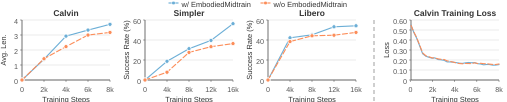
Figure 3: Embodied-Midtrain을 적용한 VLM과 적용하지 않은 VLM의 VLA task 전반 학습 dynamics. downstream VLA task 성능(왼쪽)과 training loss(오른쪽)를 포함한다.
Figure [3](#S6.F3 "Figure 3 ‣ 6.2 Training dynamics ‣ 6 Analysis ‣ EmbodiedMidtrain: Bridging the Gap between Vision-Language Models and Vision-Language-Action Models via Mid-training")은 원래 InternVL3.5-1B backbone과 우리의 mid-trained 변형에서 얻은 VLA fine-tuning trajectory를 비교하며, training 전반의 intermediate checkpoint에서 평가했다. mid-trained model은 fine-tuning 초기 단계부터 이미 더 높은 성능을 달성하여, 근접도 기반 mid-training이 VLA learning에 더 나은 initialization을 제공한다는 직접적 증거를 제시한다. 더욱이 이 장점은 일시적인 head start가 아닌데, mid-trained model이 전체 training trajectory 동안 baseline을 일관되게 능가하며 시간이 지남에 따라 격차가 줄어들기보다 넓어지기 때문이다.
특히, 이 차이는 training loss에 명확히 반영되지 않으며, 두 initialization 간 training loss는 매우 유사하게 유지된다. 이는 training loss만으로는 학습된 initialization의 품질을 완전히 포착하지 못함을 시사한다. mid-trained model의 downstream 성능이 지속적으로 더 강하다는 점과 함께, 이러한 결과는 mid-training의 이점이 VLA fine-tuning 전반에 걸쳐 지속되며 VLA task에 더 적합한 backbone으로 이어진다는 것을 나타낸다.
### 6.3 선택된 VLM 데이터 분석
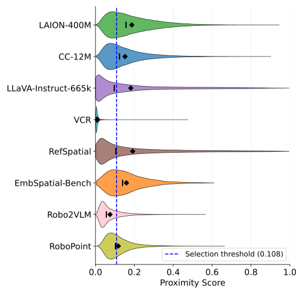
((a)) dataset별 근접도 점수
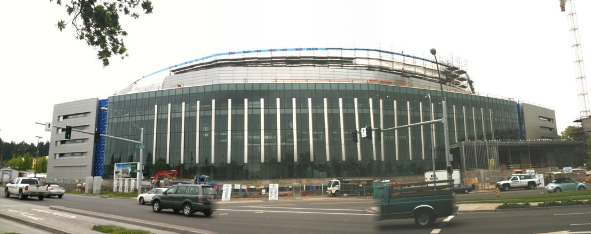
Q: 당신은 좌표점 (0.878, 0.780)으로 표시된 지점에 서 있다. 바로 앞에 있는 물체는 무엇인가?
A: 오른쪽 아래의 흰색 무광 트럭.
Q: 오른쪽 위의 노란색 금속 crane 위 한 점을 찾으시오. ⟨format instructions…⟩
A: [(0.976, 0.244)]
((b)) 높은 점수의 sample

Q: 이 책을 쓴 사람은 누구인가?
  A: Charles P. McKeague.
  Q: 이 책의 제목은 무엇인가?
  A: Trigonometry.
((c)) 낮은 점수의 sample
Figure 4: 근접도 기반 데이터 선택 분석. (a) VLM data source 전반의 근접도 점수 분포. (b) spatial grounding과 reasoning을 요구하는 RefSpatial의 높은 점수 sample. (c) 낮은 점수 sample: text-only VQA가 포함된 책 표지.
Figure [4(a)](#S6.F4.sf1 "In Figure 4 ‣ 6.3 Analysis of selected VLM data ‣ 6 Analysis ‣ EmbodiedMidtrain: Bridging the Gap between Vision-Language Models and Vision-Language-Action Models via Mid-training")는 여덟 개 후보 VLM dataset 전반의 근접도 점수 분포를 violin plot으로 시각화하여 제시한다. 모든 dataset이 낮음에서 중간 정도의 점수 범위에 집중되어 있지만, 분포 형태는 dataset별로 뚜렷하게 다르다. 그중 RefSpatial은 가장 높은 평균 점수를 달성하는 반면 VCR은 가장 낮은 점수를 받아, 추정기가 명확한 *dataset-level* 선호를 부여함을 나타낸다. 동시에 dataset 내부 점수 분산은 추정기가 세밀한 *sample-level* 선택도 수행하여, 높은 점수를 받는 dataset에서도 VLA와 가장 잘 정렬된 sample만 유지함을 보여준다.
Figures [4(b)](#S6.F4.sf2 "In Figure 4 ‣ 6.3 Analysis of selected VLM data ‣ 6 Analysis ‣ EmbodiedMidtrain: Bridging the Gap between Vision-Language Models and Vision-Language-Action Models via Mid-training")와 [4(c)](#S6.F4.sf3 "In Figure 4 ‣ 6.3 Analysis of selected VLM data ‣ 6 Analysis ‣ EmbodiedMidtrain: Bridging the Gap between Vision-Language Models and Vision-Language-Action Models via Mid-training")는 대표 예시로 이를 설명한다. 높은 점수의 sample은 embodied manipulation에 중요한 spatial reference grounding과 spatial reasoning 수행을 요구한다. 낮은 점수의 sample은 책 표지의 text를 인식하는 문제로, embodied task와의 관련성이 거의 없다. 이는 근접도 추정기가 수동 domain expertise 없이도 embodied control로 transfer되는 visual reasoning pattern과 그렇지 않은 pattern을 구별하도록 학습한다는 것을 시사한다.
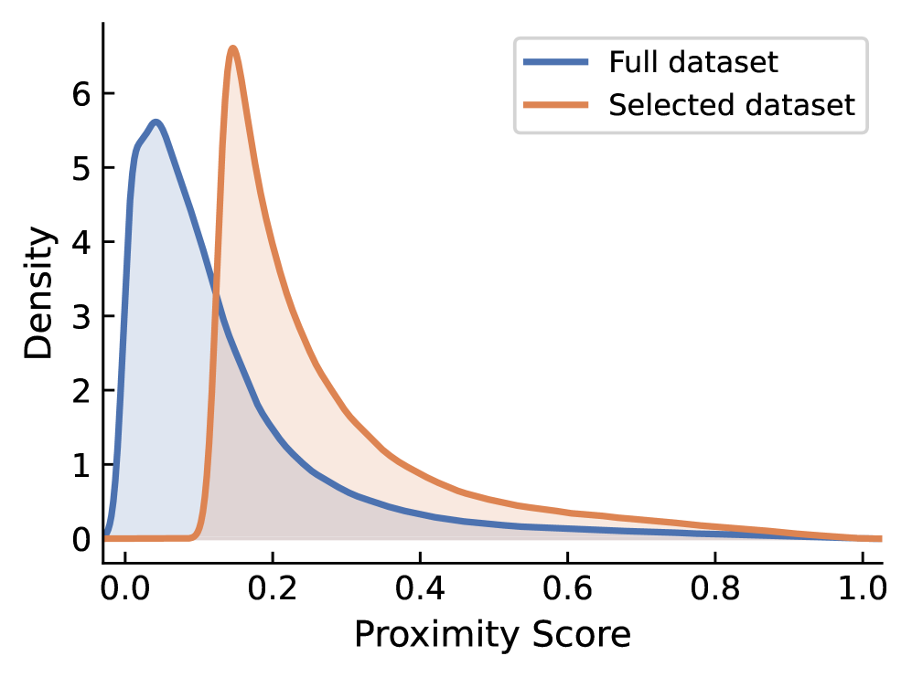
Figure 5: 데이터 선택 이후 근접도 점수의 VLM data distribution shift.
데이터 선택 전후의 전체 근접도 점수 분포는 Figure [5](#S6.F5 "Figure 5 ‣ 6.3 Analysis of selected VLM data ‣ 6 Analysis ‣ EmbodiedMidtrain: Bridging the Gap between Vision-Language Models and Vision-Language-Action Models via Mid-training")에 제시되어 있다. 전체 후보 pool과 비교하면, 선택된 subset은 낮은 점수의 질량 일부가 제거되면서 더 높은 근접도 점수 쪽으로 distribution shift를 보이며, 재구성된 데이터 분포가 VLA domain과 더 잘 정렬되어 있음을 보여준다.
또한 우리의 데이터 선택이 mid-training dataset을 좁은 영역으로 붕괴시키는 것이 아니라 일반 VLM data의 다양성을 보존한다는 점도 확인한다. Appendix [A.5](#A1.SS5 "A.5 Diversity Preservation after Data Selection ‣ Appendix A Appendix ‣ EmbodiedMidtrain: Bridging the Gap between Vision-Language Models and Vision-Language-Action Models via Mid-training")에서, 선택된 subset이 여전히 높은 다양성을 유지하며 더 집중된 embodied-oriented VLM 또는 VLA data보다 원래의 일반 VLM pool에 다양성 측면에서 훨씬 더 가깝게 남아 있음을 관찰한다. 이는 우리의 data engine이 general VLM data를 mid-training에 가치 있게 만드는 폭넓은 visual 및 linguistic coverage를 유지하면서 embodied task에 대한 alignment를 개선함을 나타낸다.
Dataset composition에 대한 추가 분석은 Appendix [A.6](#A1.SS6 "A.6 Selected Data Mixture Composition ‣ Appendix A Appendix ‣ EmbodiedMidtrain: Bridging the Gap between Vision-Language Models and Vision-Language-Action Models via Mid-training")에 제공되어 있다.
## 7 결론
우리는 근접도 기반 데이터 선택을 통해 VLM과 VLA 사이의 데이터 분포 간극을 메우는 mid-training pipeline인 EmbodiedMidtrain을 제시했다. frozen VLM feature를 기반으로 구축된 우리의 lightweight estimator는 VLA domain과 가장 잘 정렬된 VLM sample을 식별하고, 이를 사용해 더 효과적인 mid-training set을 구성한다. 세 가지 manipulation benchmark 전반에서 이 전략은 더 큰 scale과 training budget으로 학습된 model들과 경쟁력 있는 성능을 일관되게 향상시킨다. 선택된 data는 Qwen3VL-2B에도 transfer되어, InternVL3.5-1B feature로 curated되었음에도 그 성능을 높인다.
우리의 분석은 mid-training이 downstream VLA learning에 더 강한 initialization을 제공한다는 점도 추가로 보여준다: 그 이점은 fine-tuning의 가장 초기 단계부터 나타나며 training 전반에 걸쳐 계속 커진다. 또한 선택된 data는 원래 VLM dataset의 다양성을 보존하면서 dataset 및 sample level 모두에서 의미 있는 선호를 보인다는 것을 발견했다. 우리는 이러한 발견이 embodied intelligence를 위해 vision-language backbone을 더 잘 준비하려는 향후 노력에 도움이 되기를 바란다.
## 감사의 글
본 연구는 computational resource를 제공한 CMU Foundation and Language Model (FLAME) Center의 지원을 받았다. 본 연구는 U.S. National Science Foundation grants #2138259, #2138286, #2138307, #2137603, and #2138296의 지원을 받는 Advanced Cyberinfrastructure Coordination Ecosystem: Services & Support (ACCESS) program의 allocation CIS250941을 통해 National Center for Supercomputing Applications의 Delta와 DeltaAI를 사용했다. 본 연구에 유용한 feedback을 제공해 준 Cathy Jiao, Zichun Yu, Shanshan Zhong, Xiaochuan Li, Hao Kang에게 진심으로 감사한다.
## 참고문헌
- Bai et al. (2023)
  Jinze Bai, Shuai Bai, Shusheng Yang, Shijie Wang, Sinan Tan, Peng Wang, Junyang Lin, Chang Zhou, and Jingren Zhou.
  Qwen-vl: A versatile vision-language model for understanding, localization, text reading, and beyond.
  *arXiv preprint arXiv:2308.12966*, 2023.
- Bai et al. (2025a)
  Shuai Bai, Yuxuan Cai, Ruizhe Chen, Keqin Chen, Xionghui Chen, Zesen Cheng, Lianghao Deng, Wei Ding, Chang Gao, Chunjiang Ge, Wenbin Ge, Zhifang Guo, Qidong Huang, Jie Huang, Fei Huang, Binyuan Hui, Shutong Jiang, Zhaohai Li, Mingsheng Li, Mei Li, Kaixin Li, Zicheng Lin, Junyang Lin, Xuejing Liu, Jiawei Liu, Chenglong Liu, Yang Liu, Dayiheng Liu, Shixuan Liu, Dunjie Lu, Ruilin Luo, Chenxu Lv, Rui Men, Lingchen Meng, Xuancheng Ren, Xingzhang Ren, Sibo Song, Yuchong Sun, Jun Tang, Jianhong Tu, Jianqiang Wan, Peng Wang, Pengfei Wang, Qiuyue Wang, Yuxuan Wang, Tianbao Xie, Yiheng Xu, Haiyang Xu, Jin Xu, Zhibo Yang, Mingkun Yang, Jianxin Yang, An Yang, Bowen Yu, Fei Zhang, Hang Zhang, Xi Zhang, Bo Zheng, Humen Zhong, Jingren Zhou, Fan Zhou, Jing Zhou, Yuanzhi Zhu, and Ke Zhu.
  Qwen3-vl technical report.
  *arXiv preprint arXiv:2511.21631*, 2025a.
- Bai et al. (2025b)
  Shuai Bai, Keqin Chen, Xuejing Liu, Jialin Wang, Wenbin Ge, Sibo Song, Kai Dang, Peng Wang, Shijie Wang, Jun Tang, Humen Zhong, Yuanzhi Zhu, Mingkun Yang, Zhaohai Li, Jianqiang Wan, Pengfei Wang, Wei Ding, Zheren Fu, Yiheng Xu, Jiabo Ye, Xi Zhang, Tianbao Xie, Zesen Cheng, Hang Zhang, Zhibo Yang, Haiyang Xu, and Junyang Lin.
  Qwen2.5-vl technical report.
  *arXiv preprint arXiv:2502.13923*, 2025b.
- Beyer et al. (2024)
  Lucas Beyer, Andreas Steiner, André Susano Pinto, Alexander Kolesnikov, Xiao Wang, Daniel Salz, Maxim Neumann, Ibrahim Alabdulmohsin, Michael Tschannen, Emanuele Bugliarello, Thomas Unterthiner, Daniel Keysers, Skanda Koppula, Fangyu Liu, Adam Grycner, Alexey Gritsenko, Neil Houlsby, Manoj Kumar, Keran Rong, Julian Eisenschlos, Rishabh Kabra, Matthias Bauer, Matko Bošnjak, Xi Chen, Matthias Minderer, Paul Voigtlaender, Ioana Bica, Ivana Balazevic, Joan Puigcerver, Pinelopi Papalampidi, Olivier Henaff, Xi Xiong, Radu Soricut, Jeremiah Harmsen, and Xiaohua Zhai.
  Paligemma: A versatile 3b vlm for transfer.
  *arXiv preprint arXiv:2407.07726*, 2024.
- Black et al. (2024)
  Kevin Black, Noah Brown, Danny Driess, Adnan Esmail, Michael Equi, Chelsea Finn, Niccolo Fusai, Lachy Groom, Karol Hausman, Brian Ichter, Szymon Jakubczak, Tim Jones, Liyiming Ke, Sergey Levine, Adrian Li-Bell, Mohith Mothukuri, Suraj Nair, Karl Pertsch, Lucy Xiaoyang Shi, James Tanner, Quan Vuong, Anna Walling, Haohuan Wang, and Ury Zhilinsky.
  π0\pi\_{0}: A vision-language-action flow model for general robot control.
  *arXiv preprint arXiv:2410.24164*, 2024.
- Cai et al. (2024)
  Wenxiao Cai, Yaroslav Ponomarenko, Jianhao Yuan, Xiaoqi Li, Wankou Yang, Hao Dong, and Bo Zhao.
  Spatialbot: Precise spatial understanding with vision language models.
  *arXiv preprint arXiv:2406.13642*, 2024.
- Changpinyo et al. (2021)
  Soravit Changpinyo, Piyush Sharma, Nan Ding, and Radu Soricut.
  Conceptual 12M: Pushing web-scale image-text pre-training to recognize long-tail visual concepts.
  In *CVPR*, 2021.
- Chen et al. (2025a)
  Kaiyuan Chen, Shuangyu Xie, Zehan Ma, and Ken Goldberg.
  Robo2vlm: Visual question answering from large-scale in-the-wild robot manipulation datasets, 2025a.
  URL <https://arxiv.org/abs/2505.15517>.
- Chen et al. (2025b)
  Xinyi Chen, Yilun Chen, Yanwei Fu, Ning Gao, Jiaya Jia, Weiyang Jin, Hao Li, Yao Mu, Jiangmiao Pang, Yu Qiao, Yang Tian, Bin Wang, Bolun Wang, Fangjing Wang, Hanqing Wang, Tai Wang, Ziqin Wang, Xueyuan Wei, Chao Wu, Shuai Yang, Jinhui Ye, Junqiu Yu, Jia Zeng, Jingjing Zhang, Jinyu Zhang, Shi Zhang, Feng Zheng, Bowen Zhou, and Yangkun Zhu.
  Internvla-m1: A spatially guided vision-language-action framework for generalist robot policy, 2025b.
  URL <https://arxiv.org/abs/2510.13778>.
- Chen et al. (2025c)
  Zhe Chen, Weiyun Wang, Yue Cao, Yangzhou Liu, Zhangwei Gao, Erfei Cui, Jinguo Zhu, Shenglong Ye, Hao Tian, Zhaoyang Liu, Lixin Gu, Xuehui Wang, Qingyun Li, Yiming Ren, Zixuan Chen, Jiapeng Luo, Jiahao Wang, Tan Jiang, Bo Wang, Conghui He, Botian Shi, Xingcheng Zhang, Han Lv, Yi Wang, Wenqi Shao, Pei Chu, Zhongying Tu, Tong He, Zhiyong Wu, Huipeng Deng, Jiaye Ge, Kai Chen, Kaipeng Zhang, Limin Wang, Min Dou, Lewei Lu, Xizhou Zhu, Tong Lu, Dahua Lin, Yu Qiao, Jifeng Dai, and Wenhai Wang.
  Expanding performance boundaries of open-source multimodal models with model, data, and test-time scaling, 2025c.
  URL <https://arxiv.org/abs/2412.05271>.
- Du et al. (2024)
  Mengfei Du, Binhao Wu, Zejun Li, Xuanjing Huang, and Zhongyu Wei.
  EmbSpatial-bench: Benchmarking spatial understanding for embodied tasks with large vision-language models.
  In Lun-Wei Ku, Andre Martins, and Vivek Srikumar (eds.), *Proceedings of the 62nd Annual Meeting of the Association for Computational Linguistics (Volume 2: Short Papers)*, pp. 346–355, Bangkok, Thailand, August 2024. Association for Computational Linguistics.
  doi: 10.18653/v1/2024.acl-short.33.
  URL <https://aclanthology.org/2024.acl-short.33/>.
- Fu et al. (2024)
  Xingyu Fu, Yushi Hu, Bangzheng Li, Yu Feng, Haoyu Wang, Xudong Lin, Dan Roth, Noah A. Smith, Wei-Chiu Ma, and Ranjay Krishna.
  Blink: Multimodal large language models can see but not perceive, 2024.
  URL <https://arxiv.org/abs/2404.12390>.
- Goodfellow et al. (2014)
  Ian Goodfellow, Jean Pouget-Abadie, Mehdi Mirza, Bing Xu, David Warde-Farley, Sherjil Ozair, Aaron Courville, and Yoshua Bengio.
  Generative adversarial networks.
  *Advances in Neural Information Processing Systems*, 3, 06 2014.
  doi: 10.1145/3422622.
- GR Team (2025)
  GR Team.
  Gemini robotics 1.5: Pushing the frontier of generalist embodied agents.
  *arXiv preprint arXiv:2510.03342*, 2025.
- Grattafiori et al. (2024)
  Aaron Grattafiori, Abhimanyu Dubey, Abhinav Jauhri, Abhinav Pandey, Abhishek Kadian, Ahmad Al-Dahle, Aiesha Letman, Akhil Mathur, Alan Schelten, Alex Vaughan, Amy Yang, Angela Fan, Anirudh Goyal, Anthony Hartshorn, Aobo Yang, Archi Mitra, Archie Sravankumar, Artem Korenev, Arthur Hinsvark, Arun Rao, Aston Zhang, Aurelien Rodriguez, Austen Gregerson, Ava Spataru, Baptiste Roziere, Bethany Biron, Binh Tang, Bobbie Chern, Charlotte Caucheteux, Chaya Nayak, Chloe Bi, Chris Marra, Chris McConnell, Christian Keller, Christophe Touret, Chunyang Wu, Corinne Wong, Cristian Canton Ferrer, Cyrus Nikolaidis, Damien Allonsius, Daniel Song, Danielle Pintz, Danny Livshits, Danny Wyatt, David Esiobu, Dhruv Choudhary, Dhruv Mahajan, Diego Garcia-Olano, Diego Perino, Dieuwke Hupkes, Egor Lakomkin, Ehab AlBadawy, Elina Lobanova, Emily Dinan, Eric Michael Smith, Filip Radenovic, Francisco Guzmán, Frank Zhang, Gabriel Synnaeve, Gabrielle Lee, Georgia Lewis Anderson, Govind Thattai, Graeme Nail, Gregoire Mialon, Guan Pang,
  Guillem Cucurell, Hailey Nguyen, Hannah Korevaar, Hu Xu, Hugo Touvron, Iliyan Zarov, Imanol Arrieta Ibarra, Isabel Kloumann, Ishan Misra, Ivan Evtimov, Jack Zhang, Jade Copet, Jaewon Lee, Jan Geffert, Jana Vranes, Jason Park, Jay Mahadeokar, Jeet Shah, Jelmer van der Linde, Jennifer Billock, Jenny Hong, Jenya Lee, Jeremy Fu, Jianfeng Chi, Jianyu Huang, Jiawen Liu, Jie Wang, Jiecao Yu, Joanna Bitton, Joe Spisak, Jongsoo Park, Joseph Rocca, Joshua Johnstun, Joshua Saxe, Junteng Jia, Kalyan Vasuden Alwala, Karthik Prasad, Kartikeya Upasani, Kate Plawiak, Ke Li, Kenneth Heafield, Kevin Stone, Khalid El-Arini, Krithika Iyer, Kshitiz Malik, Kuenley Chiu, Kunal Bhalla, Kushal Lakhotia, Lauren Rantala-Yeary, Laurens van der Maaten, Lawrence Chen, Liang Tan, Liz Jenkins, Louis Martin, Lovish Madaan, Lubo Malo, Lukas Blecher, Lukas Landzaat, Luke de Oliveira, Madeline Muzzi, Mahesh Pasupuleti, Mannat Singh, Manohar Paluri, Marcin Kardas, Maria Tsimpoukelli, Mathew Oldham, Mathieu Rita, Maya Pavlova, Melanie Kambadur,
  Mike Lewis, Min Si, Mitesh Kumar Singh, Mona Hassan, Naman Goyal, Narjes Torabi, Nikolay Bashlykov, Nikolay Bogoychev, Niladri Chatterji, Ning Zhang, Olivier Duchenne, Onur Çelebi, Patrick Alrassy, Pengchuan Zhang, Pengwei Li, Petar Vasic, Peter Weng, Prajjwal Bhargava, Pratik Dubal, Praveen Krishnan, Punit Singh Koura, Puxin Xu, Qing He, Qingxiao Dong, Ragavan Srinivasan, Raj Ganapathy, Ramon Calderer, Ricardo Silveira Cabral, Robert Stojnic, Roberta Raileanu, Rohan Maheswari, Rohit Girdhar, Rohit Patel, Romain Sauvestre, Ronnie Polidoro, Roshan Sumbaly, Ross Taylor, Ruan Silva, Rui Hou, Rui Wang, Saghar Hosseini, Sahana Chennabasappa, Sanjay Singh, Sean Bell, Seohyun Sonia Kim, Sergey Edunov, Shaoliang Nie, Sharan Narang, Sharath Raparthy, Sheng Shen, Shengye Wan, Shruti Bhosale, Shun Zhang, Simon Vandenhende, Soumya Batra, Spencer Whitman, Sten Sootla, Stephane Collot, Suchin Gururangan, Sydney Borodinsky, Tamar Herman, Tara Fowler, Tarek Sheasha, Thomas Georgiou, Thomas Scialom, Tobias Speckbacher,
  Todor Mihaylov, Tong Xiao, Ujjwal Karn, Vedanuj Goswami, Vibhor Gupta, Vignesh Ramanathan, Viktor Kerkez, Vincent Gonguet, Virginie Do, Vish Vogeti, Vítor Albiero, Vladan Petrovic, Weiwei Chu, Wenhan Xiong, Wenyin Fu, Whitney Meers, Xavier Martinet, Xiaodong Wang, Xiaofang Wang, Xiaoqing Ellen Tan, Xide Xia, Xinfeng Xie, Xuchao Jia, Xuewei Wang, Yaelle Goldschlag, Yashesh Gaur, Yasmine Babaei, Yi Wen, Yiwen Song, Yuchen Zhang, Yue Li, Yuning Mao, Zacharie Delpierre Coudert, Zheng Yan, Zhengxing Chen, Zoe Papakipos, Aaditya Singh, Aayushi Srivastava, Abha Jain, Adam Kelsey, Adam Shajnfeld, Adithya Gangidi, Adolfo Victoria, Ahuva Goldstand, Ajay Menon, Ajay Sharma, Alex Boesenberg, Alexei Baevski, Allie Feinstein, Amanda Kallet, Amit Sangani, Amos Teo, Anam Yunus, Andrei Lupu, Andres Alvarado, Andrew Caples, Andrew Gu, Andrew Ho, Andrew Poulton, Andrew Ryan, Ankit Ramchandani, Annie Dong, Annie Franco, Anuj Goyal, Aparajita Saraf, Arkabandhu Chowdhury, Ashley Gabriel, Ashwin Bharambe, Assaf Eisenman, Azadeh
  Yazdan, Beau James, Ben Maurer, Benjamin Leonhardi, Bernie Huang, Beth Loyd, Beto De Paola, Bhargavi Paranjape, Bing Liu, Bo Wu, Boyu Ni, Braden Hancock, Bram Wasti, Brandon Spence, Brani Stojkovic, Brian Gamido, Britt Montalvo, Carl Parker, Carly Burton, Catalina Mejia, Ce Liu, Changhan Wang, Changkyu Kim, Chao Zhou, Chester Hu, Ching-Hsiang Chu, Chris Cai, Chris Tindal, Christoph Feichtenhofer, Cynthia Gao, Damon Civin, Dana Beaty, Daniel Kreymer, Daniel Li, David Adkins, David Xu, Davide Testuggine, Delia David, Devi Parikh, Diana Liskovich, Didem Foss, Dingkang Wang, Duc Le, Dustin Holland, Edward Dowling, Eissa Jamil, Elaine Montgomery, Eleonora Presani, Emily Hahn, Emily Wood, Eric-Tuan Le, Erik Brinkman, Esteban Arcaute, Evan Dunbar, Evan Smothers, Fei Sun, Felix Kreuk, Feng Tian, Filippos Kokkinos, Firat Ozgenel, Francesco Caggioni, Frank Kanayet, Frank Seide, Gabriela Medina Florez, Gabriella Schwarz, Gada Badeer, Georgia Swee, Gil Halpern, Grant Herman, Grigory Sizov, Guangyi, Zhang, Guna
  Lakshminarayanan, Hakan Inan, Hamid Shojanazeri, Han Zou, Hannah Wang, Hanwen Zha, Haroun Habeeb, Harrison Rudolph, Helen Suk, Henry Aspegren, Hunter Goldman, Hongyuan Zhan, Ibrahim Damlaj, Igor Molybog, Igor Tufanov, Ilias Leontiadis, Irina-Elena Veliche, Itai Gat, Jake Weissman, James Geboski, James Kohli, Janice Lam, Japhet Asher, Jean-Baptiste Gaya, Jeff Marcus, Jeff Tang, Jennifer Chan, Jenny Zhen, Jeremy Reizenstein, Jeremy Teboul, Jessica Zhong, Jian Jin, Jingyi Yang, Joe Cummings, Jon Carvill, Jon Shepard, Jonathan McPhie, Jonathan Torres, Josh Ginsburg, Junjie Wang, Kai Wu, Kam Hou U, Karan Saxena, Kartikay Khandelwal, Katayoun Zand, Kathy Matosich, Kaushik Veeraraghavan, Kelly Michelena, Keqian Li, Kiran Jagadeesh, Kun Huang, Kunal Chawla, Kyle Huang, Lailin Chen, Lakshya Garg, Lavender A, Leandro Silva, Lee Bell, Lei Zhang, Liangpeng Guo, Licheng Yu, Liron Moshkovich, Luca Wehrstedt, Madian Khabsa, Manav Avalani, Manish Bhatt, Martynas Mankus, Matan Hasson, Matthew Lennie, Matthias Reso, Maxim
  Groshev, Maxim Naumov, Maya Lathi, Meghan Keneally, Miao Liu, Michael L. Seltzer, Michal Valko, Michelle Restrepo, Mihir Patel, Mik Vyatskov, Mikayel Samvelyan, Mike Clark, Mike Macey, Mike Wang, Miquel Jubert Hermoso, Mo Metanat, Mohammad Rastegari, Munish Bansal, Nandhini Santhanam, Natascha Parks, Natasha White, Navyata Bawa, Nayan Singhal, Nick Egebo, Nicolas Usunier, Nikhil Mehta, Nikolay Pavlovich Laptev, Ning Dong, Norman Cheng, Oleg Chernoguz, Olivia Hart, Omkar Salpekar, Ozlem Kalinli, Parkin Kent, Parth Parekh, Paul Saab, Pavan Balaji, Pedro Rittner, Philip Bontrager, Pierre Roux, Piotr Dollar, Polina Zvyagina, Prashant Ratanchandani, Pritish Yuvraj, Qian Liang, Rachad Alao, Rachel Rodriguez, Rafi Ayub, Raghotham Murthy, Raghu Nayani, Rahul Mitra, Rangaprabhu Parthasarathy, Raymond Li, Rebekkah Hogan, Robin Battey, Rocky Wang, Russ Howes, Ruty Rinott, Sachin Mehta, Sachin Siby, Sai Jayesh Bondu, Samyak Datta, Sara Chugh, Sara Hunt, Sargun Dhillon, Sasha Sidorov, Satadru Pan, Saurabh Mahajan,
  Saurabh Verma, Seiji Yamamoto, Sharadh Ramaswamy, Shaun Lindsay, Shaun Lindsay, Sheng Feng, Shenghao Lin, Shengxin Cindy Zha, Shishir Patil, Shiva Shankar, Shuqiang Zhang, Shuqiang Zhang, Sinong Wang, Sneha Agarwal, Soji Sajuyigbe, Soumith Chintala, Stephanie Max, Stephen Chen, Steve Kehoe, Steve Satterfield, Sudarshan Govindaprasad, Sumit Gupta, Summer Deng, Sungmin Cho, Sunny Virk, Suraj Subramanian, Sy Choudhury, Sydney Goldman, Tal Remez, Tamar Glaser, Tamara Best, Thilo Koehler, Thomas Robinson, Tianhe Li, Tianjun Zhang, Tim Matthews, Timothy Chou, Tzook Shaked, Varun Vontimitta, Victoria Ajayi, Victoria Montanez, Vijai Mohan, Vinay Satish Kumar, Vishal Mangla, Vlad Ionescu, Vlad Poenaru, Vlad Tiberiu Mihailescu, Vladimir Ivanov, Wei Li, Wenchen Wang, Wenwen Jiang, Wes Bouaziz, Will Constable, Xiaocheng Tang, Xiaojian Wu, Xiaolan Wang, Xilun Wu, Xinbo Gao, Yaniv Kleinman, Yanjun Chen, Ye Hu, Ye Jia, Ye Qi, Yenda Li, Yilin Zhang, Ying Zhang, Yossi Adi, Youngjin Nam, Yu, Wang, Yu Zhao, Yuchen Hao, Yundi
  Qian, Yunlu Li, Yuzi He, Zach Rait, Zachary DeVito, Zef Rosnbrick, Zhaoduo Wen, Zhenyu Yang, Zhiwei Zhao, and Zhiyu Ma.
  The llama 3 herd of models, 2024.
  URL <https://arxiv.org/abs/2407.21783>.
- Gretton et al. (2012)
  Arthur Gretton, Karsten M. Borgwardt, Malte J. Rasch, Bernhard Schölkopf, and Alexander Smola.
  A kernel two-sample test.
  *Journal of Machine Learning Research*, 13(25):723–773, 2012.
  URL <http://jmlr.org/papers/v13/gretton12a.html>.
- Hu et al. (2024)
  Shengding Hu, Yuge Tu, Xu Han, Chaoqun He, Ganqu Cui, Xiang Long, Zhi Zheng, Yewei Fang, Yuxiang Huang, Weilin Zhao, Xinrong Zhang, Zheng Leng Thai, Kaihuo Zhang, Chongyi Wang, Yuan Yao, Chenyang Zhao, Jie Zhou, Jie Cai, Zhongwu Zhai, Ning Ding, Chao Jia, Guoyang Zeng, Dahai Li, Zhiyuan Liu, and Maosong Sun.
  Minicpm: Unveiling the potential of small language models with scalable training strategies, 2024.
  URL <https://arxiv.org/abs/2404.06395>.
- Ji et al. (2025)
  Yuheng Ji et al.
  Robobrain: A unified brain model for robotic manipulation from abstract to concrete.
  *arXiv preprint arXiv:2502.21257*, 2025.
- Kim et al. (2024)
  Moo Jin Kim, Karl Pertsch, Siddharth Karamcheti, Ted Xiao, Ashwin Balakrishna, Suraj Nair, Rafael Rafailov, Ethan Foster, Grace Lam, Pannag Sanketi, Quan Vuong, Thomas Kollar, Benjamin Burchfiel, Russ Tedrake, Dorsa Sadigh, Sergey Levine, Percy Liang, and Chelsea Finn.
  Openvla: An open-source vision-language-action model.
  *arXiv preprint arXiv:2406.09246*, 2024.
- Kim et al. (2025a)
  Moo Jin Kim, Chelsea Finn, and Percy Liang.
  Fine-Tuning Vision-Language-Action Models: Optimizing Speed and Success.
  In *Proceedings of Robotics: Science and Systems*, LosAngeles, CA, USA, June 2025a.
  doi: 10.15607/RSS.2025.XXI.017.
- Kim et al. (2025b)
  Taeyoung Kim, Jimin Lee, Myungkyu Koo, Dongyoung Kim, Kyungmin Lee, Changyeon Kim, Younggyo Seo, and Jinwoo Shin.
  Contrastive representation regularization for vision-language-action models, 2025b.
  URL <https://arxiv.org/abs/2510.01711>.
- Li et al. (2022)
  Junnan Li, Dongxu Li, Caiming Xiong, and Steven Hoi.
  Blip: Bootstrapping language-image pre-training for unified vision-language understanding and generation.
  In *ICML*, 2022.
- Li et al. (2023a)
  Junnan Li, Dongxu Li, Silvio Savarese, and Steven C. H. Hoi.
  Blip-2: Bootstrapping language-image pre-training with frozen image encoders and large language models.
  In *International Conference on Machine Learning*, 2023a.
  URL <https://api.semanticscholar.org/CorpusID:256390509>.
- Li et al. (2025a)
  Xuanlin Li, Kyle Hsu, Jiayuan Gu, Karl Pertsch, Oier Mees, Homer Rich Walke, Chuyuan Fu, Ishikaa Lunawat, Isabel Sieh, Sean Kirmani, Sergey Levine, Jiajun Wu, Chelsea Finn, Hao Su, Quan Vuong, and Ted Xiao.
  Evaluating real-world robot manipulation policies in simulation.
  In *Proceedings of The 8th Conference on Robot Learning*, volume 270 of *Proceedings of Machine Learning Research*, pp. 3193–3215, 2025a.
- Li et al. (2023b)
  Yifan Li, Yifan Du, Kun Zhou, Jinpeng Wang, Wayne Xin Zhao, and Ji-Rong Wen.
  Evaluating object hallucination in large vision-language models.
  In *The 2023 Conference on Empirical Methods in Natural Language Processing*, 2023b.
  URL <https://openreview.net/forum?id=xozJw0kZXF>.
- Li et al. (2025b)
  Zhiqi Li, Guo Chen, Shilong Liu, Shihao Wang, Vibashan VS, Yishen Ji, Shiyi Lan, Hao Zhang, Yilin Zhao, Subhashree Radhakrishnan, Nadine Chang, Karan Sapra, Amala Sanjay Deshmukh, Tuomas Rintamaki, Matthieu Le, Ilia Karmanov, Lukas Voegtle, Philipp Fischer, De-An Huang, Timo Roman, Tong Lu, Jose M. Alvarez, Bryan Catanzaro, Jan Kautz, Andrew Tao, Guilin Liu, and Zhiding Yu.
  Eagle 2: Building post-training data strategies from scratch for frontier vision-language models.
  *arXiv:2501.14818*, 2025b.
- Liu et al. (2023a)
  Bo Liu, Yifeng Zhu, Chongkai Gao, Yihao Feng, Qiang Liu, Yuke Zhu, and Peter Stone.
  Libero: Benchmarking knowledge transfer for lifelong robot learning.
  *arXiv preprint arXiv:2306.03310*, 2023a.
- Liu et al. (2023b)
  Haotian Liu, Chunyuan Li, Yuheng Li, and Yong Jae Lee.
  Improved baselines with visual instruction tuning, 2023b.
- Liu et al. (2023c)
  Haotian Liu, Chunyuan Li, Qingyang Wu, and Yong Jae Lee.
  Visual instruction tuning.
  In A. Oh, T. Naumann, A. Globerson, K. Saenko, M. Hardt, and S. Levine (eds.), *Advances in Neural Information Processing Systems*, volume 36, pp. 34892–34916. Curran Associates, Inc., 2023c.
  URL <https://proceedings.neurips.cc/paper_files/paper/2023/file/6dcf277ea32ce3288914faf369fe6de0-Paper-Conference.pdf>.
- Ma et al. (2025)
  Wufei Ma, Haoyu Chen, Guofeng Zhang, Yu-Cheng Chou, Jieneng Chen, Celso de Melo, and Alan Yuille.
  3dsrbench: A comprehensive 3d spatial reasoning benchmark.
  In *Proceedings of the IEEE/CVF International Conference on Computer Vision (ICCV)*, pp. 6924–6934, October 2025.
- Mees et al. (2022)
  Oier Mees, Lukas Hermann, Erick Rosete-Beas, and Wolfram Burgard.
  Calvin: A benchmark for language-conditioned policy learning for long-horizon robot manipulation tasks.
  *IEEE Robotics and Automation Letters (RA-L)*, 7(3):7327–7334, 2022.
- NVIDIA et al. (2025)
  NVIDIA, Johan Bjorck, Fernando Castañeda, Nikita Cherniadev, Xingye Da, Runyu Ding, Linxi ”Jim” Fan, Yu Fang, Dieter Fox, Fengyuan Hu, Spencer Huang, Joel Jang, Zhenyu Jiang, Jan Kautz, Kaushil Kundalia, Lawrence Lao, Zhiqi Li, Zongyu Lin, Kevin Lin, Guilin Liu, Edith Llontop, Loic Magne, Ajay Mandlekar, Avnish Narayan, Soroush Nasiriany, Scott Reed, You Liang Tan, Guanzhi Wang, Zu Wang, Jing Wang, Qi Wang, Jiannan Xiang, Yuqi Xie, Yinzhen Xu, Zhenjia Xu, Seonghyeon Ye, Zhiding Yu, Ao Zhang, Hao Zhang, Yizhou Zhao, Ruijie Zheng, and Yuke Zhu.
  Gr00t n1: An open foundation model for generalist humanoid robots, 2025.
  URL <https://arxiv.org/abs/2503.14734>.
- OLMo et al. (2025)
  Team OLMo, Pete Walsh, Luca Soldaini, Dirk Groeneveld, Kyle Lo, Shane Arora, Akshita Bhagia, Yuling Gu, Shengyi Huang, Matt Jordan, Nathan Lambert, Dustin Schwenk, Oyvind Tafjord, Taira Anderson, David Atkinson, Faeze Brahman, Christopher Clark, Pradeep Dasigi, Nouha Dziri, Allyson Ettinger, Michal Guerquin, David Heineman, Hamish Ivison, Pang Wei Koh, Jiacheng Liu, Saumya Malik, William Merrill, Lester James V. Miranda, Jacob Morrison, Tyler Murray, Crystal Nam, Jake Poznanski, Valentina Pyatkin, Aman Rangapur, Michael Schmitz, Sam Skjonsberg, David Wadden, Christopher Wilhelm, Michael Wilson, Luke Zettlemoyer, Ali Farhadi, Noah A. Smith, and Hannaneh Hajishirzi.
  2 olmo 2 furious, 2025.
  URL <https://arxiv.org/abs/2501.00656>.
- Peng et al. (2023)
  Zhiliang Peng, Wenhui Wang, Li Dong, Yaru Hao, Shaohan Huang, Shuming Ma, and Furu Wei.
  Kosmos-2: Grounding multimodal large language models to the world.
  *arXiv preprint arXiv:2306.14824*, 2023.
- Physical Intelligence et al. (2025)
  Physical Intelligence, Kevin Black, Noah Brown, James Darpinian, Karan Dhabalia, Danny Driess, Adnan Esmail, Michael Equi, Chelsea Finn, Niccolo Fusai, Manuel Y. Galliker, Dibya Ghosh, Lachy Groom, Karol Hausman, Brian Ichter, Szymon Jakubczak, Tim Jones, Liyiming Ke, Devin LeBlanc, Sergey Levine, Adrian Li-Bell, Mohith Mothukuri, Suraj Nair, Karl Pertsch, Allen Z. Ren, Lucy Xiaoyang Shi, Laura Smith, Jost Tobias Springenberg, Kyle Stachowicz, James Tanner, Quan Vuong, Homer Walke, Anna Walling, Haohuan Wang, Lili Yu, and Ury Zhilinsky.
  π0.5\pi\_{0.5}: A Vision-Language-Action Model with Open-World Generalization.
  *arXiv preprint arXiv:2504.16054*, 2025.
- Schuhmann et al. (2021)
  Christoph Schuhmann, Richard Vencu, Romain Beaumont, Robert Kaczmarczyk, Clayton Mullis, Aarush Katta, Theo Coombes, Jenia Jitsev, and Aran Komatsuzaki.
  LAION-400M: open dataset of clip-filtered 400 million image-text pairs.
  *CoRR*, abs/2111.02114, 2021.
  URL <https://arxiv.org/abs/2111.02114>.
- Steiner et al. (2024)
  Andreas Steiner, André Susano Pinto, Michael Tschannen, Daniel Keysers, Xiao Wang, Yonatan Bitton, Alexey Gritsenko, Matthias Minderer, Anthony Sherbondy, Shangbang Long, Siyang Qin, Reeve Ingle, Emanuele Bugliarello, Sahar Kazemzadeh, Thomas Mesnard, Ibrahim Alabdulmohsin, Lucas Beyer, and Xiaohua Zhai.
  Paligemma 2: A family of versatile vlms for transfer.
  *arXiv preprint arXiv:2412.03555*, 2024.
- Walke et al. (2023)
  Homer Walke, Kevin Black, Abraham Lee, Moo Jin Kim, Max Du, Chongyi Zheng, Tony Zhao, Philippe Hansen-Estruch, Quan Vuong, Andre He, Vivek Myers, Kuan Fang, Chelsea Finn, and Sergey Levine.
  Bridgedata v2: A dataset for robot learning at scale.
  In *Conference on Robot Learning (CoRL)*, 2023.
- Wang et al. (2024a)
  Jiayu Wang, Yifei Ming, Zhenmei Shi, Vibhav Vineet, Xin Wang, Yixuan Li, and Neel Joshi.
  Is a picture worth a thousand words? delving into spatial reasoning for vision language models.
  In *The Thirty-Eighth Annual Conference on Neural Information Processing Systems*, 2024a.
- Wang et al. (2024b)
  Peng Wang, Shuai Bai, Sinan Tan, Shijie Wang, Zhihao Fan, Jinze Bai, Keqin Chen, Xuejing Liu, Jialin Wang, Wenbin Ge, Yang Fan, Kai Dang, Mengfei Du, Xuancheng Ren, Rui Men, Dayiheng Liu, Chang Zhou, Jingren Zhou, and Junyang Lin.
  Qwen2-vl: Enhancing vision-language model’s perception of the world at any resolution.
  *arXiv preprint arXiv:2409.12191*, 2024b.
- Wang & Isola (2020)
  Tongzhou Wang and Phillip Isola.
  Understanding contrastive representation learning through alignment and uniformity on the hypersphere.
  In *Proceedings of the 37th International Conference on Machine Learning*, ICML’20. JMLR.org, 2020.
- Wang et al. (2025a)
  Weiyun Wang, Zhangwei Gao, Lixin Gu, Hengjun Pu, Long Cui, Xingguang Wei, Zhaoyang Liu, Linglin Jing, Shenglong Ye, Jie Shao, et al.
  Internvl3.5: Advancing open-source multimodal models in versatility, reasoning, and efficiency.
  *arXiv preprint arXiv:2508.18265*, 2025a.
- Wang et al. (2025b)
  Zengzhi Wang, Fan Zhou, Xuefeng Li, and Pengfei Liu.
  Octothinker: Mid-training incentivizes reinforcement learning scaling.
  *arXiv preprint arXiv:2506.20512*, 2025b.
  URL <https://arxiv.org/abs/2506.20512>.
- Xie et al. (2023)
  Sang Michael Xie, Shibani Santurkar, Tengyu Ma, and Percy Liang.
  Data selection for language models via importance resampling.
  *Advances in Neural Information Processing Systems (NeurIPS)*, 2023.
- Xing et al. (2025)
  Youguang Xing, Xu Luo, Junlin Xie, Lianli Gao, Heng Tao Shen, and Jingkuan Song.
  Shortcut learning in generalist robot policies: The role of dataset diversity and fragmentation.
  In *Conference on Robot Learning*, pp. 3239–3266, 2025.
- Xu et al. (2025)
  Weiye Xu, Jiahao Wang, Weiyun Wang, Zhe Chen, Wengang Zhou, Aijun Yang, Lewei Lu, Houqiang Li, Xiaohua Wang, Xizhou Zhu, Wenhai Wang, Jifeng Dai, and Jinguo Zhu.
  Visulogic: A benchmark for evaluating visual reasoning in multi-modal large language models.
  *arXiv preprint arXiv:2504.15279*, 2025.
  URL <https://arxiv.org/abs/2504.15279>.
- Yang et al. (2025)
  Ganlin Yang, Tianyi Zhang, Haoran Hao, Weiyun Wang, Yibin Liu, Dehui Wang, Guanzhou Chen, Zijian Cai, Junting Chen, Weijie Su, et al.
  Vlaser: Vision-language-action model with synergistic embodied reasoning.
  *arXiv preprint arXiv:2510.11027*, 2025.
- Yuan et al. (2025)
  Wentao Yuan, Jiafei Duan, Valts Blukis, Wilbert Pumacay, Ranjay Krishna, Adithyavairavan Murali, Arsalan Mousavian, and Dieter Fox.
  Robopoint: A vision-language model for spatial affordance prediction in robotics.
  In Pulkit Agrawal, Oliver Kroemer, and Wolfram Burgard (eds.), *Proceedings of The 8th Conference on Robot Learning*, volume 270 of *Proceedings of Machine Learning Research*, pp. 4005–4020. PMLR, 06–09 Nov 2025.
  URL <https://proceedings.mlr.press/v270/yuan25c.html>.
- Zellers et al. (2019)
  Rowan Zellers, Yonatan Bisk, Ali Farhadi, and Yejin Choi.
  From recognition to cognition: Visual commonsense reasoning.
  In *The IEEE Conference on Computer Vision and Pattern Recognition (CVPR)*, June 2019.
- Zhang et al. (2026)
  Jianke Zhang, Xiaoyu Chen, Qiuyue Wang, Mingsheng Li, Yanjiang Guo, Yucheng Hu, Jiajun Zhang, Shuai Bai, Junyang Lin, and Jianyu Chen.
  Vlm4vla: Revisiting vision-language-models in vision-language-action models.
  *arXiv preprint arXiv:2601.03309*, 2026.
- Zheng et al. (2024)
  Yaowei Zheng, Richong Zhang, Junhao Zhang, Yanhan Ye, Zheyan Luo, Zhangchi Feng, and Yongqiang Ma.
  Llamafactory: Unified efficient fine-tuning of 100+ language models.
  In *Proceedings of the 62nd Annual Meeting of the Association for Computational Linguistics (Volume 3: System Demonstrations)*, Bangkok, Thailand, 2024. Association for Computational Linguistics.
  URL <http://arxiv.org/abs/2403.13372>.
- Zhou et al. (2025)
  Enshen Zhou, Jingkun An, Cheng Chi, Yi Han, Shanyu Rong, Chi Zhang, Pengwei Wang, Zhongyuan Wang, Tiejun Huang, Lu Sheng, et al.
  Roborefer: Towards spatial referring with reasoning in vision-language models for robotics.
  *arXiv preprint arXiv:2506.04308*, 2025.

## Appendix A 부록
### A.1 VLM Mid-training 구현 세부 사항
우리는 섹션 [4](#S4 "4 Data engine for EmbodiedMidtrain ‣ EmbodiedMidtrain: Bridging the Gap between Vision-Language Models and Vision-Language-Action Models via Mid-training")에서 설명한 간단하지만 효과적인 학습 가능한 점수 함수 f​(⋅)f(\cdot)를 고정된 VLM representation 위의 linear layer로 적용한다. proximity estimator 학습에는 batch size 128을 적용한다.
학습 데이터는 섹션 [5.1](#S5.SS1 "5.1 Setup ‣ 5 Experiments ‣ EmbodiedMidtrain: Bridging the Gap between Vision-Language Models and Vision-Language-Action Models via Mid-training")에서 설명한 것처럼 VLM 후보 풀과 대상 VLA 데이터에서 균형 있게 샘플링된다.
early-stopping으로 인해, 우리의 binary classifier 학습은 보통 75~100 step에서 중단된다. 그런 다음 이 proximity estimator로 모든 VLM 데이터에 대해 추론을 실행하여 proximity score 기준 상위 1.2M samples의 subset을 추가 VLM 학습을 위해 선택한다.
VLM mid-training에서는 LLaMA-Factory (Zheng et al., [2024](#bib.bib51))를 학습 framework로 활용한다. InternVL3.5-1B에 대해 full-parameter supervised fine-tuning을 수행하며, vision encoder, multi-modal projector, language model을 unfreeze한다. 표 [3](#A1.T3 "Table 3 ‣ A.1 Implementation Details for VLM Mid-training ‣ Appendix A Appendix ‣ EmbodiedMidtrain: Bridging the Gap between Vision-Language Models and Vision-Language-Action Models via Mid-training")은 주요 hyperparameter를 요약한다.
|  |  |
| --- | --- |
| 구성 | Mid-training |
| VLM backbone | InternVL3.5-1B |
| 학습 가능 parameters | 전체 (full fine-tuning) |
| Sequence length | 1024 |
| Optimizer | AdamW |
| Peak learning rate | 5×10−55\times 10^{-5} |
| Learning rate schedule | Cosine decay |
| Warmup ratio | 0.1 |
| Numerical precision | bfloat16 |
| Training steps | 5,000 |
| Per-device batch size | 32 |
| Gradient accumulation | 2 |
| Global batch size | 256 |
표 3: VLM mid-training의 주요 hyperparameter.
### A.2 VLA Fine-tuning 구현 세부 사항
학습 설정.
우리는 downstream VLA adaptation을 위해 VLM4VLA adaptation 설계와 평가 protocol (Zhang et al., [2026](#bib.bib50))을 따른다. 표 [4](#A1.T4 "Table 4 ‣ A.2 Implementation Details for VLA Fine-tuning ‣ Appendix A Appendix ‣ EmbodiedMidtrain: Bridging the Gap between Vision-Language Models and Vision-Language-Action Models via Mid-training")는 InternVL3.5-1B 기반 VLA 모델의 주요 학습 설정을 요약한다. 모든 실험에서 모델은 single-view image를 시각 입력으로 사용하고 robot state information은 사용하지 않으며, end-to-end로 fine-tuning된다. 입력 이미지는 먼저 224×224224\times 224로 표준화된 뒤 각 VLM backbone이 요구하는 input resolution에 맞게 resize된다. InternVL3.5-1B의 경우 최종 input resolution은 448×448448\times 448이다.
표 [1](#S5.T1 "Table 1 ‣ 5.3 Main results ‣ 5 Experiments ‣ EmbodiedMidtrain: Bridging the Gap between Vision-Language Models and Vision-Language-Action Models via Mid-training")에 보고된 expert VLA와 off-the-shelf VLM을 포함한 baseline model의 경우, 우리는 VLM4VLA의 결과를 직접 사용하며 이 작업에서 다시 실행하지 않는다. 해당 model-specific 학습 세부 사항과 hyperparameter 설정은 VLM4VLA를 참고하기 바란다.
|  |  |
| --- | --- |
| 구성 | VLA Fine-tuning |
| 학습 가능 parameters | 전체 (full fine-tuning) |
| Action chunk size | 10 (Calvin ABC-D)  4 (Simpler-Bridge, Libero-10) |
| Optimizer | AdamW |
| Peak learning rate | 5×10−55\times 10^{-5} |
| Learning rate schedule | Cosine decay |
| Warmup steps | 500 |
| Numerical precision | bfloat16 |
| Training steps | 16,000 |
| Per-device batch size | 32 |
| Gradient accumulation | 2 |
| Global batch size | 256 |
표 4: VLA fine-tuning의 주요 hyperparameter.
VLA 아키텍처.
우리는 VLM을 VLA로 변환하기 위해 VLM4VLA adaptation 설계를 따른다. 구체적으로, VLM backbone이 생성한 multimodal representation은 latent control feature로 mapping되고, 이후 작은 MLP 기반 action head가 이를 chunked robot action으로 decode한다. 연속적인 arm action은 Huber loss로 supervised되고, binary gripper action은 binary cross-entropy loss로 supervised된다.
### A.3 상세 실험 결과
표 [5](#A1.T5 "Table 5 ‣ A.3 Detailed Experimental Results ‣ Appendix A Appendix ‣ EmbodiedMidtrain: Bridging the Gap between Vision-Language Models and Vision-Language-Action Models via Mid-training")는 표 [1](#S5.T1 "Table 1 ‣ 5.3 Main results ‣ 5 Experiments ‣ EmbodiedMidtrain: Bridging the Gap between Vision-Language Models and Vision-Language-Action Models via Mid-training")에 보고된 aggregate score에 해당하는 SimplerEnv-Bridge의 전체 scene별 breakdown을 제공한다.
모델
크기
# Samples Seen
Carrot
Eggplant
Spoon
Cube
Simpler↑\uparrow
Expert VLA 기준선\*
OpenVLA (Llama-2)
7.7B
25.6M
4.2
0.0
0.0
12.5
4.2
π0\pi\_{0} (Paligemma-1)
3.1B
25.6M
62.5
100.0
54.2
25.0
60.4
Off-the-shelf VLM 기준선\*
Qwen2.5VL-3B
3.8B
25.6M
20.8
91.7
79.2
0.0
48.0
Qwen2.5VL-7B
8.3B
25.6M
12.5
100.0
75.0
0.0
46.8
Qwen3VL-2B
2.1B
25.6M
20.8
95.8
79.2
0.0
49.0
Qwen3VL-4B
4.4B
25.6M
54.2
95.8
75.0
0.0
56.3
Qwen3VL-8B
8.8B
25.6M
58.3
95.8
79.2
0.0
58.3
Qwen3VL-30B-A3B
30B-A3B
25.6M
29.2
79.2
70.8
0.0
44.8
Paligemma-1
2.9B
25.6M
50.0
91.7
75.0
4.2
55.3
Paligemma-2
3.0B
25.6M
75.0
75.0
79.2
0.0
57.3
KosMos-2
1.7B
25.6M
37.5
100.0
75.0
29.2
60.4
EmbodiedMidtrain 적용 VLM (우리 방법)
InternVL3.5-1B
1.1B
4.1M
0.0
100.0
45.8
0.0
36.5
+EmbodiedMidtrain
1.1B
4.1M
20.8
91.7
70.8
41.7
56.3
Qwen3VL-2B
2.1B
4.1M
37.5
75.0
41.7
0.0
38.5
+EmbodiedMidtrain
2.1B
4.1M
41.7
96.8
45.8
0.0
45.8
표 5: SimplerEnv-Bridge에서의 상세 결과 (scene별 성공률: Carrot, Eggplant, Spoon, Cube). # Samples Seen은 SimplerEnv fine-tuning budget을 보고한다. \* Expert VLA 기준선과 Off-the-shelf VLM 기준선의 결과는 VLM4VLA에 의해 재현 및 보고되었다.
### A.4 대체 proximity 측정의 구현 세부 사항
우리는 섹션 [6.1](#S6.SS1 "6.1 Ablations ‣ 6 Analysis ‣ EmbodiedMidtrain: Bridging the Gap between Vision-Language Models and Vision-Language-Action Models via Mid-training")에서 우리의 학습 가능한 proximity estimator와 비교한 세 가지 대체 proximity measurement에 대한 formal definition과 구현 세부 사항을 제공한다.
Feature-space 평균 거리.
각 후보 VLM sample xx에 대해, 고정된 VLM representation space에서 모든 VLA sample까지의 평균 ℓ2\ell\_{2} 거리를 계산한다:
|  |  |  |  |
| --- | --- | --- | --- |
|  | davg​(x)=1|𝒟VLA|​∑y∈𝒟VLA‖ϕ​(x)−ϕ​(y)‖2,d\_{\mathrm{avg}}(x)=\frac{1}{|\mathcal{D}\_{\mathrm{VLA}}|}\sum\_{y\in\mathcal{D}\_{\mathrm{VLA}}}\left\|\phi(x)-\phi(y)\right\|\_{2}, |  | (7) |
여기서 ϕ​(⋅)\phi(\cdot)는 섹션 [3](#S3 "3 Data distribution gap between VLMs and VLAs ‣ EmbodiedMidtrain: Bridging the Gap between Vision-Language Models and Vision-Language-Action Models via Mid-training")에서 사용한 것과 동일한 feature space를 따르는, 고정된 VLM의 last hidden state를 나타낸다. 더 작은 davg​(x)d\_{\mathrm{avg}}(x)를 가진 sample은 VLA distribution에 더 가까운 것으로 rank되어 먼저 선택된다.
VLA-conditioned Perplexity.
우리는 robot action이 text token으로 표현된 변환된 in-domain VLA data에서 VLM을 fine-tuning하여, parameter θVLA\theta\_{\mathrm{VLA}}를 가진 VLA-conditioned model을 얻는다. 이 model 하에서 후보 sample x=(x1,…,xT)x=(x\_{1},\ldots,x\_{T})의 perplexity는 다음과 같다:
|  |  |  |  |
| --- | --- | --- | --- |
|  | PPLVLA​(x)=exp⁡(−1T​∑t=1Tlog⁡pθVLA​(xt∣x<t)).\mathrm{PPL}\_{\mathrm{VLA}}(x)=\exp\!\left(-\frac{1}{T}\sum\_{t=1}^{T}\log p\_{\theta\_{\mathrm{VLA}}}(x\_{t}\mid x\_{<t})\right). |  | (8) |
더 낮은 PPLVLA​(x)\mathrm{PPL}\_{\mathrm{VLA}}(x)를 가진 sample은 VLA domain과 더 compatible한 것으로 간주되어 먼저 선택된다.
Delta Perplexity.
Delta perplexity는 VLA fine-tuning으로 인해 유도되는 perplexity 변화를 측정한다:
|  |  |  |  |
| --- | --- | --- | --- |
|  | Δ​PPL​(x)=PPLVLA​(x)−PPLVLM​(x),\Delta\mathrm{PPL}(x)=\mathrm{PPL}\_{\mathrm{VLA}}(x)-\mathrm{PPL}\_{\mathrm{VLM}}(x), |  | (9) |
여기서 PPLVLM​(x)\mathrm{PPL}\_{\mathrm{VLM}}(x)는 original pretrained VLM 하에서의 perplexity이다. 더 negative한 Δ​PPL​(x)\Delta\mathrm{PPL}(x)는 VLA adaptation 이후 sample이 더 예측 가능해짐을 나타내며, 이는 VLA domain과의 더 강한 alignment를 시사한다. sample은 선택을 위해 Δ​PPL​(x)\Delta\mathrm{PPL}(x)를 기준으로 ascending order로 rank된다.
### A.5 Data Selection 이후 다양성 보존
우리는 proximity-based data selection 이후 VLM dataset의 data diversity를 보존하기를 희망한다. data subset의 diversity를 정량화하기 위해, Xing et al. ([2025](#bib.bib45))를 따라 Wang & Isola ([2020](#bib.bib41))가 제안한 *uniformity* metric을 채택한다. 형식적으로, dataset DiD\_{i}가 주어졌을 때 그 diversity를 uniformity metric으로 다음과 같이 정의한다:
|  |  |  |  |
| --- | --- | --- | --- |
|  | SdiversityDi≜1𝔼u,v∼Di​[e−t​‖u−v‖22],S\_{\text{diversity}}^{D\_{i}}\triangleq\frac{1}{\mathbb{E}\_{u,v\sim D\_{i}}\left[e^{-t\|u-v\|\_{2}^{2}}\right]}, |  | (10) |
여기서 uu와 vv는 (섹션 [3](#S3 "3 Data distribution gap between VLMs and VLAs ‣ EmbodiedMidtrain: Bridging the Gap between Vision-Language Models and Vision-Language-Action Models via Mid-training")을 따라) 고정된 VLM의 last hidden state space에서 DiD\_{i}로부터 추출된 feature representation이며, tt는 kernel bandwidth를 제어하는 temperature parameter이다(우리 계산에서는 t=2t=2를 적용한다). 더 높은 SdiversityDiS\_{\text{diversity}}^{D\_{i}}는 sample 간의 더 큰 spread를 나타내며, 더 높은 diversity를 반영한다.
표 [6](#A1.T6 "Table 6 ‣ A.5 Diversity Preservation after Data Selection ‣ Appendix A Appendix ‣ EmbodiedMidtrain: Bridging the Gap between Vision-Language Models and Vision-Language-Action Models via Mid-training")은 서로 다른 data subset의 diversity score를 보고한다. 원래 data pool 중에서는 general VLM data가 가장 높은 diversity(1.96)를 보이며, full VLM pool(1.85)과 embodied-oriented VLM data(1.62)가 그 뒤를 잇고, VLA data는 섹션 [3](#S3 "3 Data distribution gap between VLMs and VLAs ‣ EmbodiedMidtrain: Bridging the Gap between Vision-Language Models and Vision-Language-Action Models via Mid-training")에서 관찰된 compact cluster와 일관되게 가장 집중되어 있다(1.26). 특히 우리가 선택한 VLM data는 1.93의 diversity score를 달성하여 full general VLM pool의 값과 거의 일치하며, embodied-oriented subset과 VLA data를 모두 상당히 상회한다. 이는 proximity-based selection이 mid-training distribution을 VLA domain 근처의 좁은 영역으로 collapse시키지 않으며, 대신 embodied perception을 향해 전체 alignment를 이동시키면서도 폭넓고 다양한 sample set을 유지한다는 것을 나타낸다. 선택된 data의 높은 diversity는 이것이 mid-training signal로서 효과적인 이유를 설명하는 데 도움이 된다: 단순히 VLA-like pattern을 복제하는 것이 아니라, downstream embodied task와 관련성이 있으면서도 매우 다양한 visual 및 linguistic context에 VLM을 노출하기 때문이다.
|  |  |
| --- | --- |
| 데이터셋 | 다양성 |
| VLM 데이터 | 1.85 |
| General VLM 데이터 | 1.96 |
| Embodied-oriented VLM 데이터 | 1.62 |
| VLA 데이터 | 1.26 |
| 선택된 VLM 데이터 | 1.93 |
표 6: VLM data, VLA data 및 EmbodiedMidtrain이 선택한 VLM data의 diversity.
### A.6 선택된 데이터 mixture 구성
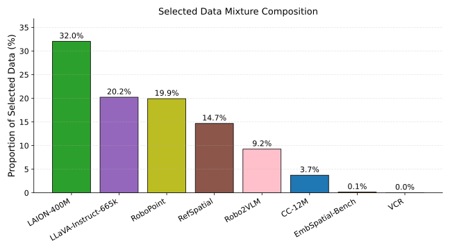
그림 6: proximity-based selection 이후 선택된 mid-training data mixture의 구성으로, 최종 mixture에서 각 VLM source dataset이 차지하는 비율로 표시된다.
그림 [6](#A1.F6 "Figure 6 ‣ A.6 Selected Data Mixture Composition ‣ Appendix A Appendix ‣ EmbodiedMidtrain: Bridging the Gap between Vision-Language Models and Vision-Language-Action Models via Mid-training")은 proximity-based data selection 이후 mid-training mixture의 구성을 보여준다. LAION-400M이 가장 큰 비중(32.0%)을 차지하며, LLaVA-Instruct-665k(20.2%)와 RoboPoint(19.9%)가 그 뒤를 따른다. RefSpatial과 Robo2VLM은 각각 14.7%와 9.2%를 차지하는 반면, CC-12M은 작은 비율(3.7%)만 기여한다. EmbSpatial-Bench와 VCR은 선택된 mixture에서 거의 존재하지 않는다(0.1% 및 0.0%).
두 가지 pattern이 주목할 만하다. 첫째, LAION-400M의 지배적인 비중은 이 dataset이 VLA domain에 균일하게 가깝기 때문이 아니라, 그 압도적인 규모 때문에 high-scoring sample의 작은 비율조차도 큰 absolute count로 이어지기 때문이다. 이는 sample-level selection의 가치를 부각한다: estimator는 대규모이지만 대부분 out-of-domain인 source에서 유용한 subset을 식별하며, 그렇지 않았다면 dataset-level filtering에 의해 전체가 폐기되었을 것이다. 둘째, 선택된 mixture는 general data와 embodied-oriented data 사이의 balance를 반영한다. RoboPoint와 RefSpatial 같은 embodied-oriented dataset은 그림 [4(a)](#S6.F4.sf1 "In Figure 4 ‣ 6.3 Analysis of selected VLM data ‣ 6 Analysis ‣ EmbodiedMidtrain: Bridging the Gap between Vision-Language Models and Vision-Language-Action Models via Mid-training")의 score distribution과 일관되게 원래 pool size 대비 훨씬 높은 rate로 유지되지만, mixture를 지배하지는 않는다. 이는 proximity estimator가 specialized source의 spatial 및 embodied reasoning과 large-scale general data의 complementary visual knowledge를 결합하는 diverse mixture를 자연스럽게 curate한다는 것을 시사한다.
### A.7 VLM Mid-training 이후 능력 유지
우리의 주요 목표는 downstream VLA adaptation을 위한 initialization으로서 VLM을 개선하는 것이지만, mid-training이 VLM 자체의 original capability profile에 어떤 영향을 미치는지 살펴보는 것 역시 중요하다. 이를 위해 mid-trained model을 BLINK (Fu et al., [2024](#bib.bib12)), POPE (Li et al., [2023b](#bib.bib25)), VisuLogic (Xu et al., [2025](#bib.bib46)), 3DSRBench (Ma et al., [2025](#bib.bib30)) 및 SpatialEval (Wang et al., [2024a](#bib.bib39))을 포함한 VLM benchmark에서 평가한다. 결과는 표 [7](#A1.T7 "Table 7 ‣ A.7 Capability Retention After VLM Mid-training ‣ Appendix A Appendix ‣ EmbodiedMidtrain: Bridging the Gap between Vision-Language Models and Vision-Language-Action Models via Mid-training")에 보고되어 있다.
전반적으로, mid-training은 original VLM capability profile을 대체로 보존하면서 performance의 선택적 변화를 유도한다. POPE에서는 performance가 거의 변하지 않고, VisuLogic과 3DSRBench에서는 향상되며, BLINK와 SpatialEval에서는 중간 정도로 감소한다. 이는 VLM mid-training이 모든 original capability를 균일하게 유지하는 것이 아니라, embodied downstream adaptation과 더 관련 있는 skill 쪽으로 model을 재지향한다는 것을 시사한다.
|  |  |  |  |  |  |
| --- | --- | --- | --- | --- | --- |
| 모델 | POPE | BLINK | VisuLogic | 3DSRBench | SpatialEval |
| InternVL3.5-1B | 86.33 | 43.45 | 21.00 | 47.87 | 49.82 |
| +EmbodiedMidtrain | 86.29 | 40.45 | 24.90 | 49.51 | 48.00 |
표 7: mid-training 전후 VLM benchmark에서 InternVL3.5-1B의 성능.
