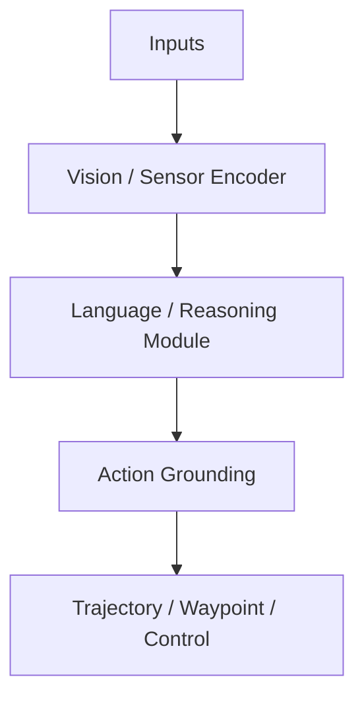

# Week {week:02d}. {title}

- 날짜: {date}
- 진행: Week {week}/{total_weeks}
- Deep read: {deep}
- 원문 링크: {deep_url}
- Skim: {skim}
- 이번 주 산출물: {output}

## 1. 한 문장 결론

## 2. 한국어 번역 요약

### 2.1 제목 번역

### 2.2 Abstract 한국어 번역

### 2.3 핵심 기여 번역·정리

## 3. 시각적 개념 지도

## 4. Architecture 분석

| 구성요소 | 역할 | 확인할 질문 |
|---|---|---|
| Visual input |  |  |
| Language module |  |  |
| Action head |  |  |
| Planner / controller |  |  |

## 5. Action Grounding 분석

| 항목 | 분석 |
|---|---|
| action representation |  |
| text에서 action으로 가는 경로 |  |
| closed-loop 가능성 |  |
| safety risk |  |

## 6. Evaluation 분석

| 평가 축 | 내용 | 신뢰도 코멘트 |
|---|---|---|
| Dataset |  |  |
| Metric |  |  |
| Open-loop |  |  |
| Closed-loop |  |  |
| Long-tail / safety |  |  |

## 7. 관련 논문 비교

| 논문 | 계열 | language 역할 | action 출력 | 평가 방식 | 핵심 차이 |
|---|---|---|---|---|---|

## 8. 이번 주 핵심 용어

| 용어 | 의미 | VLA for AD에서의 중요성 |
|---|---|---|

## 9. 비판적 코멘트

- 가장 설득력 있는 주장:
- 가장 의심스러운 주장:
- 실험상 부족한 점:
- 실제 자율주행 적용 시 위험 요소:

## 10. 다음 주로 넘길 질문

1.
2.
3.
