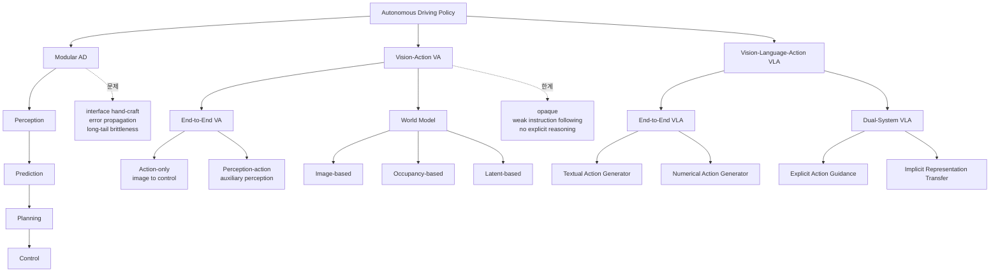
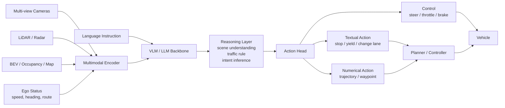
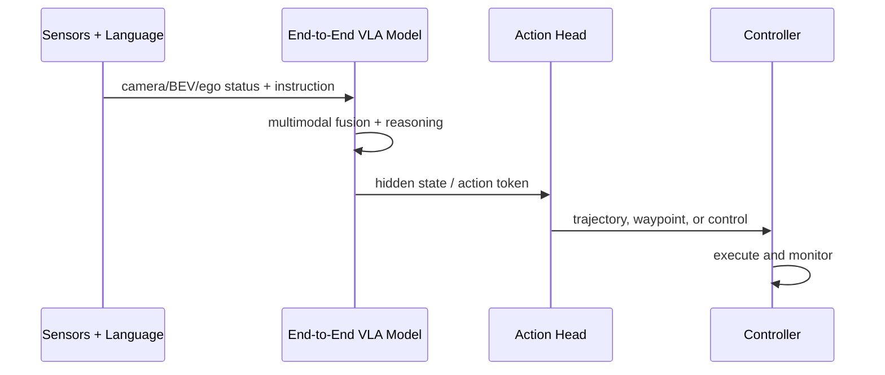
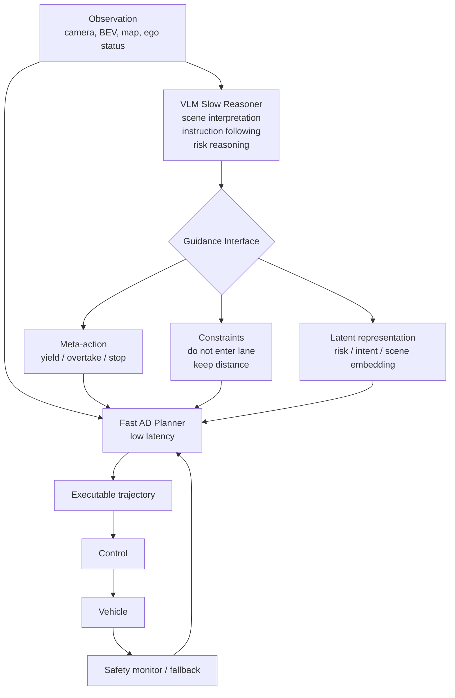
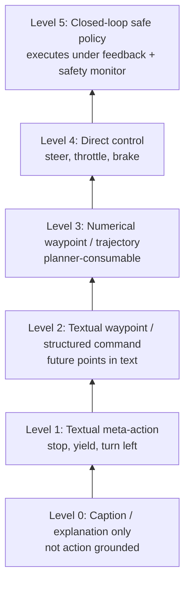
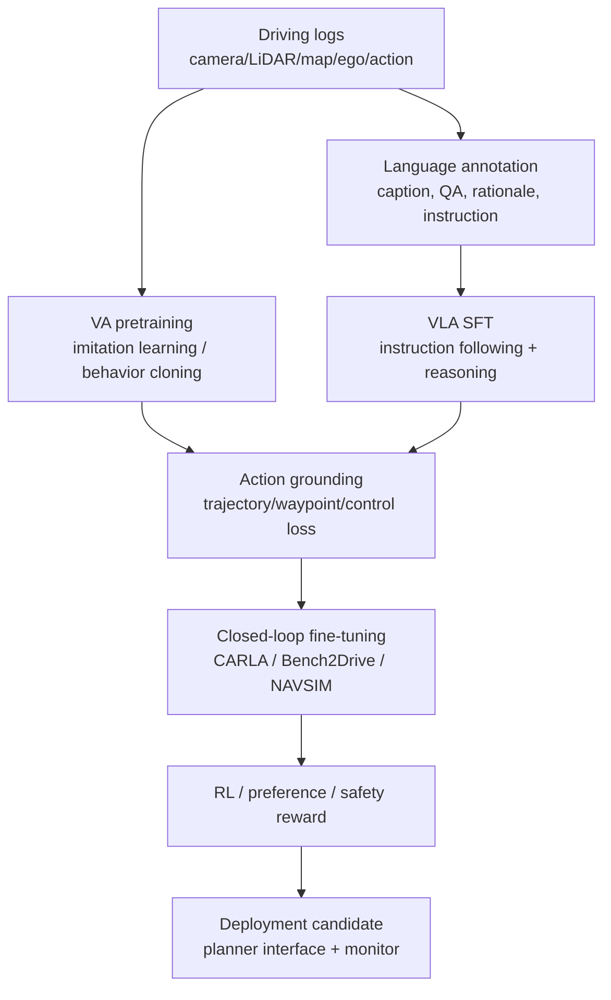
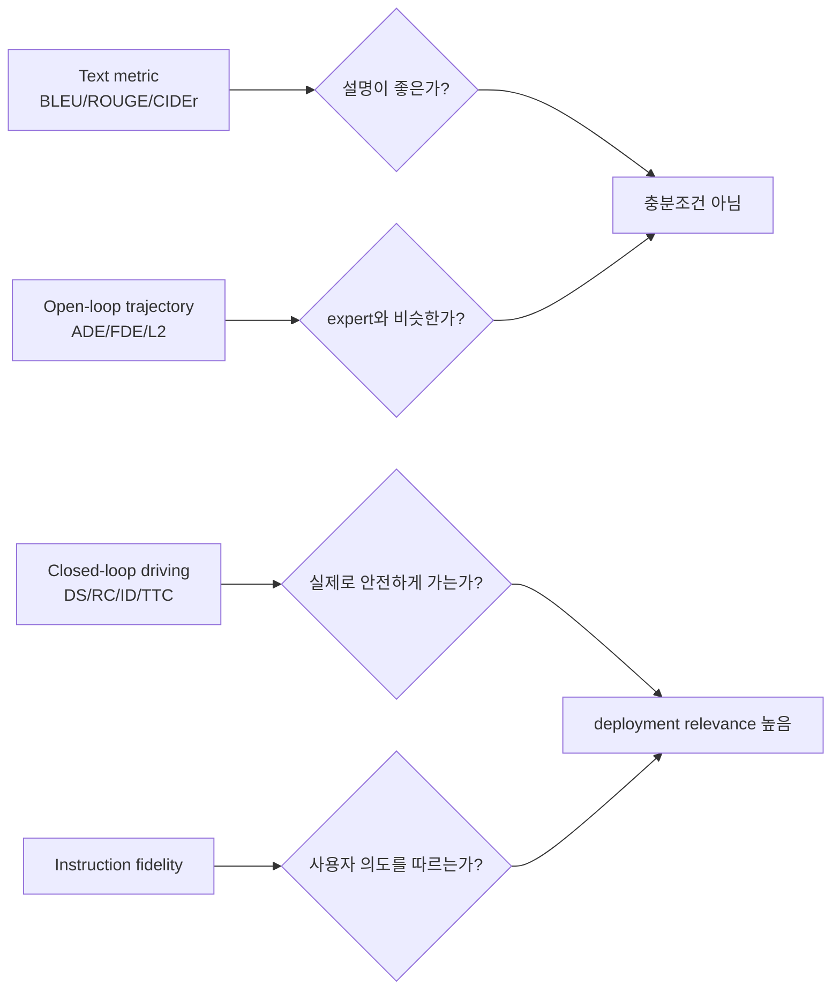
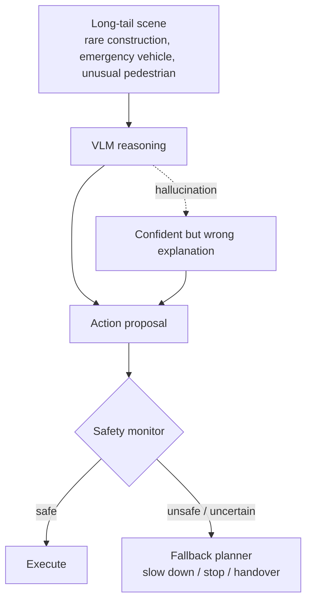
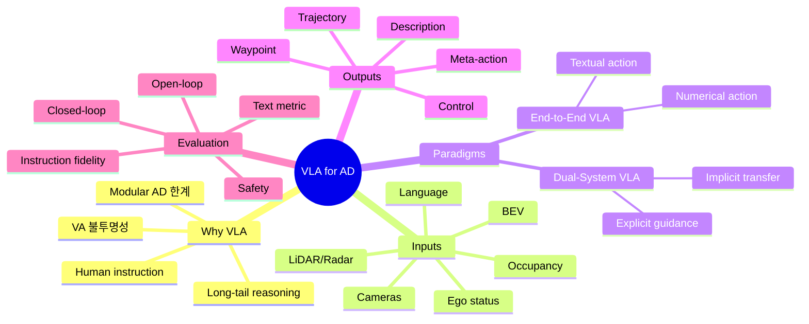

# Week 01. VLA for AD 지형도와 taxonomy

## Metadata

| 항목 | 내용 |
|---|---|
| 날짜 | 2026-04-28 |
| 주차 | 1 / 12 |
| 원문 제목 | Vision-Language-Action Models for Autonomous Driving: Past, Present, and Future |
| 한국어 제목 | 자율주행을 위한 Vision-Language-Action 모델: 과거, 현재, 미래 |
| 원문 URL | https://arxiv.org/abs/2512.16760 |
| arXiv | 2512.16760v2, Robotics (cs.RO), Survey, 47 pages |
| 보조 자료 | VLA4AD project page, awesome-vla-for-ad README, HuggingFace leaderboard |
| Taxonomy | Survey / VLA for Autonomous Driving / VA→VLA taxonomy / End-to-End VLA vs Dual-System VLA |
| Reading mode | Deep reading + taxonomy map 중심 정리 |
| Extraction note | arXiv abstract page와 arXiv HTML 전문, GitHub README를 사용했다. PDF 원문을 줄 단위 전체 번역하지 않고, 학습 목적의 한국어 노트로 재구성했다. |

---

## 1. 이번 주 한 문장 결론

**VLA for Autonomous Driving의 핵심은 “차량이 무엇을 봤는가”를 “왜 그렇게 판단했는가”와 “어떤 trajectory/action으로 실행할 것인가”까지 연결하는 것이며, 현재 지형도는 크게 `VA → End-to-End VLA → Dual-System VLA`로 읽어야 한다.**

> 이번 주의 목표는 특정 모델 하나를 외우는 것이 아니라, 앞으로 12주 동안 읽을 논문들을 꽂아 넣을 **좌표계(taxonomy)** 를 만드는 것이다.

---

## 2. 논문 제목·Abstract 한국어 번역

### 2.1 제목 번역

**Vision-Language-Action Models for Autonomous Driving: Past, Present, and Future**  
→ **자율주행을 위한 Vision-Language-Action 모델: 과거, 현재, 미래**

### 2.2 Abstract 한국어 번역

자율주행은 오랫동안 모듈형 **“Perception-Decision-Action” pipeline**에 의존해 왔다. 이 구조에서는 사람이 설계한 인터페이스와 rule-based component가 복잡하거나 long-tail 상황에서 자주 한계를 드러낸다. 또한 cascade 구조 때문에 perception 오류가 뒤 단계로 전파되어 planning과 control 성능을 떨어뜨린다.

**Vision-Action (VA)** 모델은 시각 입력에서 action으로 직접 매핑을 학습함으로써 일부 한계를 해결하지만, 여전히 내부 의사결정이 불투명하고 distribution shift에 민감하며 structured reasoning이나 instruction-following 능력이 부족하다.

최근 **Large Language Models (LLMs)** 와 multimodal learning의 발전은 **Vision-Language-Action (VLA)** framework의 등장을 촉진했다. VLA는 perception과 language-grounded decision making을 통합한다. 시각 이해, 언어적 reasoning, 실행 가능한 output을 결합함으로써 VLA는 더 해석 가능하고, 일반화 가능하며, 인간 의도와 정렬된 driving policy로 가는 경로를 제공한다.

이 논문은 자율주행에서 새롭게 형성되고 있는 VLA landscape를 구조적으로 정리한다. 저자들은 초기 VA 접근에서 현대 VLA framework로의 진화를 추적하고, 기존 방법들을 두 가지 주요 paradigm으로 조직한다. 첫째는 perception, reasoning, planning을 하나의 모델 안에 통합하는 **End-to-End VLA**이고, 둘째는 VLM을 통한 느린 숙고와 planner를 통한 빠르고 safety-critical한 실행을 분리하는 **Dual-System VLA**이다.

이 두 paradigm 안에서 저자들은 textual action generator와 numerical action generator, explicit guidance와 implicit guidance 같은 하위 유형도 구분한다. 또한 VLA 기반 driving system을 평가하기 위한 대표 dataset과 benchmark를 요약하고, robustness, interpretability, instruction fidelity 같은 핵심 challenge와 open direction을 제시한다. 전체적으로 이 논문은 human-compatible autonomous driving system을 발전시키기 위한 일관된 foundation을 세우는 것을 목표로 한다.

### 2.3 Abstract를 한 줄로 압축

**모듈형 AD와 VA의 한계를 넘어, VLA는 시각·언어·행동을 하나의 학습/추론 체계로 묶되, 실행 가능성과 safety를 위해 End-to-End와 Dual-System이라는 두 설계 축으로 발전하고 있다.**

---

## 3. 핵심 기여 3~5개

| # | 기여 | 왜 중요한가 |
|---:|---|---|
| 1 | **VA→VLA 진화 경로 정리** | 기존 end-to-end driving, world model, VLM-based driving을 하나의 역사적 흐름으로 연결한다. |
| 2 | **VLA taxonomy 제안** | VLA를 `End-to-End VLA`와 `Dual-System VLA`로 나누고, 다시 textual/numerical action, explicit/implicit guidance로 세분화한다. |
| 3 | **Action grounding 관점 도입** | “언어로 설명하는 모델”과 “실제로 trajectory/control을 내는 모델”을 구분할 기준을 제공한다. |
| 4 | **Dataset/benchmark map 정리** | nuScenes, WOD-E2E, NAVSIM, Bench2Drive 등 open-loop/closed-loop 평가 축을 비교한다. |
| 5 | **미래 challenge 정리** | latency, driving-specific foundation model 부재, long-tail generalization, reasoning-action alignment, 안전 검증 생태계를 핵심 과제로 제시한다. |

---

## 4. VLA for AD taxonomy 위치

### 4.1 전체 지형도

### 4.2 VA vs VLA 비교표

| 축 | VA (Vision-Action) | VLA (Vision-Language-Action) | 학습 포인트 |
|---|---|---|---|
| 입력 | 주로 camera/LiDAR/BEV/occupancy | vision + language instruction + scene description + ego status + traffic rule | 언어가 단순 annotation인지, policy input인지 구분 |
| 중간 reasoning | 대부분 implicit | explicit reasoning 또는 latent reasoning 가능 | CoT가 action 품질에 실제로 기여하는지 봐야 함 |
| 출력 | trajectory, waypoint, control | textual action, numerical action, meta-action, planner guidance | 출력이 executable한가가 핵심 |
| 장점 | latency 낮음, 구조 단순, closed-loop 실험 쉬움 | interpretability, instruction following, long-tail reasoning 가능성 | 자율주행에서는 “설명”보다 “안전한 실행”이 중요 |
| 약점 | 불투명성, distribution shift 취약 | latency, hallucination, action grounding 불안정 | VLM을 그대로 차에 얹을 수 없음 |
| 대표 계열 | LBC, TransFuser, UniAD류, world models | DriveLM, LMDrive, DriveVLM, AutoVLA, DriveAgent-R1 등 | 앞으로 논문별 위치를 이 표에 꽂기 |

### 4.3 End-to-End VLA vs Dual-System VLA

| 구분 | End-to-End VLA | Dual-System VLA |
|---|---|---|
| 기본 아이디어 | 하나의 multimodal model이 perception→reasoning→action을 직접 연결 | 느린 VLM reasoning과 빠른 planner/control을 분리 |
| System analogy | “한 모델이 보고 생각하고 운전” | Kahneman식 System 2 + System 1 구조 |
| 장점 | unified training, language-action alignment를 직접 학습 가능 | latency/safety-critical execution에 유리, 기존 planner와 결합 쉬움 |
| 단점 | 실시간성, 검증성, failure isolation 어려움 | interface 설계가 어렵고 VLM output이 planner에 잘 grounding되어야 함 |
| action grounding | 모델 output이 바로 waypoint/trajectory/control이거나 action token | VLM output이 meta-action, constraint, latent representation으로 planner를 guide |
| 평가 | open-loop trajectory + closed-loop CARLA/Bench2Drive가 중요 | planner interface의 safety, fallback, intervention metric이 중요 |
| 언제 유리한가 | 연구적으로 end-to-end alignment를 보고 싶을 때 | 실제 차량 시스템에 점진적으로 통합하고 싶을 때 |

---

## 5. Architecture / pipeline 시각화

### 5.1 VLA의 공통 구성요소

### 5.2 End-to-End VLA pipeline

### 5.3 Dual-System VLA pipeline

### 5.4 Action grounding ladder

**해석:** VLA 논문을 읽을 때 “언어를 썼다”보다 중요한 질문은 **어느 level까지 action grounding이 되었는가**이다. Level 0~1은 explainable driving에 가깝고, Level 3~5부터 실제 driving policy 논문으로 볼 수 있다.

---

## 6. Input → Reasoning → Action Grounding 분석

| 축 | 논문이 정리한 옵션 | 분석 질문 | 위험 |
|---|---|---|---|
| Sensor input | RGB multi-view, LiDAR, radar | raw image를 직접 쓰는가, BEV/occupancy로 구조화하는가? | visual token 폭증, latency 증가 |
| Latent representation | BEV, occupancy grid, latent scene token | spatial reasoning이 가능한 표현인가? | latent가 해석 불가능하면 safety 검증 어려움 |
| Language input | system prompt, instruction, scene description, traffic rule, ego status, context examples | 언어가 policy condition인가, 단순 explanation target인가? | prompt sensitivity, hallucination |
| VLM role | direct action generation, guidance generation | VLM이 action을 직접 내는가, planner를 보조하는가? | VLM latency와 nondeterminism |
| Action head | language head, MLP/GRU head, diffusion head, action token | continuous trajectory로 변환되는 경로가 명확한가? | text는 그럴듯하지만 실행 불가능할 수 있음 |
| Output | description, meta-action, trajectory, control | controller가 바로 사용할 수 있는가? | action grounding gap |
| Evaluation | open-loop, closed-loop | 예측만 맞는가, 실제 simulator에서 안전하게 도는가? | open-loop overfitting |

### 6.1 언어의 역할 4단계

| 단계 | 언어 역할 | 예시 | VLA라고 부를 수 있는가? |
|---|---|---|---|
| A | 사후 설명 | “왜 멈췄는지 설명” | 약한 VLA / explainable AD |
| B | 입력 instruction | “다음 교차로에서 좌회전” | VLA 핵심 조건 중 하나 |
| C | 중간 reasoning | “보행자가 있으므로 감속” | interpretability에 중요 |
| D | action grounding | reasoning이 waypoint/control을 바꿈 | 강한 VLA |

### 6.2 Textual action vs Numerical action

| 출력 유형 | 장점 | 단점 | 대표적 사용처 |
|---|---|---|---|
| Textual meta-action | 해석 쉬움, VLM과 자연스럽게 연결 | controller가 바로 못 씀 | high-level planner guidance |
| Textual waypoint | 언어 reasoning과 trajectory를 한 공간에 표현 | 숫자 정밀도와 format 안정성 문제 | instruction-following planning 연구 |
| Numerical waypoint | planner/controller 연결 쉬움 | reasoning trace가 약할 수 있음 | end-to-end driving policy |
| Direct control | 폐루프 실행 단순 | 안전 검증과 smoothness 어려움 | CARLA closed-loop 실험 |
| Latent guidance | fast planner와 결합 쉬움 | 해석성 낮음 | dual-system distillation/representation transfer |

---

## 7. Training recipe

이 survey는 특정 단일 training recipe를 제안하는 논문은 아니지만, VLA for AD에서 반복되는 학습 패턴을 다음처럼 정리할 수 있다.

### 7.1 Training component별 체크리스트

| 구성 | 가능한 loss/reward | 확인할 질문 |
|---|---|---|
| Perception/representation | detection, map, BEV, occupancy auxiliary loss | action 성능 향상에 실제 기여하는가? |
| Language alignment | captioning, QA, rationale SFT | 설명만 좋아지고 운전은 그대로 아닌가? |
| Trajectory grounding | L2, ADE/FDE, waypoint regression, control loss | reasoning token과 trajectory가 연결되어 있는가? |
| RL / safety reward | collision penalty, route completion, comfort, format consistency | reward hacking 없이 safety가 좋아지는가? |
| Distillation | large VLM → compact driving model | latency가 줄면서 reasoning signal이 남는가? |

### 7.2 이번 논문에서 특히 중요한 training 관찰

- **VA는 주로 imitation learning / reinforcement learning으로 시각→행동 mapping을 학습**한다.
- **VLA는 여기에 language supervision과 VLM backbone을 얹는다.** 하지만 언어 annotation이 있다고 곧바로 action grounding이 되는 것은 아니다.
- 최신 textual action 계열에서는 **CoT supervision + RL**로 reasoning path를 driving decision에 맞추려는 시도가 등장한다.
- numerical action 계열에서는 **MLP/GRU/diffusion/action token** 등을 붙여 VLM hidden state를 trajectory/control로 변환한다.
- Dual-System 계열에서는 VLM을 직접 controller로 쓰기보다 **planner를 guide하거나 representation을 transfer**하는 방향이 현실적이다.

---

## 8. Dataset / Benchmark / Metric 분석

### 8.1 Dataset 지형도

| 유형 | 대표 데이터셋/벤치마크 | 포함 modality | VLA 관점에서의 의미 |
|---|---|---|---|
| Vision-Action dataset | BDD100K, nuScenes, Waymo Open Dataset, Argoverse 2 | sensor + trajectory/action | VA 및 numerical action 학습의 기반 |
| VLA-compatible dataset | DriveLM, BDD-X, CoVLA류 | vision + language + action/rationale | 언어와 action을 정렬하는 데 필요 |
| Simulator benchmark | CARLA, Bench2Drive | closed-loop interaction | 실제 policy 안정성 평가 |
| Planning benchmark | nuScenes planning, WOD-E2E, NAVSIM/nuPlan | trajectory prediction/planning | open-loop와 pseudo closed-loop 사이의 연결 |
| Leaderboard/resource | VLA4AD HuggingFace leaderboard | 모델/데이터셋 비교 | 빠르게 변하는 VLA landscape 추적 |

### 8.2 Open-loop vs Closed-loop 평가

| 평가 | 정의 | 대표 metric | 장점 | 한계 |
|---|---|---|---|---|
| Open-loop | expert trajectory와 예측 trajectory를 비교 | L2 error, ADE, FDE, Miss Rate, collision rate | 빠르고 재현성 높음 | 실제 실행 시 compounding error를 못 봄 |
| Closed-loop | simulator/environment 안에서 policy 실행 | Route Completion, Driving Score, Infraction Distance, Success Rate, Comfort, TTC | deployment realism 높음 | simulator bias, 비용, reproducibility 문제 |
| Text evaluation | language output 품질 평가 | BLEU, ROUGE, CIDEr, rationale consistency, human preference | 설명/명령 품질 측정 | 운전 안전성과 약하게만 연결될 수 있음 |

### 8.3 Metric을 읽는 법

**핵심:** VLA 논문에서 text metric만 좋아지는 것은 큰 의미가 없다. **closed-loop 안전성, trajectory feasibility, instruction fidelity**가 함께 좋아져야 진짜 발전이다.

---

## 9. 관련 논문 비교표

이번 주는 대표 논문 전체를 깊게 읽기보다, 앞으로 읽을 논문들의 taxonomy 위치를 잡는다.

| 계열 | 대표 논문/모델 | 핵심 질문 | Action grounding 수준 | 앞으로의 주차 |
|---|---|---|---|---|
| Modular / planning-oriented E2E | UniAD | perception-prediction-planning을 end-to-end로 묶을 수 있는가? | numerical trajectory 중심 | Week 2 |
| Sensor fusion VA | TransFuser | camera/LiDAR fusion이 driving policy를 얼마나 개선하는가? | waypoint/control | Week 2 skim |
| World model | Drive-WM, OccWorld, DriveDreamer | 미래 scene/occupancy를 예측해 planning에 쓰는가? | future prediction → planning | Week 3 |
| Explainable VLA | DriveLM, DriveGPT4 | driving scene을 언어로 이해/설명할 수 있는가? | 주로 text/action 약함 | Week 4 |
| Retrieval/CoT VLA | RAG-Driver, Reason2Drive, DriveCoT | reasoning과 retrieval이 decision 품질을 높이는가? | text→decision | Week 5 |
| Numerical VLA | LMDrive, ORION, SimLingo | VLM이 실제 waypoint/control을 만들 수 있는가? | 높음 | Week 6 |
| Efficient VLA | AutoVLA, OpenDriveVLA, DriveMoE | VLA latency와 cost를 줄일 수 있는가? | numerical/efficient | Week 7 |
| Dual-System VLA | DriveVLM, Senna, LeapAD | VLM reasoning과 fast planner를 안전하게 분리할 수 있는가? | guidance→planner | Week 8 |
| VLM supervision | DiMA, VLM-AD | VLM을 teacher로 써서 deployable model을 만들 수 있는가? | distillation | Week 9 |
| Benchmark | DriveBench, CoVLA, DriveAction | 무엇을 측정해야 VLA driving을 제대로 평가하는가? | evaluation-centric | Week 10 |
| RL reasoning | Drive-R1, DriveAgent-R1, AlphaDrive | RL로 reasoning-action alignment를 강화할 수 있는가? | meta-action/trajectory reward | Week 11 |
| VLA world model | Learning VLA World Models for AD | world model과 VLA를 합칠 수 있는가? | long-horizon action/world prediction | Week 12 |

### 9.1 Taxonomy matrix

| 모델 유형 | Perception | Language | Action | 장점 | 핵심 리스크 |
|---|---:|---:|---:|---|---|
| Modular AD | 높음 | 낮음 | 높음 | 검증/분해 쉬움 | error propagation |
| VA E2E | 높음 | 없음/낮음 | 높음 | 단순·빠름 | opaque, weak generalization |
| VA World Model | 높음 | 낮음 | 중간~높음 | 미래 예측 가능 | world/action mismatch |
| Textual VLA | 높음 | 높음 | 낮음~중간 | 설명/추론 좋음 | 실행 불가능할 수 있음 |
| Numerical VLA | 높음 | 높음 | 높음 | action grounding 강함 | latency/검증 난이도 |
| Dual-System VLA | 높음 | 높음 | 높음 | 현실적 통합 가능 | interface 설계 실패 위험 |

---

## 10. 강점과 한계

### 10.1 강점

1. **좌표계를 제공한다.**  
   VLA for AD 논문들이 빠르게 늘어나는 상황에서 End-to-End / Dual-System, textual / numerical, explicit / implicit이라는 분류는 유용한 map이다.

2. **VA와 VLA를 깔끔하게 구분한다.**  
   VA는 “vision에서 action으로 직접 매핑”이고, VLA는 “language-grounded reasoning과 action output의 결합”이다.

3. **action grounding을 생각하게 만든다.**  
   VLA라는 이름이 붙어도 실제로 차량을 움직일 수 있는 output인지 확인해야 한다.

4. **benchmark blind spot을 드러낸다.**  
   open-loop trajectory error와 text quality만으로는 safety-critical driving을 평가할 수 없다.

5. **연구 로드맵으로 좋다.**  
   이 논문은 특정 SOTA 주장보다 “무엇을 읽어야 하는가”를 알려주는 survey로 가치가 크다.

### 10.2 한계 / 비판적 코멘트

| 한계 | 설명 | 읽을 때 주의점 |
|---|---|---|
| Survey 특성 | 자체 모델이나 새로운 실험 기여는 제한적 | taxonomy의 객관성보다 organizing power를 봐야 함 |
| VLA 정의가 넓음 | language가 조금만 들어가도 VLA로 묶일 수 있음 | 강한 VLA와 약한 VLA를 구분해야 함 |
| Closed-loop safety 부족 | 많은 논문이 open-loop 또는 text 평가에 머무름 | 실제 deployment claim은 보수적으로 해석 |
| Latency 문제 | VLM backbone은 차량 실시간 요구와 충돌 | sub-50ms급 실행 가능성 확인 필요 |
| Hallucination 위험 | 언어 reasoning이 그럴듯하지만 잘못된 action을 만들 수 있음 | reasoning trace를 믿지 말고 action 결과를 검증 |
| Human instruction fidelity | 사람이 지시한 목표와 교통 안전이 충돌할 수 있음 | instruction following보다 safety hierarchy가 우선 |

### 10.3 Safety / long-tail risk 관점

**핵심 비판:** VLA가 long-tail 상황을 “설명”할 수 있다는 것과 long-tail 상황에서 “안전하게 행동”할 수 있다는 것은 다르다. 자율주행에서는 후자가 중요하다.

---

## 11. 실전 학습 포인트

### 11.1 앞으로 논문 읽을 때 항상 물어볼 10개 질문

1. 이 논문은 **VA, End-to-End VLA, Dual-System VLA** 중 어디에 속하는가?
2. language는 **입력, 중간 reasoning, supervision, 출력** 중 어디에 쓰이는가?
3. output은 **textual action**인가, **numerical trajectory/control**인가?
4. action grounding은 어느 수준인가? caption 수준인가, 실제 waypoint/control 수준인가?
5. VLM이 직접 운전하는가, planner를 guide하는가?
6. open-loop metric과 closed-loop metric을 모두 보고하는가?
7. dataset에 language-action alignment가 실제로 존재하는가?
8. latency와 model size가 차량 실시간 제약에 맞는가?
9. failure case와 long-tail scenario를 어떻게 다루는가?
10. safety monitor, fallback, rule constraint가 있는가?

### 11.2 이번 주 암기보다 중요한 구조

### 11.3 개인 연구 감각으로 보는 우선순위

| 우선순위 | 이유 |
|---|---|
| 1. Numerical action grounding | 실제 AD policy로 가려면 trajectory/control이 필요하다. |
| 2. Dual-System VLA | 현재 차량 시스템에 넣기 가장 현실적인 구조다. |
| 3. Closed-loop evaluation | open-loop 성능은 deployment 가능성을 과대평가할 수 있다. |
| 4. Efficient VLA | latency와 token cost 없이는 차량 적용이 어렵다. |
| 5. Safety hierarchy | human instruction보다 traffic rule/safety constraint가 우선이어야 한다. |

---

## 12. 다음 주 질문

다음 주 주제는 **End-to-End AD 기본기 — UniAD: Planning-Oriented Autonomous Driving**이다.

다음 주에 가져갈 질문:

1. UniAD는 VLA는 아니지만, 왜 VLA 이전의 핵심 foundation인가?
2. `planning-oriented perception`은 일반 perception과 무엇이 다른가?
3. BEV representation은 왜 AD에서 표준 중간표현이 되었는가?
4. modular AD와 end-to-end AD 사이에서 UniAD는 어느 지점에 있는가?
5. UniAD식 trajectory planning은 나중에 VLA의 numerical action head와 어떻게 연결되는가?
6. VLA가 UniAD 같은 planner를 대체해야 하는가, 아니면 guide해야 하는가?

---

## 13. 참고 링크

- arXiv abstract: https://arxiv.org/abs/2512.16760
- arXiv HTML: https://arxiv.org/html/2512.16760
- Project page: https://worldbench.github.io/vla4ad
- GitHub README: https://github.com/worldbench/awesome-vla-for-ad
- HuggingFace leaderboard: https://huggingface.co/spaces/worldbench/vla4ad

### 이번 주 최종 takeaway

> **VLA for AD를 볼 때는 “VLM이 들어갔는가?”가 아니라, “언어 기반 reasoning이 executable action으로 어떻게 grounding되는가?”를 봐야 한다.**
