# Week 01. VLA for AD 지형도와 taxonomy

## Metadata

| 항목 | 내용 |
|---|---|
| 날짜 | 2026-07-21 |
| 주차 | 1 / 12 |
| 원문 제목 | Vision-Language-Action Models for Autonomous Driving: Past, Present, and Future |
| 한국어 제목 | 자율주행을 위한 Vision-Language-Action 모델: 과거, 현재, 미래 |
| 저자 | Tianshuai Hu, Xiaolu Liu, Song Wang, Yiyao Zhu, Ao Liang, Lingdong Kong, Guoyang Zhao, Zeying Gong, Jun Cen, Zhiyu Huang, Xiaoshuai Hao, Linfeng Li, Hang Song, Xiangtai Li, Jun Ma, Shaojie Shen, Jianke Zhu, Dacheng Tao, Ziwei Liu, Junwei Liang |
| 원문 URL | https://arxiv.org/abs/2512.16760 |
| 보조 자료 | arXiv HTML/e-print TeX, Project page, awesome-vla-for-ad README, HuggingFace leaderboard |
| Taxonomy | Survey / VA→VLA evolution / End-to-End VLA vs Dual-System VLA / textual action vs numerical action / explicit vs implicit guidance |
| Reading mode | Deep reading + taxonomy map + 앞으로 12주 학습 좌표계 만들기 |
| Extraction note | arXiv abstract page, arXiv HTML 전문, e-print TeX source, GitHub README를 사용했다. PDF 전체를 줄 단위 번역하지 않고, 한국어 학습 노트로 재구성했다. |

---

## 1. 이번 주 한 문장 결론

**VLA for Autonomous Driving을 읽는 핵심 질문은 “VLM을 넣었는가?”가 아니라, “시각·언어 reasoning이 실제 `trajectory / waypoint / control` 같은 executable action으로 얼마나 안전하게 grounding되는가?”이다.**

이번 주는 개별 모델 성능을 외우는 주가 아니라, 앞으로 12주 동안 읽을 AD/VLA 논문들을 꽂아 넣을 **taxonomy 좌표계**를 만드는 주다.

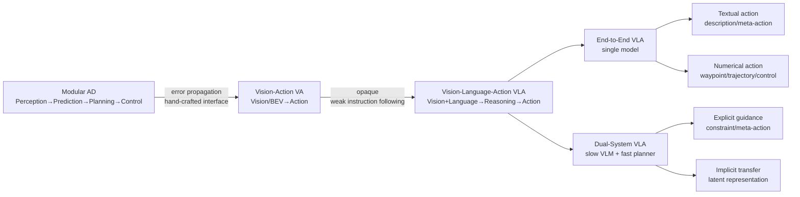

---

## 2. 논문 제목·Abstract 한국어 번역

### 2.1 제목 번역

**Vision-Language-Action Models for Autonomous Driving: Past, Present, and Future**  
→ **자율주행을 위한 Vision-Language-Action 모델: 과거, 현재, 미래**

### 2.2 Abstract 한국어 번역

자율주행은 오랫동안 모듈형 **“Perception-Decision-Action” pipeline**에 의존해 왔다. 이 구조에서는 사람이 설계한 인터페이스와 rule-based component가 복잡하거나 long-tail 상황에서 자주 한계를 드러낸다. 또한 cascade 구조 때문에 perception 오류가 뒤 단계로 전파되어 downstream planning과 control 성능이 저하된다.

**Vision-Action (VA)** 모델은 시각 입력에서 action으로 직접 매핑을 학습함으로써 일부 한계를 해결하지만, 여전히 내부 의사결정이 불투명하고 distribution shift에 민감하며 structured reasoning이나 instruction-following 능력이 부족하다.

최근 **Large Language Models (LLMs)** 와 multimodal learning의 발전은 **Vision-Language-Action (VLA)** framework의 등장을 촉진했다. VLA는 perception과 language-grounded decision making을 통합한다. 시각 이해, 언어적 reasoning, 실행 가능한 output을 결합함으로써 VLA는 더 해석 가능하고, 일반화 가능하며, 인간 의도와 정렬된 driving policy로 가는 경로를 제공한다.

이 논문은 자율주행에서 새롭게 형성되고 있는 VLA landscape를 구조적으로 정리한다. 저자들은 초기 VA 접근에서 현대 VLA framework로의 진화를 추적하고, 기존 방법들을 두 가지 주요 paradigm으로 조직한다. 첫째는 perception, reasoning, planning을 하나의 모델 안에 통합하는 **End-to-End VLA**이고, 둘째는 VLM을 통한 느린 숙고와 planner를 통한 빠르고 safety-critical한 실행을 분리하는 **Dual-System VLA**이다.

이 두 paradigm 안에서 저자들은 textual action generator와 numerical action generator, explicit guidance와 implicit guidance 같은 하위 유형도 구분한다. 또한 VLA 기반 driving system을 평가하기 위한 대표 dataset과 benchmark를 요약하고, robustness, interpretability, instruction fidelity 같은 핵심 challenge와 open direction을 제시한다. 전체적으로 이 논문은 human-compatible autonomous driving system을 발전시키기 위한 일관된 foundation을 세우는 것을 목표로 한다.

### 2.3 Abstract를 한 줄로 압축

**모듈형 AD와 VA의 한계를 넘어, VLA는 시각·언어·행동을 하나의 학습/추론 체계로 묶되, 실행 가능성과 safety를 위해 End-to-End와 Dual-System이라는 두 설계 축으로 발전하고 있다.**

### 2.4 Section-by-section 한국어 요약

| 섹션 | 논문 내용 | 학습자가 잡아야 할 포인트 |
|---|---|---|
| 1. Introduction | Modular AD의 error propagation, VA의 black-box 문제, VLA의 등장 배경을 설명 | VLA는 “언어 추가”가 아니라 **reasoning + action grounding** 문제로 이해해야 함 |
| 2. Preliminary Foundations | VLA를 `a_t = H(F(x))`로 formalize. 입력 `x`, VLM backbone `F`, action head `H`를 분해 | 어떤 논문이든 입력·backbone·head로 쪼개면 구조가 보임 |
| 3. Vision-Action Models | Action-only E2E, Perception-action E2E, image/occupancy/latent world model 계열 정리 | VA는 VLA의 전 단계이며, numerical action 학습의 기반 |
| 4. Vision-Language-Action Models | End-to-End VLA와 Dual-System VLA, textual/numerical action, explicit/implicit guidance 정리 | 이번 주 핵심 taxonomy |
| 5. Datasets & Benchmark | VA/VLA datasets, trajectory/text/closed-loop metric 정리 | text metric만으로 AD 안전성을 말하면 안 됨 |
| 6. Challenges & Future Directions | latency, driving foundation model, long-tail generalization, hallucination, temporal coherence, deployment ecosystem | “좋은 설명”과 “안전한 폐루프 행동” 사이의 gap이 핵심 리스크 |
| 7. Conclusion | VLA는 interpretability, generalization, human interaction을 강화하지만 action alignment와 safety 평가가 남은 과제 | 앞으로 읽을 논문을 이 open problem 기준으로 평가 |

---

## 3. 핵심 기여 3~5개

| # | 핵심 기여 | 한국어 해석 | 왜 중요한가 |
|---:|---|---|---|
| 1 | **VA→VLA 진화 경로 정리** | End-to-end driving, world model, VLM-based driving을 하나의 흐름으로 연결 | VLA를 갑자기 등장한 유행어가 아니라 AD policy 발전사 안에서 이해하게 해준다 |
| 2 | **VLA taxonomy 제안** | `End-to-End VLA`와 `Dual-System VLA`로 나누고, textual/numerical action 및 explicit/implicit guidance로 세분화 | 앞으로 논문을 빠르게 분류할 수 있는 좌표계를 제공한다 |
| 3 | **Action grounding 관점 부각** | “설명하는 모델”과 “실제로 차량 action을 내는 모델”을 구분 | VLA 논문 과장 claim을 걸러내는 기준이 된다 |
| 4 | **Dataset/benchmark map 정리** | VA dataset, VLA dataset, open-loop, closed-loop, text metric을 비교 | evaluation blind spot을 이해할 수 있다 |
| 5 | **미래 challenge 제시** | latency, hallucination, long-tail, instruction fidelity, safety deployment ecosystem 정리 | 실제 연구 주제와 실험 설계를 뽑아낼 수 있다 |

---

## 4. VLA for AD taxonomy 위치

### 4.1 전체 taxonomy map

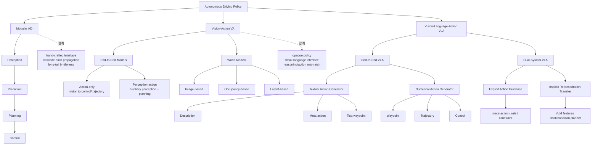

### 4.2 VA vs VLA 비교표

| 축 | VA (Vision-Action) | VLA (Vision-Language-Action) | 읽을 때 질문 |
|---|---|---|---|
| 입력 | camera, LiDAR, BEV, occupancy, ego status | VA 입력 + language instruction, prompt, scene description, traffic rule, context | 언어가 실제 policy input인가, annotation인가? |
| 중간 reasoning | 대부분 implicit latent | explicit CoT 또는 latent language-grounded reasoning 가능 | reasoning이 action을 바꾸는가? |
| 출력 | waypoint, trajectory, control | description, meta-action, waypoint, trajectory, control, planner guidance | executable output인가? |
| 장점 | 빠르고 단순하며 closed-loop 실험이 비교적 쉬움 | instruction following, interpretability, long-tail reasoning 가능성 | 실용 claim은 closed-loop로 확인해야 함 |
| 약점 | black-box, distribution shift 취약 | latency, hallucination, nondeterminism, grounding gap | VLM이 안전-critical loop에 들어갈 수 있는가? |
| 대표 계열 | LBC, TransFuser, UniAD, VAD, world models | DriveLM, RAG-Driver, LMDrive, DriveVLM, AutoVLA, DriveAgent-R1 | taxonomy 안에서 위치 찾기 |

### 4.3 End-to-End VLA vs Dual-System VLA

| 구분 | End-to-End VLA | Dual-System VLA |
|---|---|---|
| 기본 아이디어 | 하나의 multimodal model이 perception→reasoning→action을 직접 연결 | 느린 VLM reasoning과 빠른 planner/control을 분리 |
| System analogy | “한 모델이 보고 생각하고 운전” | System 2 reasoning + System 1 execution |
| 언어 역할 | action generation 자체에 참여 | planner guidance, constraint, representation transfer |
| action grounding | VLM hidden state 또는 language head가 waypoint/control/action token으로 변환 | VLM output이 fast planner의 조건·규칙·목표·latent feature가 됨 |
| 장점 | unified training, language-action alignment를 직접 학습 가능 | latency/safety-critical execution에 유리, 기존 planner와 결합 쉬움 |
| 단점 | 실시간성, 검증성, failure isolation 어려움 | interface 설계가 어렵고 VLM output grounding 실패 가능 |
| 안전 관점 | model-level safety와 closed-loop 검증이 매우 중요 | planner safety monitor/fallback을 붙이기 상대적으로 쉬움 |
| 현실 적용성 | 연구적으로 매력적이나 deployment 부담 큼 | 가까운 시기 차량 stack 통합에는 더 현실적 |

### 4.4 Action grounding ladder

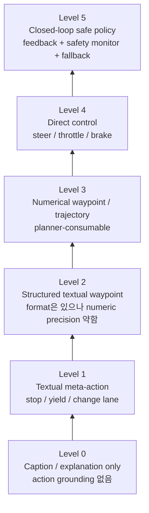

**읽는 법:** VLA라는 이름보다 이 ladder에서 어디에 있는지가 더 중요하다. Level 0~1은 explainable driving 또는 high-level reasoning에 가깝고, Level 3~5부터 실제 AD policy 논문으로 강하게 볼 수 있다.

---

## 5. Architecture / pipeline 시각화

### 5.1 논문이 제시하는 공통 수식

논문은 VLA framework를 다음처럼 볼 수 있다고 정리한다.

```text
a_t = H(F(x_t))

x_t : multimodal input
F   : VLM / multimodal backbone
H   : action prediction head
```

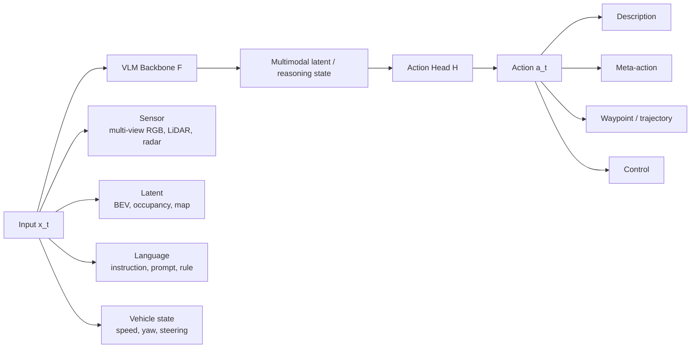

### 5.2 End-to-End VLA pipeline

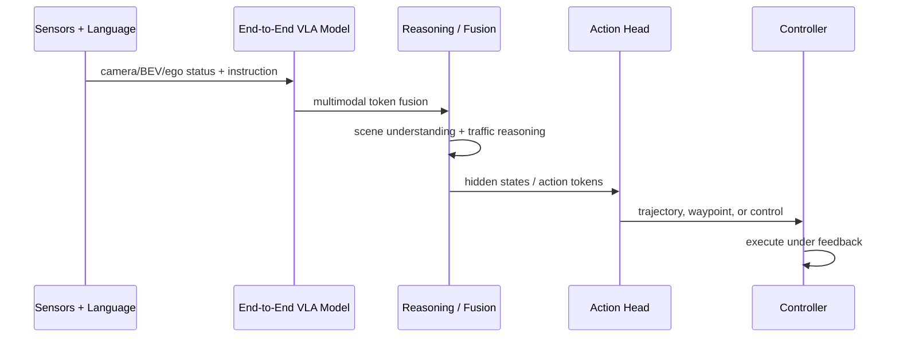

### 5.3 Dual-System VLA pipeline

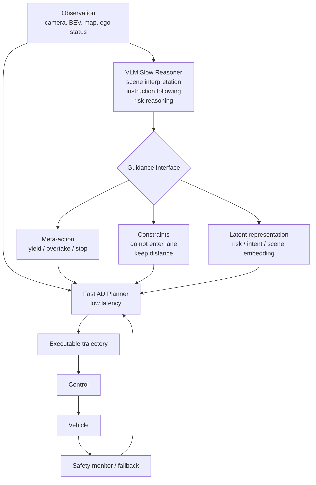

### 5.4 “언어”가 들어가는 위치별 architecture block

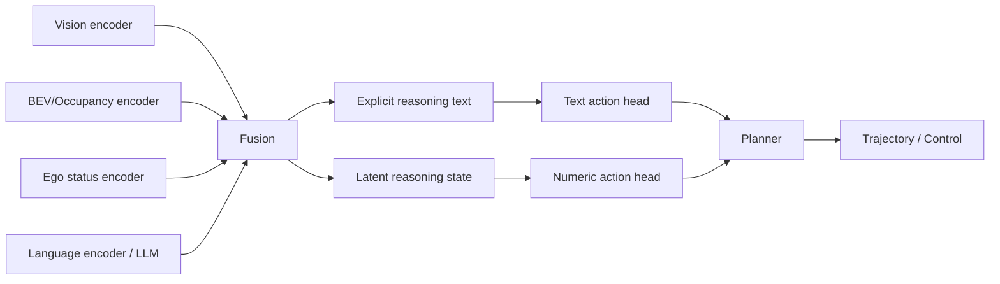

---

## 6. Input → Reasoning → Action Grounding 분석

### 6.1 축별 분석표

| 축 | 논문이 정리한 옵션 | 분석 질문 | 주요 위험 |
|---|---|---|---|
| Sensor input | RGB multi-view, LiDAR, radar | raw image를 직접 쓰는가, BEV/occupancy로 구조화하는가? | visual token 폭증, latency 증가 |
| Latent representation | BEV, occupancy grid, latent scene token | spatial reasoning이 가능한 표현인가? | latent가 해석 불가능하면 safety 검증 어려움 |
| Language input | system prompt, instruction, scene description, traffic rule, ego status, context examples | 언어가 policy condition인가, 단순 explanation target인가? | prompt sensitivity, hallucination |
| VLM role | direct action generation, guidance generation | VLM이 직접 action을 내는가, planner를 보조하는가? | VLM latency와 nondeterminism |
| Action head | language head, MLP/GRU head, diffusion/generative head, action token | continuous trajectory로 변환되는 경로가 명확한가? | text는 그럴듯하지만 실행 불가능할 수 있음 |
| Output | description, meta-action, trajectory, control | controller가 바로 사용할 수 있는가? | action grounding gap |
| Evaluation | open-loop, closed-loop, text metric, instruction fidelity | 실제 driving safety와 연결되는가? | open-loop/text metric 과대평가 |

### 6.2 언어의 역할 5단계

| 단계 | 언어 역할 | 예시 | 강한 VLA인가? |
|---|---|---|---|
| A | 사후 설명 | “왜 멈췄는지 설명” | 약함 — explainable AD에 가까움 |
| B | 입력 instruction | “다음 교차로에서 좌회전” | 조건부 policy라면 VLA 핵심 |
| C | 중간 reasoning | “보행자가 있으므로 감속” | 해석성에는 중요하지만 action 연결 확인 필요 |
| D | planner guidance | “왼쪽 차선 변경 금지”, “보수적으로 감속” | Dual-System VLA에서 중요 |
| E | action grounding | reasoning이 waypoint/control을 실제로 바꿈 | 강한 VLA |

### 6.3 Textual action vs Numerical action

| 출력 유형 | 예시 | 장점 | 단점 | Action grounding 수준 |
|---|---|---|---|---|
| Description | “앞에 보행자가 있다” | 해석 쉬움 | action 아님 | 낮음 |
| Textual meta-action | `slow down`, `yield`, `turn left` | VLM과 자연스럽게 연결, 사람이 이해 가능 | controller가 바로 못 씀 | 중간 |
| Textual waypoint | `[(0,0), (1.2,0.1), ...]`를 텍스트로 출력 | reasoning과 trajectory를 한 space에 표현 | format 안정성·숫자 정밀도 문제 | 중간~높음 |
| Numerical waypoint/trajectory | float tensor trajectory | planner/controller 연결 쉬움 | reasoning trace는 약해질 수 있음 | 높음 |
| Direct control | steer/throttle/brake | closed-loop 실행 단순 | smoothness/safety 검증 어려움 | 높지만 위험 |
| Latent guidance | risk/intent embedding | fast planner와 결합 쉬움 | 해석성 낮음 | 설계에 따라 다름 |

### 6.4 Input-output map

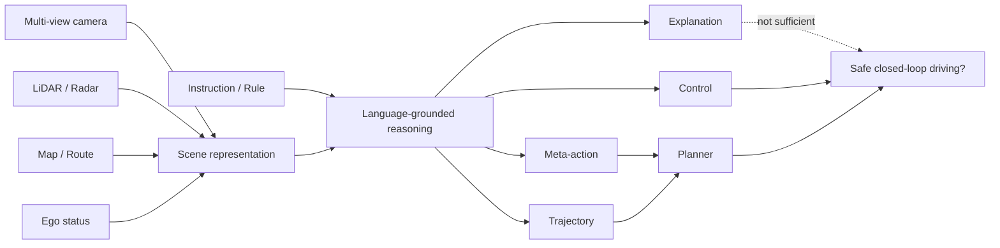

---

## 7. Training recipe

이 논문은 survey라서 새로운 단일 training recipe를 제안하지는 않는다. 하지만 VLA for AD 논문들에서 반복되는 학습 패턴은 다음처럼 정리할 수 있다.

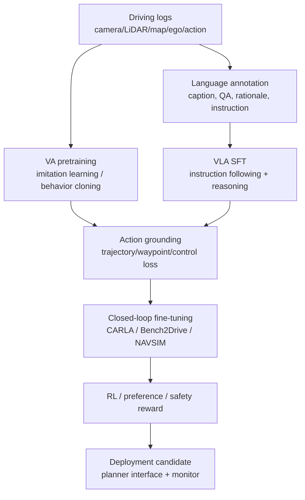

### 7.1 Training component별 체크리스트

| 구성 | 가능한 loss/reward | 확인할 질문 |
|---|---|---|
| Perception/representation | detection, map, BEV, occupancy auxiliary loss | action 성능 향상에 실제 기여하는가? |
| Language alignment | captioning, QA, rationale SFT, instruction tuning | 설명만 좋아지고 운전은 그대로 아닌가? |
| Trajectory grounding | L2, ADE/FDE, waypoint regression, control loss | reasoning token과 trajectory가 연결되어 있는가? |
| RL / safety reward | collision penalty, route completion, comfort, format consistency | reward hacking 없이 safety가 좋아지는가? |
| Distillation | large VLM → compact driving model | latency가 줄면서 reasoning signal이 남는가? |
| Closed-loop adaptation | simulator rollout, intervention penalty, infraction reward | open-loop imitation의 compounding error를 줄이는가? |

### 7.2 VA/VLA 학습 recipe 비교

| Recipe | 주된 supervision | 장점 | 한계 | 어울리는 taxonomy |
|---|---|---|---|---|
| Behavior cloning | expert action / trajectory | 단순하고 scalable | distribution shift, causal confusion | VA, numerical VLA |
| RL fine-tuning | driving score, collision, comfort reward | closed-loop 목표와 직접 연결 | reward design 어려움 | VA, RL-VLA |
| Language SFT | caption, QA, rationale, instruction | reasoning/instruction 능력 강화 | action과 분리될 위험 | textual VLA |
| CoT + action loss | reasoning trace + trajectory/meta-action | reasoning-action alignment 가능 | CoT faithfulness 불확실 | End-to-End VLA |
| VLM distillation | teacher reasoning/features | deployable model 가능 | teacher hallucination 전파 | Dual-System / implicit transfer |

### 7.3 이번 논문에서 특히 중요한 training 관찰

- **VA는 주로 imitation learning / reinforcement learning으로 시각→행동 mapping을 학습**한다.
- **VLA는 여기에 language supervision과 VLM backbone을 얹는다.** 하지만 언어 annotation이 있다고 곧바로 action grounding이 되는 것은 아니다.
- textual action 계열은 설명과 meta-action은 강하지만, controller 연결부가 약할 수 있다.
- numerical action 계열은 AD policy에 가깝지만, VLM hidden state를 trajectory/control로 안정적으로 변환하는 head 설계가 중요하다.
- Dual-System 계열은 VLM을 직접 controller로 쓰기보다 **planner를 guide하거나 representation을 transfer**하는 방향이 더 현실적이다.

---

## 8. Dataset / Benchmark / Metric 분석

### 8.1 Dataset 지형도

| 유형 | 대표 데이터셋/벤치마크 | 포함 modality | VLA 관점에서의 의미 |
|---|---|---|---|
| Vision-Action dataset | BDD100K, nuScenes, Waymo Open Dataset, Argoverse 2, nuPlan | sensor + trajectory/action + map | VA 및 numerical action 학습의 기반 |
| Vision-Language dataset | BDD-X, DriveLM, Talk2Car | vision + caption/QA/instruction/rationale | language reasoning 및 explanation 학습 기반 |
| Vision-Language-Action dataset | CoVLA, ImpromptuVLA, DriveAction 계열 | vision + language + action/trajectory | tri-modal grounding에 직접 필요 |
| Simulator benchmark | CARLA, Bench2Drive | interactive closed-loop | 실제 policy 안정성 평가 |
| Planning benchmark | nuScenes planning, WOD-E2E, NAVSIM/nuPlan | trajectory prediction/planning | open-loop와 pseudo closed-loop 사이의 연결 |
| Resource/leaderboard | awesome-vla-for-ad, VLA4AD HF leaderboard | 모델/데이터셋/코드 목록 | 빠르게 변하는 landscape 추적 |

### 8.2 Metric matrix

| 평가 축 | 대표 metric | 묻는 질문 | 장점 | 한계 |
|---|---|---|---|---|
| Open-loop trajectory | L2, ADE, FDE, Miss Rate, heading error | expert와 비슷한 trajectory를 냈는가? | 빠르고 재현성 높음 | 실행 시 compounding error를 못 봄 |
| Closed-loop driving | Route Completion, Driving Score, No Collision, Infraction Distance, TTC, Comfort | 실제 환경에서 안전하게 가는가? | deployment relevance 높음 | simulator bias, 비용, reproducibility 문제 |
| Text output | BLEU, ROUGE, CIDEr, rationale consistency | 설명이 reference와 비슷한가? | language 품질 측정 가능 | 안전한 driving과 약하게만 연결될 수 있음 |
| Instruction fidelity | success rate, command compliance, human preference | 사용자 의도를 따르는가? | VLA의 차별점 측정 | 안전 규칙과 충돌 시 우선순위 필요 |
| Safety/long-tail | collision, near-miss, rule violation, rare scenario score | rare event에서 버티는가? | 실제 위험과 가까움 | 데이터셋 설계가 어려움 |

### 8.3 Open-loop vs Closed-loop 평가

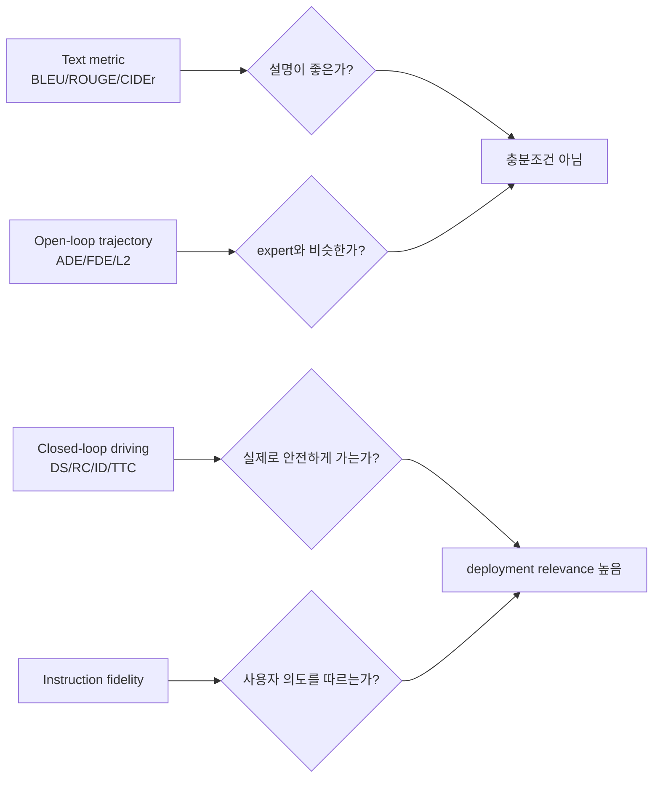

**핵심:** VLA 논문에서 text metric만 좋아지는 것은 큰 의미가 없다. **closed-loop safety, trajectory feasibility, instruction fidelity**가 함께 좋아져야 진짜 발전이다.

---

## 9. 관련 논문 비교표

### 9.1 앞으로 12주 curriculum 속 위치

| 계열 | 대표 논문/모델 | 핵심 질문 | Action grounding 수준 | 앞으로의 주차 |
|---|---|---|---|---|
| Modular / planning-oriented E2E | UniAD | perception-prediction-planning을 end-to-end로 묶을 수 있는가? | numerical trajectory 중심 | Week 2 |
| Sensor fusion VA | TransFuser | camera/LiDAR fusion이 driving policy를 얼마나 개선하는가? | waypoint/control | Week 2 skim |
| World model | Drive-WM, OccWorld, DriveDreamer | 미래 scene/occupancy를 예측해 planning에 쓰는가? | future prediction → planning | Week 3 |
| Explainable VLA | DriveLM, DriveGPT4 | driving scene을 언어로 이해/설명할 수 있는가? | 주로 text/action 약함~중간 | Week 4 |
| Retrieval/CoT VLA | RAG-Driver, Reason2Drive, DriveCoT | reasoning과 retrieval이 decision 품질을 높이는가? | text→decision | Week 5 |
| Numerical VLA | LMDrive, ORION, SimLingo | VLM이 실제 waypoint/control을 만들 수 있는가? | 높음 | Week 6 |
| Efficient VLA | AutoVLA, OpenDriveVLA, DriveMoE | VLA latency와 cost를 줄일 수 있는가? | numerical/efficient | Week 7 |
| Dual-System VLA | DriveVLM, Senna, LeapAD | VLM reasoning과 fast planner를 안전하게 분리할 수 있는가? | guidance→planner | Week 8 |
| VLM supervision | DiMA, VLM-AD | VLM을 teacher로 써서 deployable model을 만들 수 있는가? | distillation | Week 9 |
| Benchmark | DriveBench, CoVLA, DriveAction | 무엇을 측정해야 VLA driving을 제대로 평가하는가? | evaluation-centric | Week 10 |
| RL reasoning | Drive-R1, DriveAgent-R1, AlphaDrive | RL로 reasoning-action alignment를 강화할 수 있는가? | meta-action/trajectory reward | Week 11 |
| VLA world model | Learning VLA World Models for AD | world model과 VLA를 합칠 수 있는가? | long-horizon action/world prediction | Week 12 |

### 9.2 Taxonomy matrix

| 모델 유형 | Perception | Language | Action | 대표 장점 | 핵심 리스크 |
|---|---:|---:|---:|---|---|
| Modular AD | 높음 | 낮음 | 높음 | 검증/분해 쉬움 | error propagation, hand-crafted interface |
| VA E2E | 높음 | 없음/낮음 | 높음 | 단순·빠름 | opaque, weak generalization |
| VA World Model | 높음 | 낮음 | 중간~높음 | 미래 예측 가능 | world/action mismatch |
| Textual VLA | 높음 | 높음 | 낮음~중간 | 설명/추론 좋음 | 실행 불가능하거나 planner 연결 약함 |
| Numerical VLA | 높음 | 높음 | 높음 | action grounding 강함 | latency/검증 난이도 |
| Dual-System VLA | 높음 | 높음 | 높음 | 현실적 통합 가능 | interface 설계 실패, stale guidance |

### 9.3 대표 모델을 읽는 빠른 기준

| 모델을 볼 때 체크 | 좋은 신호 | 경고 신호 |
|---|---|---|
| Output | numerical trajectory/control 또는 planner-consumable constraint | free-form description만 있음 |
| Evaluation | closed-loop + open-loop + safety metric | text metric 또는 single dataset만 보고 |
| Language | instruction이 action을 실제로 바꿈 | 설명 생성만 별도 task |
| Latency | model size, FPS, inference time 보고 | VLM backbone만 강조하고 runtime 없음 |
| Safety | fallback, monitor, rule constraint, long-tail failure 분석 | “LLM world knowledge로 안전” 같은 추상 주장 |

---

## 10. 강점과 한계

### 10.1 강점

1. **좌표계를 제공한다.**  
   VLA for AD 논문들이 빠르게 늘어나는 상황에서 End-to-End / Dual-System, textual / numerical, explicit / implicit이라는 분류는 매우 유용하다.

2. **VA와 VLA를 깔끔하게 구분한다.**  
   VA는 “vision에서 action으로 직접 매핑”이고, VLA는 “language-grounded reasoning과 action output의 결합”이다.

3. **action grounding을 생각하게 만든다.**  
   VLA라는 이름이 붙어도 실제로 차량을 움직일 수 있는 output인지 확인해야 한다.

4. **benchmark blind spot을 드러낸다.**  
   open-loop trajectory error와 text quality만으로는 safety-critical driving을 평가할 수 없다.

5. **연구 로드맵으로 좋다.**  
   이 논문은 특정 SOTA 모델보다 “어떤 축으로 논문을 읽어야 하는가”를 알려주는 survey로 가치가 크다.

### 10.2 한계 / 비판적 코멘트

| 한계 | 설명 | 읽을 때 주의점 |
|---|---|---|
| Survey 특성 | 자체 모델이나 새로운 실험 기여는 제한적 | taxonomy의 객관성보다 organizing power를 봐야 함 |
| VLA 정의가 넓음 | language가 조금만 들어가도 VLA로 묶일 수 있음 | 강한 VLA와 약한 VLA를 구분해야 함 |
| Closed-loop safety 부족 | 많은 논문이 open-loop 또는 text 평가에 머무름 | deployment claim은 보수적으로 해석 |
| Latency 문제 | VLM backbone은 차량 실시간 요구와 충돌 | sub-50ms급 또는 planner 주기 대응 가능성 확인 |
| Hallucination 위험 | 언어 reasoning이 그럴듯하지만 잘못된 action을 만들 수 있음 | reasoning trace를 믿지 말고 action 결과를 검증 |
| Human instruction fidelity | 사람이 지시한 목표와 교통 안전이 충돌할 수 있음 | instruction following보다 safety hierarchy가 우선 |

### 10.3 Safety / long-tail risk 관점

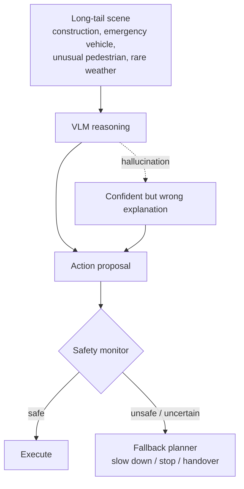

**핵심 비판:** VLA가 long-tail 상황을 “설명”할 수 있다는 것과 long-tail 상황에서 “안전하게 행동”할 수 있다는 것은 다르다. 자율주행에서는 후자가 중요하다.

### 10.4 Risk register

| 리스크 | 발생 위치 | 완화 아이디어 |
|---|---|---|
| Hallucinated rationale | VLM reasoning | perception-action consistency check, factual grounding, uncertainty estimation |
| Slow inference | VLM backbone / multi-view tokens | token pruning, streaming encoder, compact distillation, Dual-System 구조 |
| Bad instruction following | prompt/interface | rule hierarchy, constrained decoding, planner-level validation |
| Open-loop overfitting | benchmark design | closed-loop rollout, counterfactual scenarios, intervention metric |
| Unsafe continuous action | action head | trajectory constraint, MPC/safety shield, fallback planner |

---

## 11. 실전 학습 포인트

### 11.1 앞으로 논문 읽을 때 항상 물어볼 12개 질문

1. 이 논문은 **VA, End-to-End VLA, Dual-System VLA** 중 어디에 속하는가?
2. language는 **입력, 중간 reasoning, supervision, 출력, planner guidance** 중 어디에 쓰이는가?
3. output은 **description, meta-action, textual waypoint, numerical trajectory/control** 중 무엇인가?
4. action grounding은 Level 0~5 중 어디인가?
5. VLM이 직접 운전하는가, planner를 guide하는가?
6. open-loop metric과 closed-loop metric을 모두 보고하는가?
7. dataset에 language-action alignment가 실제로 존재하는가?
8. latency와 model size가 차량 실시간 제약에 맞는가?
9. failure case와 long-tail scenario를 어떻게 다루는가?
10. safety monitor, fallback, rule constraint가 있는가?
11. reasoning trace가 faithful한지, 아니면 그럴듯한 사후 설명인지 확인했는가?
12. human instruction과 traffic safety가 충돌할 때 우선순위가 명확한가?

### 11.2 이번 주 암기보다 중요한 구조

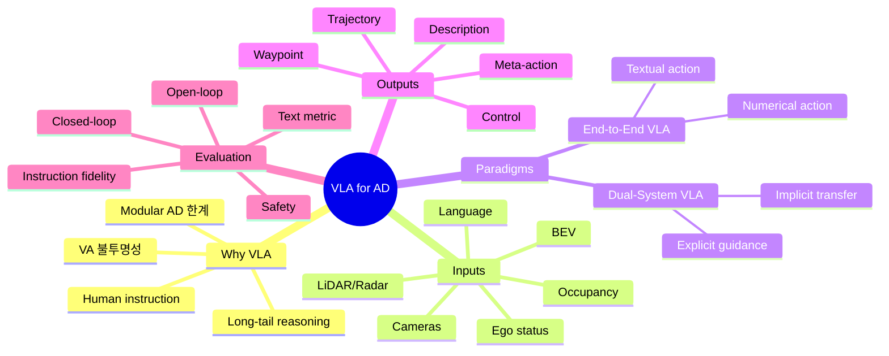

### 11.3 개인 연구 감각으로 보는 우선순위

| 우선순위 | 이유 |
|---|---|
| 1. Numerical action grounding | 실제 AD policy로 가려면 trajectory/control이 필요하다 |
| 2. Dual-System VLA | 현재 차량 시스템에 넣기 가장 현실적인 구조다 |
| 3. Closed-loop evaluation | open-loop 성능은 deployment 가능성을 과대평가할 수 있다 |
| 4. Efficient VLA | latency와 token cost 없이는 차량 적용이 어렵다 |
| 5. Safety hierarchy | human instruction보다 traffic rule/safety constraint가 우선이어야 한다 |
| 6. Long-horizon temporal coherence | AD는 한 프레임 reasoning이 아니라 지속적인 상황 인식 문제다 |

### 11.4 나만의 “VLA 논문 30초 판별법”

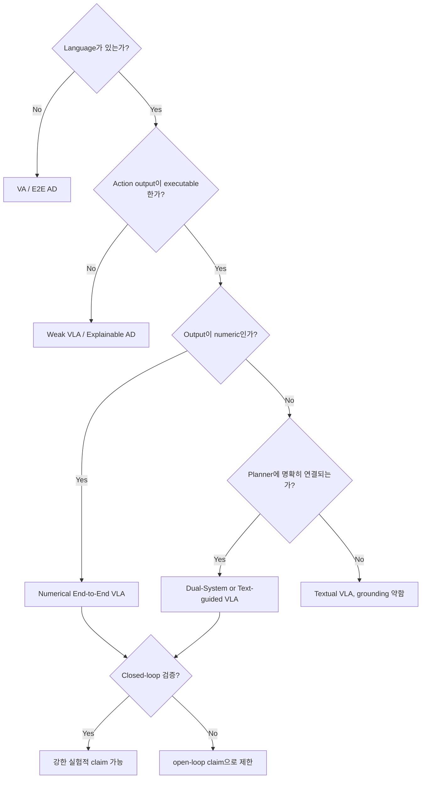

---

## 12. 다음 주 질문

다음 주 주제는 **End-to-End AD 기본기 — UniAD: Planning-Oriented Autonomous Driving**이다.

다음 주에 가져갈 질문:

1. UniAD는 VLA는 아니지만, 왜 VLA 이전의 핵심 foundation인가?
2. `planning-oriented perception`은 일반 perception과 무엇이 다른가?
3. BEV representation은 왜 AD에서 표준 중간표현이 되었는가?
4. modular AD와 end-to-end AD 사이에서 UniAD는 어느 지점에 있는가?
5. UniAD식 trajectory planning은 나중에 VLA의 numerical action head와 어떻게 연결되는가?
6. VLA가 UniAD 같은 planner를 대체해야 하는가, 아니면 guide해야 하는가?
7. UniAD의 open-loop planning metric은 실제 closed-loop safety를 얼마나 설명하는가?

---

## 13. 참고 링크

- arXiv abstract: https://arxiv.org/abs/2512.16760
- arXiv HTML: https://arxiv.org/html/2512.16760
- Project page: https://worldbench.github.io/vla4ad
- GitHub README / awesome list: https://github.com/worldbench/awesome-vla-for-ad
- HuggingFace leaderboard: https://huggingface.co/spaces/worldbench/vla4ad

### 이번 주 최종 takeaway

> **VLA for AD를 볼 때는 “VLM이 들어갔는가?”가 아니라, “언어 기반 reasoning이 executable action으로 어떻게 grounding되고, closed-loop에서 안전하게 검증되는가?”를 봐야 한다.**
