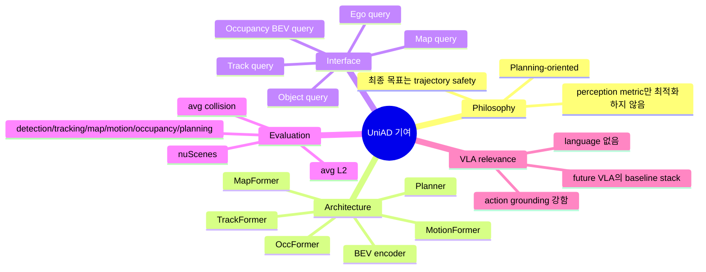
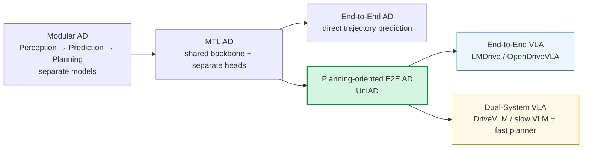
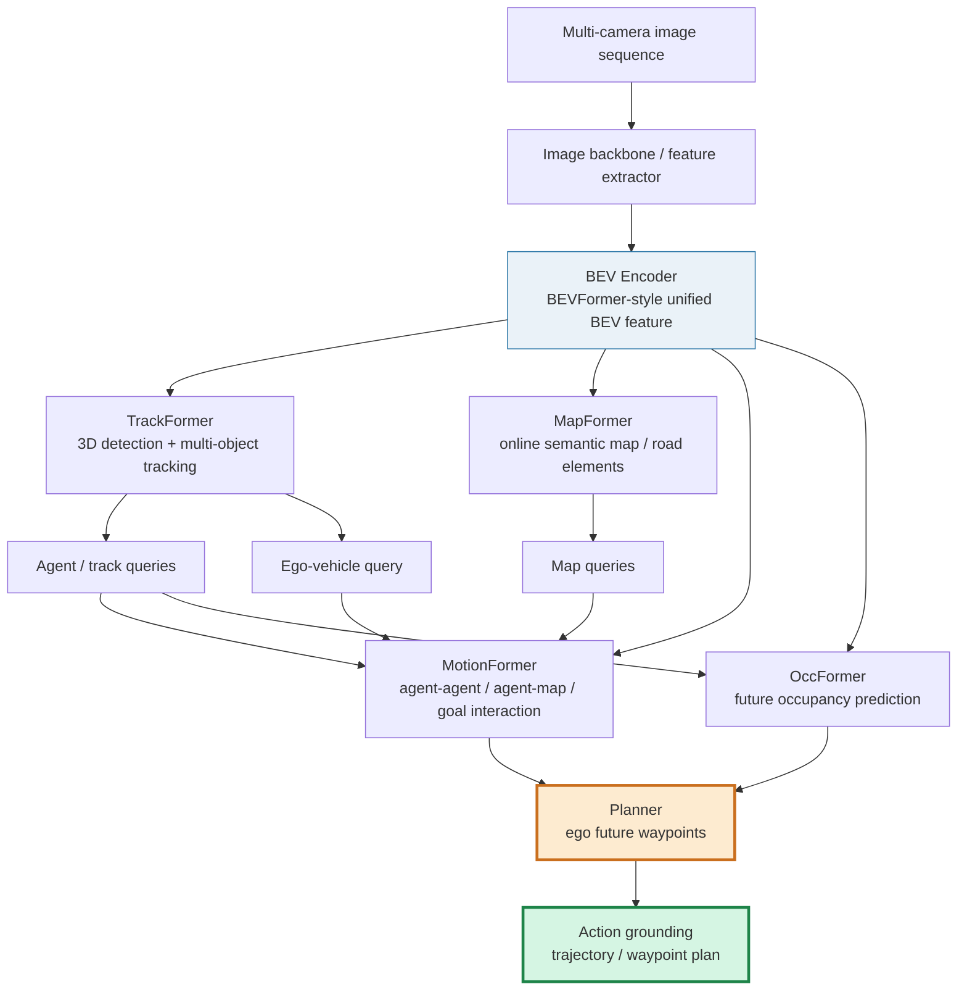
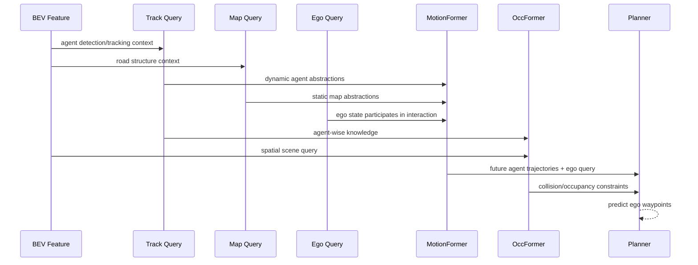
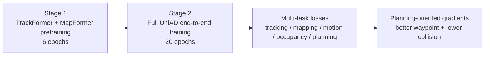
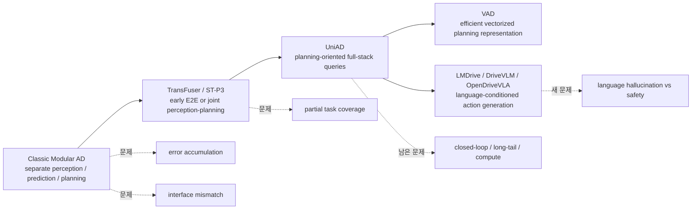
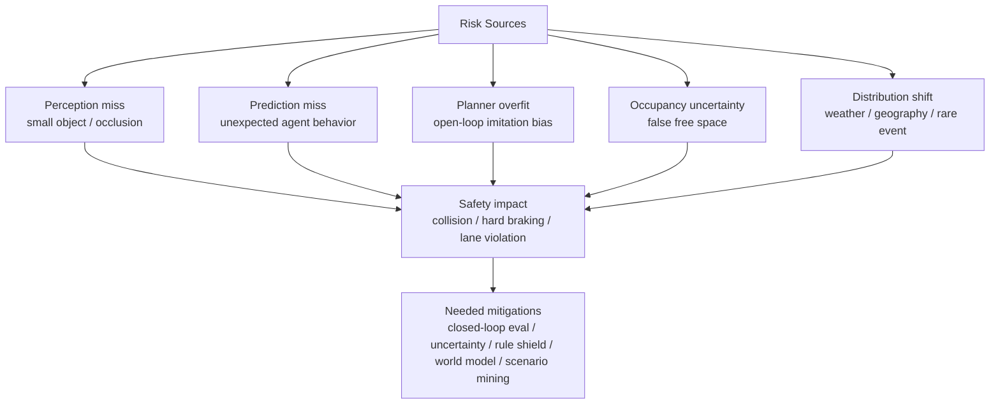

# Week 02. End-to-End AD 기본기: UniAD와 Planning-Oriented Autonomous Driving

- **Date**: 2026-05-05
- **Week**: 02 / 12
- **Original paper**: *Planning-oriented Autonomous Driving* / UniAD
- **Korean title**: **Planning 중심 자율주행: UniAD**
- **URL**: https://arxiv.org/abs/2212.10156
- **Version read**: arXiv:2212.10156v2, project page / ar5iv HTML 기반 요약
- **Authors**: Yihan Hu, Jiazhi Yang, Li Chen, Keyu Li, Chonghao Sima, Xizhou Zhu, Siqi Chai, Senyao Du, Tianwei Lin, Wenhai Wang, Lewei Lu, Xiaosong Jia, Qiang Liu, Jifeng Dai, Yu Qiao, Hongyang Li
- **Taxonomy**: End-to-End Autonomous Driving / Planning-oriented perception-prediction-planning / BEV + query-based multi-task stack
- **Reading mode**: Deep read + 관련 논문 skim: TransFuser, ST-P3, VAD
- **이번 주 focus**: modular AD vs end-to-end AD, BEV representation, planning-oriented perception
- **Output**: Modular AD vs End-to-End AD 비교표

> 참고: PDF 전체 원문을 줄 단위로 번역하지 않고, arXiv abstract/API metadata와 ar5iv HTML에서 확인한 본문 구조·실험·표 내용을 바탕으로 한국어 학습 노트를 작성했다. 핵심 수치와 구조는 논문 본문 기준으로 정리하되, 긴 supplementary 세부 loss/implementation은 요약 수준으로만 다룬다.

---

## 1. 이번 주 한 문장 결론

**UniAD의 핵심은 “자율주행 stack을 그냥 하나의 neural network로 붙이는 것”이 아니라, detection·tracking·mapping·motion forecasting·occupancy prediction을 모두 planning 성능을 높이도록 query interface로 연결한 planning-oriented end-to-end AD 설계라는 점이다.**

VLA for AD 관점에서 UniAD는 아직 language가 없는 **VA / end-to-end AD foundation**에 가깝지만, 이후 LMDrive·DriveVLM·OpenDriveVLA 같은 VLA 논문을 읽을 때 반드시 기준점으로 삼아야 할 질문을 만든다.

> “언어가 들어갔는가?”보다 먼저 물어야 한다: **perception과 reasoning의 중간 표현이 실제 trajectory / waypoint / safety metric에 grounding되는가?**

---

## 2. 논문 제목·Abstract 한국어 번역

### 2.1 제목 번역

- **원제**: *Planning-oriented Autonomous Driving*
- **번역**: **Planning 중심 자율주행** 또는 **계획 지향형 자율주행**
- 논문에서 제안하는 시스템명: **UniAD, Unified Autonomous Driving**

### 2.2 Abstract 원문 핵심 번역

현대 자율주행 시스템은 일반적으로 **perception → prediction → planning**이 순차적으로 연결된 modular task 구조로 특징지어진다. 다양한 task를 수행하고 높은 수준의 지능을 달성하기 위해, 기존 접근은 개별 task마다 standalone model을 배치하거나, separate head를 가진 multi-task paradigm을 설계해 왔다. 그러나 이런 방식은 **누적 오류(accumulative errors)** 또는 **task 간 coordination 부족** 문제를 겪을 수 있다.

저자들은 더 바람직한 framework는 자율주행차의 궁극적 목표, 즉 **planning**을 달성하도록 설계되고 최적화되어야 한다고 주장한다. 이를 위해 perception과 prediction 내부의 핵심 구성요소를 다시 검토하고, 모든 task가 planning에 기여하도록 task의 우선순위를 정한다.

논문은 **UniAD(Unified Autonomous Driving)**를 제안한다. UniAD는 full-stack driving task를 하나의 network 안에 통합한 comprehensive framework다. 각 module의 장점을 활용하고, global perspective에서 agent interaction을 위한 상호보완적인 feature abstraction을 제공하도록 정교하게 설계되었다. task들은 **unified query interface**로 소통하여 planning을 향해 서로를 보조한다.

저자들은 challenging한 **nuScenes benchmark**에서 UniAD를 구현했고, extensive ablation을 통해 이 planning-oriented 철학이 모든 측면에서 기존 state-of-the-art를 크게 능가함을 보였다. code와 model은 공개되어 있다.

### 2.3 Abstract를 한 문장으로 다시 쓰기

**UniAD는 자율주행의 모든 중간 task를 planning이라는 최종 목적에 맞춰 query 기반으로 연결하면, 단순 modular stack이나 naive multi-task learning보다 안전한 trajectory planning을 더 잘 할 수 있음을 보인 논문이다.**

---

## 3. 핵심 기여 3~5개

| # | 핵심 기여 | 왜 중요한가 |
|---:|---|---|
| 1 | **Planning-oriented philosophy** 제안 | 자율주행 task를 detection accuracy 중심이 아니라 최종 planning 품질 중심으로 재정렬한다. |
| 2 | **Full-stack end-to-end AD framework, UniAD** | detection, tracking, online mapping, motion forecasting, occupancy prediction, planning을 하나의 network 안에서 연결한다. |
| 3 | **Unified query interface** | task별 output을 hard-coded box/map raster로만 넘기지 않고, query representation으로 agent·map·ego·occupancy 정보를 연결한다. |
| 4 | **BEV 기반 scene-centric representation** | multi-camera feature를 BEV로 변환해 agent-agent, agent-map, ego-agent interaction을 공간적으로 다루기 쉽게 만든다. |
| 5 | **Ablation으로 task coordination의 필요성 입증** | motion + occupancy를 함께 넣을 때 planning L2와 collision이 크게 좋아지고, naive MTL 대비 planning collision이 크게 감소한다. |

### Contribution map

---

## 4. VLA for AD taxonomy 위치

### 4.1 이번 주 taxonomy 판정

| 축 | UniAD 위치 | 해석 |
|---|---|---|
| Modality | Vision 중심, multi-camera → BEV | LiDAR 중심이 아니라 camera-based BEV pipeline에 가깝다. |
| Language role | **없음** | VLM/VLA는 아니며, instruction following이나 textual reasoning은 없다. |
| Action grounding | **강함** | 최종 output이 ego future waypoint / trajectory planning이므로 action grounding이 명확하다. |
| System type | End-to-End AD / Planning-oriented multi-task | modular AD와 pure black-box E2E 사이의 중간: task는 명시하지만 학습과 representation은 end-to-end에 가깝다. |
| Intermediate representation | BEV, queries, occupancy, map, motion | future VLA에서 language가 참조할 수 있는 구조화된 driving state 후보가 된다. |
| Evaluation | 주로 open-loop nuScenes benchmark | real closed-loop simulator/road test는 아님. safety 일반화에는 한계가 있다. |
| VLA relevance | **VLA 이전의 action backbone** | 언어 없는 VA model이지만, VLA가 action을 생성하려면 이런 planner와 연결되어야 한다. |

### 4.2 Taxonomy 위치도

### 4.3 Modular AD vs End-to-End AD 비교표

| 비교 축 | Modular AD | Naive End-to-End AD | UniAD식 Planning-oriented E2E |
|---|---|---|---|
| 기본 구조 | perception, prediction, planning을 독립 모델로 연결 | sensor input에서 바로 control/trajectory 예측 | 중간 task를 유지하되 planning 중심으로 통합 |
| 장점 | 디버깅 쉬움, 팀별 개발 가능, safety case 작성 상대적으로 쉬움 | 정보 손실 감소 가능, 단순한 pipeline | interpretability와 end-to-end coordination의 절충 |
| 단점 | module 간 정보 손실, error accumulation, interface mismatch | safety guarantee와 interpretability 부족 | 학습/튜닝 복잡, compute 큼, task loss balancing 필요 |
| 중간 표현 | box, lane, track, object list 등 명시적 interface | 없거나 약함 | BEV + query + occupancy + motion |
| 최적화 목표 | task별 metric 분리 | imitation/control loss | planning L2/collision을 최종 목표로 삼되 중간 task supervision 활용 |
| long-tail 대응 | rule/planner 보강 가능하지만 interface가 brittle | 데이터 밖 상황에서 불안정 가능 | occupancy/motion/map을 함께 쓰지만 closed-loop 검증 필요 |
| VLA와의 연결 | language가 rule/planner에 instruction 제공 가능 | language-action alignment가 어려울 수 있음 | language가 query/BEV/world model/planner와 결합하기 좋음 |

---

## 5. Architecture / pipeline 시각화

### 5.1 UniAD 전체 pipeline

### 5.2 Module별 역할

| Module | 입력 | 출력 | Planning에 주는 정보 |
|---|---|---|---|
| BEV Encoder | multi-camera image sequence | unified BEV feature | ego-centric top-down spatial feature |
| TrackFormer | BEV feature + detection/track queries | agent track queries | 주변 객체의 위치·속도·identity·history |
| MapFormer | BEV feature + map queries | lane/divider/crossing/drivable area queries | road topology와 drivable constraint |
| MotionFormer | agent queries + map queries + ego query | multi-modal future trajectories | 다른 agent가 어디로 갈지 예측 |
| OccFormer | BEV feature + agent knowledge | multi-step future occupancy | 미래 충돌 위험 영역 |
| Planner | ego query + motion + occupancy | future waypoints | ego trajectory / action output |

### 5.3 Query interface 개념도

---

## 6. Input → Reasoning → Action Grounding 분석

### 6.1 End-to-end AD 관점의 I/O map

| Stage | Representation | Reasoning type | Action grounding 여부 | VLA 관점 질문 |
|---|---|---|---|---|
| Sensor input | multi-camera image sequence | visual encoding | 아직 없음 | language가 원본 image를 직접 볼 것인가, BEV를 볼 것인가? |
| BEV | top-down spatial feature | spatial aggregation | 간접적 | VLM이 BEV를 이해할 수 있는 token/feature로 받을 수 있는가? |
| Tracking | agent query | object permanence / identity | 간접적 | “저 차량이 끼어들 가능성” 같은 언어 설명과 연결 가능한가? |
| Mapping | map query | lane topology / drivable area | 간접적 | instruction “stay in right lane”을 map query에 grounding할 수 있는가? |
| Motion forecasting | multi-modal agent trajectory | interaction prediction | 강해짐 | 다른 agent의 미래와 ego action을 함께 reasoning하는가? |
| Occupancy prediction | future occupied cells | collision risk reasoning | 강함 | VLM hallucination을 occupancy constraint로 막을 수 있는가? |
| Planning | ego waypoint / trajectory | final decision | **직접적** | language output이 실제 waypoint로 변환되는가? |

### 6.2 UniAD의 “reasoning”은 무엇인가?

UniAD에는 자연어 chain-of-thought가 없다. 하지만 driving 관점의 reasoning은 있다.

- **agent-agent interaction**: 주변 차량과 보행자의 상호작용을 motion query에서 attention으로 모델링한다.
- **agent-map interaction**: agent trajectory가 lane, crossing, drivable area와 어떻게 관계되는지 반영한다.
- **ego-agent interaction**: ego query가 MotionFormer에 참여해 주변 agent와 함께 미래 dynamics를 고려한다.
- **occupancy-aware planning**: Planner가 future occupancy를 참고해 충돌 가능 영역을 피한다.

즉, UniAD의 reasoning은 text reasoning이 아니라 **structured spatial-temporal reasoning**이다. VLA 연구에서는 여기에 language reasoning을 어떻게 얹을지가 핵심 문제가 된다.

### 6.3 Action grounding 점수표

| 항목 | 점수 | 이유 |
|---|---:|---|
| Numeric action output | 5/5 | ego future waypoints를 직접 예측한다. |
| Closed-loop interaction | 2/5 | nuScenes open-loop 평가가 중심이며, closed-loop 검증은 제한적이다. |
| Safety metric | 4/5 | collision rate를 planning metric으로 포함한다. |
| Interpretability | 4/5 | tracking/map/motion/occupancy 중간 task가 있어 black-box보다 해석 가능하다. |
| Language-action alignment | 0/5 | language input/output이 없다. |
| Long-tail robustness | 2/5 | nuScenes 기반 검증은 있으나 OOD/rare event 보장은 약하다. |

---

## 7. Training recipe

### 7.1 학습 절차

논문은 UniAD를 **two-stage training**으로 학습한다.

| Stage | 학습 대상 | 논문상 설정 | 목적 |
|---|---|---|---|
| Stage 1 | perception parts: tracking + mapping | 약 6 epochs | perception query가 안정적으로 agent/map을 표현하도록 warm-up |
| Stage 2 | full end-to-end: perception + prediction + planning | 약 20 epochs | 모든 module을 planning-oriented objective로 joint optimization |

### 7.2 Loss와 matching의 중요한 아이디어

| 구성 | 설명 | 중요성 |
|---|---|---|
| Bipartite matching | DETR류처럼 prediction set과 GT set을 matching | detection/tracking/map의 set prediction 안정화 |
| Shared matching | tracking에서 얻은 assignment를 motion/occupancy에 재사용 | agent identity가 perception → prediction으로 일관되게 전달됨 |
| Multi-task supervision | 각 module의 중간 output도 supervision | pure black-box E2E보다 학습 안정성과 interpretability가 좋음 |
| Planning loss | ego waypoint/trajectory 품질을 직접 최적화 | 최종 목표와 학습 objective를 맞춤 |
| Non-linear smoother | upstream detection 오차가 trajectory target을 비현실적으로 만들지 않도록 smoothing | end-to-end pipeline의 error propagation 완화 |

### 7.3 실무 관점에서의 training risk

- task가 많아질수록 **loss balancing**이 어렵다.
- perception metric을 너무 강하게 잡으면 planning에 불필요한 feature를 과최적화할 수 있다.
- planning loss만 강하게 잡으면 중간 task의 안정성이 무너질 수 있다.
- temporal history를 포함하면 GPU memory와 training time이 커진다.
- closed-loop deployment에서는 covariate shift가 open-loop nuScenes보다 훨씬 크게 나타날 수 있다.

---

## 8. Dataset / Benchmark / Metric 분석

### 8.1 Dataset

| 항목 | 내용 |
|---|---|
| Benchmark | **nuScenes** |
| Sensor focus | multi-camera 기반, BEV feature 구성 |
| Task coverage | detection, tracking, mapping, motion forecasting, occupancy prediction, planning |
| 평가 성격 | 주로 logged dataset 기반 open-loop evaluation |
| VLA 관점 한계 | language instruction, causal intervention, closed-loop recovery, rare event stress test는 부족 |

### 8.2 Metric matrix

| Task | 대표 metric | 의미 | Planning과의 관계 |
|---|---|---|---|
| Detection | NDS, mAP 계열 | 객체 탐지 품질 | 주변 agent 인식의 기본 |
| Tracking | AMOTA/AMOTP 계열 | identity 유지와 tracking 정확도 | motion forecasting의 입력 안정성 |
| Mapping | IoU 등 | lane/drivable/crossing segmentation | road constraint 제공 |
| Motion forecasting | minADE, minFDE, MR | 주변 agent 미래 trajectory 예측 | ego planner가 회피·양보 판단 가능 |
| Occupancy | IoU-f, VPQ-f 등 | 미래 occupied region 예측 | collision avoidance constraint |
| Planning | avg.L2, avg.Col. | ego waypoint 오차와 충돌률 | 최종 action grounding metric |

### 8.3 논문 ablation에서 기억할 수치

논문 Table 2의 핵심 메시지는 **모든 preceding task를 planning-oriented로 통합한 ID-12가 naive MTL baseline(ID-0)보다 prediction/planning에서 더 좋다**는 것이다.

| 비교 | avg.L2 | avg.Col. | 해석 |
|---|---:|---:|---|
| Naive MTL baseline ID-0 | 1.154 | 0.941 | shared backbone + separate heads 방식 |
| UniAD full ID-12 | 1.004 | 0.430 | tracking + mapping + motion + occupancy + planning 통합 |
| 개선 방향 | ↓ 약 0.15m | ↓ 약 0.51%p | planning accuracy와 collision이 함께 개선됨 |

또한 motion + occupancy를 함께 넣을 때 planning이 좋아진다는 점이 중요하다. motion은 **agent-level future**, occupancy는 **scene-level risk field**에 가깝다. 둘 중 하나만으로는 안전 planning에 충분하지 않다.

### 8.4 Open-loop vs Closed-loop 평가

| 평가 방식 | UniAD에서의 상태 | 장점 | 한계 |
|---|---|---|---|
| Open-loop | 중심 평가 | nuScenes 같은 real-world log에서 비교 가능 | ego action이 환경을 바꿨을 때의 feedback을 보지 못함 |
| Closed-loop simulation | 제한적/직접 중심 아님 | policy의 compounding error와 recovery 평가 가능 | simulator realism과 scenario coverage 문제가 있음 |
| Real-world closed-loop | 없음 | safety validation에 가장 중요 | 비용·위험·재현성 문제 |

**VLA for AD에서 중요한 교훈**: 자연어 reasoning score가 아무리 좋아도, closed-loop에서 route completion, infraction, collision, comfort가 나쁘면 driving intelligence라고 보기 어렵다.

---

## 9. 관련 논문 비교표

### 9.1 TransFuser / ST-P3 / VAD / UniAD 비교

| 논문 | 핵심 아이디어 | 입력 | 중간 표현 | 출력/action | 언어 역할 | UniAD와의 관계 |
|---|---|---|---|---|---|---|
| TransFuser | camera + LiDAR feature fusion으로 end-to-end driving | camera, LiDAR | transformer fusion feature | waypoint/control | 없음 | E2E driving에서 sensor fusion 방향을 대표 |
| ST-P3 | spatial-temporal feature learning으로 perception-prediction-planning 통합 | vision 중심 | BEV / semantic occupancy류 | trajectory/planning | 없음 | UniAD 이전의 interpretable vision-based E2E AD 계열 |
| VAD | dense raster 대신 vectorized scene representation으로 efficient planning | camera/BEV | vectorized agents/map | trajectory | 없음 | UniAD 이후 효율적 representation 방향 |
| **UniAD** | planning-oriented full-stack tasks를 query interface로 통합 | multi-camera | BEV + task queries + occupancy | ego waypoints | 없음 | VLA 이전 action-grounded AD backbone의 강한 기준점 |

### 9.2 Modular → UniAD → VLA 발전 흐름

### 9.3 왜 UniAD를 VLA 전에 읽어야 하나?

| VLA 논문에서 나오는 주장 | UniAD를 알면 던질 수 있는 질문 |
|---|---|
| “VLM이 driving scene을 이해한다” | 그 이해가 BEV/map/motion/occupancy와 연결되는가? |
| “LLM이 reasoning으로 decision을 만든다” | decision이 numeric trajectory/waypoint로 grounding되는가? |
| “explanation을 잘 생성한다” | collision, L2, route completion 같은 action metric이 개선되는가? |
| “end-to-end driving 가능” | 중간 supervision 없이 safety와 interpretability를 어떻게 확보하는가? |
| “closed-loop 성능 향상” | open-loop benchmark와 closed-loop benchmark의 gap을 어떻게 다뤘는가? |

---

## 10. 강점과 한계

### 10.1 강점

1. **Planning-first 관점이 명확하다**  
   detection, tracking, mapping 자체가 목적이 아니라 planning을 위한 representation이라는 점을 분명히 한다.

2. **순수 black-box E2E보다 해석 가능하다**  
   TrackFormer, MapFormer, MotionFormer, OccFormer 같은 중간 module이 있어 failure 분석이 상대적으로 쉽다.

3. **query interface가 elegant하다**  
   box/raster만 넘기는 rigid interface보다, transformer query는 agent interaction과 task 간 knowledge transfer에 유연하다.

4. **motion과 occupancy를 함께 다룬다**  
   자율주행 planning에서 agent future trajectory와 scene-level occupied region은 서로 보완적이다.

5. **VLA stack의 좋은 하부 구조가 된다**  
   language를 얹기 전, action-grounded visual driving backbone이 무엇을 해야 하는지 보여준다.

### 10.2 한계

| 한계 | 설명 | VLA for AD에서의 의미 |
|---|---|---|
| Language 없음 | instruction, explanation, commonsense reasoning을 직접 다루지 않는다. | VLA라기보다 VLA의 action backbone이다. |
| Open-loop 중심 | logged dataset metric 중심이라 ego action의 feedback loop를 충분히 보지 못한다. | closed-loop에서 hallucination/recovery/safety를 별도 검증해야 한다. |
| Compute 부담 | full-stack multi-task temporal model은 가볍지 않다. | onboard latency와 real-time deployment가 핵심 병목이 된다. |
| Task/loss 복잡도 | 많은 module과 loss를 함께 튜닝해야 한다. | VLM/LLM까지 얹으면 optimization이 더 어려워진다. |
| Long-tail 보장 부족 | rare event, adversarial, unusual road user에 대한 검증은 제한적이다. | language commonsense가 long-tail을 도울 수 있지만 safety filter가 필요하다. |
| Causal reasoning 부족 | attention 기반 interaction은 있지만 causal intervention reasoning은 약하다. | VLA의 reasoning이 실제 causal planning으로 이어지는지 검증해야 한다. |

### 10.3 Safety / long-tail risk 분석

---

## 11. 실전 학습 포인트

### 11.1 논문을 읽을 때 잡아야 할 큰 줄기

1. **End-to-end는 “module 삭제”가 아니다**  
   UniAD는 오히려 task를 명시적으로 많이 둔다. 차이는 task들이 separate model로 끊기지 않고 query interface와 joint optimization으로 연결된다는 점이다.

2. **Planning-oriented는 metric의 우선순위를 바꾼다**  
   detection mAP가 조금 높아도 planning collision이 나쁘면 좋은 driving system이 아니다.

3. **BEV는 AD의 공통 작업 공간이다**  
   multi-camera perspective feature를 top-down 공간으로 모으면 map, agent, occupancy, trajectory를 같은 좌표계에서 다룰 수 있다.

4. **Occupancy는 safety에 가까운 representation이다**  
   object trajectory만으로는 설명되지 않는 공간적 위험을 future occupancy가 보완한다.

5. **VLA에서 language는 이 stack 위에 얹혀야 한다**  
   language가 아무리 자연스러워도 최종적으로 waypoint, trajectory, control, safety constraint에 연결되지 않으면 action grounding이 약하다.

### 11.2 내 연구/실무 체크리스트

| 질문 | 체크 |
|---|---|
| 내 모델의 최종 action output은 무엇인가? waypoint, trajectory, control, text 중 무엇인가? | □ |
| perception representation이 planning loss로 feedback을 받는가? | □ |
| language output이 실제 vehicle action에 grounding되는가? | □ |
| open-loop metric과 closed-loop metric을 둘 다 보는가? | □ |
| collision, comfort, route completion, rule violation을 분리해서 보는가? | □ |
| long-tail scenario를 따로 mining/evaluation하는가? | □ |
| VLM hallucination을 막는 safety shield나 occupancy/world model constraint가 있는가? | □ |

### 11.3 Week 02 핵심 용어 정리

| 용어 | 자연스러운 이해 |
|---|---|
| Planning-oriented | 모든 중간 task를 최종 planning 성능 향상에 맞춰 설계하는 관점 |
| BEV | Bird’s-Eye View. top-down 좌표계에서 scene을 표현하는 방식 |
| Query interface | transformer query를 task 간 정보 전달 단위로 쓰는 방식 |
| Motion forecasting | 주변 agent의 미래 trajectory를 예측하는 task |
| Occupancy prediction | 미래 시점에 어떤 공간이 점유될지 예측하는 task |
| avg.L2 | 예측 ego trajectory와 GT trajectory 사이의 평균 거리 오차 |
| avg.Col. | planning trajectory가 다른 agent/occupied region과 충돌하는 비율 |
| Open-loop | logged data에서 예측만 평가하고, 예측 action이 환경을 바꾸지는 않는 평가 |
| Closed-loop | model action이 simulator/environment state에 영향을 주고 다음 상황이 바뀌는 평가 |

---

## 12. 다음 주 질문

다음 주 주제는 **World Model 기초**이며, curriculum상 deep paper는 **Drive-WM or OccWorld**다. 이번 주 UniAD를 읽고 다음 질문을 들고 가면 좋다.

1. **UniAD의 occupancy prediction은 world model인가, 아니면 world model의 일부인가?**
2. **World model이 future scene을 예측할 때, motion forecasting과 occupancy prediction을 어떻게 통합하는가?**
3. **image-based world model과 occupancy-based world model 중 AD planning에 더 직접적인 것은 무엇인가?**
4. **closed-loop planning에서 world model은 simulator 역할을 할 수 있는가?**
5. **VLA가 language reasoning을 할 때, world model은 hallucination을 줄이는 grounding mechanism이 될 수 있는가?**

---

## 13. 참고 링크

- UniAD arXiv: https://arxiv.org/abs/2212.10156
- UniAD PDF: https://arxiv.org/pdf/2212.10156
- UniAD project / code: https://github.com/OpenDriveLab/UniAD
- OpenDriveLab UniAD page: https://opendrivelab.github.io/UniAD/
- ST-P3 arXiv: https://arxiv.org/abs/2207.07601
- VAD arXiv: https://arxiv.org/abs/2303.12077
- nuScenes dataset: https://www.nuscenes.org/

---

## Appendix A. 한 장 요약

| Axis | UniAD 분석 |
|---|---|
| Taxonomy | Language 없는 end-to-end AD / planning-oriented full-stack model |
| Input | Multi-camera image sequence → BEV |
| Output | Ego future waypoints / trajectory |
| Language role | 없음 |
| Action grounding | 높음: numeric planning output 직접 생성 |
| Training recipe | perception warm-up 후 full end-to-end multi-task training |
| Dataset/benchmark | nuScenes 중심 |
| Open-loop vs closed-loop | open-loop 중심, closed-loop safety 검증은 한계 |
| Safety/long-tail | collision metric은 보지만 rare event/OOD/interactive feedback은 부족 |
| Limitations | compute, optimization complexity, no language, limited closed-loop validation |
| VLA lesson | VLA의 언어 reasoning은 UniAD 같은 action-grounded planner/occupancy/world model과 연결되어야 한다. |

## Appendix B. Modular AD vs End-to-End AD 최종 비교표

| 구분 | Modular AD | End-to-End AD | Planning-oriented UniAD | VLA for AD |
|---|---|---|---|---|
| 대표 목표 | 안전한 engineering decomposition | sensor-to-action learning | planning 성능 중심 task coordination | language-conditioned action |
| 주 입력 | sensor + HD map | sensor | multi-camera + BEV | vision + language + driving state |
| 중간 task | 명시적, 독립적 | 생략 가능 | 명시적, query로 연결 | 명시적/암묵적 모두 가능 |
| language | 없음 | 없음 | 없음 | 있음 |
| action | planner/control | control/trajectory | waypoint/trajectory | text + trajectory/control 가능 |
| 장점 | 검증/디버깅 | 단순성, joint feature | action grounding + interpretability | commonsense/instruction/explanation |
| 핵심 위험 | interface brittleness | black-box unsafe behavior | system complexity | hallucination + latency + grounding failure |
| 평가 핵심 | module metrics + road test | closed-loop success | planning L2/collision + task metrics | closed-loop safety + action alignment |
