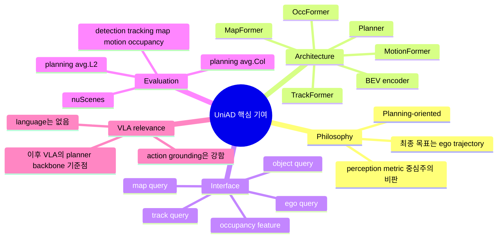
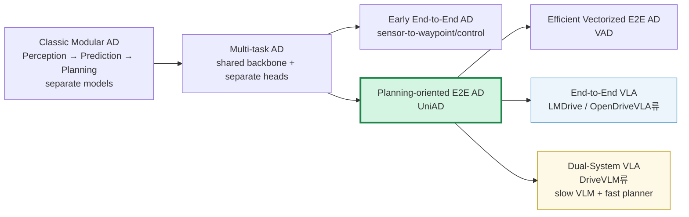
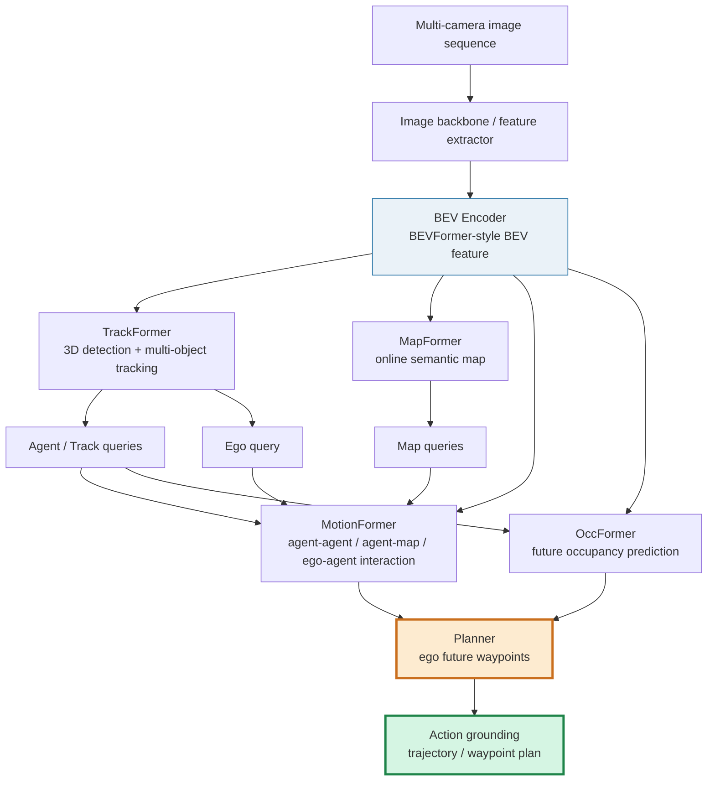
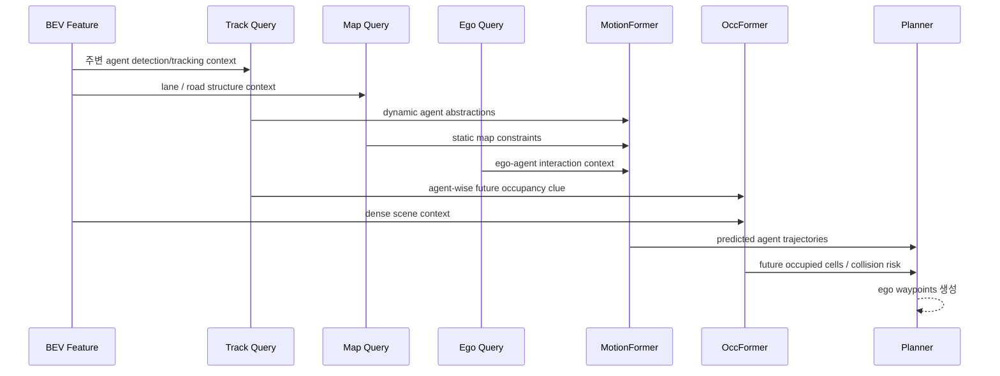
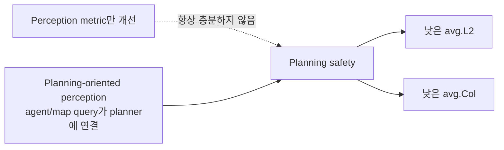
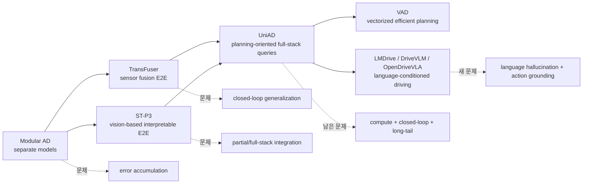
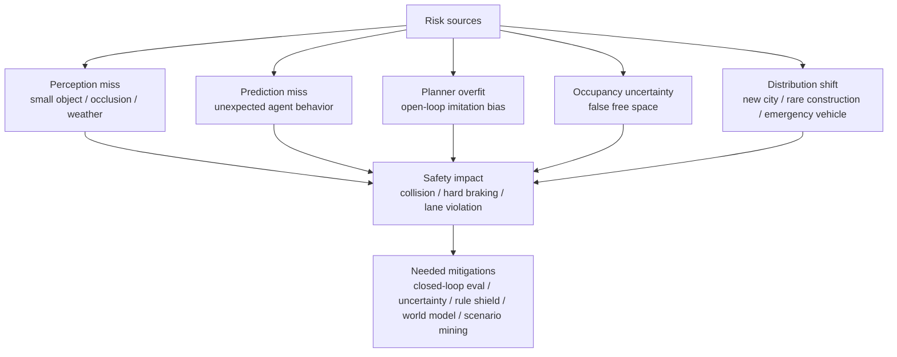
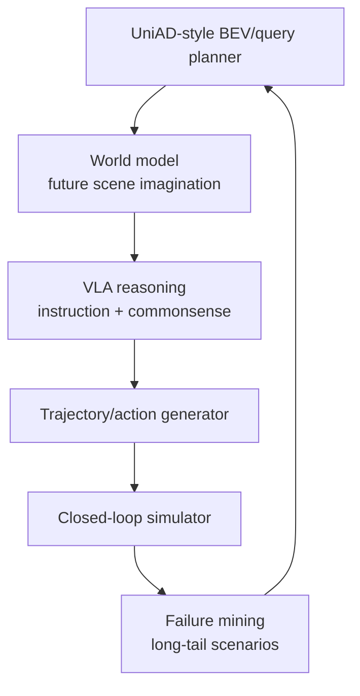
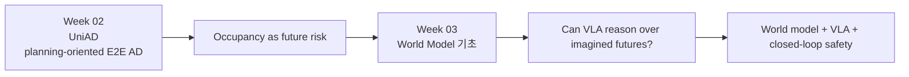

# Week 02. End-to-End AD 기본기: UniAD와 Planning-Oriented Autonomous Driving

- **Date**: 2026-07-28
- **Week**: 02 / 12
- **Original paper/source**: *Planning-oriented Autonomous Driving* / UniAD
- **Korean title**: **Planning 중심 자율주행** 또는 **계획 지향형 자율주행**
- **URL**: https://arxiv.org/abs/2212.10156
- **Authors**: Yihan Hu, Jiazhi Yang, Li Chen, Keyu Li, Chonghao Sima, Xizhou Zhu, Siqi Chai, Senyao Du, Tianwei Lin, Wenhai Wang, Lewei Lu, Xiaosong Jia, Qiang Liu, Jifeng Dai, Yu Qiao, Hongyang Li
- **Taxonomy**: language 없는 Vision-Action / End-to-End AD / BEV + query 기반 planning-oriented full-stack model
- **Reading mode**: Deep read: UniAD / Skim: TransFuser, ST-P3, VAD
- **이번 주 focus**: modular AD vs end-to-end AD, BEV representation, planning-oriented perception
- **Output**: Modular AD vs End-to-End AD 비교표

> 읽기 범위 메모: arXiv abstract, ar5iv HTML 본문, OpenDriveLab UniAD GitHub README, 관련 arXiv abstract를 확인해 작성했다. PDF 전체를 줄 단위로 번역한 문서는 아니며, 논문 학습에 필요한 abstract 번역, section별 요약, architecture 분석, 실험/metric 해석, VLA for AD 관점의 비판적 코멘트를 한국어로 정리했다.

---

## 1. 이번 주 한 문장 결론

**UniAD의 핵심은 “모든 task를 하나의 network에 넣었다”가 아니라, detection·tracking·mapping·motion forecasting·occupancy prediction을 최종 목표인 planning 성능에 맞춰 query interface로 연결했다는 점이다.**

VLA for Autonomous Driving 관점에서 UniAD는 아직 language가 없기 때문에 엄밀한 VLA는 아니다. 하지만 **action grounding**, 즉 모델 출력이 실제 ego trajectory / waypoint로 연결되는 구조를 이해하기 위한 가장 중요한 전 단계다.

> 이번 주의 기준 질문: **중간 representation이 최종 action, collision, closed-loop safety에 얼마나 직접적으로 연결되는가?**

---

## 2. 논문 제목·Abstract 한국어 번역

### 2.1 제목 번역

- **원제**: *Planning-oriented Autonomous Driving*
- **번역**: **Planning 중심 자율주행** / **계획 지향형 자율주행**
- **모델명**: **UniAD = Unified Autonomous Driving**

### 2.2 Abstract 한국어 번역

현대 자율주행 시스템은 일반적으로 **perception → prediction → planning**이 순차적으로 이어지는 modular task 구조로 설명된다. 다양한 task를 수행하고 높은 수준의 지능을 달성하기 위해, 기존 접근법은 각 task마다 독립적인 standalone model을 배치하거나, shared backbone 위에 task별 separate head를 둔 multi-task paradigm을 설계해 왔다. 그러나 이러한 방식은 **누적 오류(accumulative errors)** 또는 **task 간 coordination 부족** 문제를 겪을 수 있다.

저자들은 더 바람직한 framework는 자율주행차의 궁극적 목표, 즉 **planning**을 달성하도록 설계되고 최적화되어야 한다고 주장한다. 이를 위해 perception과 prediction 내부의 핵심 구성요소를 다시 검토하고, 모든 task가 planning에 기여하도록 task의 우선순위를 정한다.

논문은 **UniAD(Unified Autonomous Driving)**를 제안한다. UniAD는 full-stack driving task를 하나의 network 안에 통합한 포괄적 framework다. 각 module의 장점을 활용하고, global perspective에서 agent interaction을 위한 상호보완적인 feature abstraction을 제공하도록 설계되었다. task들은 **unified query interface**로 소통하며, 서로를 보조해 planning이라는 목표로 나아간다.

저자들은 challenging한 **nuScenes benchmark**에서 UniAD를 구현했고, extensive ablation을 통해 이러한 planning-oriented philosophy가 모든 측면에서 기존 state-of-the-art를 크게 능가함을 보였다. code와 model은 공개되어 있다.

### 2.3 Abstract 한 문장 재해석

**UniAD는 자율주행 stack의 중간 task를 planning을 위해 재배치하고, query 기반 interface로 연결하면 naive modular/MTL 방식보다 더 안전하고 정확한 trajectory planning이 가능하다는 것을 보인 논문이다.**

---

## 3. 핵심 기여 3~5개

| # | 핵심 기여 | 왜 중요한가 |
|---:|---|---|
| 1 | **Planning-oriented philosophy** | detection mAP, map IoU 같은 중간 metric 자체보다 최종 ego planning 품질을 중심에 둔다. |
| 2 | **Full-stack end-to-end AD framework** | detection, tracking, online mapping, motion forecasting, occupancy prediction, planning을 하나의 network로 연결한다. |
| 3 | **Unified query interface** | task 간 hard-coded object list/raster만 전달하지 않고, transformer query를 공통 interface로 사용한다. |
| 4 | **BEV 중심 scene representation** | multi-camera feature를 BEV 공간으로 변환해 agent, map, occupancy, ego trajectory를 같은 좌표계에서 다룬다. |
| 5 | **Ablation으로 task coordination 입증** | naive MTL보다 motion/planning/collision metric이 좋아지며, 특히 motion + occupancy가 planning에 상호보완적임을 보인다. |

---

## 4. VLA for AD taxonomy 위치

### 4.1 Taxonomy 판정표

| 분석 축 | UniAD 위치 | VLA for AD 관점 해석 |
|---|---|---|
| Taxonomy | **Vision-Action / End-to-End AD** | language가 없으므로 VLA는 아니지만, action output을 직접 만드는 VA backbone이다. |
| Input | multi-camera image sequence → BEV | camera 기반 AD stack이며, BEV가 핵심 중간 작업 공간이다. |
| Output | ego future trajectory / waypoints | text 설명이 아니라 numeric action에 가까운 planning output이다. |
| Language role | **없음** | instruction following, natural language reasoning, explanation generation은 다루지 않는다. |
| Action grounding | **강함** | 최종 output이 trajectory이고 collision metric으로 평가된다. |
| Training recipe | two-stage + multi-task losses | perception warm-up 후 full-stack end-to-end optimization. |
| Dataset/benchmark | nuScenes 중심 | logged dataset 기반 open-loop 성격이 강하다. |
| Open-loop vs closed-loop | paper는 open-loop 중심, repo에는 이후 Bench2Drive/CARLA 관련 안내 존재 | 실제 policy feedback loop 검증은 논문 원본만으로는 제한적이다. |
| Safety/long-tail risk | collision metric은 포함, rare/OOD 검증은 제한 | VLA hallucination과 long-tail safety를 다루려면 별도 safety shield/world model이 필요하다. |
| Limitations | compute, loss balancing, closed-loop 부족, language 없음 | VLA로 확장할 때 latency와 grounding 문제가 더 커진다. |

### 4.2 Taxonomy 위치도

### 4.3 Modular AD vs End-to-End AD 비교표

| 비교 축 | Modular AD | Naive End-to-End AD | UniAD식 Planning-oriented E2E |
|---|---|---|---|
| 기본 구조 | perception, prediction, planning 독립 개발 | sensor input에서 바로 trajectory/control 예측 | 중간 task를 유지하되 query와 joint training으로 통합 |
| 장점 | 디버깅 쉬움, 책임 경계 명확, safety case 작성 유리 | pipeline 단순, 정보 손실 감소 가능 | interpretability와 end-to-end coordination의 절충 |
| 단점 | error accumulation, interface mismatch, module별 목표 불일치 | black-box, 안전 검증 어려움 | 구조/학습/compute가 복잡, loss balancing 필요 |
| 중간 표현 | boxes, tracks, lanes, object list | 없거나 약함 | BEV + task queries + occupancy + motion |
| 최적화 목표 | task별 metric 분리 | imitation/control loss | planning L2/collision을 최종 목표로 삼고 중간 supervision 활용 |
| long-tail 대응 | rule/planner 보강 가능하지만 brittle | data distribution 밖에서 취약 | occupancy/motion이 도움되지만 closed-loop/OOD 검증 필요 |
| VLA 연결성 | language가 rule/planner에 instruction 제공 가능 | language-action alignment가 어려울 수 있음 | language가 BEV/query/world model/planner와 결합하기 좋음 |

---

## 5. Architecture / pipeline 시각화

### 5.1 UniAD 전체 pipeline

### 5.2 Architecture block table

| Block | 입력 | 출력 | Planning에 주는 정보 |
|---|---|---|---|
| Image backbone | multi-camera image sequence | perspective-view features | visual evidence |
| BEV Encoder | image features + camera geometry | unified BEV feature | top-down spatial workspace |
| TrackFormer | BEV + object/track queries | agent track queries | 주변 agent 위치, identity, history |
| MapFormer | BEV + map queries | lane/divider/crossing/drivable queries | road topology, drivable constraint |
| MotionFormer | agent + map + ego queries | multi-modal future trajectories | 주변 agent가 어디로 갈지 |
| OccFormer | BEV + agent knowledge | future occupancy | scene-level collision risk field |
| Planner | ego query + motion + occupancy | ego future waypoints | 최종 action grounding |

### 5.3 Query interface 개념도

### 5.4 Planning-oriented perception의 의미

UniAD에서 perception은 최종 산출물이 아니다. Detection과 mapping은 leaderboard용 task가 아니라 **planner가 안전한 trajectory를 만들 수 있도록 scene을 구조화하는 전처리 reasoning**에 가깝다.

---

## 6. Input → Reasoning → Action Grounding 분석

### 6.1 I/O map

| Stage | Representation | Reasoning type | Action grounding | VLA로 확장할 때 질문 |
|---|---|---|---|---|
| Sensor input | multi-camera images | visual encoding | 없음 | VLM이 raw image를 볼지, BEV token을 볼지? |
| BEV | top-down spatial feature | spatial aggregation | 간접 | BEV를 language model이 이해 가능한 token으로 바꿀 수 있나? |
| Tracking | agent/track query | object permanence, identity | 간접 | “저 차가 끼어든다”를 query 변화로 grounding할 수 있나? |
| Mapping | map query | lane topology, drivable area | 간접 | “오른쪽 차선 유지” instruction을 map query에 연결할 수 있나? |
| Motion forecasting | future agent trajectory | interaction prediction | 강해짐 | 주변 agent의 미래와 ego action을 함께 reasoning하나? |
| Occupancy | future occupied cells | collision risk reasoning | 강함 | VLM hallucination을 occupancy constraint로 막을 수 있나? |
| Planning | ego waypoints | final decision | **직접** | text decision이 실제 trajectory/control로 변환되는가? |

### 6.2 UniAD의 reasoning은 text reasoning이 아니다

UniAD에는 chain-of-thought나 자연어 설명이 없다. 그 대신 다음과 같은 **structured spatial-temporal reasoning**이 있다.

- **Agent-agent interaction**: 주변 차량·보행자 간 상호작용을 attention/query로 반영한다.
- **Agent-map interaction**: agent trajectory가 lane, divider, crossing, drivable area와 어떤 관계인지 고려한다.
- **Ego-agent interaction**: ego query가 주변 agent의 미래 행동과 함께 planner에 반영된다.
- **Occupancy-aware planning**: future occupancy가 planner의 collision risk field 역할을 한다.

VLA 연구에서는 여기에 language reasoning을 얹을 때, language가 단순 설명을 넘어서 **BEV/query/trajectory/occupancy에 실제로 grounding되는지**가 핵심이다.

### 6.3 Action grounding 점수표

| 항목 | 점수 | 이유 |
|---|---:|---|
| Numeric action output | 5/5 | ego future waypoints를 직접 예측한다. |
| Safety metric 연결 | 4/5 | planning collision rate(avg.Col)를 핵심 metric으로 본다. |
| Closed-loop feedback | 2/5 | 원 논문은 nuScenes open-loop 평가 중심이다. |
| Intermediate interpretability | 4/5 | track/map/motion/occupancy module이 있어 failure 분석 가능성이 있다. |
| Language-action alignment | 0/5 | language input/output이 없다. |
| Long-tail robustness | 2/5 | rare/OOD scenario stress test는 제한적이다. |

---

## 7. Training recipe

### 7.1 Two-stage training

논문은 UniAD를 한 번에 처음부터 끝까지 학습시키기보다, perception query를 먼저 안정화한 후 full-stack end-to-end training을 수행한다.

| Stage | 학습 대상 | 논문상 설정 | 목적 |
|---|---|---|---|
| Stage 1 | tracking + mapping | 약 6 epochs | agent/map query가 안정적 representation을 갖도록 warm-up |
| Stage 2 | perception + prediction + planning 전체 | 약 20 epochs | motion, occupancy, planner까지 planning-oriented joint optimization |

### 7.2 Loss / matching 핵심 아이디어

| 구성 | 설명 | 왜 중요한가 |
|---|---|---|
| Bipartite matching | DETR 계열처럼 prediction set과 GT set을 matching | detection/tracking/map의 set prediction 안정화 |
| Shared matching | tracking matching 결과를 motion/occupancy node에 재사용 | historical track → future motion이 같은 agent identity를 유지 |
| Multi-task supervision | 각 module의 중간 output도 supervision | pure black-box보다 학습 안정성과 해석 가능성이 높다. |
| Planning loss | ego future waypoint/trajectory를 직접 최적화 | 최종 action metric과 training objective를 연결한다. |
| Occupancy-aware optimization | occupancy 정보를 planner에 반영 | trajectory mimicking만으로 생기는 collision risk를 낮춘다. |

### 7.3 Training recipe를 VLA로 확장할 때의 위험

| 위험 | 설명 | VLA 확장 시 더 어려워지는 이유 |
|---|---|---|
| Loss balancing | task가 많을수록 gradient conflict가 커진다. | language loss까지 추가되면 action loss가 약해질 수 있다. |
| Compute/latency | temporal BEV + transformer decoder stack은 무겁다. | VLM/LLM을 얹으면 onboard real-time 요구와 충돌한다. |
| Shortcut learning | open-loop trajectory imitation에 과적합할 수 있다. | language explanation이 그럴듯해도 closed-loop behavior가 나쁠 수 있다. |
| Hallucination | UniAD에는 language가 없어 해당 문제는 없다. | VLA에서는 text reasoning이 occupancy/map constraint와 충돌할 수 있다. |

---

## 8. Dataset / Benchmark / Metric 분석

### 8.1 Dataset / benchmark matrix

| 항목 | 내용 |
|---|---|
| Main benchmark | **nuScenes** |
| Sensor focus | camera-based multi-view input, BEV feature 구성 |
| Task coverage | detection, tracking, online mapping, motion forecasting, occupancy prediction, planning |
| 평가 성격 | logged dataset 기반 open-loop evaluation 중심 |
| Code/model | OpenDriveLab UniAD GitHub 공개 |
| 이후 참고 | README에는 2024년 이후 Bench2Drive/CARLA closed-loop 관련 안내가 있으나, UniAD 원 논문의 핵심 평가는 nuScenes open-loop다. |
| VLA 관점 한계 | language instruction, causal intervention, recovery, rare event stress test가 부족하다. |

### 8.2 Metric map

| Task | 대표 metric | 의미 | Planning과의 관계 |
|---|---|---|---|
| Detection | NDS, mAP 계열 | 3D object detection 품질 | 주변 agent 인식의 기본 |
| Tracking | AMOTA, AMOTP 계열 | identity 유지와 tracking 정확도 | motion forecasting 입력 안정성 |
| Mapping | IoU 등 | lane, divider, crossing, drivable area 품질 | road constraint 제공 |
| Motion forecasting | minADE, minFDE, MR | 주변 agent future trajectory 예측 | 회피·양보·추월 판단의 근거 |
| Occupancy prediction | IoU-f, VPQ-f 등 | 미래 occupied region 예측 | collision avoidance constraint |
| Planning | avg.L2, avg.Col | ego trajectory error와 collision rate | 최종 action grounding metric |

### 8.3 논문 ablation에서 기억할 수치

ar5iv 본문에서 확인되는 Table 2의 핵심 메시지는 **full UniAD(ID-12)가 naive MTL baseline(ID-0)보다 planning L2와 collision을 크게 개선한다**는 것이다.

| 비교 | avg.L2 | avg.Col | 해석 |
|---|---:|---:|---|
| Naive MTL baseline ID-0 | 1.154 | 0.941 | shared backbone + separate heads 방식 |
| UniAD full ID-12 | 1.004 | 0.430 | tracking + mapping + motion + occupancy + planning 통합 |
| 개선 | ↓ 약 0.150m | ↓ 약 0.511%p | 특히 collision 감소가 planning-oriented design의 핵심 근거 |

OpenDriveLab README는 UniAD의 highlight로 prediction/planning SOTA를 강조하며, planning avg.Col 0.31% 수준의 결과도 언급한다. 다만 benchmark setting/version 및 이후 업데이트에 따라 수치 표기는 달라질 수 있으므로, 학습 노트에서는 논문 Table 2의 ablation 수치를 중심으로 기억한다.

### 8.4 Open-loop vs Closed-loop 평가

| 평가 방식 | UniAD 원 논문에서의 위치 | 장점 | 한계 |
|---|---|---|---|
| Open-loop nuScenes | 중심 평가 | real-world log 기반 비교가 쉽다. | ego action이 다음 world state를 바꾸지 않는다. |
| Closed-loop simulation | 원 논문 핵심은 아님 | compounding error와 recovery를 볼 수 있다. | simulator realism과 scenario coverage가 문제다. |
| Real-world closed-loop | 없음 | safety validation에 가장 중요 | 비용, 위험, 재현성 문제가 크다. |

**VLA 교훈**: natural language reasoning 점수가 높아도 closed-loop에서 collision, route completion, comfort, rule violation이 나쁘면 driving intelligence라고 보기 어렵다.

---

## 9. 관련 논문 비교표

### 9.1 TransFuser / ST-P3 / VAD / UniAD

| 논문 | 핵심 아이디어 | 입력 | 중간 표현 | 출력/action | 언어 역할 | 평가 포인트 | UniAD와의 관계 |
|---|---|---|---|---|---|---|---|
| **TransFuser** | image + LiDAR representation을 transformer self-attention으로 fusion | camera + LiDAR | multi-resolution perspective/BEV fusion feature | waypoint/control | 없음 | CARLA leaderboard, collision/km 감소 | sensor fusion 기반 E2E driving의 강한 초기 기준점 |
| **ST-P3** | spatial-temporal feature learning으로 perception/prediction/planning을 interpretable vision setting에서 통합 | vision 중심 | BEV / semantic occupancy류 | planning trajectory | 없음 | nuScenes open-loop + CARLA closed-loop | UniAD 이전의 interpretable E2E AD 계열 |
| **VAD** | dense raster 대신 vectorized agents/map elements를 planning constraint로 사용 | camera/BEV | vectorized scene representation | ego trajectory | 없음 | nuScenes planning, collision, inference speed | UniAD 이후 효율적 representation/latency 문제에 집중 |
| **UniAD** | planning-oriented full-stack tasks를 query interface로 연결 | multi-camera | BEV + task queries + occupancy | ego waypoints | 없음 | nuScenes full-stack tasks + planning avg.L2/avg.Col | VLA 이전 action-grounded AD backbone의 핵심 기준점 |

### 9.2 발전 흐름

### 9.3 UniAD를 VLA 전에 읽어야 하는 이유

| VLA 논문에서 흔한 주장 | UniAD를 알면 던질 수 있는 질문 |
|---|---|
| “VLM이 driving scene을 이해한다” | 그 이해가 BEV/map/motion/occupancy representation과 연결되는가? |
| “LLM이 reasoning으로 decision을 만든다” | decision이 numeric trajectory/waypoint/control로 grounding되는가? |
| “설명을 잘 생성한다” | 설명 품질이 collision, L2, route completion, infraction 감소로 이어지는가? |
| “end-to-end driving 가능” | 중간 supervision 없이 safety와 interpretability를 어떻게 확보하는가? |
| “closed-loop 성능 향상” | open-loop와 closed-loop gap을 어떻게 측정하고 줄였는가? |

---

## 10. 강점과 한계

### 10.1 강점

1. **Planning-first 관점이 명확하다**  
   detection, tracking, mapping 자체가 목적이 아니라 planning에 필요한 representation이라는 철학을 분명히 한다.

2. **순수 black-box E2E보다 해석 가능하다**  
   TrackFormer, MapFormer, MotionFormer, OccFormer가 있어 어떤 중간 task에서 failure가 났는지 분석할 여지가 있다.

3. **Query interface가 깔끔하다**  
   hard-coded box/map raster만 넘기는 rigid interface보다, task query는 agent interaction과 task 간 knowledge transfer에 유연하다.

4. **Motion + occupancy의 상호보완성을 보여준다**  
   motion은 agent-level future, occupancy는 scene-level risk field에 가깝다. 둘을 함께 쓰는 것이 safety planning에 유리하다.

5. **VLA stack의 하부 구조로 좋다**  
   language를 얹기 전, action-grounded visual driving backbone이 무엇을 해야 하는지 보여준다.

### 10.2 한계

| 한계 | 설명 | VLA for AD에서의 의미 |
|---|---|---|
| Language 없음 | instruction, explanation, commonsense reasoning을 직접 다루지 않는다. | VLA라기보다 VLA의 action backbone이다. |
| Open-loop 중심 | logged dataset metric이 중심이라 ego feedback loop를 충분히 보지 못한다. | closed-loop에서 hallucination/recovery/safety를 별도로 검증해야 한다. |
| Compute 부담 | full-stack multi-task temporal model은 가볍지 않다. | VLM/LLM까지 붙이면 latency 병목이 커진다. |
| Loss/task 복잡도 | 많은 module과 objective를 함께 튜닝해야 한다. | language loss와 planning loss 사이의 conflict 가능성이 크다. |
| Long-tail 보장 부족 | rare event, adversarial road user, unusual weather/geography 검증은 제한적이다. | language commonsense가 도움이 될 수 있으나 safety shield가 필요하다. |
| Causal reasoning 부족 | attention 기반 interaction은 있지만 explicit causal intervention reasoning은 약하다. | VLA reasoning이 실제 causal planning으로 이어지는지 검증해야 한다. |

### 10.3 Safety / long-tail risk map

### 10.4 Critical commentary

UniAD는 “end-to-end가 무조건 black-box”라는 인식을 깨는 좋은 논문이다. 하지만 동시에 “중간 task를 많이 넣고 joint training하면 safety가 해결된다”는 결론으로 과도하게 읽어서는 안 된다. 논문이 강하게 보여주는 것은 **open-loop nuScenes에서 planning-oriented coordination이 유효하다**는 점이다. 실제 deployment에서는 closed-loop feedback, latency, uncertainty calibration, rare event evaluation이 별도로 필요하다.

---

## 11. 실전 학습 포인트

### 11.1 이번 주 체크리스트

| 질문 | 체크 |
|---|---|
| 내 모델의 최종 action output은 무엇인가? text, waypoint, trajectory, control 중 무엇인가? | □ |
| perception representation이 planning loss로 feedback을 받는가? | □ |
| language output이 실제 vehicle action에 grounding되는가? | □ |
| open-loop metric과 closed-loop metric을 둘 다 보는가? | □ |
| collision, comfort, route completion, rule violation을 분리해서 보는가? | □ |
| long-tail scenario를 따로 mining/evaluation하는가? | □ |
| VLM hallucination을 막는 occupancy/world model/rule shield가 있는가? | □ |

### 11.2 핵심 용어 정리

| 용어 | 자연스러운 이해 |
|---|---|
| Planning-oriented | 모든 중간 task를 최종 planning 성능 향상에 맞춰 설계하는 관점 |
| BEV | Bird’s-Eye View. top-down 좌표계에서 scene을 표현하는 방식 |
| Query interface | transformer query를 task 간 정보 전달 단위로 쓰는 방식 |
| Motion forecasting | 주변 agent의 미래 trajectory를 예측하는 task |
| Occupancy prediction | 미래 시점에 어떤 공간이 점유될지 예측하는 task |
| avg.L2 | 예측 ego trajectory와 GT trajectory 사이의 평균 거리 오차 |
| avg.Col | planning trajectory가 다른 agent/occupied region과 충돌하는 비율 |
| Open-loop | logged data에서 예측만 평가하고 action이 환경을 바꾸지 않는 평가 |
| Closed-loop | model action이 simulator/environment에 영향을 주고 다음 state가 바뀌는 평가 |
| Action grounding | model output이 실제 action/trajectory/control 및 safety metric과 연결되는 정도 |

### 11.3 연구 아이디어 메모

- VLA가 바로 control을 내기보다, **VLM/LLM reasoning → structured constraint → planner** 구조가 더 안전할 수 있다.
- UniAD의 occupancy는 VLA hallucination을 억제하는 safety prior로 쓸 수 있다.
- language 설명은 evaluation의 보조 지표일 뿐, 최종 검증은 collision/route/completion/comfort여야 한다.

---

## 12. 다음 주 질문

다음 주 주제는 **World Model 기초**이며 curriculum상 deep paper는 **Drive-WM or OccWorld**다. UniAD를 읽은 뒤 다음 질문을 들고 가면 좋다.

1. **UniAD의 occupancy prediction은 world model인가, 아니면 world model의 일부인가?**
2. **World model이 future scene을 예측할 때 motion forecasting과 occupancy prediction을 어떻게 통합하는가?**
3. **Image-based world model과 occupancy-based world model 중 planning에 더 직접적인 것은 무엇인가?**
4. **Closed-loop planning에서 world model은 simulator 또는 imagination engine 역할을 할 수 있는가?**
5. **VLA의 language reasoning은 imagined future와 어떻게 연결되어야 hallucination을 줄일 수 있는가?**

---

## 13. 참고 링크

- UniAD arXiv: https://arxiv.org/abs/2212.10156
- UniAD PDF: https://arxiv.org/pdf/2212.10156
- UniAD GitHub: https://github.com/OpenDriveLab/UniAD
- UniAD ar5iv HTML: https://ar5iv.labs.arxiv.org/html/2212.10156
- TransFuser arXiv: https://arxiv.org/abs/2205.15997
- ST-P3 arXiv: https://arxiv.org/abs/2207.07601
- VAD arXiv: https://arxiv.org/abs/2303.12077
- nuScenes dataset: https://www.nuscenes.org/

---

## Appendix. 한 장 요약

| Axis | UniAD 분석 |
|---|---|
| Taxonomy | language 없는 Vision-Action / planning-oriented End-to-End AD |
| Input | multi-camera image sequence → BEV |
| Output | ego future waypoints / trajectory |
| Language role | 없음 |
| Action grounding | 높음: numeric planning output 직접 생성 |
| Training recipe | perception warm-up 후 full-stack multi-task end-to-end training |
| Dataset/benchmark | nuScenes 중심 |
| Open-loop vs closed-loop | 원 논문은 open-loop 중심, closed-loop safety 검증은 제한적 |
| Safety/long-tail | collision metric은 보지만 rare/OOD/interactive feedback은 부족 |
| Limitations | compute, optimization complexity, no language, limited closed-loop validation |
| VLA lesson | VLA의 언어 reasoning은 UniAD 같은 action-grounded planner/occupancy/world model과 연결되어야 한다. |
