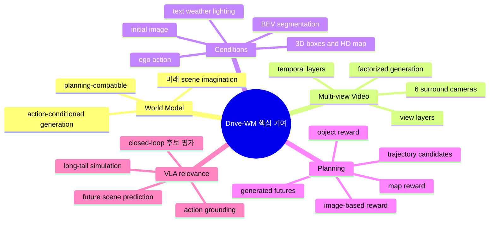
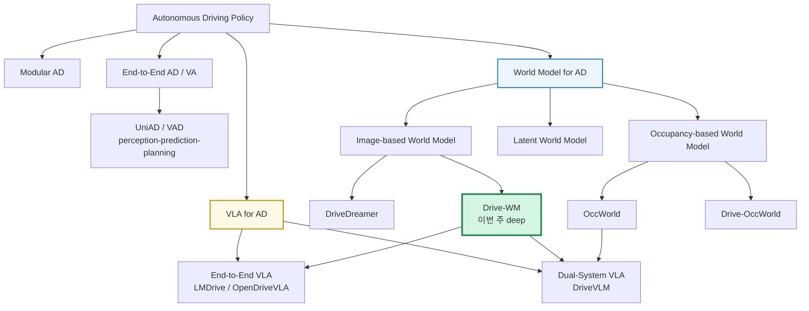
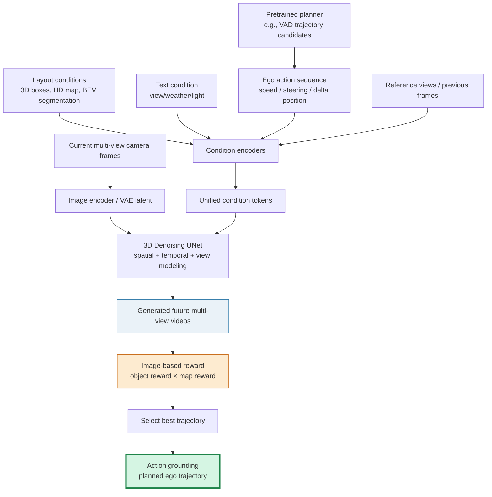
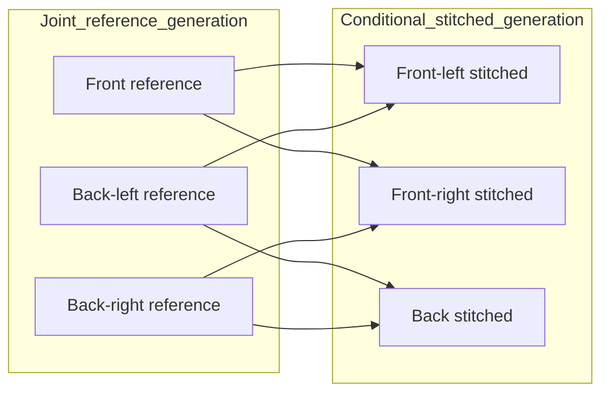
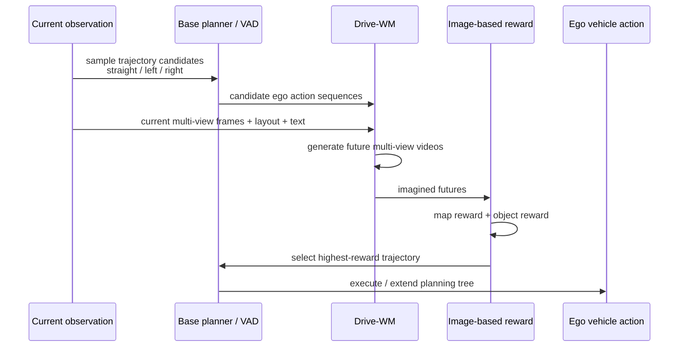
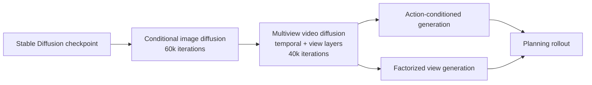
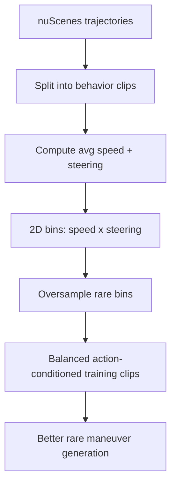
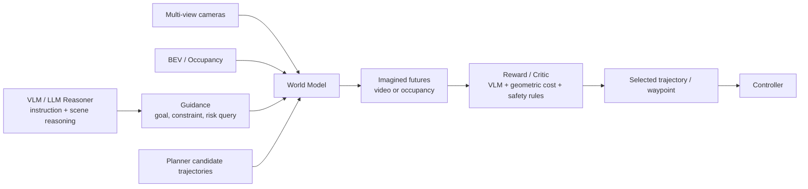
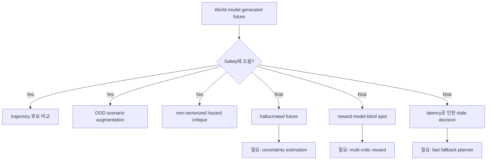
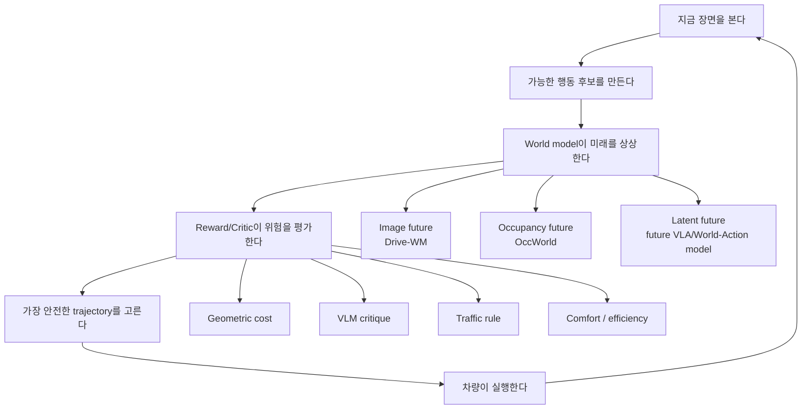

# Week 03. World Model 기초: Drive-WM으로 보는 “미래를 상상하는” 자율주행

## Metadata

| 항목 | 내용 |
|---|---|
| Date | 2026-05-12 |
| Week | 03 / 12 |
| Original paper/source | *Driving into the Future: Multiview Visual Forecasting and Planning with World Model for Autonomous Driving* / **Drive-WM** |
| Korean title | **자율주행을 위한 World Model 기반 Multi-view 시각 예측과 Planning** |
| URL | https://arxiv.org/abs/2311.17918 |
| Version read | arXiv:2311.17918v1, arXiv API metadata, arXiv HTML 전문, project page 기반 |
| Authors | Yuqi Wang, Jiawei He, Lue Fan, Hongxin Li, Yuntao Chen, Zhaoxiang Zhang |
| Taxonomy | Vision-Action world model / image-based driving world model / multi-view video diffusion / planning-by-imagination |
| Reading mode | Deep read: Drive-WM / skim: DriveDreamer, OccWorld, Drive-OccWorld |
| 이번 주 focus | image-based world model, occupancy-based world model, future scene prediction과 planning |
| Output | world model 유형 비교표 |

> 참고: PDF 전체를 줄 단위로 번역하지 않고, arXiv abstract/API metadata와 arXiv HTML 본문에서 확인한 구조·실험·표를 바탕으로 한국어 학습 노트를 작성했다. 수식의 세부 기호는 학습 목적에 맞게 직관 중심으로 설명하며, supplementary의 구현 세부는 핵심만 요약한다.

---

## 1. 이번 주 한 문장 결론

**Drive-WM의 핵심은 자율주행 planner가 “지금 이 trajectory를 고르면 미래 camera view가 어떻게 변할까?”를 multi-view video로 상상하고, 그 상상된 미래를 image-based reward로 평가해 더 안전한 planning을 고르는 첫 번째 image-based driving world model이라는 점이다.**

Week 02의 UniAD가 **BEV/query/occupancy를 통해 planning-oriented end-to-end AD**를 만들었다면, Week 03의 Drive-WM은 한 걸음 더 나아가 **행동 후보별 미래 장면을 생성해서 비교**한다.

> VLA for AD 관점에서 중요한 질문: **언어가 reasoning을 해도, 실제 action 후보가 미래 장면·occupancy·collision risk에 grounding되지 않으면 driving policy가 아니다.** World model은 이 grounding gap을 줄이는 핵심 도구다.

---

## 2. 논문 제목·Abstract 한국어 번역

### 2.1 제목 번역

- **원제**: *Driving into the Future: Multiview Visual Forecasting and Planning with World Model for Autonomous Driving*
- **번역**: **미래로 주행하기: 자율주행을 위한 World Model 기반 Multi-view 시각 예측과 Planning**
- **시스템명**: **Drive-WM**

### 2.2 Abstract 한국어 번역

자율주행에서는 미래 사건을 미리 예측하고, 예측 가능한 위험을 평가하는 능력이 차량이 더 나은 행동을 계획하도록 도와 도로 위 안전성과 효율성을 높인다. 이를 위해 저자들은 기존 end-to-end planning model과 호환되는 첫 번째 driving world model인 **Drive-WM**을 제안한다.

Drive-WM은 view factorization으로 가능해진 joint spatial-temporal modeling을 통해 driving scene에서 고품질 multi-view video를 생성한다. 저자들은 이 강력한 생성 능력을 바탕으로, world model을 안전한 driving planning에 적용할 수 있는 가능성을 처음으로 보여준다.

구체적으로 Drive-WM은 서로 다른 driving maneuver에 따라 여러 가능한 미래로 “주행해 보고”, image-based reward에 따라 최적 trajectory를 결정할 수 있다. 실제 driving dataset에서의 평가는 이 방법이 고품질·일관적·제어 가능한 multi-view video를 생성할 수 있음을 보여주며, real-world simulation과 safe planning을 향한 가능성을 연다.

### 2.3 Abstract를 한 문장으로 다시 쓰기

**Drive-WM은 multi-view video diffusion으로 action 후보별 미래 장면을 생성하고, 그 미래를 reward로 평가해 planner가 더 안전한 trajectory를 고르게 하는 image-space world model이다.**

---

## 3. 핵심 기여 3~5개

| # | 핵심 기여 | 왜 중요한가 |
|---:|---|---|
| 1 | **기존 end-to-end planner와 호환되는 driving world model 제안** | world model을 단순 video generation이 아니라 planning pipeline 안에 넣었다. |
| 2 | **Multi-view + temporal video diffusion** | 6개 surround-view camera의 시간적 변화와 view 간 일관성을 함께 생성한다. |
| 3 | **View factorization으로 multi-view consistency 강화** | 겹치는 시야가 서로 모순되지 않도록 reference view와 stitched view를 나눠 생성한다. |
| 4 | **Unified condition interface** | image, layout, text, ego action을 동일한 condition embedding interface로 통합한다. |
| 5 | **Tree-based rollout + image-based reward planning** | “trajectory 후보 → 미래 video 생성 → risk reward 평가 → 최적 trajectory 선택”이라는 planning-by-imagination을 실험적으로 보였다. |

### Contribution map

---

## 4. VLA for AD taxonomy 위치

### 4.1 이번 주 taxonomy 판정

| 축 | Drive-WM 위치 | 해석 |
|---|---|---|
| Modality | Multi-view RGB image 중심 | 6개 surround camera view를 생성/예측하는 image-based world model이다. |
| Intermediate representation | latent diffusion feature + condition tokens | BEV/occupancy처럼 명시적인 3D grid가 아니라 pixel/latent video 중심이다. |
| Language role | 제한적 | CLIP text condition은 weather/light/view description 제어용이지, instruction-following VLA는 아니다. |
| Action grounding | 중간~강함 | ego action/trajectory 후보가 generated future에 반영되고 planning reward로 선택된다. 단, 최종 실행 closed-loop policy까지 완성한 것은 아니다. |
| System type | Vision-Action world model / neural simulator | language 없는 VA 계열이지만 VLA planner의 imagination module로 확장 가능하다. |
| Evaluation | nuScenes open-loop 중심 + OOD simulation 실험 | 실제 closed-loop driving simulator나 차량 평가가 아니라 logged data 기반이다. |
| Safety/long-tail | promising but not guaranteed | OOD ego deviation과 counterfactual event generation을 다루지만, 생성 모델 hallucination과 reward reliability가 남는다. |

### 4.2 Taxonomy 위치도

### 4.3 Week 02 UniAD와의 연결

| 질문 | UniAD | Drive-WM |
|---|---|---|
| 핵심 목표 | perception/prediction/planning을 planning-oriented로 통합 | action 후보별 미래 scene을 상상하고 평가 |
| 중간 표현 | BEV, query, motion, occupancy | multi-view video latent, condition embeddings |
| Planning 방식 | learned planner가 ego waypoints 예측 | VAD 같은 planner 후보를 world model이 rollout하고 reward로 선택 |
| 미래 예측 | motion forecasting + occupancy prediction | pixel-level / view-level future video generation |
| action grounding | waypoint/trajectory 직접 예측 | action-conditioned future 생성 + trajectory 선택 |
| 약점 | open-loop benchmark 한계 | generated future와 reward의 신뢰성 문제 |

---

## 5. Architecture / pipeline 시각화

### 5.1 Drive-WM 전체 pipeline

### 5.2 Multi-view factorization 직관

Drive-WM은 6개 카메라 view를 한꺼번에 생성하면 겹치는 영역에서 모순이 생길 수 있다고 본다. 그래서 view를 두 그룹으로 나눈다.

- **Reference views**: 서로 겹침이 적은 기준 view들. 먼저 생성한다.
- **Stitched views**: 이웃 reference view를 조건으로 받아 생성하는 view들. 겹치는 영역의 consistency를 맞추기 쉽다.

### 5.3 Planning-by-imagination sequence

---

## 6. Input → Reasoning → Action Grounding 분석

### 6.1 I/O map

| Stage | Input | Representation | Reasoning type | Action grounding |
|---|---|---|---|---|
| Observation | 현재 multi-view camera images | image latent | 현재 scene 인코딩 | 없음 |
| Condition | 3D boxes, HD map, BEV segmentation, text, action | unified condition tokens | scene structure + 제어 조건 | 간접적 |
| World modeling | condition + noisy video latent | 3D UNet latent diffusion | spatial-temporal imagination | action이 미래 video에 반영됨 |
| Future generation | trajectory/action 후보별 조건 | generated multi-view videos | “이 행동을 하면 어떻게 보일까?” | 강해짐 |
| Reward evaluation | generated videos | detector/map predictor output, image reward | collision/map risk 평가 | trajectory 선택으로 연결 |
| Planning output | reward-ranked candidates | selected ego trajectory | best future 선택 | **직접적** |

### 6.2 언어의 역할

Drive-WM은 VLA라고 부르기 어렵다. 언어는 다음 정도로 쓰인다.

| 언어 사용 | Drive-WM에서의 역할 | VLA 관점 평가 |
|---|---|---|
| Text description | view, weather, lighting 등 global condition | scene generation 제어용 |
| CLIP text encoder | diffusion condition embedding 생성 | text-to-video 계열 관습 활용 |
| Driving instruction | 명시적 route/instruction-following 없음 | LMDrive/DriveVLM류와 다름 |
| Chain-of-thought | 없음 | reasoning은 text가 아니라 generated future와 reward에서 발생 |
| Action grounding | text가 아니라 ego action condition과 trajectory reward로 grounding | strong VA world model, weak/absent language |

### 6.3 Action grounding 점수표

| 항목 | 점수 | 이유 |
|---|---:|---|
| Numeric action conditioning | 4/5 | ego action sequence를 condition으로 넣어 future video를 생성한다. |
| Direct action output | 3/5 | 자체가 controller는 아니고, planner 후보 중 best trajectory를 고르는 구조다. |
| Future consequence modeling | 5/5 | 행동별 미래 multi-view scene을 explicit하게 생성한다. |
| Closed-loop evaluation | 2/5 | tree rollout 아이디어는 있으나 실제 simulator closed-loop 검증은 제한적이다. |
| Safety metric | 3/5 | object reward와 map reward로 collision/map risk를 본다. 하지만 reward model이 완전하지 않다. |
| Language-action alignment | 1/5 | text condition은 generation style 제어에 가깝고 driving instruction grounding은 없다. |
| Long-tail robustness | 3/5 | OOD ego deviation과 counterfactual event를 다루지만 생성 신뢰성 검증은 더 필요하다. |

---

## 7. Training recipe

### 7.1 학습 절차 요약

Drive-WM은 Stable Diffusion 계열 latent diffusion을 driving video에 맞게 확장한다.

| 단계 | 학습 대상 | 목적 |
|---|---|---|
| 1. Conditional image model | single-view image generation | HD map, BEV segmentation, 3D box, text 등 조건을 받아 realistic driving image 생성 |
| 2. Multi-view temporal tuning | temporal layer + multiview layer | image diffusion을 video 및 6-camera setting으로 확장 |
| 3. Action-based generation | ego action condition 추가 | speed/steering/ego movement가 future video에 반영되도록 학습 |
| 4. Factorization model | reference view → stitched view conditional generation | view 간 overlap inconsistency 완화 |
| 5. Planning use | pretrained planner 후보 + generated video reward | world model을 planning 평가기로 사용 |

### 7.2 Condition 설계

| Condition | Encoding | 역할 |
|---|---|---|
| Initial/context images | ConvNeXt image encoder | 현재 scene appearance와 temporal context 제공 |
| Layout: 3D boxes / HD map / BEV segmentation | perspective projection 후 image-like encoding | geometry와 drivable area 제어 |
| Text | pre-trained CLIP text encoder | weather, lighting, view description 제어 |
| Ego action | MLP | ego movement / speed / steering을 latent condition으로 전달 |
| Reference views | image condition | stitched view의 multi-view consistency 강화 |

### 7.3 Data curation 포인트

논문은 ego-action distribution이 불균형하다고 지적한다. nuScenes에는 작은 steering angle과 정상 속도 구간이 많고, 큰 조향·극단 속도 조합은 적다. 이런 imbalance는 world model이 rare action future를 잘 못 상상하게 만든다.

이를 완화하기 위해 저자들은 trajectory clip을 turning left / going straight / turning right 같은 driving behavior로 나누고, speed × steering angle bin을 만들어 rare combination을 re-sampling한다.

### 7.4 Training risk

- Diffusion world model은 compute가 크고 inference가 느리다. 실시간 planning loop에 넣으려면 distillation, caching, low-step sampler가 필요하다.
- action-conditioned generation은 dataset의 action coverage에 강하게 의존한다.
- generated video가 realistic하더라도 **driving-relevant causal dynamics**가 맞는지는 별도 검증이 필요하다.
- reward model이 detector/map predictor에 의존하면, generated image artifact가 reward를 속일 수 있다.
- VLA와 연결할 경우 VLM hallucination과 world model hallucination이 중첩될 수 있다.

---

## 8. Dataset / Benchmark / Metric 분석

### 8.1 Dataset

| 항목 | 내용 |
|---|---|
| Main dataset | **nuScenes** |
| Train / val | 700 training videos, 150 validation videos |
| Sensor | 6 surround-view cameras, 약 20초 video scenes |
| Image preprocessing | 1600×900 원본을 crop/resize하여 384×192 학습 |
| Additional demo | Waymo Open Dataset에 high-resolution generation 예시 적용 |
| VLA 관점 한계 | language instruction/action command dataset이 아니며, closed-loop simulator benchmark도 아니다. |

### 8.2 Metric matrix

| 평가 축 | Metric | 의미 | Drive-WM 결과/관찰 |
|---|---|---|---|
| Video quality | FID, FVD | 생성 image/video distribution 품질 | layout-based video generation에서 FID 15.8, FVD 122.7 보고 |
| Multi-view image quality | FID | multi-view image realism | single-frame multi-view setting에서 FID 12.99 보고 |
| Controllability | mAP, mIoU | generated video가 3D object/map/layout condition을 따르는지 | BEVControl/MagicDrive 등보다 좋은 controllability 보고 |
| Multi-view consistency | KPM | adjacent view 간 keypoint matching 비율 | factorized generation이 KPM 45.8% → 94.4%로 개선 |
| Planning | L2 distance, collision rate | GT trajectory와 거리, object collision | tree-based planning이 random command보다 우수하고 GT command에 근접 |
| OOD robustness | L2/collision under ego deviation | lane center에서 0.5m 벗어난 상황 회복 | world model generated OOD data로 fine-tuning 시 성능 회복 |

### 8.3 Planning table 핵심 해석

| 비교 | Avg L2 | Avg collision | 해석 |
|---|---:|---:|---|
| VAD with GT command | 0.72 m | 0.22% | oracle command를 쓰는 상한선에 가까운 기준 |
| VAD with random command | 1.02 m | 0.93% | command가 틀리면 planning이 크게 나빠짐 |
| Drive-WM tree-based selection | 0.80 m | 0.26% | world model로 세 command 미래를 평가하면 GT command에 근접 |

이 결과는 “world model이 planner를 완전히 대체했다”는 뜻은 아니다. 더 정확히는 **world model이 planner candidate selector / evaluator로 쓸 수 있다**는 증거다.

### 8.4 Open-loop vs closed-loop 평가

| 평가 형태 | Drive-WM에서의 상태 | 주의점 |
|---|---|---|
| Open-loop video generation | 강함 | FID/FVD/KPM으로 생성 품질 평가 가능 |
| Open-loop planning | 있음 | L2/collision으로 trajectory 품질 평가 |
| Counterfactual generation | 있음 | turning around, non-drivable area 등 qualitative evidence |
| Closed-loop simulator | 제한적/없음 | vehicle dynamics와 feedback control까지 검증한 것은 아님 |
| Real-world deployment | 없음 | safety case와 latency 검증 필요 |

---

## 9. 관련 논문 비교표

### 9.1 World model 유형 비교표

| 논문 | 핵심 표현 | Input | Output | Planning 연결 | 장점 | 한계 |
|---|---|---|---|---|---|---|
| **DriveDreamer** | image/video diffusion + structured traffic constraints | real-world driving scene, layout/condition | controllable driving video | policy generation 가능성 제시 | real-world-driven world model의 초기 대표 | planning integration은 Drive-WM보다 약함 |
| **Drive-WM** | multi-view latent video diffusion | multi-view images, layout, text, ego action | future multi-view video | tree-based rollout + image reward로 trajectory 선택 | image-space future imagination과 기존 planner 호환 | diffusion latency, reward reliability, closed-loop 한계 |
| **OccWorld** | 3D occupancy tokens + GPT-like spatiotemporal transformer | past 3D occupancy | future occupancy + ego trajectory | instance/map supervision 없이 competitive planning | fine-grained 3D scene evolution, vision/LiDAR 모두 적응 가능 | occupancy annotation/tokenizer 품질 의존, image realism 없음 |
| **Drive-OccWorld** | vision-centric 4D occupancy forecasting | historical BEV embeddings + action conditions | future occupancy + flow | occupancy-based cost로 trajectory 선택 | geometry + motion + planning 연결이 명시적 | 2024/2025 계열로 복잡도 증가, dataset/benchmark 의존 |
| **UniAD** | BEV/query/motion/occupancy | multi-camera sequence | trajectory/waypoints | planner head 직접 학습 | planning-oriented E2E baseline | world imagination/rollout은 약함 |

### 9.2 Image-based vs Occupancy-based world model

| 축 | Image-based world model | Occupancy-based world model |
|---|---|---|
| 대표 | DriveDreamer, Drive-WM, GAIA-1 계열 | OccWorld, Drive-OccWorld |
| 표현 | RGB/video latent, pixel space | 3D/4D occupancy grid, BEV voxel/token |
| 장점 | appearance, weather, lighting, non-vectorized hazard 표현 가능 | geometry, collision, drivable space, planning cost 계산이 명확 |
| 약점 | visual realism이 safety correctness를 보장하지 않음 | appearance-level event나 subtle visual cue 표현이 약할 수 있음 |
| action grounding | action-conditioned future video + visual reward | action-conditioned occupancy rollout + occupancy cost |
| VLA 연결 | VLM이 image/video를 직접 평가하기 쉬움 | planner/safety monitor가 구조적으로 쓰기 쉬움 |
| long-tail | 물웅덩이, 파손 도로, 야간/우천 같은 visual long-tail에 유리 | occlusion, free space, unseen object dynamics에 유리 |
| 실전 추천 | VLM-based critique, simulation, data augmentation | safety-critical planning, collision checking, closed-loop 비용 함수 |

### 9.3 VLA 시스템에 붙이는 방식

---

## 10. 강점과 한계

### 10.1 강점

1. **Planning에 world model을 실제로 연결했다**  
   Drive-WM은 단순히 멋진 driving video를 생성하는 데서 멈추지 않고, planner 후보를 생성된 미래로 평가한다.

2. **Multi-view consistency 문제를 정면으로 다뤘다**  
   자율주행은 front camera 하나가 아니라 surround-view가 중요하다. KPM metric과 factorized generation은 이 문제를 실험적으로 다룬다.

3. **Unified condition interface가 확장 가능하다**  
   image, layout, text, action을 하나의 condition token set으로 묶는 설계는 future VLA/world-action model로 확장하기 좋다.

4. **OOD 회복 학습 아이디어가 좋다**  
   behavior cloning planner의 “lane center distribution에 갇히는” 문제를 world model generated OOD data로 보강하는 방향은 practical하다.

5. **Non-vectorized hazard까지 갈 수 있는 길을 제시한다**  
   물웅덩이, 파손 도로, 분수 물보라처럼 box/map으로 표현하기 어려운 위험을 image/video 기반으로 다룰 가능성을 보여준다.

### 10.2 한계

| 한계 | 설명 | 연구 질문 |
|---|---|---|
| Realism ≠ correctness | generated video가 그럴듯해도 물리/교통 인과가 맞는지는 별개다. | world model calibration은 어떻게 측정할까? |
| Diffusion latency | multi-view video diffusion은 느리다. | real-time planning에 쓰려면 몇 step까지 줄일 수 있을까? |
| Reward hacking | detector/map predictor 기반 reward는 generated artifact에 취약할 수 있다. | geometric reward + VLM reward + rule-based safety를 어떻게 결합할까? |
| Closed-loop 부족 | nuScenes open-loop 중심이다. | CARLA/Bench2Drive 같은 closed-loop에서 효과가 유지될까? |
| Language role 약함 | text condition은 weather/light 제어에 가까움. | instruction-following VLA와 어떻게 결합할까? |
| Long-tail coverage | rare action resampling은 했지만 실제 long-tail 공간은 훨씬 크다. | active data generation / scenario mining이 필요하다. |

### 10.3 Safety / long-tail risk 관점

Drive-WM은 안전성 측면에서 “좋은 도구”이지만 “안전한 시스템” 그 자체는 아니다.

---

## 11. 실전 학습 포인트

### 11.1 논문을 읽을 때 잡아야 할 핵심 개념

- **World model**: action을 조건으로 미래 state를 예측/생성하는 모델. 자율주행에서는 future camera view, BEV, occupancy, latent state 등이 될 수 있다.
- **Planning-by-imagination**: 실제로 실행하기 전에 여러 action 후보의 미래를 모델 안에서 rollout해 보고 평가하는 방식.
- **Action-conditioned generation**: 단순 future prediction이 아니라 “내가 이렇게 움직이면 미래가 어떻게 변하는가?”를 생성한다.
- **Image-based reward**: generated video에서 object/map/hazard를 평가해 reward를 만든다.
- **Multi-view consistency**: 6개 camera view가 같은 3D world를 보고 있어야 한다. view마다 따로 생성하면 모순이 생긴다.
- **Occupancy-based world model**: pixel 대신 3D occupancy/BEV voxel을 future state로 예측한다. planning cost와 더 직접 연결된다.

### 11.2 구현 관점 checklist

| 체크포인트 | 질문 |
|---|---|
| State representation | image/video, BEV, occupancy, latent 중 무엇을 예측하는가? |
| Action interface | steering/speed인가, waypoint인가, trajectory인가, high-level command인가? |
| World model horizon | 몇 초 뒤까지 reliable한가? horizon이 길어질수록 uncertainty가 커진다. |
| Candidate generation | planner가 trajectory 후보를 어떻게 만들고 몇 개를 평가하는가? |
| Reward design | object collision, map consistency, comfort, rule compliance를 어떻게 합치는가? |
| Uncertainty | generated future의 confidence를 reward에 반영하는가? |
| Closed-loop | open-loop L2가 아니라 실제 feedback under intervention을 평가했는가? |
| Safety fallback | world model이 실패할 때 conservative planner가 있는가? |

### 11.3 VLA 연구로 이어지는 포인트

Week 04 이후 DriveLM/DriveVLM/LMDrive를 볼 때 다음 질문을 계속 가져가면 좋다.

1. VLM이 말한 “위험”이 **world model의 미래 state**와 일치하는가?
2. language instruction이 action candidate generation에 영향을 주는가, 아니면 사후 설명에 그치는가?
3. VLM reward/critic이 image-based reward보다 long-tail hazard를 더 잘 잡는가?
4. final output이 text action인지, waypoint인지, trajectory인지, control인지 명확한가?
5. open-loop 성능이 closed-loop safety로 이어지는지 검증했는가?

### 11.4 내 머릿속 도식

---

## 12. 다음 주 질문

Week 04는 **Early VLA와 explainable driving**으로, DriveLM을 중심으로 볼 예정이다.

다음 주에 가져갈 질문:

1. Drive-WM은 language가 약하지만 action grounding이 있다. 반대로 DriveLM은 language reasoning이 강할 텐데 action grounding은 얼마나 강한가?
2. Graph VQA가 “설명”을 넘어 실제 planning에 어떤 형태로 연결될 수 있는가?
3. VLM이 위험을 설명하는 것과 trajectory를 바꾸는 것 사이에는 어떤 interface가 필요한가?
4. image-based world model의 generated future를 VLM이 평가하면, hallucination이 줄어들까 늘어날까?
5. closed-loop safety 관점에서 “설명 가능한 모델”과 “실제로 안전한 모델”을 어떻게 구분할까?

---

## 13. 참고 링크

### Deep read

- Drive-WM arXiv: https://arxiv.org/abs/2311.17918
- Drive-WM PDF: https://arxiv.org/pdf/2311.17918
- Drive-WM project page: https://drive-wm.github.io
- Drive-WM GitHub: https://github.com/BraveGroup/Drive-WM

### Skim / comparison

- DriveDreamer: https://arxiv.org/abs/2309.09777
- OccWorld: https://arxiv.org/abs/2311.16038
- OccWorld GitHub: https://github.com/wzzheng/OccWorld
- Drive-OccWorld: https://arxiv.org/abs/2408.14197
- Drive-OccWorld project page: https://drive-occworld.github.io/

### 이전 주차 연결

- Week 01: VLA for AD taxonomy — `raw/vla_study/weeks/week-01-vla-for-ad-지형도와-taxonomy-2026-04-28.md`
- Week 02: UniAD / End-to-End AD 기본기 — `raw/vla_study/weeks/week-02-end-to-end-ad-기본기-2026-05-05.md`
