# Week 03. World Model 기초: Drive-WM으로 미래를 생성해 Planning하기

| 항목 | 내용 |
|---|---|
| 날짜 | 2026-08-04 (Asia/Seoul) |
| 주차 | 03 / 12 |
| 원 논문 | *Driving into the Future: Multiview Visual Forecasting and Planning with World Model for Autonomous Driving* (Drive-WM) |
| 한국어 제목 | **미래로 주행하기: 자율주행을 위한 World Model 기반 Multi-view 시각 예측과 Planning** |
| URL | https://arxiv.org/abs/2311.17918 |
| 저자 | Yuqi Wang, Jiawei He, Lue Fan, Hongxin Li, Yuntao Chen, Zhaoxiang Zhang |
| 공개 정보 | arXiv v1 (2023-11-29), CVPR 2024, 코드: https://github.com/BraveGroup/Drive-WM |
| Taxonomy | Vision–Action world model / image-based multi-view video world model / planning-by-imagination |
| 읽기 방식 | Deep read: Drive-WM · skim: DriveDreamer, OccWorld, Drive-OccWorld |
| 이번 주 산출물 | image-based·occupancy-based world model 유형 비교표 |

> **읽기 범위 및 한계.** arXiv abstract/API와 논문 PDF를 확보해 확인했고, 공개 저장소 metadata도 확인했다. 이 환경에는 PDF 텍스트 추출기가 없어 PDF 전체를 줄 단위 번역하지 않았다. 따라서 아래는 abstract의 정확한 한국어 번역과 논문의 공개 구조·평가 설정을 바탕으로 한 section-by-section 학습 노트이며, 구현 hyperparameter나 수치는 재현 전 원문 표와 함께 재확인해야 한다.

---

## 1. 이번 주 한 문장 결론

**Drive-WM은 “후보 trajectory를 실제로 실행하기 전에, 그 action이 만든 multi-view 미래 영상을 생성하고 위험 reward로 비교한다”는 planning-by-imagination을 자율주행에 연결한 image-based world model이다.**

Week 02의 UniAD가 BEV·motion·occupancy를 이용해 trajectory를 **직접 예측**했다면, Drive-WM은 후보 행동마다 미래를 **rollout**하여 “어느 후보가 덜 위험한가?”를 평가한다. 즉, 좋은 video generator 자체가 목적이 아니라 **action-conditioned counterfactual 미래를 planning의 근거로 만드는 것**이 목적이다.

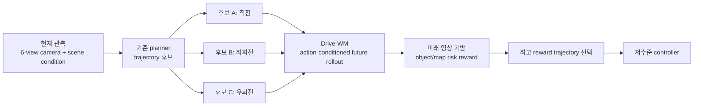

---

## 2. 논문 제목·Abstract 한국어 번역

### 2.1 제목

- **원제**: *Driving into the Future: Multiview Visual Forecasting and Planning with World Model for Autonomous Driving*
- **번역**: **미래로 주행하기: 자율주행을 위한 World Model 기반 Multi-view 시각 예측과 Planning**
- **모델명**: **Drive-WM**

### 2.2 Abstract 한국어 번역

자율주행에서 미래 사건을 미리 예측하고 예견 가능한 위험을 평가하면, 차량은 행동을 더 잘 계획할 수 있고 도로 위 안전성과 효율성도 높일 수 있다. 이를 위해 저자들은 기존 end-to-end planning model과 호환되는 최초의 driving world model인 **Drive-WM**을 제안한다.

Drive-WM은 view factorization이 가능하게 하는 결합 spatial-temporal modeling을 통해 주행 장면의 고품질 multi-view video를 생성한다. 저자들은 이 생성 능력을 바탕으로 world model을 안전한 driving planning에 적용할 가능성을 처음으로 보인다.

특히 Drive-WM은 서로 다른 driving maneuver에 따라 여러 미래로 주행해 볼 수 있으며, image-based reward에 따라 최적 trajectory를 결정한다. 실제 주행 dataset 평가는 이 방법이 고품질·일관성·제어 가능성을 갖춘 multi-view video를 생성할 수 있음을 검증하며, real-world simulation과 안전한 planning의 가능성을 연다.

### 2.3 논문 주장과 보장 범위 구분

| 논문이 보이는 것 | 아직 보이지 않는 것 |
|---|---|
| action 조건이 다른 multi-view 미래 생성과 후보 trajectory 비교가 가능함 | 생성 미래가 모든 물리·사회적 인과관계를 정확히 보존한다는 보장 |
| 기존 planner 위에 붙는 candidate evaluator 가능성 | Drive-WM 자체가 실시간 end-to-end controller라는 증명 |
| logged-data/open-loop 기반 생성·planning 신호 | 실제 차량 또는 완전한 closed-loop safety case |

---

## 3. 핵심 기여 3~5개

| # | 핵심 기여 | VLA for AD에서의 의미 |
|---:|---|---|
| 1 | 기존 end-to-end planner와 호환되는 **driving world model** 제안 | 새 policy를 처음부터 만들지 않고 trajectory 후보의 미래 결과를 평가할 수 있다. |
| 2 | spatial·temporal·view 차원을 함께 다루는 **multi-view video diffusion** | surround-view AD에서 한 camera만 그럴듯한 문제를 줄이려 한다. |
| 3 | **view factorization**으로 겹치는 camera 영역의 일관성을 다룸 | 서로 다른 카메라가 같은 차량을 서로 다른 위치에 생성하는 모순을 완화한다. |
| 4 | image/layout/text/ego action을 통합하는 controllable condition interface | scene editing과 action grounding을 같은 generation interface에 넣는다. |
| 5 | **tree rollout + image-based reward**를 planning 선택에 연결 | “미래를 상상한다”는 말을 trajectory ranking이라는 검증 가능한 operation으로 바꾼다. |

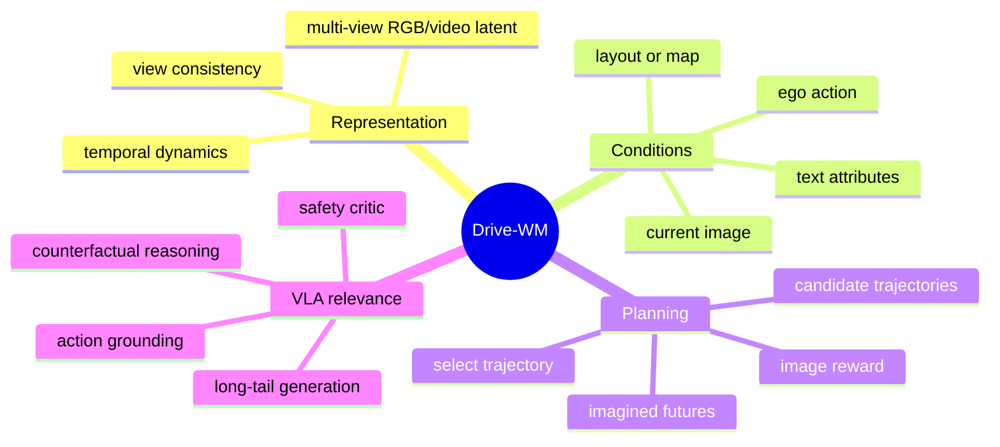

---

## 4. VLA for AD taxonomy 위치

### 4.1 축별 판정

| 분석 축 | Drive-WM의 위치 | 판정 근거 |
|---|---|---|
| Taxonomy | **Vision–Action (VA) world model**, VLA의 보조 module | natural-language driving instruction이 핵심 입력이 아니므로 엄밀한 VLA는 아니다. |
| State 표현 | **image-based** multi-view video latent | RGB camera view의 미래를 생성한다. 명시적 occupancy state가 주 표현은 아니다. |
| Input | 현재/과거 multi-view image, layout·map류 condition, ego action, 선택적 text condition | action과 scene condition이 미래 생성에 들어간다. |
| Output | 후보 action마다 조건화된 미래 multi-view video; 최종적으로 선택된 trajectory | model 자체의 주 출력은 video이며, planning wrapper가 action을 고른다. |
| Language role | 약함—style/scene condition | weather·lighting·view 등의 제어에는 쓸 수 있지만 instruction-following reasoning은 아니다. |
| Action grounding | 중간~강함 | ego action이 생성 미래에 영향을 주고 reward가 trajectory selection에 연결된다. |
| Evaluation | 생성 품질·제어 가능성·planning signal 중심의 open-loop 성격 | logged data에서 미래와 후보를 평가하며 full closed-loop driving은 제한적이다. |
| Safety/long-tail | 유망하지만 미보장 | counterfactual/OOD augmentation 가능성은 있으나 hallucination과 reward error가 남는다. |

### 4.2 taxonomy 지도

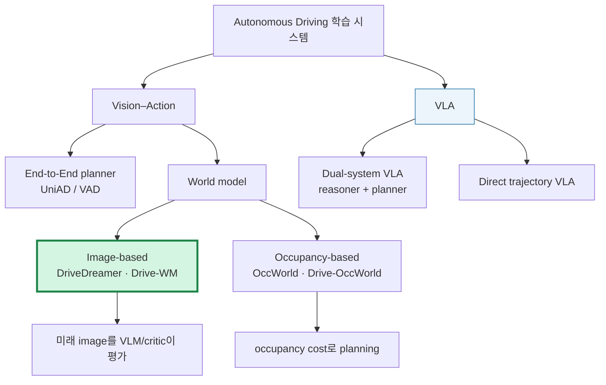

### 4.3 핵심 taxonomy 교훈

World model에 language token이 하나 있다고 VLA가 되는 것은 아니다. **언어가 route·constraint·risk 판단을 바꾸고, 그 판단이 waypoint/trajectory와 안전 metric에 검증 가능하게 연결될 때** language-action alignment가 있다고 볼 수 있다. Drive-WM은 language 축은 약하지만, action→future→reward→trajectory라는 **action grounding 축**은 명확하다.

---

## 5. Architecture / pipeline 시각화

### 5.1 전체 pipeline

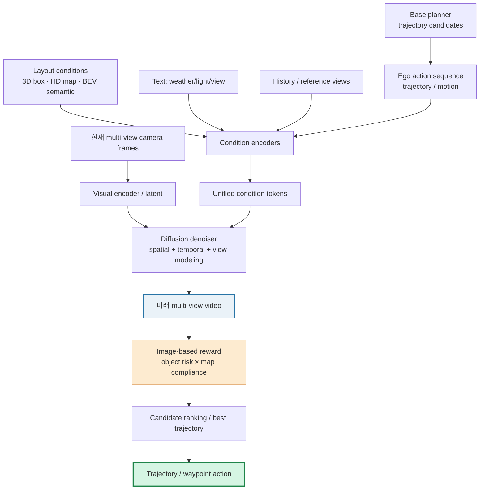

### 5.2 view factorization 직관

6개 camera를 독립적으로 생성하면, front-left와 front가 겹쳐 보는 동일 차량·차선의 위치가 달라질 수 있다. Drive-WM의 핵심 발상은 일부 **reference view**를 먼저 만들고, 나머지 **stitched view**는 이웃 reference view를 condition으로 받아 생성해 overlap을 맞추는 것이다.

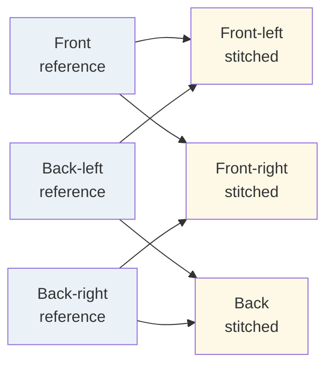

### 5.3 planning-by-imagination sequence

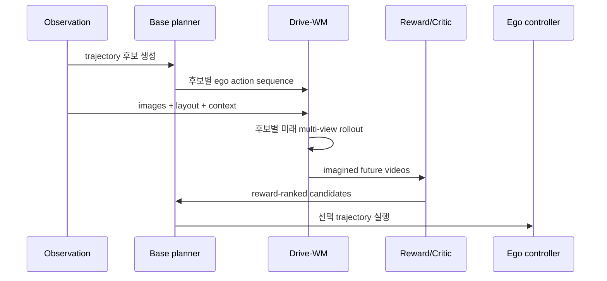

---

## 6. Input → Reasoning → Action Grounding 분석

### 6.1 I/O map

| 단계 | 입력 | 내부 표현/처리 | 출력 | action grounding |
|---|---|---|---|---|
| Observation | multi-view camera frame/history | image latent | 현재 scene context | 없음 |
| Condition | map/layout, text attributes, reference view | condition token | 생성 제어 정보 | 간접 |
| Action condition | candidate trajectory/ego motion | action embedding | “이 행동이면”이라는 counterfactual 조건 | 시작점 |
| World rollout | noise latent + 모든 condition | video diffusion | 후보별 future multi-view video | **행동 결과가 시각화됨** |
| Critique | imagined video, object/map estimator | risk/reward | 후보 점수 | 강함 |
| Planning | candidate score | ranking/selection | trajectory/waypoint | **직접** |

### 6.2 Reasoning의 실체

Drive-WM은 chain-of-thought를 출력하지 않는다. reasoning은 다음의 **환경 내재적(simulative) reasoning**으로 일어난다.

1. `candidate action`을 고정한다.
2. 그 action 아래의 future observation을 생성한다.
3. 생성된 future가 충돌·도로 이탈·지도 제약 위반을 보이는지 critic이 평가한다.
4. 가장 좋은 reward를 주는 trajectory를 고른다.

따라서 이 논문에서 “reasoning” 품질은 설명 문장의 설득력이 아니라 **counterfactual 미래의 calibration**과 **reward의 안전 정렬**로 평가해야 한다.

### 6.3 언어 역할과 action grounding scorecard

| 항목 | 점수 | 이유 |
|---|---:|---|
| Numeric action conditioning | 4/5 | ego motion/trajectory가 생성 조건으로 쓰인다. |
| Future consequence modeling | 5/5 | action별로 다른 future video를 rollout하는 것이 중심이다. |
| Direct action output | 3/5 | standalone controller가 아니라 planner candidate selector에 가깝다. |
| Language-action alignment | 1/5 | text는 scene/style condition에 가깝고 driving instruction grounding은 주제가 아니다. |
| Closed-loop feedback | 2/5 | planning 연결은 있지만 full simulator/vehicle feedback 검증은 제한적이다. |
| Safety constraint traceability | 3/5 | object/map reward는 해석 가능하나 reward가 안전을 완전히 대표하지는 않는다. |

---

## 7. Training recipe

### 7.1 학습 흐름

Drive-WM은 latent diffusion을 driving video generation으로 확장한다. 핵심은 단일 이미지의 appearance 생성에서 멈추지 않고, **시간 일관성**, **camera 간 일관성**, **action controllability**를 동시에 학습하는 것이다.

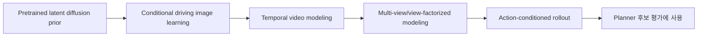

| 구성 | 역할 | 실전 주의점 |
|---|---|---|
| Visual latent encoder/decoder | 고해상도 RGB 대신 압축 latent에서 diffusion | latent reconstruction error가 작은 위험물체를 지울 수 있다. |
| Layout/map condition | 3D box·map·semantic 정보를 camera plane 조건으로 제공 | annotation/map 품질이 generation ceiling이 된다. |
| Temporal modeling | frame 간 object identity·motion 유지 | 한 프레임 realism만으로는 braking/cut-in 위험을 판단할 수 없다. |
| View modeling/factorization | surround-view overlap consistency | multi-view artifact는 3D scene 모순으로 이어질 수 있다. |
| Ego action condition | action을 future 변화의 원인으로 넣음 | dataset에서 rare steering/speed 조합이 부족하면 causal coverage가 약하다. |

### 7.2 data curation과 action coverage

자율주행 로그는 보통 직진·정상 속도 데이터가 압도적으로 많다. 이것을 그대로 학습하면 “급회피, 큰 조향, 경계 복귀”처럼 필요한 action에서 미래를 제대로 생성하지 못한다. 논문의 핵심 실무 교훈은 **trajectory를 maneuver 및 speed×steering 구간으로 나누고 rare action을 보강**해야 한다는 점이다.

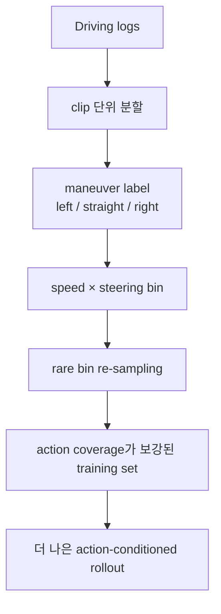

### 7.3 training recipe의 VLA 확장 위험

- VLM의 natural-language instruction을 추가해도, action loss·counterfactual consistency loss보다 강하면 language shortcut이 생길 수 있다.
- video realism loss는 **안전 인과성** loss가 아니다. 생성 영상이 그럴듯해도 pedestrian의 우선권이나 타 차량 반응을 틀릴 수 있다.
- multi-view diffusion은 compute/latency가 크다. online planning에는 distillation, short-horizon rollout, cache, 비학습 safety fallback이 필요하다.
- image-derived reward는 generator artifact를 exploit할 수 있으므로, geometric/occupancy/rule critic과 ensemble하는 편이 낫다.

---

## 8. Dataset / Benchmark / Metric 분석

### 8.1 dataset 및 평가 대상

| 항목 | Drive-WM에서의 의미 | VLA 관점의 공백 |
|---|---|---|
| 주 데이터 | **nuScenes**의 surround-view driving sequence | language instruction 중심 dataset은 아니다. |
| Sensor | 6-camera multi-view 영상과 구조화된 scene condition | raw visual world와 action의 연결에는 좋지만 LiDAR/occupancy를 주 state로 검증하지는 않는다. |
| 생성 평가 | image/video quality, temporal·view consistency, controllability | 좋은 FID/FVD가 correct driving dynamics를 보장하지 않는다. |
| Planning 평가 | 생성 미래의 reward로 trajectory candidate 선택 | imitation/open-loop 신호가 closed-loop recovery를 대체하지 못한다. |
| OOD 활용 | ego deviation·counterfactual scenario를 생성해 data augmentation 가능성 탐색 | 실제 rare-event frequency와 causal validity를 더 검증해야 한다. |

### 8.2 metric matrix

| 평가 축 | 대표 metric/검사 | 무엇을 측정하나 | 단독 사용의 위험 |
|---|---|---|---|
| Visual quality | FID, FVD | image/video distribution이 실제 data와 가까운가 | 위험한 object가 빠져도 평균 품질은 좋을 수 있다. |
| Condition adherence | detection mAP, map/semantic mIoU 류 | 입력 layout/map을 따르는가 | detector가 생성 artifact에 속을 수 있다. |
| Multi-view consistency | adjacent-view keypoint/overlap matching | 겹치는 camera view가 같은 3D world를 보는가 | keypoint 일치가 semantic/physical correctness를 보장하지 않는다. |
| Planning | trajectory L2, collision rate | 선택 trajectory가 GT와 가깝고 충돌이 적은가 | GT imitation이 안전한 alternative를 벌점 줄 수 있다. |
| Closed-loop | route completion, infraction, intervention, comfort | action이 다음 state를 바꾸는 상황에서도 안전한가 | 원 논문의 핵심 검증 범위가 아니다. |
| Calibration | rollout uncertainty vs actual error | world model을 언제 믿을지 | 필수지만 표준화가 부족하다. |

### 8.3 open-loop vs closed-loop

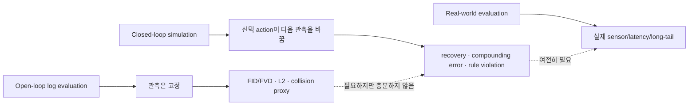

**판정:** Drive-WM은 open-loop world generation과 candidate planning signal을 강하게 다루지만, VLA safety를 주장하려면 closed-loop evaluator에서 collision, route completion, comfort, intervention을 별도로 보고해야 한다.

---

## 9. 관련 논문 비교표

### 9.1 world model 유형 비교표

| 계열/논문 | World state | 주 입력 → 주 출력 | Action interface | Planning 연결 | 강점 | 핵심 한계 |
|---|---|---|---|---|---|---|
| **DriveDreamer** | image/video latent | scene/layout condition → controllable driving video | condition 기반 | simulation/data generation 성격이 강함 | visually rich한 scene control | explicit candidate ranking은 상대적으로 약함 |
| **Drive-WM** | **multi-view image/video latent** | cameras + layout + ego action → future multi-view video | ego action-conditioned rollout | image reward로 trajectory 후보 선택 | multi-view consistency와 planning-by-imagination | diffusion latency, image reward reliability, closed-loop 부족 |
| **OccWorld** | 3D/4D occupancy token | past occupancy → future occupancy 및 planning-related prediction | ego future와 state evolution 연결 | geometry-aware planning에 적합 | collision/free-space를 구조적으로 다룸 | appearance·weather 같은 visual long-tail 표현은 약할 수 있음 |
| **Drive-OccWorld** | vision-centric future occupancy/flow | historical BEV feature + action → occupancy evolution | action-conditioned occupancy | occupancy cost/trajectory selection과 친화적 | 3D geometry·motion·cost 연결이 명확 | representation/annotation/tokenization 품질 의존 |
| **UniAD** | BEV + query + occupancy | multi-camera → trajectory | planner head 직접 출력 | direct end-to-end planner | full-stack planning backbone | explicit imagined video rollout은 약함 |

### 9.2 image-based vs occupancy-based 비교

| 축 | Image-based world model | Occupancy-based world model |
|---|---|---|
| 대표 state | RGB/multi-view video latent | BEV voxel/grid 또는 occupancy token |
| 대표 예 | DriveDreamer, **Drive-WM** | OccWorld, Drive-OccWorld |
| 잘 보이는 정보 | texture, lighting, weather, signage, 비정형 도로 위험 | free space, geometry, visibility, collision volume |
| planning cost | learned image/VLM/object-map critic이 필요 | occupancy overlap, drivable cost를 직접 계산하기 쉽다. |
| failure mode | realistic하지만 물리적으로 틀린 future | geometry는 맞아도 visual semantics/rare appearance를 놓침 |
| VLA 연결 | VLM이 미래 image를 critique하기 좋음 | numeric planner/safety shield가 쓰기 좋음 |
| 권장 역할 | scenario generation, visual hazard critique | safety constraint, collision checking, trajectory cost |

### 9.3 하이브리드 VLA 설계안

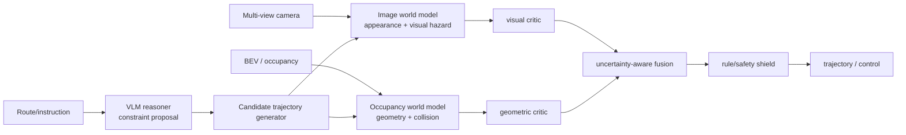

이 구조의 원칙은 **VLM이 final brake/steer를 독점하지 않게 하고**, language의 제안은 world model·occupancy·rule shield가 반증할 수 있게 하는 것이다.

---

## 10. 강점과 한계

### 10.1 강점

1. **생성과 planning을 끊지 않았다.** 미래 video를 만드는 데서 끝나지 않고, trajectory 후보를 고르는 reward loop에 연결한다.
2. **Surround-view의 본질적 문제를 다룬다.** 자율주행은 single front video가 아니라 여러 camera가 공유하는 3D scene이며, view consistency는 안전과 직결된다.
3. **기존 planner에 점진적으로 붙일 수 있다.** foundation-style world model을 planner replacement가 아니라 evaluator/augmentor로 쓴다.
4. **counterfactual data의 경로를 연다.** 로그에 부족한 ego deviation/희귀 maneuver를 생성해 behavior-cloning의 distribution gap을 보완할 수 있다.
5. **VLA의 grounding 기준을 선명하게 한다.** 텍스트 설명 대신 “행동하면 미래가 어떻게 달라지는가?”라는 반사실적 질문으로 action quality를 검사한다.

### 10.2 한계 및 안전 위험 matrix

| 한계/위험 | 왜 발생하는가 | Safety 영향 | 필요한 완화책 |
|---|---|---|---|
| Realism ≠ causal correctness | diffusion은 pixel likelihood에 강하고 물리·social dynamics에 약할 수 있음 | 잘못된 양보/끼어들기/충돌 예측 | causal scenario test, rollout calibration |
| Reward hacking | detector/map model이 생성 artifact를 오판할 수 있음 | 위험 trajectory가 높은 reward를 받을 수 있음 | multi-critic + rule + occupancy cross-check |
| Long-horizon drift | rollout이 길어질수록 작은 motion error가 누적 | late braking, miss된 conflict | receding horizon, uncertainty-gated horizon |
| Multi-view inconsistency | factorization도 완전한 3D reconstruction은 아님 | blind spot/overlap의 object 위치 모순 | explicit 3D/occupancy consistency loss |
| Action coverage 부족 | real logs의 조향·속도 분포가 불균형 | recovery/rare maneuver가 취약 | targeted data collection, scenario mining |
| Diffusion latency | multi-view video denoising이 무거움 | stale action, emergency 반응 지연 | distilled rollout + fast conservative fallback |
| Closed-loop 근거 부족 | logged/open-loop 평가가 중심 | feedback·compounding error 미검증 | CARLA/Bench2Drive 및 shadow-mode 평가 |
| Language grounding 부재 | text가 driving decision interface가 아님 | VLA extension에서 instruction hallucination 위험 | text→constraint→trajectory trace를 supervision |

### 10.3 critical commentary

Drive-WM을 “자율주행을 이미 해결한 simulator”로 읽으면 안 된다. 더 정확한 해석은 **world model이 planner의 보조적인 counterfactual evaluator가 될 수 있다**는 증명이다. 특히 safety-critical deployment에서는 생성 영상의 미관보다 다음이 중요하다.

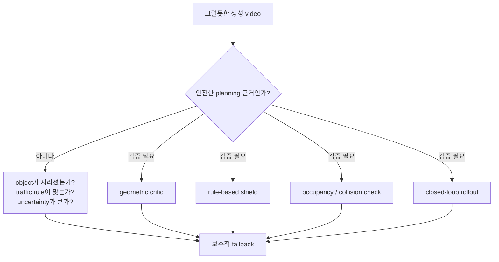

---

## 11. 실전 학습 포인트

### 11.1 구현/리뷰 checklist

| 질문 | 체크 |
|---|:---:|
| world state는 image, BEV, occupancy, latent 중 무엇이며 planning cost와 얼마나 직접 연결되는가? | □ |
| action condition은 steering/speed, waypoint, trajectory, high-level command 중 무엇인가? | □ |
| 동일 action에서 rollout이 여러 개일 때 uncertainty를 어떻게 추정하는가? | □ |
| candidate 수 × horizon × diffusion step이 실시간 latency 예산 안에 드는가? | □ |
| image critic 외에 occupancy/rule/geometric critic이 있는가? | □ |
| FID/FVD 외에 object persistence, map compliance, collision, calibration을 측정하는가? | □ |
| closed-loop에서 recovery, comfort, rule violation, intervention을 보고하는가? | □ |
| VLM의 language 판단이 final action이 아니라 검증 가능한 constraint로 내려오는가? | □ |

### 11.2 핵심 용어

| 용어 | 이 주차에서의 뜻 |
|---|---|
| **World model** | 현재 state와 action으로 미래 state/observation을 예측·생성하는 모델 |
| **Action-conditioned generation** | “무슨 일이 일어날까?”가 아니라 “내가 이 action을 하면 무엇이 일어날까?”를 생성하는 것 |
| **Planning-by-imagination** | 실제 실행 전 후보 action을 모델 안에서 rollout·평가·선택하는 planning |
| **Multi-view consistency** | 여러 camera가 하나의 동일 3D world를 모순 없이 표현하는 성질 |
| **Occupancy** | 공간이 future 시점에 물체로 점유되는지 나타내는 3D/4D 표현 |
| **Open-loop** | action이 환경의 다음 관측을 바꾸지 않는 logged-data 평가 |
| **Closed-loop** | policy action이 다음 state를 바꾸고 error가 누적되는 평가 |
| **Action grounding** | model decision이 실제 trajectory/control 및 안전 결과와 연결되는 정도 |

### 11.3 30분 복습 과제

1. **그림으로 설명:** “직진/좌회전 두 candidate가 있고, 보행자가 가려져 있다”는 장면에서 image reward만 사용할 때의 failure를 그리고 occupancy critic이 무엇을 추가하는지 적는다.
2. **설계 선택:** VLA reasoner의 텍스트 출력 `좌측 차선을 피하라`를 high-level command로 바로 보내지 말고, map constraint·trajectory 후보·world rollout의 세 단계로 바꿔 본다.
3. **평가 표 작성:** 자신의 모델에 대해 `open-loop L2`, `collision`, `route completion`, `comfort`, `rollout calibration`, `latency`를 한 표에 넣고 빠진 칸을 표시한다.

---

## 12. 다음 주 질문

다음 주는 **Early VLA와 explainable driving**이며, deep paper는 **DriveLM: Driving with Graph Visual Question Answering**이다.

1. DriveLM의 언어 explanation은 Drive-WM의 imagined future보다 안전 decision에 더 직접적인 근거가 될 수 있는가?
2. graph VQA의 object·relation 표현을 trajectory/occupancy/world-model constraint로 어떻게 grounding할 수 있는가?
3. “설명을 잘한다”는 평가와 “closed-loop에서 충돌을 줄인다”는 평가 사이에 어떤 bridge metric이 필요한가?
4. Drive-WM의 image future를 VLM이 critique할 때, VLM hallucination을 occupancy/rule shield가 어떻게 반증해야 하는가?

---

## 13. 참고 링크

1. **Drive-WM arXiv** — https://arxiv.org/abs/2311.17918
2. **Drive-WM PDF** — https://arxiv.org/pdf/2311.17918
3. **Drive-WM 코드 (BraveGroup)** — https://github.com/BraveGroup/Drive-WM
4. **DriveDreamer** — https://arxiv.org/abs/2309.09777
5. **OccWorld** — https://arxiv.org/abs/2309.09502
6. **Drive-OccWorld** — https://arxiv.org/abs/2408.14197
7. **Week 02: UniAD** — `raw/vla_study/weeks/week-02-end-to-end-ad-기본기-2026-07-28.md`

> **이번 주 요약:** image-based world model은 visual future를 통해 VLM/critic의 풍부한 판단을 가능하게 하고, occupancy-based world model은 collision·free-space·planning cost를 더 직접적으로 만든다. 실전 VLA for AD는 둘 중 하나를 맹신하기보다, **language constraint → trajectory 후보 → image/occupancy rollout → uncertainty-aware multi-critic → safety shield**라는 검증 고리를 만들어야 한다.
