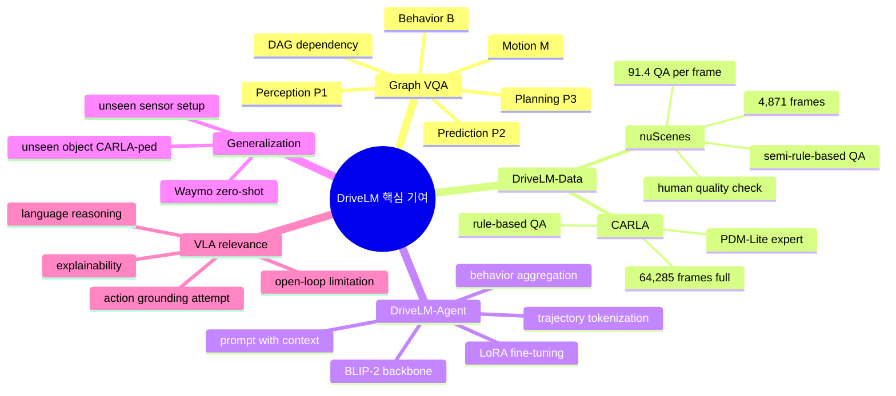
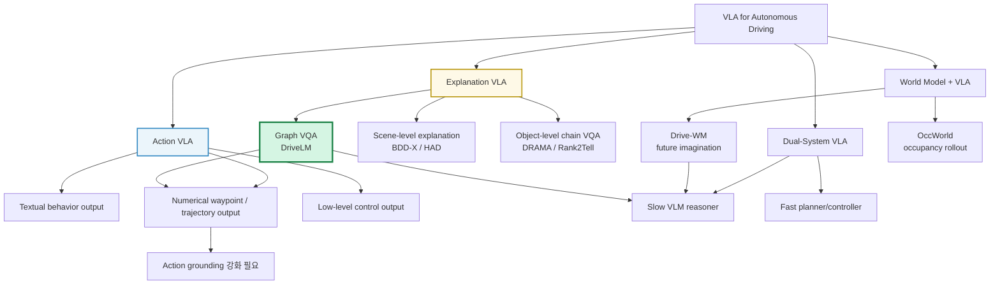
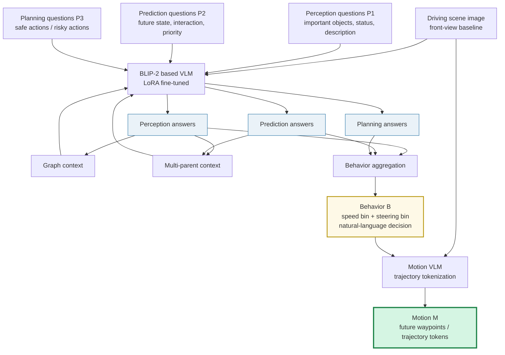
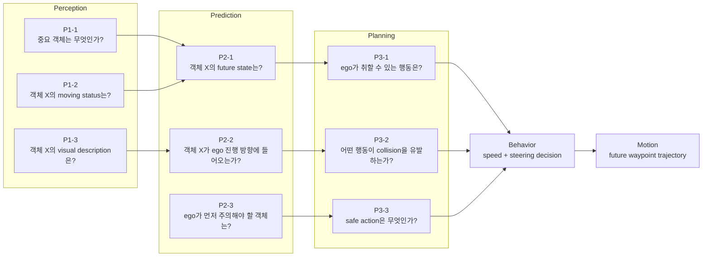
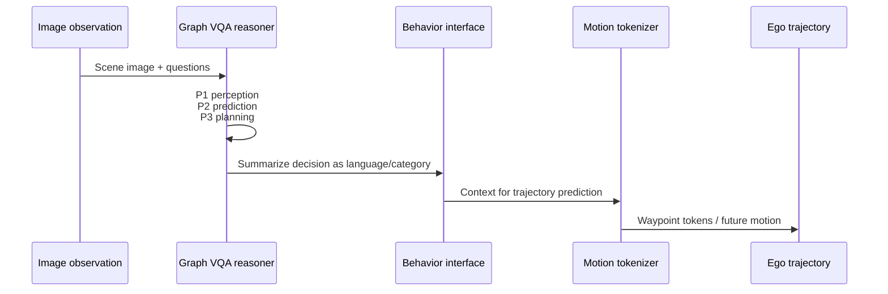
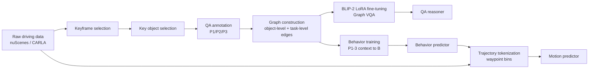
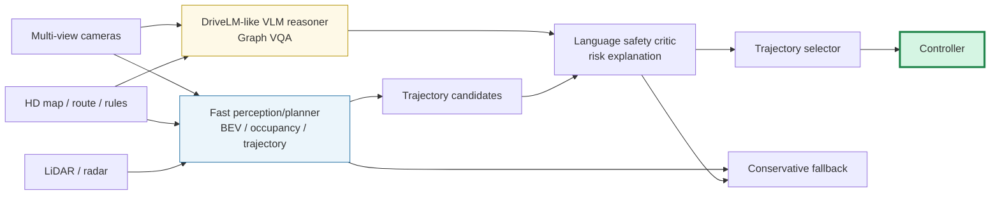
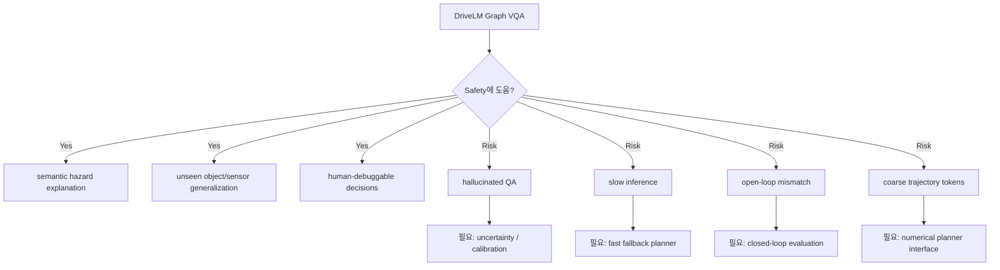
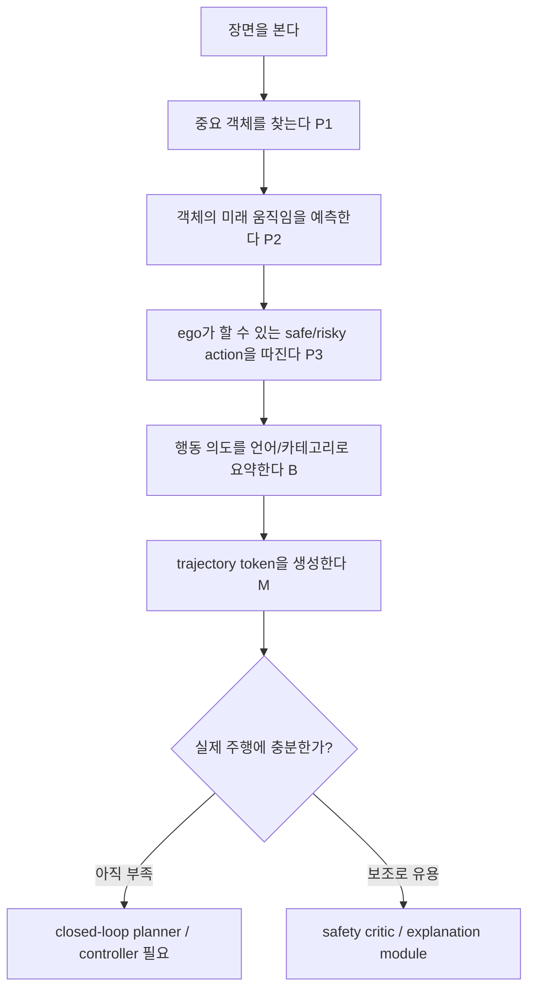

# Week 04. Early VLA와 Explainable Driving: DriveLM으로 보는 “설명하는 주행”과 “실행하는 주행”의 간극

## Metadata

| 항목 | 내용 |
|---|---|
| Date | 2026-05-19 |
| Week | 04 / 12 |
| Original paper/source | *DriveLM: Driving with Graph Visual Question Answering* |
| Korean title | **DriveLM: Graph Visual Question Answering으로 주행하기** |
| URL | https://arxiv.org/abs/2312.14150 |
| Version read | arXiv:2312.14150v3, arXiv abstract page + arXiv LaTeX source 기반 |
| Authors | Chonghao Sima, Katrin Renz, Kashyap Chitta, Li Chen, Hanxue Zhang, Chengen Xie, Jens Beißwenger, Ping Luo, Andreas Geiger, Hongyang Li |
| Taxonomy | Early VLA / explainable driving / graph-structured VQA / language-mediated behavior planning |
| Reading mode | Deep read: DriveLM / skim: DriveGPT4, DriveMLM |
| 이번 주 focus | language reasoning, graph VQA, explanation과 action의 차이 |
| Output | Explanation VLA vs Action VLA 구분표 |

> 참고: 이번 노트는 PDF 전체를 줄 단위로 번역하지 않고, arXiv abstract와 공개 LaTeX source의 핵심 섹션(abstract, introduction, data/task, method, experiments, discussion, tables)을 바탕으로 한국어 학습 노트로 재구성했다. 핵심 수치와 구조는 논문 표/본문에서 확인한 값만 사용했다.

---

## 1. 이번 주 한 문장 결론

**DriveLM의 핵심은 VLM을 바로 steering/control에 꽂는 것이 아니라, 주행 장면을 `Perception → Prediction → Planning → Behavior → Motion`이라는 Graph VQA로 쪼개어 “왜 그렇게 운전해야 하는지”를 언어로 설명하게 만들고, 마지막에 trajectory token으로 action grounding을 시도한 early VLA라는 점이다.**

Week 03의 Drive-WM이 **행동 후보별 미래 장면을 생성해서 action grounding을 강화**했다면, Week 04의 DriveLM은 반대로 **언어 reasoning과 explainability를 강화**한다.

하지만 가장 중요한 결론은 다음이다.

> **설명을 잘하는 모델이 곧 안전하게 운전하는 모델은 아니다.** DriveLM은 explanation VLA의 강한 출발점이지만, closed-loop safety와 numerical action reliability까지 증명한 action VLA는 아니다.

---

## 2. 논문 제목·Abstract 한국어 번역

### 2.1 제목 번역

- **원제**: *DriveLM: Driving with Graph Visual Question Answering*
- **번역**: **DriveLM: Graph Visual Question Answering으로 주행하기**
- **시스템명**: **DriveLM / DriveLM-Agent / DriveLM-Data**

### 2.2 Abstract 한국어 번역

저자들은 web-scale 데이터로 학습된 Vision-Language Model(VLM)을 end-to-end driving system에 어떻게 통합하여 일반화 성능을 높이고, 인간 사용자와의 상호작용을 가능하게 할 수 있는지 연구한다. 최근 연구들은 VLM을 단일 라운드 Visual Question Answering(VQA) 방식으로 주행에 적응시키지만, 인간 운전자는 의사결정을 여러 단계로 추론한다. 핵심 객체를 위치 파악하는 것에서 시작해, 객체 간 상호작용을 추정한 뒤 행동을 취한다.

이 논문의 핵심 통찰은 저자들이 제안한 **Graph VQA** task에 있다. Graph VQA는 perception, prediction, planning question-answer pair를 통해 graph-structured reasoning을 모델링하며, 인간의 주행 추론 과정을 모사하기에 적절한 proxy task를 제공한다. 저자들은 nuScenes와 CARLA를 기반으로 **DriveLM-Data** 데이터셋을 구축하고, Graph VQA와 end-to-end driving을 함께 수행하는 VLM 기반 baseline인 **DriveLM-Agent**를 제안한다.

실험은 Graph VQA가 주행 장면에 대한 reasoning을 위한 단순하고 원칙적인 framework를 제공하며, DriveLM-Data가 이 task를 위한 도전적인 benchmark임을 보여준다. DriveLM-Agent baseline은 state-of-the-art driving-specific architecture와 비교해 경쟁력 있는 end-to-end autonomous driving 성능을 보인다. 특히 unseen object나 sensor configuration에서 zero-shot으로 평가할 때 이점이 두드러진다. 저자들은 이 연구가 VLM을 자율주행에 적용하는 방법을 새롭게 조명하는 출발점이 되기를 기대하며, code, data, model을 공개한다.

### 2.3 Abstract를 한 문장으로 다시 쓰기

**DriveLM은 자율주행을 VLM에게 한 번에 “운전해”라고 시키는 대신, 주행 reasoning을 graph-structured QA로 분해하고 그 언어적 중간 결과를 trajectory prediction으로 연결하는 explainable early VLA framework다.**

---

## 3. 핵심 기여 3~5개

| # | 핵심 기여 | 왜 중요한가 |
|---:|---|---|
| 1 | **Graph Visual Question Answering(GVQA) task 제안** | 단일 VQA나 단순 scene caption이 아니라, object-level 및 task-level dependency를 가진 DAG로 주행 reasoning을 모델링한다. |
| 2 | **DriveLM-Data 구축** | nuScenes와 CARLA를 기반으로 perception, prediction, planning QA를 graph 구조로 제공한다. DriveLM-nuScenes는 keyframe당 평균 91.4 QA를 가진다. |
| 3 | **DriveLM-Agent baseline** | BLIP-2 기반 VLM에 LoRA fine-tuning, graph prompting, behavior aggregation, trajectory tokenization을 결합해 language reasoning에서 motion으로 이어지게 한다. |
| 4 | **Zero-shot sensor configuration generalization 분석** | nuScenes로 학습한 뒤 Waymo sensor setup에서 평가했을 때 graph context가 일반화에 도움이 됨을 보인다. |
| 5 | **Explanation과 action을 연결하는 초기 interface 제시** | 자연어 behavior가 trajectory token prediction의 중간 interface가 될 수 있음을 보여주지만, 그 한계도 드러낸다. |

### Contribution map



---

## 4. VLA for AD taxonomy 위치

### 4.1 이번 주 taxonomy 판정

| 축 | DriveLM 위치 | 해석 |
|---|---|---|
| System type | **Early VLA / Explainable VLA** | VLM이 perception/prediction/planning QA를 언어로 처리하고 behavior/motion으로 연결한다. |
| Input modality | 주로 camera image + text question | baseline은 low-resolution front-view image 중심이다. LiDAR, temporal, 360° understanding은 제한적이다. |
| Output modality | QA text, behavior category, trajectory tokens | 최종적으로 future waypoint trajectory를 tokenized form으로 출력하므로 action grounding 시도는 있다. |
| Language role | **강함** | 언어가 단순 설명이 아니라 중간 reasoning state와 behavior interface 역할을 한다. |
| Action grounding | 중간 | motion stage가 trajectory를 출력하지만 open-loop이고 closed-loop control 검증은 부족하다. |
| Training recipe | VLM fine-tuning + graph context + LoRA | BLIP-2를 DriveLM-Data에 맞춰 fine-tuning한다. |
| Evaluation | open-loop planning + GVQA + zero-shot Waymo/CARLA | closed-loop deployment보다 reasoning benchmark 성격이 강하다. |
| Safety/long-tail | promising but insufficient | unseen sensor/object generalization을 보지만, latency와 hallucination, closed-loop mismatch가 남는다. |

### 4.2 Taxonomy 위치도



### 4.3 Week 03 Drive-WM과의 연결

| 질문 | Drive-WM | DriveLM |
|---|---|---|
| 핵심 목표 | 행동 후보별 미래 장면 생성과 reward 기반 선택 | 주행 reasoning을 graph QA로 설명하고 motion으로 연결 |
| 강한 축 | action-conditioned future prediction | language reasoning / explainability |
| 약한 축 | instruction-following language | closed-loop action reliability |
| 중간 표현 | multi-view video latent, action condition | QA graph, behavior text/category, trajectory token |
| Action grounding | 미래 video와 reward로 후보 trajectory 선택 | behavior → motion token으로 waypoint 예측 |
| Safety 관점 | generated future correctness가 핵심 | explanation hallucination과 open-loop mismatch가 핵심 |

---

## 5. Architecture / pipeline 시각화

### 5.1 DriveLM 전체 pipeline



### 5.2 Graph VQA 구조

DriveLM에서 graph는 단순 flowchart가 아니라 **DAG(Directed Acyclic Graph)**다. 각 node는 `(question, answer)` pair이고, edge는 “이 질문의 답이 다음 질문에 context로 들어간다”는 논리적 dependency를 의미한다.



### 5.3 Behavior를 interface로 쓰는 이유



핵심 직관은 다음이다.

- 일반 VLM은 **숫자를 정밀하게 출력하는 데 약하다**.
- 하지만 VLM은 “왜 감속해야 하는가?”, “어떤 객체가 위험한가?” 같은 **언어 reasoning**에는 강하다.
- DriveLM은 이 장점을 살리기 위해 behavior를 중간 interface로 두고, 마지막 motion stage에서 trajectory tokenization으로 numerical output을 만든다.

---

## 6. Input → Reasoning → Action Grounding 분석

### 6.1 I/O map

| Stage | Input | Representation | Reasoning type | Action grounding |
|---|---|---|---|---|
| Observation | front-view driving image | visual tokens | scene understanding | 없음 |
| P1 Perception | image + object questions | QA text | 중요 객체 식별, 위치/상태/묘사 | 간접적 |
| P2 Prediction | P1 context + future questions | QA graph node | 객체 future state, ego path와의 interaction | 중간 |
| P3 Planning | P1/P2 context + planning questions | QA graph node | safe/risky action reasoning | 강해짐 |
| Behavior B | P1~P3 QA context | speed/steering category + language | 행동 의도 요약 | 중간~강함 |
| Motion M | image + behavior | trajectory tokens | waypoint generation | **직접적 시도** |
| Control | trajectory → controller | vehicle command | closed-loop execution | 논문 범위 밖 |

### 6.2 언어의 역할

| 언어 사용 | DriveLM에서의 역할 | VLA 관점 평가 |
|---|---|---|
| Question | perception/prediction/planning을 분해하는 task specification | 매우 중요 |
| Answer | 중간 reasoning state | 설명 가능성의 핵심 |
| Context | parent QA를 child QA에 전달하는 graph dependency 구현 | multi-step reasoning 강화 |
| Behavior text | trajectory generation 전의 decision summary | language-action bridge |
| Motion token | 좌표 bin을 special token으로 출력 | action grounding 시도 |
| Natural language explanation | 사용자 interaction / regulation-friendly explainability | deployment 설득력은 있으나 safety 보증은 아님 |

### 6.3 Action grounding 점수표

| 항목 | 점수 | 이유 |
|---|---:|---|
| Visual grounding | 3/5 | baseline은 front-view low-resolution image 중심이므로 360° scene understanding은 제한적이다. |
| Language reasoning | 5/5 | DriveLM의 주된 기여가 Graph VQA reasoning이다. |
| Direct action output | 3/5 | trajectory tokens를 출력하지만 open-loop waypoint prediction 수준이다. |
| Closed-loop evaluation | 1/5 | discussion에서 closed-loop planning은 향후 과제로 명시된다. |
| Safety metric | 2/5 | collision/ADE 등 open-loop metric은 있으나 closed-loop safety case는 없다. |
| Long-tail generalization | 3/5 | Waymo sensor setup, CARLA-ped unseen object 등 일반화 실험이 있다. |
| Latency/deployability | 1/5 | DriveLM-Agent는 UniAD-Single보다 약 10배 느리고 FPS 0.16으로 보고된다. |
| Explanation reliability | 3/5 | graph context로 좋아지지만 hallucination/calibration 문제는 여전히 남는다. |

### 6.4 Explanation과 action의 차이

| 구분 | Explanation VLA | Action VLA |
|---|---|---|
| 주 질문 | “왜 그렇게 판단했는가?” | “실제로 무엇을 실행할 것인가?” |
| Output | caption, QA, rationale, behavior description | waypoint, trajectory, control, route-conditioned plan |
| 평가 | QA accuracy, SPICE, GPT score, explanation quality | collision, route completion, comfort, rule violation, closed-loop score |
| 실패 모드 | 그럴듯한 hallucinated explanation | 실제 collision, off-route, unsafe acceleration |
| DriveLM 위치 | 강함 | 초기적/부분적 |
| 실전 요구 | explanation faithfulness | action grounding + closed-loop robustness |

---

## 7. Training recipe

### 7.1 학습 절차 요약

| 단계 | 학습 대상 | 목적 |
|---|---|---|
| 1. DriveLM-Data 구축 | nuScenes/CARLA QA graph | perception, prediction, planning reasoning supervision 제공 |
| 2. BLIP-2 기반 VLM fine-tuning | Graph VQA QA pairs | image + question + context → answer 학습 |
| 3. Graph prompting | parent QA를 child question에 context로 추가 | logical dependency를 prompt 수준에서 구현 |
| 4. Behavior aggregation | P1~P3 QA를 behavior prediction context로 사용 | driving decision을 language/category interface로 요약 |
| 5. Trajectory tokenization | waypoint 좌표를 256 bins로 discretize | general VLM이 numerical motion을 token으로 출력하게 함 |
| 6. LoRA fine-tuning | BLIP-2 adapters | 큰 VLM 전체를 학습하지 않고 효율적으로 domain adaptation |



### 7.2 DriveLM-nuScenes annotation

| 항목 | 내용 |
|---|---|
| Source | nuScenes + OpenLane-V2 annotation + human annotators |
| Frames | 4,871 keyframes |
| Avg QA/frame | 91.4 |
| QA scale | Perception 144k, Prediction 153k, Planning 146k |
| Logic | Graph |
| Annotation style | semi-rule-based + human annotation + multi-round quality check |
| 강점 | 사람의 운전 reasoning에 가까운 풍부한 QA |
| 약점 | human answer diversity 때문에 평가/학습 난도가 높음 |

### 7.3 DriveLM-CARLA annotation

| 항목 | 내용 |
|---|---|
| Source | CARLA 0.9.14, Leaderboard 2.0 |
| Expert | PDM-Lite rule-based expert |
| Full frames | 64,285 |
| Keyframe frames | 5,721 |
| Avg QA/frame | 24.4~24.8 |
| QA scale(full) | Perception 697k, Prediction 311k, Planning 558k |
| Logic | Graph |
| Annotation style | privileged simulator info 기반 rule-based QA generation |
| 강점 | closed-loop simulator 기반으로 확장 가능 |
| 약점 | rule-based template의 다양성 한계 |

### 7.4 Trajectory tokenization 직관

DriveLM은 waypoint 좌표를 직접 float으로 출력하지 않는다. 대신 training trajectory 통계를 기반으로 좌표 bin을 만들고, 각 bin을 language tokenizer의 special token처럼 다룬다.

```mermaid
flowchart TD
    A[Future waypoints<br/>(x1,y1),...,(xN,yN)] --> B[Coordinate distribution]
    B --> C[256 bins]
    C --> D[Special trajectory tokens]
    D --> E[VLM text generation]
    E --> F[Decode tokens back to waypoints]
```

이 접근은 RT-2류 robotics VLA에서 action을 token으로 만드는 방식과 유사하다. 장점은 VLM generation을 그대로 쓸 수 있다는 점이고, 단점은 정밀 제어와 smoothness, uncertainty를 다루기 어렵다는 점이다.

### 7.5 Training risk

- QA graph가 풍부할수록 reasoning은 좋아질 수 있지만, inference round가 늘어 latency가 커진다.
- parent QA가 틀리면 child QA도 연쇄적으로 오염될 수 있다.
- behavior category가 coarse하면 실제 trajectory의 세밀한 차이를 잃는다.
- trajectory tokenization은 numerical precision과 control smoothness에 한계가 있다.
- open-loop imitation은 distribution shift와 compounding error를 해결하지 못한다.

---

## 8. Dataset / Benchmark / Metric 분석

### 8.1 Dataset 비교

| Dataset | Source | # Frames | Avg QA/frame | Perception | Prediction | Planning | Logic |
|---|---|---:|---:|---:|---:|---:|---|
| BDD-X | BDD | 26,228 | 1.0 | 26k | 없음 | 없음 | None |
| DRAMA | DRAMA | 17,785 | 5.8 | 85k | 없음 | 17k | Chain |
| nuScenes-QA | nuScenes | 34,149 | 13.5 | 460k | 없음 | 없음 | None |
| **DriveLM-nuScenes** | nuScenes | 4,871 | **91.4** | 144k | 153k | 146k | **Graph** |
| **DriveLM-CARLA full** | CARLA | 64,285 | 24.4 | 697k | 311k | 558k | **Graph** |
| **DriveLM-CARLA keyframe** | CARLA | 5,721 | 24.8 | 63k | 28k | 51k | **Graph** |

핵심 차이는 “QA가 많다”가 아니라 **QA 사이의 dependency가 있다**는 점이다. DriveLM은 단일 질문을 맞히는 benchmark가 아니라, reasoning chain/graph를 타고 최종 behavior/motion으로 가는 benchmark다.

### 8.2 Open-loop planning 결과 핵심

| Method | nuScenes ADE ↓ | nuScenes Collision ↓ | Waymo zero-shot ADE ↓ | Waymo Collision ↓ | 해석 |
|---|---:|---:|---:|---:|---|
| Command Mean | 4.57 | 5.72 | 7.98 | 11.41 | command별 평균 trajectory라 baseline 성격 |
| UniAD-Single | 1.80 | 2.62 | 4.16 | 9.31 | single-frame driving-specific baseline |
| BLIP-RT-2 | 2.63 | 2.77 | 2.78 | 6.47 | motion-only VLM baseline |
| DriveLM-Agent None→B | **1.39** | **1.67** | 2.76 | 6.59 | nuScenes에서는 behavior interface만으로 강함 |
| DriveLM-Agent Graph→B | 1.74 | 1.89 | **2.63** | **6.17** | Waymo zero-shot에서 graph context 이점 |
| UniAD full(video, privileged comparison) | 0.80 | 0.17 | - | - | single-frame/VLM baseline보다 강한 upper reference |

해석 포인트:

1. nuScenes open-loop에서는 full graph가 항상 최고는 아니다. None→B variant가 더 좋은 ADE/collision을 보인다.
2. 하지만 Waymo sensor setup으로 zero-shot transfer하면 graph context가 가장 좋은 성능을 보인다.
3. 즉, graph reasoning의 가치는 **in-domain open-loop score**보다 **domain shift/generalization**에서 더 잘 드러난다.

### 8.3 Question-wise analysis

논문은 대표 질문을 단계별로 추가해 behavior performance를 분석한다.

| Stage | 대표 질문 | behavior에 주는 정보 |
|---|---|---|
| P1 Perception | 중요한 객체는 무엇인가? 객체 X의 상태/묘사는? | 현재 장면의 object grounding |
| P2 Prediction | 객체 X의 future state는? ego 진행 방향에 들어오는가? | 위험/상호작용의 미래성 |
| P3 Planning | ego가 취할 수 있는 행동은? 어떤 행동이 collision을 유발하는가? safe action은? | action 후보와 risk |

결과적으로 **prediction과 planning QA를 추가하면 perception-only보다 behavior 성능이 좋아진다.** 다만 P3를 끝까지 모두 추가한다고 항상 크게 오르지는 않는다. 이는 객체의 future state가 이미 behavior decision에 필요한 정보를 상당 부분 담고 있음을 시사한다.

### 8.4 GVQA metric

| 평가 대상 | Metric | 의미 | 주의점 |
|---|---|---|---|
| P1~P3 QA | SPICE | generated answer와 reference semantics 비교 | driving safety와 직접 동일하지 않음 |
| P1~P3 QA | GPT score | LLM judge 기반 answer quality | judge bias 가능 |
| Behavior | Accuracy / Speed / Steer | speed/steering category 분류 | coarse behavior만 평가 |
| Motion | ADE | 평균 waypoint error | open-loop imitation metric |
| Motion | Collision | predicted path의 collision proxy | 실제 closed-loop collision과 다름 |
| Generalization | Waymo zero-shot / CARLA-ped | unseen sensor/object 대응 | 제한된 setting |

### 8.5 Open-loop vs closed-loop 평가

| 평가 형태 | DriveLM에서의 상태 | 주의점 |
|---|---|---|
| Graph VQA | 강함 | reasoning benchmark로 의미가 큼 |
| Open-loop planning | 있음 | ADE/collision이 실제 주행 안정성을 보장하지 않음 |
| Zero-shot domain shift | 있음 | Waymo sensor config, CARLA-ped object로 확인 |
| Closed-loop simulator | 제한적/향후 과제 | 논문 discussion에서 closed-loop planning을 명시적 limitation으로 언급 |
| Real vehicle deployment | 없음 | latency, safety monitor, fallback planner 필요 |

---

## 9. 관련 논문 비교표

### 9.1 DriveLM vs DriveGPT4 vs DriveMLM

| 논문 | 핵심 아이디어 | Input | Output | Language role | Action grounding | 평가 | 한계 |
|---|---|---|---|---|---|---|---|
| **DriveGPT4** | LLM 기반 interpretable end-to-end driving | multi-frame video + textual query | explanation, QA, low-level control signals | action 해석/질문 답변/추론 | control signal 예측을 시도 | BDD-X 중심 | graph reasoning보다는 instruction tuning 중심, closed-loop 강한 증거 제한 |
| **DriveLM** | Graph VQA로 perception→prediction→planning reasoning 구성 | front-view image + graph questions/context | QA, behavior, trajectory tokens | 중간 reasoning state 전체 | waypoint trajectory token으로 연결 | nuScenes/CARLA/Waymo open-loop + GVQA | latency, front-view, open-loop, closed-loop 부족 |
| **DriveMLM** | MLLM을 modular AD의 behavior planning module로 정렬 | camera/LiDAR, driving rules, user command | behavioral planning state + explanation | decision state와 explanation 생성 | off-the-shelf planner/control module과 연결 | CARLA Town05 Long closed-loop 개선 보고 | end-to-end VLA라기보다 modular behavior planner에 가까움 |

### 9.2 Explanation VLA vs Action VLA 구분표

| 축 | Explanation VLA | Action VLA |
|---|---|---|
| 대표 논문 | DriveGPT4, DriveLM 초기 계열 | LMDrive, ORION, OpenDriveVLA, ReflectDrive류 |
| 핵심 가치 | human-readable reasoning, regulatory explainability, debugging | 실제 waypoint/trajectory/control generation |
| 중간 표현 | QA, rationale, behavior text | trajectory token, BEV plan, control command |
| 장점 | 해석 가능, long-tail semantic cue를 말로 다루기 쉬움 | driving performance와 직접 연결 |
| 약점 | 말은 맞지만 행동이 틀릴 수 있음 | 불투명하고 reasoning/debugging이 어려울 수 있음 |
| 평가 metric | QA/GPT score, explanation quality | closed-loop driving score, collision, route completion |
| 실전 배치 | monitor/critic/copilot로 유리 | primary planner/controller로 요구사항 높음 |
| 안전 핵심 | explanation faithfulness | action grounding + verified fallback |

### 9.3 DriveLM을 Dual-System VLA로 확장하면?



DriveLM류는 실시간 primary controller보다 **slow reasoning / explanation / safety critic** 역할에 더 잘 맞는다. 반면 빠른 trajectory generation은 BEV/occupancy/planner 계열이 담당하고, DriveLM은 “왜 이 후보가 위험한가?”를 설명하거나 long-tail semantic hazard를 잡는 보조축이 될 수 있다.

---

## 10. 강점과 한계

### 10.1 강점

1. **자율주행 VQA를 graph reasoning 문제로 재정의했다**  
   기존 scene-level caption이나 single-object chain QA보다, 실제 운전자가 여러 객체와 단계를 함께 고려하는 방식에 더 가깝다.

2. **언어가 중간 state로 기능한다**  
   language가 단순 output explanation이 아니라 perception/prediction/planning 사이의 context carrier가 된다.

3. **데이터셋 기여가 크다**  
   DriveLM-Data는 perception, prediction, planning을 모두 포함하고 graph logic을 제공해 후속 VLA 연구의 benchmark 역할을 할 수 있다.

4. **domain shift에서 VLM의 장점을 보여준다**  
   Waymo unseen sensor setup에서 graph context가 유리하게 작동한다는 결과는 VLM의 semantic prior가 AD generalization에 도움이 될 수 있음을 시사한다.

5. **motion tokenization으로 action grounding의 첫걸음을 뗐다**  
   단순 설명 모델을 넘어 trajectory output까지 연결했다는 점에서 early VLA로 의미가 있다.

### 10.2 한계

| 한계 | 설명 | 연구 질문 |
|---|---|---|
| Front-view / low-resolution 중심 | driving-specific sensor, LiDAR, temporal, 360° context 부족 | multi-view video VLM으로 확장하면 graph reasoning이 유지될까? |
| Latency | DriveLM-Agent FPS 0.16, UniAD-Single 대비 약 10배 느림 | graph reasoning을 adaptive하게 줄이는 방법은? |
| Open-loop 중심 | closed-loop planning은 향후 과제로 남음 | CARLA/Bench2Drive에서 실제 route completion과 collision은? |
| QA error propagation | parent answer hallucination이 child answer에 누적될 수 있음 | graph uncertainty와 self-correction을 어떻게 넣을까? |
| Numerical action precision | trajectory tokenization은 coarse bin 기반 | waypoint precision과 comfort를 어떻게 보장할까? |
| Explanation faithfulness | 그럴듯한 설명이 실제 causal basis인지 보장 어려움 | explanation과 action의 causal consistency metric이 필요 |

### 10.3 Safety / long-tail risk 관점



DriveLM은 long-tail semantic hazard를 말로 포착하는 데 유리할 수 있다. 예를 들어 “공사 표지판”, “비정상적으로 움직이는 보행자”, “차선 경계가 흐릿함” 같은 요소는 pure geometry보다 language reasoning이 잘 다룰 수 있다. 그러나 이 설명이 실제 trajectory 변경으로 이어지지 않으면 안전 시스템으로는 부족하다.

---

## 11. 실전 학습 포인트

### 11.1 논문을 읽을 때 잡아야 할 핵심 개념

- **Graph VQA**: QA pair를 DAG node로 보고, logical dependency를 edge로 구성하는 VQA task.
- **P1/P2/P3**: Perception, Prediction, Planning. 주행 reasoning의 세 단계.
- **Behavior B**: speed bin과 steering bin으로 이루어진 coarse driving decision. 언어 reasoning과 motion 사이의 interface.
- **Motion M**: future waypoint trajectory. DriveLM에서는 tokenized trajectory로 출력한다.
- **Prompting with Context**: parent QA를 child question에 `Context:`로 붙여 graph dependency를 구현하는 방식.
- **Trajectory Tokenization**: waypoint 좌표를 discrete token으로 바꾸어 VLM generation problem으로 만드는 기법.
- **Explanation-action gap**: 설명은 맞지만 action이 안전하지 않을 수 있는 간극.

### 11.2 구현 관점 checklist

| 체크포인트 | 질문 |
|---|---|
| Graph design | 어떤 QA node가 실제 behavior/action에 causal하게 중요한가? |
| Context budget | 모든 QA를 넣을 것인가, 필요한 subgraph만 넣을 것인가? |
| Error propagation | 이전 QA가 틀렸을 때 downstream answer를 어떻게 보호할 것인가? |
| Behavior interface | speed/steering bin이 충분한가, lane change/overtake/yield 같은 abstraction이 필요한가? |
| Motion output | tokenized waypoint인가, continuous regression head인가, planner API call인가? |
| Sensor input | front camera만으로 충분한가, multi-view/LiDAR/BEV가 필요한가? |
| Latency | graph reasoning을 매 프레임 할 것인가, event-triggered로 할 것인가? |
| Closed-loop | open-loop ADE가 아니라 실제 intervention 후 회복을 평가했는가? |
| Safety fallback | VLM이 늦거나 불확실할 때 conservative planner가 있는가? |

### 11.3 내 머릿속 도식



### 11.4 이 논문을 VLA 연구에 연결하는 질문

1. **언어 reasoning은 action을 실제로 바꾸는가?**  
   DriveLM은 graph QA가 behavior/motion에 연결됨을 보이지만, closed-loop에서 안전 행동으로 이어지는지는 별도 문제다.

2. **Graph context는 항상 좋은가?**  
   in-domain nuScenes에서는 None→B가 더 좋은 motion metric을 보인 반면, Waymo zero-shot에서는 Graph가 유리하다. 따라서 graph reasoning은 평균 성능보다 generalization에서 더 중요할 수 있다.

3. **VLM은 primary driver인가, copilot인가?**  
   latency와 sensor 한계를 고려하면 DriveLM류는 당장 primary controller보다 explanation/critic/planner assistant에 더 적합하다.

4. **Explanation metric과 safety metric을 어떻게 연결할까?**  
   QA score가 높아도 collision이 줄지 않을 수 있다. 후속 연구는 explanation faithfulness와 closed-loop safety를 함께 측정해야 한다.

---

## 12. 다음 주 질문

Week 05는 **CoT, Retrieval, Instruction Following**으로, RAG-Driver를 중심으로 볼 예정이다.

다음 주에 가져갈 질문:

1. DriveLM의 graph context와 RAG-Driver의 retrieval context는 어떻게 다른가?
2. 주행 reasoning에서 CoT는 실제 action quality를 높이는가, 아니면 hallucination surface만 늘리는가?
3. retrieval이 long-tail driving memory를 제공할 때, outdated/irrelevant 사례를 어떻게 걸러야 하는가?
4. instruction following이 route/goal compliance에는 도움이 되지만 safety와 충돌할 때 우선순위는 어떻게 정할까?
5. Explanation VLA에서 Action VLA로 넘어가기 위한 최소 interface는 waypoint인가, trajectory인가, planner API인가?

---

## 13. 참고 링크

### Deep read

- DriveLM arXiv: https://arxiv.org/abs/2312.14150
- DriveLM PDF: https://arxiv.org/pdf/2312.14150
- DriveLM GitHub: https://github.com/OpenDriveLab/DriveLM
- DriveLM project page: https://opendrivelab.com/DriveLM/

### Skim / comparison

- DriveGPT4 arXiv: https://arxiv.org/abs/2310.01412
- DriveGPT4 project page: https://tonyxuqaq.github.io/projects/DriveGPT4/
- DriveMLM arXiv: https://arxiv.org/abs/2312.09245

### 이전 주차 연결

- Week 01: VLA for AD taxonomy — `raw/vla_study/weeks/week-01-vla-for-ad-지형도와-taxonomy-2026-04-28.md`
- Week 02: UniAD / End-to-End AD 기본기 — `raw/vla_study/weeks/week-02-end-to-end-ad-기본기-2026-05-05.md`
- Week 03: Drive-WM / World Model 기초 — `raw/vla_study/weeks/week-03-world-model-기초-2026-05-12.md`
