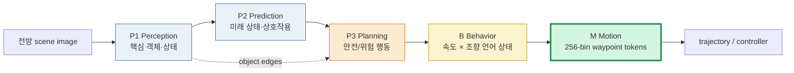
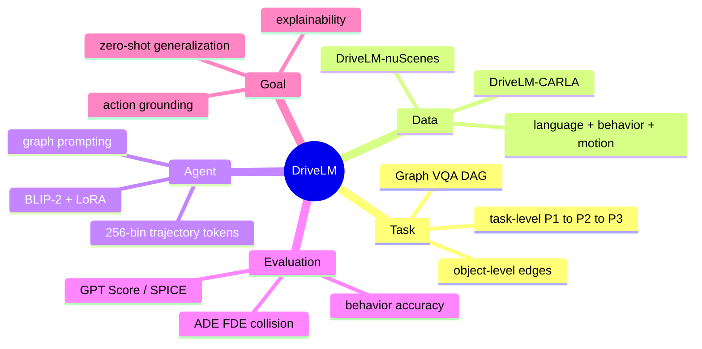
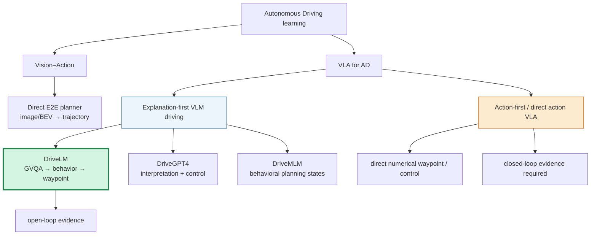
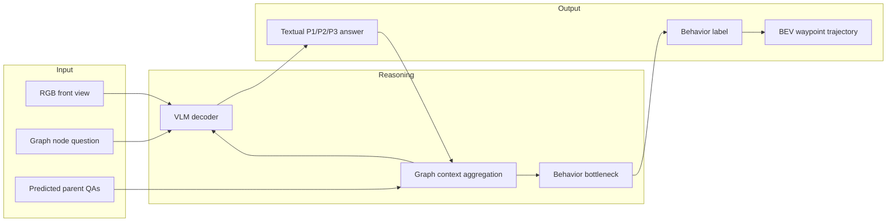
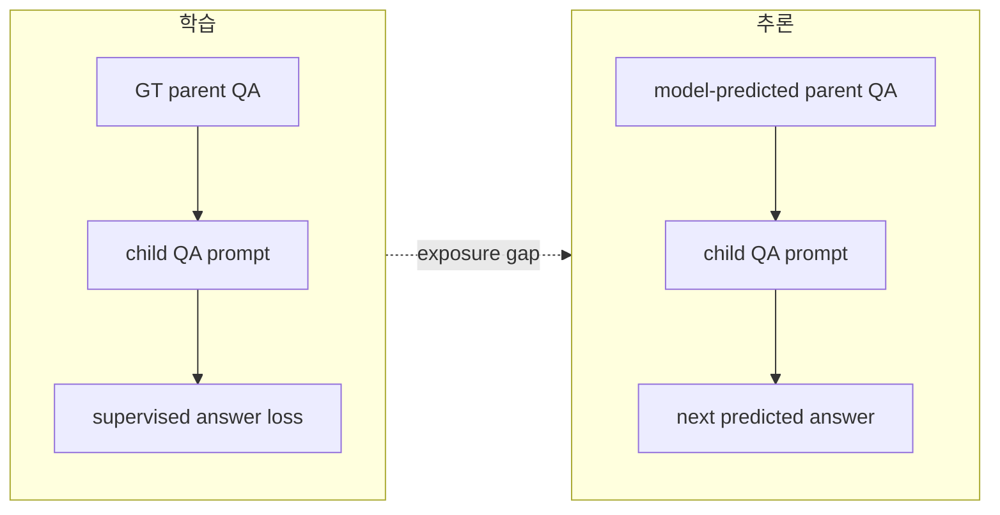
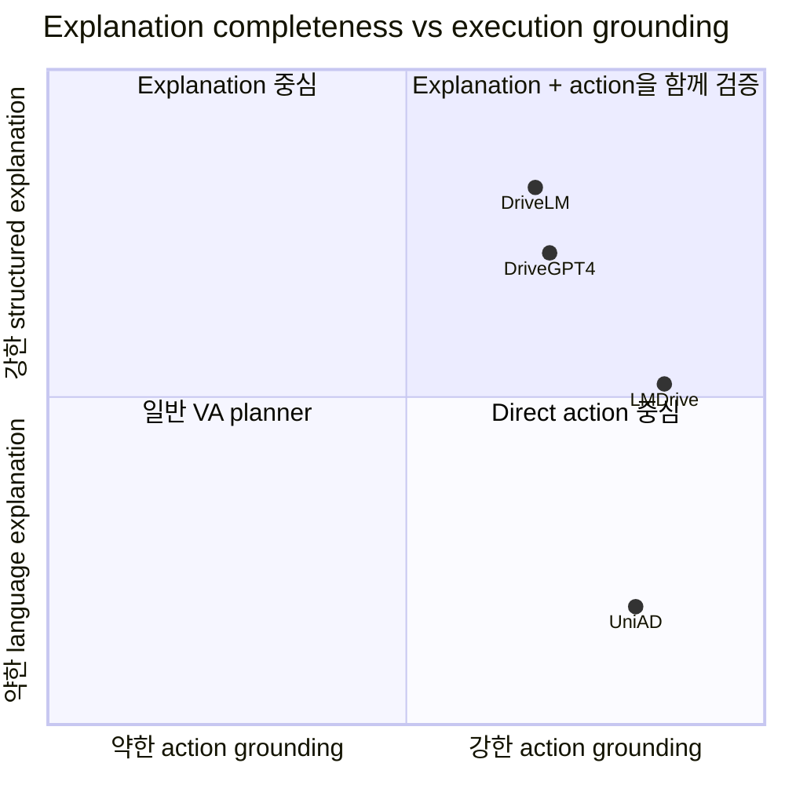
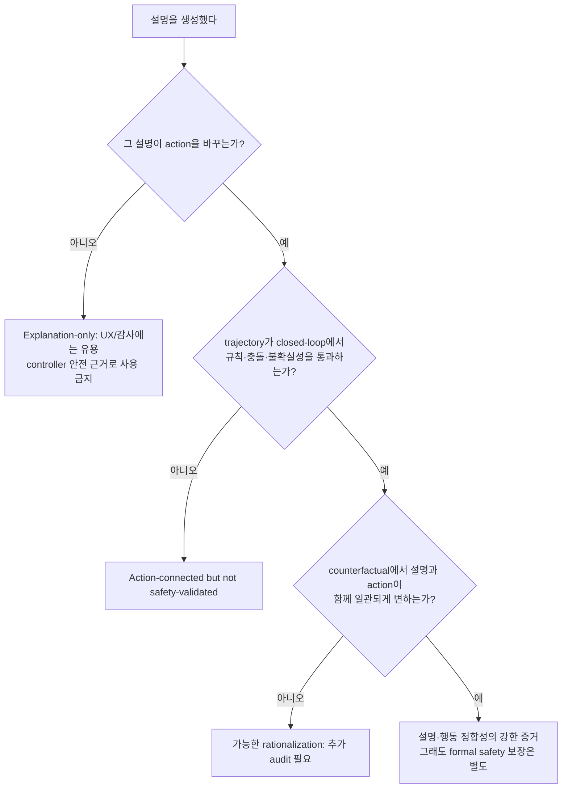

# Week 04. Early VLA와 Explainable Driving: DriveLM의 Graph VQA

| 항목 | 내용 |
|---|---|
| 날짜 | 2026-08-11 (Asia/Seoul) |
| 주차 | 04 / 12 |
| 원 논문 | *DriveLM: Driving with Graph Visual Question Answering* |
| 한국어 제목 | **DriveLM: 그래프 시각 질의응답으로 주행하기** |
| 저자 | Chonghao Sima, Katrin Renz, Kashyap Chitta, Li Chen, Hanxue Zhang, Chengen Xie, Jens Beißwenger, Ping Luo, Andreas Geiger, Hongyang Li |
| 공개 정보 | arXiv:2312.14150 v3 (2025-01-16), ECCV 2024 Oral |
| URL | https://arxiv.org/abs/2312.14150 |
| 코드·데이터 | https://github.com/OpenDriveLab/DriveLM |
| Taxonomy | **reasoning-supervised VLM driving / Graph VQA / explanation-to-trajectory pipeline** |
| 읽기 방식 | Deep read: DriveLM 논문 PDF·공식 저장소 · Skim: DriveGPT4, DriveMLM |
| 이번 주 산출물 | Explanation VLA vs Action VLA 구분표 |

> **읽기 범위.** arXiv v3 PDF 전체(52쪽)를 텍스트 추출하여 확인하고, 공식 DriveLM 저장소·challenge 평가 코드를 대조했다. 따라서 아래 수치와 구조는 논문/공개 구현 문서에 근거한다. DriveGPT4와 DriveMLM은 이번 주 비교를 위한 문헌 스킴 수준으로만 다루며, 해당 논문의 상세 재현 수치까지 검증한 것은 아니다.

---

## 1. 이번 주 한 문장 결론

**DriveLM의 핵심은 “설명 문장을 잘 생성하면 안전하게 운전한다”가 아니라, object-level·task-level DAG로 묶은 Perception → Prediction → Planning의 언어 추론을 `behavior`라는 인터페이스를 거쳐 양자화된 waypoint로 연결하고, 그 연결 자체를 학습·측정한 데 있다.**

다만 이 연결은 아직 완전한 safety case가 아니다. P1–P3의 좋은 자연어 답은 **설명 품질**, behavior와 motion의 낮은 ADE·collision rate는 **action 품질**이며, 둘은 별도 지표로 확인해야 한다. DriveLM의 최종 motion은 trajectory를 내므로 action-grounded이지만, 전체 평가는 open-loop이고 VLM의 0.16 FPS 추론은 실시간 폐루프 제어와 거리가 있다.



---

## 2. 논문 제목·Abstract 한국어 번역

### 2.1 제목

- **원제**: *DriveLM: Driving with Graph Visual Question Answering*
- **번역**: **DriveLM: 그래프 시각 질의응답으로 주행하기**
- **이름의 핵심**: Graph VQA(GVQA)는 QA를 독립 문제로 보지 않고, 앞 단계 답이 다음 단계 질문의 문맥이 되는 **유향 비순환 그래프(DAG)** 로 만든다.

### 2.2 Abstract 한국어 번역

우리는 web-scale 데이터로 학습된 vision-language model(VLM)을 end-to-end 주행 시스템에 통합하여 일반화 성능을 높이고 사용자와의 상호작용을 가능하게 하는 방법을 연구한다. 최근 방법들은 single-round visual question answering(VQA)을 통해 VLM을 주행에 적용하지만, 인간 운전자는 여러 단계로 의사결정을 추론한다. 인간은 먼저 핵심 객체를 위치 파악하고, 행동을 취하기 전에 객체 간 상호작용을 추정한다.

핵심 통찰은, Perception·Prediction·Planning 질의응답 쌍을 통해 그래프 구조의 추론을 모델링하는 제안 과제 **Graph VQA**가 인간의 추론 과정을 모사할 적절한 proxy task를 제공한다는 점이다. 저자들은 nuScenes와 CARLA에 기반한 **DriveLM-Data**를 구축하고, Graph VQA와 end-to-end 주행을 함께 수행하는 VLM 기반 baseline **DriveLM-Agent**를 제안한다.

실험은 Graph VQA가 주행 장면을 추론하는 단순하면서도 원칙적인 틀을 제공하고, DriveLM-Data가 이 과제를 위한 도전적인 benchmark임을 보인다. DriveLM-Agent는 driving-specific architecture와 비교해 경쟁력 있는 end-to-end 자율주행 성능을 보이며, 특히 보지 못한 sensor configuration에서 zero-shot으로 평가할 때 이점이 두드러진다. 저자들은 이 연구가 자율주행에 VLM을 적용하는 새로운 출발점이 되기를 기대하며, 코드·데이터·모델을 공개한다.

### 2.3 주장과 보장 범위 분리

| 논문이 실증한 주장 | 실증하지 않은 보장 |
|---|---|
| P1→P2→P3 QA dependency를 graph context로 학습하는 GVQA benchmark | 생성한 explanation이 실제 모델 내부의 **충실한(faithful) 인과 설명**이라는 보장 |
| 행동 언어 상태를 거쳐 numerical trajectory를 산출할 수 있음 | 언어 chain이 없으면 반드시 잘못된 행동을 한다는 인과적 증명 |
| nuScenes→Waymo sensor shift에서 graph context가 zero-shot motion에 도움 | 실제 도로에서 장기 closed-loop 안전을 보장 |
| P1–P3 텍스트와 behavior/motion을 분리해 평가 | GPT-score 같은 언어 점수가 안전성 metric을 대체 |

---

## 3. 핵심 기여 5개

| # | 기여 | 왜 중요한가 |
|---:|---|---|
| 1 | **Graph VQA(GVQA)**: QA node와 논리 dependency edge를 갖는 DAG 정의 | 단일 caption/VQA를 “무엇을 봤나?”에서 “무엇 때문에 어떻게 행동하나?”로 확장한다. |
| 2 | **DriveLM-Data**: nuScenes와 CARLA 기반 P1–P3 그래프 QA 및 behavior·motion label | perception·prediction·planning 언어 supervision과 continuous trajectory를 같은 graph에 둔다. |
| 3 | **DriveLM-Agent**: 일반 VLM(BLIP-2)에 graph prompting과 behavior interface를 결합 | 대형 VLM의 world knowledge를 주행 policy에 붙이는 작고 명확한 baseline이다. |
| 4 | **trajectory tokenizer** | 연속 waypoint 좌표를 256개 bin token으로 바꿔 VLM decoder가 numerical action을 생성하게 한다. |
| 5 | **DriveLM-Metrics 및 OOD 평가** | 텍스트(P1–P3), discrete behavior, trajectory(ADE/FDE/collision)를 분리해 “말”과 “운전”을 함께 측정한다. |



---

## 4. VLA for AD taxonomy 위치

### 4.1 축별 판정

| 분석 축 | DriveLM의 위치 | 근거와 주의점 |
|---|---|---|
| **Taxonomy** | **early VLA / reasoning-supervised VLM driving** | visual input과 language reasoning을 사용하고 최종 waypoint를 내므로 VLA 성격이 있다. 단, 자유로운 사용자 instruction-following이 주 과제는 아니다. |
| State 표현 | **front-view RGB + text context**, 객체 참조는 camera/2D 좌표 `c tag` | BEV·LiDAR·360° temporal state가 핵심 표현은 아니다. |
| Input | scene image, 질문, 그래프 부모 QA의 context; motion 단계에는 behavior | deployment input으로 GT 문맥을 쓰면 안 되며, 실제 inference에는 이전 **예측** 답을 넣는다. |
| Reasoning output | P1 객체/상태 → P2 미래/상호작용 → P3 안전 행동 → B 속도·조향 | 자연어 reasoning은 중간 산출물이며, 그 자체가 controller 명령은 아니다. |
| Action output | future BEV waypoint sequence | 좌표를 256 bin으로 token화한 discrete language vocabulary에서 복원한다. |
| Language 역할 | **구조화된 중간 표현·설명·문맥 전달** | 단순 caption보다 강하지만, language instruction을 최적화하는 policy는 아니다. |
| Action grounding | **중간~강함** | B가 M의 입력이고 M이 trajectory metric으로 직접 평가된다. P1–P3 답의 정답성은 action correctness와 별개다. |
| Training recipe | supervised LoRA fine-tuning; P1–P3/B/M을 분해 | RL, online interaction, safety shield 학습은 없다. |
| Evaluation | QA semantic score + behavior classification + **open-loop** trajectory | CARLA data가 있어도 DriveLM-Agent closed-loop 주행 결과는 제시하지 않았다. |
| Safety / long-tail | sensor OOD와 unseen object 일반화의 신호는 긍정적 | rare-event calibration, uncertainty, intervention, formal verification은 미해결이다. |

### 4.2 taxonomy 지도



### 4.3 Explanation VLA vs Action VLA 구분표 — 이번 주 핵심 산출물

| 구분 | Explanation VLA | Action VLA | DriveLM의 판정 |
|---|---|---|---|
| 주 목적 | 사람이 이해할 장면·근거·의도 설명 | 차량이 실행할 action/trajectory 결정 | **둘을 직렬 연결** |
| 대표 출력 | “보행자가 횡단하므로 감속” | waypoint, steer/throttle/brake, trajectory | P1–P3는 설명, B는 bridge, M은 action |
| 평가 | QA 정확도, semantic alignment, faithfulness | ADE/FDE, collision, route completion, intervention | GPT-score/SPICE + behavior accuracy + ADE/FDE/collision |
| 실패 위험 | 그럴듯하지만 근거 없는 explanation (rationalization) | 수치적으로 매끄럽지만 규칙·의도를 무시한 trajectory | 오류가 단계별로 누적될 수 있음 |
| closed-loop 필요성 | 낮음: offline human inspection도 가능 | 매우 높음: state distribution shift가 발생 | DriveLM은 **open-loop에 한정** |
| 안전 주장에 필요한 추가물 | explanation-action consistency audit | simulator/vehicle closed-loop, uncertainty, shield | 현재 논문만으로는 부족 |

> **판정 규칙:** 자연어로 “브레이크해야 한다”고 말해도 numerical trajectory/제어로 검증 가능한 연결이 없으면 Explanation VLM이다. trajectory를 출력해도 language가 action을 바꾸지 않으면 단지 VA policy다. DriveLM은 `P1–P3 → B → M` 연결과 M metric 때문에 Action VLA 쪽으로 넘어가지만, action supervision·검증의 깊이는 후속 closed-loop VLA보다 초기 단계다.

---

## 5. Architecture / pipeline 시각화

### 5.1 GVQA graph와 inference 흐름

```mermaid
flowchart TD
  I[Front scene image] --> VLM[BLIP-2 visual encoder + LLM]
  Q1[P1 question] --> VLM
  VLM --> A1[P1 answer\nobjects / states]

  A1 --> C2[Context: parent QA]
  Q2[P2 question] --> R2[Prediction node]
  C2 --> R2
  I --> R2
  R2 --> A2[P2 answer\nfuture / interactions]

  A1 --> C3[object-level contexts]
  A2 --> C3
  Q3[P3 question] --> R3[Planning node]
  I --> R3
  C3 --> R3
  R3 --> A3[P3 answer\nsafe / unsafe actions]

  A1 --> CB[all P1–P3 contexts]
  A2 --> CB
  A3 --> CB
  CB --> B[Behavior answer\n5 speed × 5 steering bins]
  I --> B
  B --> T[Trajectory tokenizer\n(x,y) → 256 bins]
  I --> M[Motion VLM + separate LoRA]
  T --> M
  M --> W[waypoints in BEV]

  style W fill:#d5f5e3,stroke:#1e8449,stroke-width:3px
  style B fill:#fcf3cf,stroke:#b7950b
```

### 5.2 graph의 두 종류 edge

| edge | 의미 | 예시 | action grounding에서의 역할 |
|---|---|---|---|
| **Task-level** | 주행 pipeline의 단계 의존성 | `P1 → P2 → P3 → B → M` | “무엇을 봤는가”를 “어떻게 움직일까”까지 전달한다. |
| **Object-level** | 서로 다른 객체 QA의 상호작용 | 보행자의 위치(P1)가 sedan의 행동(P2), ego의 안전 행동(P3)에 영향 | 단일 객체 chain이 놓치는 conflict·우선순위를 표현한다. |

### 5.3 behavior는 왜 필요한가?

연속 좌표를 곧바로 text decoder에서 생성하면 숫자 오차·문법 오류·의도 불일치를 다뤄야 한다. DriveLM은 trajectory의 평균 x/y displacement를 속도 5 bin `{fast2, fast1, moderate, slow1, slow2}`와 조향 5 bin `{left2, left1, straight, right1, right2}`으로 map해 `B=(B_sp, B_st)`를 만든다.

```text
P1–P3 다수 QA ──요약/집계──> Behavior: “slow1 + right1”
                                      │
                                      ▼
                       Motion prompt + trajectory tokens
                                      │
                                      ▼
                   [(x0,y0), (x1,y1), …, (xN,yN)]
```

이것은 **설명과 numerical action 사이의 병목(bottleneck)** 이다. 장점은 디버깅 가능성, 단점은 “차선 변경/양보/추월”처럼 의미가 풍부한 maneuver를 speed×steer 25개 조합으로 충분히 담지 못할 수 있다는 점이다.

---

## 6. Input → Reasoning → Action Grounding 분석

| 단계 | 모델 입력 | 출력 | 학습 신호·평가 | action grounding 판정 | 대표 실패 |
|---|---|---|---|---|---|
| P1 Perception | image + 객체/장면 질문 | 핵심 객체, 위치, 상태 | QA text, SPICE/GPT-score | 간접 | 객체 누락·2D 위치 오인 |
| P2 Prediction | image + P1 parent QA + 미래 질문 | 객체 미래·상호작용·attention | QA text, SPICE/GPT-score | 간접이나 중요 | 예측 hallucination, context error 전파 |
| P3 Planning | image + 관련 P1/P2 QA | 안전/위험 행동·우선순위 | QA text, SPICE/GPT-score | 중간 | 그럴듯한 안전 문구가 실제 궤적과 불일치 |
| B Behavior | image + P1–P3 전체 context | discretized 속도·조향 언어 상태 | class accuracy/speed/steer accuracy | 강한 bridge | 25개 bin의 의미 손실 |
| M Motion | image + behavior + motion 질문 | tokenized waypoint | ADE, FDE, collision rate | **직접** | quantization·open-loop imitation error |

### 6.1 입력–출력 map



### 6.2 “설명 때문에 행동했는가?”를 확인하는 최소 audit

| 확인 질문 | DriveLM의 현 상태 | 실전에서 추가할 검사 |
|---|---|---|
| P3가 “보행자 때문에 감속”이라고 했는가? | QA semantic score로 일부 확인 | object 삭제/삽입 counterfactual에서 explanation과 trajectory가 함께 변하는지 검사 |
| behavior가 P1–P3를 반영했는가? | context ablation으로 간접 확인 | behavior token을 교체했을 때 trajectory가 예측 가능하게 변하는지 확인 |
| trajectory가 실제로 안전한가? | logged future 대비 collision/ADE | closed-loop scenario에서 TTC, collision, red-light, rule violation, route completion 평가 |
| uncertainty를 아는가? | 명시적 calibration 없음 | confidence·OOD detector·fallback planner/safety shield 추가 |

---

## 7. Training recipe

### 7.1 논문에서 사용한 학습 구성

| 항목 | DriveLM-nuScenes | DriveLM-CARLA |
|---|---|---|
| Base VLM | BLIP-2 | BLIP-2 |
| Parameter adaptation | LoRA fine-tuning | LoRA fine-tuning |
| 학습 단위 | keyframe의 P1–P3, behavior, motion QA | keyframe의 그래프 QA |
| Epoch | 10 | 6 |
| Batch size | GPU당 2 | 논문 본문에 GPU당 batch를 별도 명시하지 않음 |
| 자원 | 8× V100, 약 7시간 | 4× A100, 약 6시간 |
| Motion model | 동일 BLIP-2 architecture, **독립 LoRA**, motion QA만 사용 | 같은 원칙 |
| Context | edge의 부모 QA를 `Context:` prefix로 붙여 concat | 같은 원칙 |

### 7.2 학습/추론 dataflow의 차이



논문은 graph context가 효과적임을 보이지만, sequential generation에서는 부모 답의 오류가 자식 node로 전달된다. 특히 GT context를 주는 평가는 **oracle upper bound**이며 실제 deployment score로 해석하면 안 된다.

### 7.3 구현 핵심

1. 각 waypoint 좌표를 training trajectory 통계에 맞춰 **256 bins**로 양자화한다.
2. BLIP-2 tokenizer vocabulary에 bin token을 추가하고 motion QA를 fine-tune한다.
3. P1–P3 graph는 모든 QA로 학습할 수 있지만, inference subgraph의 크기는 latency/compute budget에 따라 heuristic으로 고른다.
4. behavior node에는 가능한 모든 P1–P3 context를 넣어 multi-object 정보를 요약하게 한다.

> 공식 challenge README의 별도 LLaMA-Adapter v2 예제는 challenge baseline 경로다. 논문 본문의 DriveLM-Agent 실험은 **BLIP-2 + LoRA**를 사용한다. 두 baseline을 혼동하지 말아야 한다.

---

## 8. Dataset / Benchmark / Metric 분석

### 8.1 DriveLM-Data 구성

| 데이터 | 기반 | 규모 | annotation | 강점 | 주의점 |
|---|---|---:|---|---|---|
| DriveLM-nuScenes | nuScenes + 일부 OpenLane-V2 GT | 4,871 keyframe; frame당 평균 91.4 QA; P1/P2/P3 약 144k/153k/146k | keyframe·key object 선정 뒤 rule-based + human annotation, 다단 quality check | 사람이 쓴 다양한 예측·planning 언어 | keyframe selection, annotation 주관성, logged-world bias |
| DriveLM-CARLA (전체) | CARLA 0.9.14, Leaderboard 2.0 | 64,285 frame; 평균 24.4 QA; 약 1.6M QA | PDM-Lite privileged rule-based expert와 template QA | 대규모·자동 확장·object 상태 접근 | simulator/전문가 policy/template의 편향, real-world language 다양성 부족 |
| DriveLM-CARLA (keyframe) | 위와 동일 | 5,721 frame; 평균 24.8 QA | expert decision 변화 중심 추출 | action 변화 장면 분석 | full driving distribution을 대표하지 않을 수 있음 |

nuScenes에서는 annotation자가 ego 행동 변화(차선 변경, 급정지, 정지 후 출발 등)가 있는 keyframe을 고르고, action에 영향을 줄 객체를 선택한다. CARLA에서는 PDM-Lite가 도시·주거·농촌 route를 주행하며 simulator의 privileged object/rule 정보를 이용해 QA graph를 자동 생성한다. PDM-Lite는 공식 CARLA validation route에서 Driving Score 44%를 보고했다.

### 8.2 evaluation matrix

| 층 | metric | 측정하는 것 | 놓치는 것 |
|---|---|---|---|
| P1–P3 언어 | SPICE | text scene graph 구조 유사성 | 표현이 달라도 의미가 같은 경우, 안전 결과 |
| P1–P3 언어 | GPT Score (논문: ChatGPT-3.5가 Q/GT/pred에 수치 부여) | 의미적 답변 정렬 | evaluator bias·재현성·행동 안전 |
| Behavior | overall / speed / steer accuracy | 25개 discrete behavior의 분류 | 미세 trajectory·comfort·규칙 위반 |
| Motion | ADE, FDE | GT trajectory와 평균/최종 위치 오차 | 다른 안전한 multi-modal 행동 |
| Motion | predicted-trajectory collision rate | 계획 궤적의 충돌 | closed-loop recovery·sensor/control delay |
| System | closed-loop DS/RC/infraction | 실행 중 distribution shift 포함 안전·완주 | **본 논문 DriveLM-Agent에서는 미제시** |

### 8.3 open-loop 결과를 읽는 법

| 설정 | 무엇을 보나 | 핵심 결과 | 올바른 해석 |
|---|---|---|---|
| nuScenes keyframe open-loop | GT future waypoint와의 오차 | full Graph DriveLM-Agent: ADE 1.74, collision 1.89; UniAD-Single: 1.80, 2.62; video UniAD: 0.80, 0.17 | single-frame VLM이 single-frame UniAD와 경쟁적이나, privileged video UniAD보다 약하다. |
| nuScenes→Waymo zero-shot | sensor setup shift | Graph: ADE 2.63, collision 6.17; UniAD-Single: 4.16, 9.31; Graph speed acc. 54.29 | graph context가 sensor shift에서 도움을 보인 **실험 신호**다. real-car generalization 증명은 아니다. |
| P1–P3 GVQA | text QA와 graph context | nuScenes DriveLM-Agent GPT: None 71.39 → Graph 72.51; CARLA: 79.67 → 81.78 | graph가 개선되지만 절대적으로 큰 폭은 아니며, oracle GT context는 상한선이다. |
| question ablation | 어떤 language supervision이 B에 유용한가 | perception-only behavior acc. 54.69; P2-1 추가 58.82 | future prediction QA가 행동 결정에 특히 유용하다는 근거다. |

> **Keyframe caveat.** 저자들은 ego history만으로 low error를 내는 shortcut을 줄이기 위해 행동 의도가 바뀌는 keyframe을 평가하고 ego status input을 피했다. 이는 open-loop 평가를 더 까다롭게 만들지만, 여전히 model action이 다음 관측을 바꾸는 closed-loop 문제는 대체하지 않는다.

---

## 9. 관련 논문 비교표

| 방법 | 핵심 입력·중간 표현 | 최종 출력 | language 역할 | action grounding | 평가 관점 | DriveLM과의 관계 |
|---|---|---|---|---|---|---|
| **DriveLM** (2024) | RGB + Graph VQA P1–P3 + behavior | tokenized waypoint | graph-structured reasoning / explainability | B→M 직접 연결, 중간~강함 | QA + open-loop motion + sensor OOD | 기준점 |
| DriveGPT4 (2023, skim) | raw sensor token을 LLM에 투영, explanation | control signal과 설명 | interpretation과 end-to-end control을 병렬/연결 | control output이 있어 강함 | 설명-제어 정합성 확인이 핵심 | DriveLM보다 “설명+control” framing이 직접적이나, GVQA graph benchmark는 없음 |
| DriveMLM (2023, skim) | multi-modal input + behavioral planning state | behavioral planning | behavioral state alignment | state가 실제 trajectory/controller에 전달될 때 강해짐 | behavior-state와 driving outcome을 분리 평가해야 함 | DriveLM의 B interface와 가까운 문제의식 |
| UniAD (2023) | multi-camera temporal BEV, perception/prediction/planning | planned trajectory | 없음/비핵심 | 강함 | open-loop planning 중심 | DriveLM의 driving-specific 비교 기준; video 정보 이점 |
| LMDrive (2023) | visual observation + language instruction | numerical waypoint | instruction-following | 강함 | CARLA closed-loop가 중심 | 다음 numerical-action 주제의 직접 비교 대상 |

### 9.1 무엇이 서로 다른가?



이 도표는 논문 leaderboard가 아니라 학습용 개념 지도다. 오른쪽으로 갈수록 trajectory/control과의 검증 연결이 강하고, 위로 갈수록 reasoning trace가 구조화되어 있음을 뜻한다. 어떤 축도 closed-loop 안전 보장을 자동으로 의미하지 않는다.

---

## 10. 강점과 한계

### 10.1 강점

| 강점 | 구체적 근거 | 실무적 함의 |
|---|---|---|
| reasoning을 막연한 CoT가 아닌 **task graph**로 정의 | object-level과 P1→P2→P3 task-level dependency | 어떤 context가 policy에 유익한지 ablate하고 디버깅할 수 있다. |
| explanation과 motion의 경계가 명시적 | B와 M, 그리고 별도 metric | “말을 잘함”을 “운전을 잘함”으로 과장할 위험을 줄인다. |
| general VLM의 OOD 잠재력 탐색 | nuScenes 학습→Waymo front-view zero-shot | sensor configuration 변경에 강한 representation 연구의 출발점이다. |
| 데이터·평가·baseline을 함께 공개 | DriveLM-Data, code, official server | 초기 driving-language 연구의 비교 기준을 만든다. |
| prediction QA가 action에 유용하다는 ablation | P2 추가 시 behavior accuracy 개선 | perception caption만 늘리는 것보다 future interaction supervision이 중요함을 시사한다. |

### 10.2 한계 및 안전/long-tail 위험

| 한계·위험 | 왜 위험한가 | 다음 설계에서의 완화책 |
|---|---|---|
| **0.16 FPS** (24.2T FLOPs; UniAD-Single 1.8 FPS 대비 약 10× 느림) | 빠른 cut-in, 보행자 출현에 반복 graph decoding은 latency가 크다 | slow reasoner + fast safety planner, caching, distillation, quantization, event-triggering |
| front-view 저해상도 단일 image | rear/side, depth, occlusion, temporal velocity를 놓친다 | surround multi-view/video, LiDAR/BEV/occupancy fusion |
| open-loop only | action이 다음 observation을 바꾸지 않아 compounding error와 recovery를 못 본다 | CARLA/nuPlan/실차 closed-loop, route completion과 infractions 보고 |
| language rationalization | P3의 자연스러운 이유가 waypoint의 실제 원인이 아닐 수 있다 | counterfactual intervention, rationale–trajectory consistency loss, causal audit |
| graph-context error propagation | P1 hallucination이 P2/P3/B/M으로 전파된다 | uncertainty propagation, beam/verification, independent perception safety check |
| human/rule/template annotation bias | nuScenes 언어 다양성·CARLA expert rule가 real-world causal truth와 다를 수 있다 | multi-annotator disagreement, naturalistic intervention data, adversarial scenario coverage |
| 256-bin trajectory quantization | 아주 세밀한 action과 comfort를 잃고 bin 경계 artifact 가능 | continuous refinement head / diffusion planner / constrained optimizer |
| collision metric의 한계 | GT와 다른 안전한 trajectory를 벌주거나 상호작용 반응을 반영 못 한다 | multi-modal prediction, responsibility-aware closed-loop metric, safety envelope |

### 10.3 안전 판단 checklist



---

## 11. 실전 학습 포인트

1. **중간 언어를 controller로 오해하지 말 것.** P3 “감속”과 M waypoint는 각각 semantic plan과 executable plan이다. 둘의 consistency를 따로 측정해야 한다.
2. **Graph는 model architecture라기보다 information-routing 설계다.** DriveLM은 가장 단순한 구현으로 부모 QA를 `Context:`에 붙인다. 후속 연구는 learned graph selection, retrieval, verifier, memory로 이 edge를 개선할 수 있다.
3. **P2가 중요한 이유를 기억할 것.** “무엇이 있는가”(P1)만으로는 주행 의사결정이 부족하다. 다른 agent의 미래와 상호작용(P2)이 behavior accuracy를 올렸다는 ablation은 action grounding의 핵심 단서다.
4. **behavior bottleneck은 유용하지만 너무 거칠다.** speed×steer 25 bin은 debugging에는 좋지만 negotiation, yielding, lane topology, route intent를 담기 어렵다. richer maneuver token 또는 continuous planner가 필요하다.
5. **open-loop 숫자는 necessary, not sufficient다.** ADE가 낮아도 그 trajectory가 self-induced state shift에서 회복하는지, 법규·승차감·불확실성을 지키는지는 모른다.
6. **VLM의 web prior는 long-tail 해결책이 아니라 가설이다.** Waymo sensor OOD 개선은 고무적이나 rare object가 실제로 safety-critical decision을 개선했는지는 closed-loop counterfactual로 검증해야 한다.

### 11.1 논문을 재현/확장한다면

| 우선순위 | 실험 | 성공 기준 |
|---:|---|---|
| 1 | P1/P2/P3 답 하나씩 오류 주입 후 B/M 변화를 측정 | 위험 객체·미래 예측 오류에 trajectory가 민감하게 반응하는지 |
| 2 | predicted context와 GT/oracle context를 명확히 분리 보고 | exposure gap 및 context error propagation 정량화 |
| 3 | `image→M` direct, `image→B→M`, `image→P1–P3→B→M` 비교 | language graph의 **증분** safety/closed-loop 이득 입증 |
| 4 | CARLA/nuPlan closed-loop로 지연을 포함한 평가 | collision, route completion, infraction, intervention, latency 동시 개선 |
| 5 | sparse graph / event-triggered reasoning + fast policy | 0.16 FPS 병목을 줄이면서 위험 시나리오 성능 유지 |
| 6 | explanation–action counterfactual benchmark | rationale가 행동의 post-hoc 장식이 아님을 검증 |

---

## 12. 다음 주 질문

다음 주는 **CoT, Retrieval, Instruction Following — RAG-Driver**를 다룬다.

1. Graph VQA의 고정 dependency와 RAG의 사례 retrieval은 서로 대체재인가, 아니면 graph node마다 retrieval을 붙여 보완할 수 있는가?
2. retrieved explanation이 현재 장면의 evidence보다 강하게 작동하면, planner는 어떤 **reasoning hallucination**을 보이는가?
3. DriveLM의 `Context:` prompt와 RAG-Driver의 retrieved in-context example을 같은 action-grounding audit(trajectory intervention, closed-loop safety)로 비교하면 무엇이 남는가?
4. instruction-following은 behavior bottleneck(속도×조향)보다 어떤 route·규칙·사회적 제약을 추가로 표현해야 하는가?

---

## 13. 참고 링크

1. **DriveLM arXiv (v3)** — https://arxiv.org/abs/2312.14150
2. **DriveLM PDF** — https://arxiv.org/pdf/2312.14150
3. **공식 코드·데이터·challenge** — https://github.com/OpenDriveLab/DriveLM
4. **DriveLM project page** — https://opendrivelab.com/DriveLM/
5. **DriveLM 공식 leaderboard/test server** — https://huggingface.co/spaces/AGC2024/driving-with-language-official
6. **DriveGPT4** — https://arxiv.org/abs/2310.01412
7. **DriveMLM** — https://arxiv.org/abs/2312.09245
8. **UniAD** — https://arxiv.org/abs/2212.10156
9. **LMDrive** — https://arxiv.org/abs/2312.07488
10. **다음 주: RAG-Driver** — https://arxiv.org/abs/2402.10828
